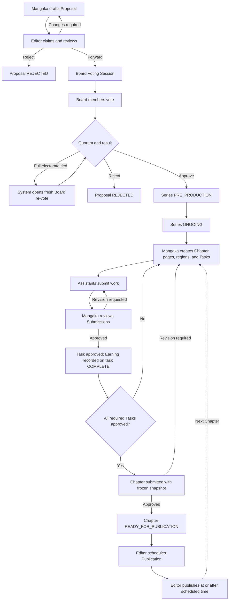
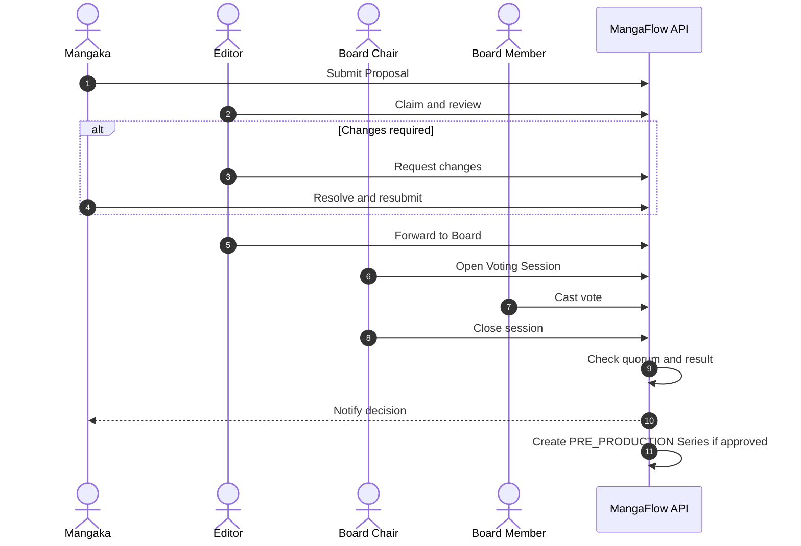
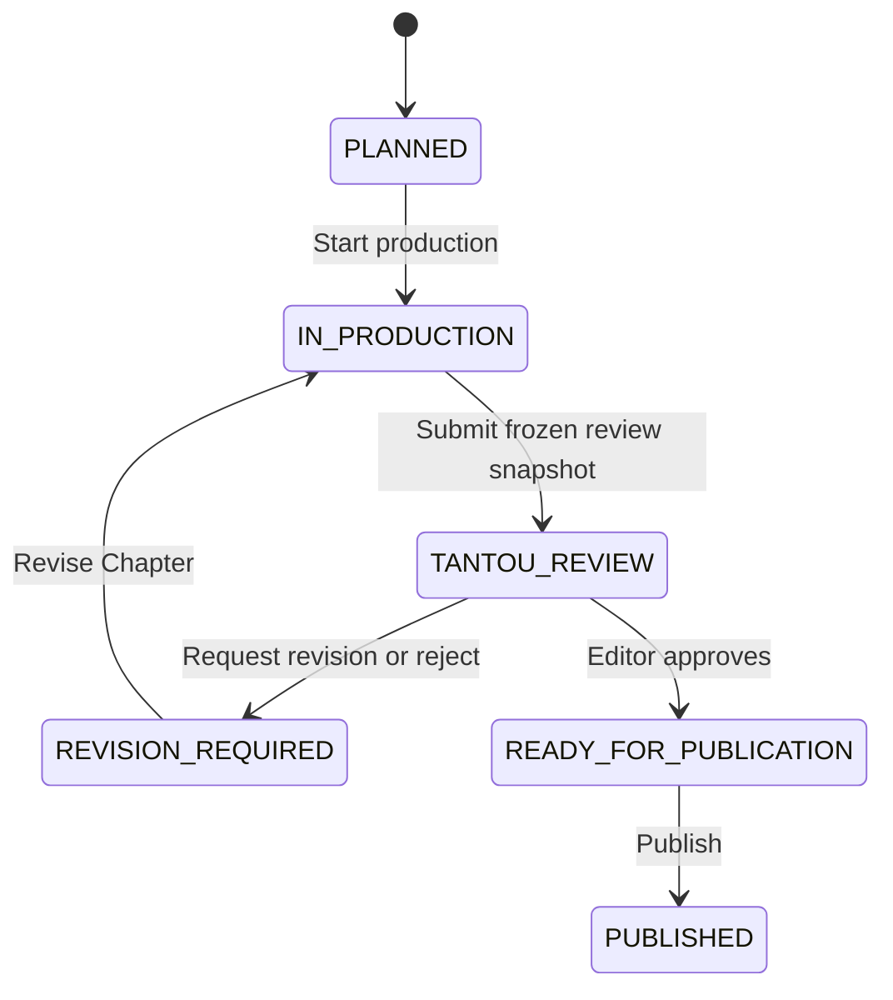
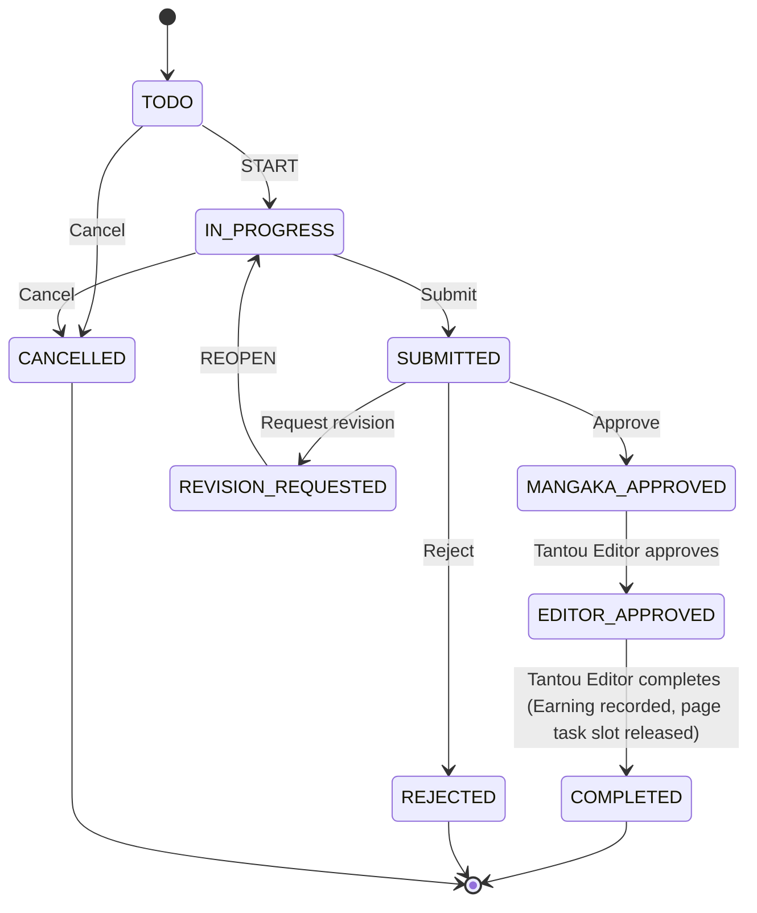
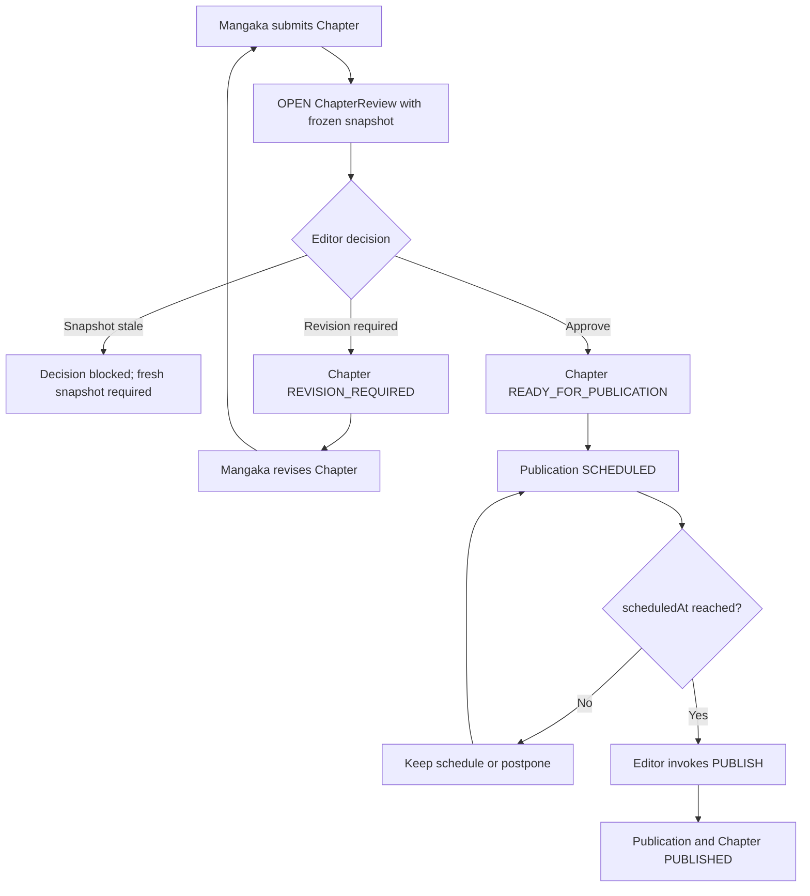
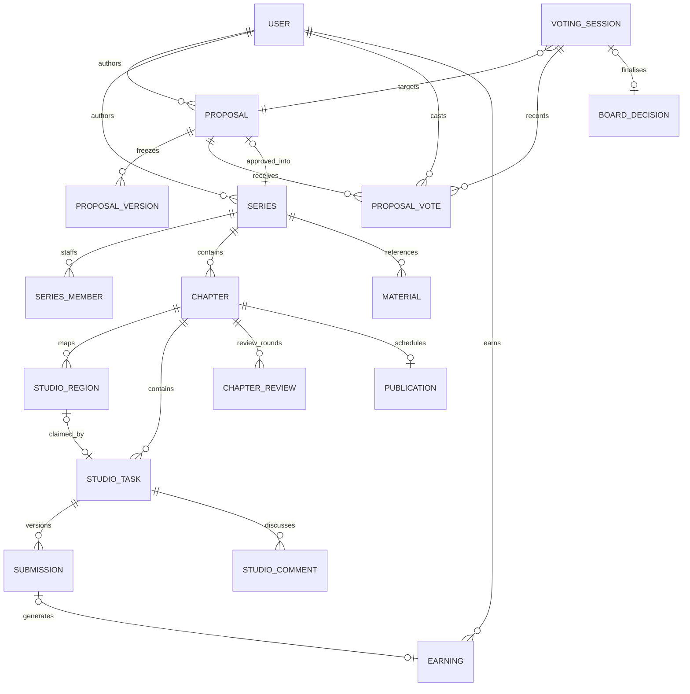
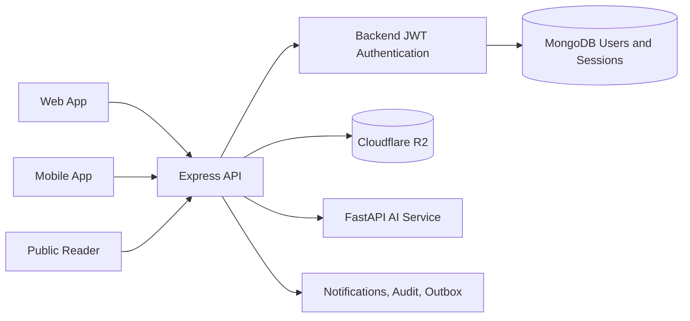

# MangaFlow — Canonical Business Flow

> **Deprecated historical reference (2026-07-28).** Despite its filename, this
> document is no longer the source of truth. Use
> [`docs/business-flows/INDEX.md`](docs/business-flows/INDEX.md) and the linked
> per-flow documents for the current implementation contract.

> **Purpose.** This document presents the current MangaFlow workflow at the
> level required for a university course project modelling one manga production
> and editorial department. It is grounded in the running codebase, but groups
> internal implementation states into a smaller business-facing model.
>
> The scope ends at Chapter publication and estimated Assistant earnings
> tracking. Full payroll, legal, printing, distribution, HR, and enterprise
> governance are intentionally outside scope.
>
> Codebase reconstruction: 2026-07-23. Business-flow revision: 2026-07-25.

## Contents

1. [Project scope](#1-project-scope)
2. [Actors and responsibilities](#2-actors-and-responsibilities)
3. [End-to-end business flow](#3-end-to-end-business-flow)
4. [Flow A — Proposal approval](#4-flow-a--proposal-approval)
5. [Flow B — Series and Chapter production](#5-flow-b--series-and-chapter-production)
6. [Flow C — Studio Task and Submission](#6-flow-c--studio-task-and-submission)
7. [Flow D — Editorial review and publication](#7-flow-d--editorial-review-and-publication)
8. [Flow E — Earnings tracking](#8-flow-e--earnings-tracking)
9. [Authentication and session management](#9-authentication-and-session-management)
10. [Notification and audit system](#10-notification-and-audit-system)
11. [Core data model](#11-core-data-model)
12. [Business rules](#12-business-rules)
13. [Business status model](#13-business-status-model)
14. [Technical reference summary](#14-technical-reference-summary)
15. [Current implementation gaps](#15-current-implementation-gaps)
16. [Final scope decision](#16-final-scope-decision)

---

## 1. Project scope

MangaFlow manages the internal workflow through which a manga Proposal becomes
an approved Series, a produced Chapter, and finally a published Chapter.

**Included**

- Proposal drafting and Editor review.
- Board voting and approval.
- Series and Chapter production.
- Page- and region-level work assignment.
- Versioned Assistant Submissions.
- Mangaka and Editor review loops.
- Publication scheduling and controlled publication.
- Notifications, audit history, materials, and file management.
- Estimated Assistant earnings tracking.
- Optional AI-assisted speech-bubble detection and whitening.

**Outside scope**

- Full payroll, tax, banking, or accounting processing.
- HR and employment-contract management.
- Copyright and legal approval workflows.
- Printing-house and physical distribution management.
- Multi-company tenancy.
- Complex SLA, escalation, delegation, or conflict-of-interest workflows.

This boundary is realistic for one production department and remains achievable
for a course project.

## 2. Actors and responsibilities

Access is controlled first by role and then by ownership, assignment, or active
Series membership.

| Actor | Responsibility |
| --- | --- |
| `ADMIN` | Manages users, shared materials, settings, notifications, and earnings overview |
| `MANGAKA` | Creates Proposals, leads Series production, creates Tasks, and reviews Assistant work |
| `ASSISTANT` | Completes assigned page or region work and submits versions |
| `EDITOR` | Reviews Proposals and Chapters and controls publication readiness |
| `BOARD` | Votes on Proposals and records approval decisions |

**Special seats**

| Flag | Holder | Additional authority |
| --- | --- | --- |
| `isChair` | One Board member | Opens, closes, or cancels Voting Sessions |

`ADMIN` is the global administrative bypass. Other actors only access records
that belong to them or are assigned to them.

## 3. End-to-end business flow



**Alignment decisions**

The following interpretations remove ambiguity without expanding the project:

- Board approval creates a Series in `PRE_PRODUCTION`.
- The Series must become `ONGOING` before Chapter editorial review.
- A region is claimed when its Task is created and locked when the Task starts.
- `START_DRAFT` only changes a Chapter from `PLANNED` to `IN_PRODUCTION`.
- Publication is performed manually by the Editor at or after `scheduledAt`.
- A Chapter may have multiple historical review rounds, but only one open
  review at a time.
- Earnings are tracking records, not confirmed payments.

## 4. Flow A — Proposal approval

A Proposal passes through two approval gates:
Mangaka → Editor → Board.
Only Board approval creates a production Series.

| From | Action | Actor | To | Main effect |
| --- | --- | --- | --- | --- |
| `DRAFT` | `SUBMIT` | Mangaka author | `PENDING_EDITOR` | Notifies Editor pool and writes audit entry |
| `PENDING_EDITOR` | `CLAIM` | Editor | `EDITOR_REVIEWING` | Assigns one Editor |
| `EDITOR_REVIEWING` | `REQUEST_CHANGES` | Assigned Editor | `CHANGES_REQUESTED` | Stores required changes and notifies author |
| `CHANGES_REQUESTED` | `RESUBMIT` | Mangaka author | `EDITOR_REVIEWING` | Returns revised Proposal to review |
| `EDITOR_REVIEWING` | `FORWARD` | Assigned Editor | `PENDING_BOARD` | Sends Proposal to Board |
| `EDITOR_REVIEWING` | `REJECT` | Assigned Editor | `REJECTED` | Requires rejection reason |
| `PENDING_BOARD` | Open session | Board Chair | `BOARD_REVIEW` | Creates one open Voting Session |
| `BOARD_REVIEW` | `VOTE` | Board member | No immediate status change | Stores vote |
| `BOARD_REVIEW` | Close session | Board Chair | `APPROVED` or `REJECTED` | Finalises result |
| Any pre-Board status | `WITHDRAW` | Mangaka author | `WITHDRAWN` | Stops workflow |
| Any non-approved status | `ARCHIVE` | Admin | `ARCHIVED` | Retains history |

**Supporting actions**

| Action | Actor | Effect |
| --- | --- | --- |
| `EDIT` | Mangaka author | Edits Proposal content; blocked during Board review or active voting session |
| `RELEASE_CLAIM` | Assigned Editor | Releases their own claim; Proposal returns to `PENDING_EDITOR` so another Editor can claim it |
| `RECALL` | Assigned Editor | Recalls a Board-stage Proposal back to `PENDING_EDITOR`; clears votes |

`FORCE_STATUS` is defined in the codebase but disabled at runtime (HTTP 410
`WORKFLOW_REMOVED`). It is not an available business action.

**Voting outcomes**

| Outcome | Condition | Result |
| --- | --- | --- |
| `NO_QUORUM` | Votes below configured quorum | Proposal returns to `PENDING_BOARD` |
| `TIE_BREAK_REQUIRED` | Legacy tie history only | System opens a fresh Board re-vote; no special role vote |
| `FINALIZED: APPROVED` | Quorum met and approval wins | Proposal approved; BoardDecision and Series created |
| `FINALIZED: REJECTED` | Quorum met and rejection wins | Proposal rejected |

**Required rules**

- Proposal content is locked during Board voting.
- Only one open Voting Session may exist for one Proposal.
- One approved Proposal may create only one Series.
- Board-approved publication cadence is inherited by the Series.

**Board quorum**

- Default: 3
- Minimum: 3
- Maximum: 5 (total Board seats)
- Configured via `BOARD_QUORUM` environment variable.



## 5. Flow B — Series and Chapter production

### 5.1 Series setup

Board approval creates a Series in `PRE_PRODUCTION`. Editor assignment is
handled through the Tantou workflow, while Assistants are assigned through
Series membership records.

The minimum business transition is:

```
Proposal APPROVED → Series PRE_PRODUCTION → Production information
and Tantou assignment confirmed → Series ONGOING
```

### 5.2 Chapter lifecycle

The business-facing Chapter lifecycle uses six stages:



**Legacy/retired Chapter statuses**

The following statuses were used in earlier versions and remain in the database
for backward compatibility. They should not appear in current business flows.

| Legacy status | Replacement |
| --- | --- |
| `DRAFTING` | `IN_PRODUCTION` |
| `ASSISTANT_WORKING` | `IN_PRODUCTION` |
| `MANGAKA_REVIEW` | `IN_PRODUCTION` |
| `EDITOR_REVIEW` | `TANTOU_REVIEW` |
| `REVISION` | `REVISION_REQUIRED` |
| `EDITOR_APPROVED` | `READY_FOR_PUBLICATION` |
| `IN_REVIEW` | `TANTOU_REVIEW` |
| `APPROVED` | `READY_FOR_PUBLICATION` |
| `SCHEDULED` | Belongs to `Publication.status`, not Chapter |

### 5.3 Chapter transitions

**Standard review flow**

| Action | From status | To status | Actor |
| --- | --- | --- | --- |
| `START_DRAFT` | `PLANNED` | `IN_PRODUCTION` | Mangaka owner |
| `SUBMIT_REVIEW` | `PLANNED` or `IN_PRODUCTION` | `TANTOU_REVIEW` | Mangaka owner |
| `RESUBMIT` | `REVISION_REQUIRED` | `TANTOU_REVIEW` | Mangaka owner |
| `REQUEST_REVISION` | `TANTOU_REVIEW` | `REVISION_REQUIRED` | Editor |
| `REJECT` | `TANTOU_REVIEW` | `REVISION_REQUIRED` | Editor |
| `EDITOR_APPROVE` | `TANTOU_REVIEW` | `READY_FOR_PUBLICATION` | Editor |
| `PUBLISH` | `READY_FOR_PUBLICATION` | `PUBLISHED` | Editor |

**Supporting and publication actions**

| Action | From status | To status | Actor | Notes |
| --- | --- | --- | --- | --- |
| `START_ASSISTANT_WORK` | `IN_PRODUCTION` | `IN_PRODUCTION` (no change) | Mangaka or Editor | Status-preserving; signals start of assistant work |
| `MARK_READY` | `IN_PRODUCTION` | `READY_FOR_PUBLICATION` | Editor | **Exceptional path.** Bypasses the standard Tantou review flow. See section 15. |
| `SCHEDULE` | `READY_FOR_PUBLICATION` | No chapter status change | Editor | Creates or updates a `Publication` record as `SCHEDULED` |
| `POSTPONE` | `READY_FOR_PUBLICATION` | No chapter status change | Editor | Cancels the scheduled `Publication` record |
| `REASSIGN` | Any | No chapter status change | Editor | Changes the assigned Tantou editor or assistant |

### 5.4 Review readiness

A Chapter may be submitted to the Editor only when all of the following hold:

1. The actor is the Mangaka owner of the Series.
2. The Series is `ONGOING`.
3. The Series originates from an `APPROVED` Proposal.
4. Every Chapter page has a valid uploaded asset.
5. Every required Studio Task has a current `MANGAKA_APPROVED` Submission.
6. No unresolved blocking Studio Comment remains.

Submitting the Chapter freezes the reviewed page versions. If a page changes
afterward, the Editor cannot approve the stale snapshot.

### 5.5 Review rounds

A Chapter may be revised and submitted again:

- One Chapter → many historical ChapterReview records.
- One Chapter → maximum one `OPEN` ChapterReview at a time.

A new review round is created after the Mangaka completes the requested
revision and resubmits a fresh snapshot.

## 6. Flow C — Studio Task and Submission

A `StudioTask` is the assigned work. A `Submission` is one delivered version
of that work. One Task may therefore have multiple Submission versions.

### 6.1 Region ownership

A region is reserved when its Task is created and locked when the Task starts:

**Stage 1 — Task creation (atomic claim)**

When a Task is created with a `regionId`, the system atomically:
- Sets `taskId` and `activeTaskId` on the `StudioRegion`.
- Sets `lockStatus: "LOCKED"` and `status: "ASSIGNED"`.
- Rejects creation if the region already has an active Task
  (`REGION_HAS_ACTIVE_TASK`).

**Stage 2 — Task START (working lock)**

When the Assistant calls `START`:
- Sets `lockedByTaskId` and `lockedAt` on the region.
- Updates `status` from `"ASSIGNED"` to `"IN_PROGRESS"`.

This two-stage design means a Task cancelled before `START` can still release
its region (matching on `taskId` rather than `lockedByTaskId`).

### 6.2 Task workflow

| Step | Actor | Action | Result |
| --- | --- | --- | --- |
| 1 | Mangaka | Create and assign Task | Task `TODO`; region claimed |
| 2 | Assistant | `START` | Task `IN_PROGRESS`; region locked |
| 3 | Assistant | Submit work | New Submission version; Task `SUBMITTED` |
| 4a | Mangaka | Approve | Task `MANGAKA_APPROVED`; no earning yet (editor step follows) |
| 4b | Mangaka | Request revision | Task `REVISION_REQUESTED` |
| 4c | Mangaka | Reject | Task `REJECTED`; region released |
| 5 | Assistant | `REOPEN` | Task returns to `IN_PROGRESS` |
| Optional | Authorised actor | Cancel | Task `CANCELLED`; region released |



**Legacy/retired Task statuses**

| Legacy status | Replacement |
| --- | --- |
| `MANGAKA_REVIEWING` | `SUBMITTED` |
| `MANGAKA_REVISION_REQUESTED` | `REVISION_REQUESTED` |
| `EDITOR_REVIEWING` | `SUBMITTED` |
| `EDITOR_REVISION_REQUESTED` | `REVISION_REQUESTED` |
| `OPEN` | `TODO` |

### 6.3 Submission workflow

| Status | Meaning |
| --- | --- |
| `PENDING` | Newly created, awaiting review |
| `MANGAKA_APPROVED` | Approved by Mangaka |
| `REVISION_REQUESTED` | Changes requested |
| `REJECTED` | Rejected |
| `SUPERSEDED` | Replaced by a newer Submission version |

**Legacy/retired Submission statuses**

| Legacy status | Replacement |
| --- | --- |
| `MANGAKA_REVISION_REQUESTED` | `REVISION_REQUESTED` |
| `EDITOR_APPROVED` | `MANGAKA_APPROVED` |
| `EDITOR_REVISION_REQUESTED` | `REVISION_REQUESTED` |

### 6.4 Review integrity

- Assistant self-review is blocked.
- Only the Mangaka who owns the Series may decide its Submissions.
- Submission references must match the target Task.
- Submission creation is idempotent to prevent duplicate versions.
- Review decisions use Submission endpoints; legacy direct Task review actions
  remain disabled (HTTP 410).

## 7. Flow D — Editorial review and publication

The Editor reviews the frozen Chapter snapshot rather than live pages.

### 7.1 ChapterReview

A `ChapterReview` record is created when the Mangaka submits a Chapter for
review. It captures a frozen snapshot of page versions at submission time.

**Statuses**

| Status | Meaning |
| --- | --- |
| `OPEN` | Review in progress |
| `APPROVED` | Editor approved the Chapter |
| `REVISION_REQUESTED` | Editor requested changes |
| `REJECTED` | Editor rejected the Chapter |
| `STALE` | Snapshot is outdated (page changed after freeze) |
| `INVALIDATED` | Review invalidated by system or override |

A partial unique index ensures only one `OPEN` ChapterReview per Chapter at
a time. A Chapter may contain many historical review records.

### 7.2 Snapshot freezing and staleness

When the Mangaka submits a Chapter for review:
- The system freezes `chapterVersionId` and per-page `pageVersionIds`.
- A `ChapterReview` record is created with the frozen snapshot.
- If any page changes after the freeze, the snapshot becomes stale.
- The Editor's `EDITOR_APPROVE`, `REQUEST_REVISION`, or `REJECT` is blocked
  with `409 REVIEW_SNAPSHOT_STALE` until a fresh snapshot is produced.

### 7.3 Publication

**Statuses**

| Status | Meaning |
| --- | --- |
| `DRAFT` | Initial state |
| `SCHEDULED` | Editor has set a future publish time |
| `PUBLISHED` | Chapter has been published |
| `CANCELLED` | Schedule was cancelled (postponed) |

### 7.4 Manual publish flow

Publication is a controlled manual action:

1. Chapter reaches `READY_FOR_PUBLICATION` after Editor approval.
2. Editor calls `SCHEDULE` with a future `scheduledAt` date.
3. A `Publication` record is created with status `SCHEDULED`.
4. The Chapter remains `READY_FOR_PUBLICATION` while waiting.
5. At or after `scheduledAt`, the Editor invokes `PUBLISH`.
6. Publication and Chapter become `PUBLISHED`.
7. The author is notified.

The system does not automatically publish at `scheduledAt`. The Editor must
manually invoke the `PUBLISH` action.



## 8. Flow E — Earnings tracking

An `Earning` record is generated when the Tantou Editor completes a
Mangaka-approved Task.

1. Mangaka approves a Submission for Task `T` (task → `MANGAKA_APPROVED`; no
   earning yet; the assignment stays locked).
2. Tantou Editor approves the task (`EDITOR_APPROVED`), then completes it
   (`COMPLETED`).
3. Workflow engine upserts an `Earning` row with status `EARNED`, keyed by
   `TASK_APPROVAL:{taskId}:{submissionId}` — tracking only, not a payment.
4. An `earning.earned` event is placed on the outbox.

**Rate configuration boundary**

- `RateTable` is wired for new task creation. Admin configures active rates;
  Mangaka sends only `rateCode` and `quantity`.
- The backend stores an immutable `rateCode`/`rateVersion`/`rateSnapshot` on the
  Task and returns `409 RATE_CONFIGURATION_REQUIRED` when no active rate exists.
- Client-supplied `rateSnapshot` and `estimatedAmount` are rejected. Production
  amounts are not invented in source and must be configured by Admin.
- The old `createEarningItemIfMissing()` helper was removed because it had no
  runtime call site. Production earnings use the `Earning` record created when
  the Tantou Editor completes the task; `EarningItem` remains a legacy/seed
  model only.
- Admin payroll actions (`confirm`, `mark-paid`, `void`) all return HTTP 410.
- Earnings today are **tracking-only** records, not a live payout pipeline.

## 9. Authentication and session management

MangaFlow does not use Supabase Authentication. Authentication is handled
entirely by the Express backend and MongoDB:

- `POST /auth/login` validates the user and issues a short-lived JWT access
  token and a refresh token.
- Protected routes use `requireAuth` to validate the access token, active
  session, and current user.
- Refresh tokens are stored as SHA-256 hashes rather than plain-text tokens.
- `POST /auth/refresh` rotates the refresh token and revokes the previous
  session token.
- `POST /auth/logout` revokes the active session.

Role-based access is then combined with ownership, assignment, or Series
membership checks.

## 10. Notification and audit system

**For people** — `Notification` records via `notify` / `notifyMany` /
`broadcastNotification`. Surfaced in-app via the bell icon in every role's
shell.

**For the system** — every mutation writes an `AuditEntry`. The current
implementation records: actor, action, entity type and ID, request ID,
timestamp, and relevant metadata. The schema supports optional `before` and
`after` fields, but the current helper does not populate them.

Many mutations also enqueue an `OutboxEvent`, drained with exponential
backoff (30s, 60s, 120s, ..., capped at 30 minutes), up to 5 attempts
before `DEAD_LETTER`.

## 11. Core data model

The backend registers **25 Mongoose models**. The ERD below focuses on core
business relationships.

**Core business models (21)**

`User`, `RefreshSession`, `Proposal`, `ProposalVote`, `Series`, `Chapter`,
`Publication`, `StudioRegion`, `StudioTask`, `StudioComment`, `Submission`,
`Material`, `VotingSession`, `BoardDecision`, `ProposalVersion`,
`ChapterReview`, `Notification`, `AuditEntry`, `OutboxEvent`, `Earning`,
`SeriesMember`

**Supporting/technical models (4)**

`Ranking`, `RankingImport`, `EarningItem`, `AiProcessing`



**Important cardinalities**

- One approved Proposal creates at most one Series.
- One Series contains many Chapters.
- One Chapter contains many Tasks and historical review rounds.
- One Chapter has at most one open review at a time.
- One Task has many Submission versions.
- One active Task may claim one region.
- One approved Submission may generate one Earning record.

## 12. Business rules

**Access**

- Every protected operation requires authentication.
- Role access is followed by ownership, assignment, or membership checks.
- `ADMIN` has system-wide administrative access.
- Self-review and cross-Series review are blocked.
- Editor and Assistant assignment cannot be replaced through unrestricted
  generic Series updates.

**Proposal and Board**

- Only Board approval creates a Series.
- Proposal content is locked during Board voting.
- Only one open Voting Session may exist per Proposal.
- Quorum is configurable (default 3, min 2, max 5).
- One approved Proposal cannot create duplicate Series records.

**Production**

- Chapter numbers are unique within a Series.
- One region may belong to only one active Task.
- One Task may have multiple Submission versions.
- Required Tasks, pages, materials, and blocking comments are checked
  before Chapter review.
- A stale review snapshot cannot be approved.
- Only one ChapterReview may be open for a Chapter.

**Publication**

- A schedule is represented by a `Publication` record.
- A Chapter remains publication-ready while waiting for its schedule.
- Manual publish is allowed only when a valid schedule exists and its time
  has been reached.

**Earnings**

- Approved Assistant work generates one tracking record.
- The record does not confirm that money was transferred.
- Duplicate earning creation is prevented using Task and Submission identity.

**Supporting technical safeguards**

Idempotency keys, transactions, audit records, outbox events, and
cross-entity validation support these rules. They are implementation
safeguards rather than additional business workflow stages.

## 13. Business status model

The UI and business documentation display a smaller status model, while
the implementation retains detailed or legacy values for compatibility.

**Proposal**

| Business stage | Active implementation value |
| --- | --- |
| Draft | `DRAFT` |
| Waiting for Editor | `PENDING_EDITOR` |
| Editor reviewing | `EDITOR_REVIEWING` |
| Changes required | `CHANGES_REQUESTED` |
| Waiting for Board | `PENDING_BOARD` |
| Board reviewing | `BOARD_REVIEW` |
| Approved | `APPROVED` |
| Rejected | `REJECTED` |
| Withdrawn | `WITHDRAWN` |
| Archived | `ARCHIVED` |

Legacy values `SUBMITTED`, `RESUBMITTED`, `READY_FOR_BOARD`, `BOARD_VOTING`,
and `TIE_BREAK` are compatibility values and should not appear as current
business stages.

**Chapter**

| Business stage | Grouped implementation values |
| --- | --- |
| PLANNED | `PLANNED` |
| IN_PRODUCTION | `IN_PRODUCTION`, `DRAFTING`, `ASSISTANT_WORKING`, `MANGAKA_REVIEW` |
| TANTOU_REVIEW | `TANTOU_REVIEW`, `EDITOR_REVIEW` |
| REVISION_REQUIRED | `REVISION_REQUIRED`, `REVISION` |
| READY_FOR_PUBLICATION | `EDITOR_APPROVED`, `READY_FOR_PUBLICATION` |
| PUBLISHED | `PUBLISHED` |
| ARCHIVED | `ARCHIVED` |

`SCHEDULED` belongs to `Publication`. Legacy Chapter values `IN_REVIEW` and
`APPROVED` remain read-only compatibility values.

**Studio Task**

| Business stage | Implementation value |
| --- | --- |
| To do | `TODO` |
| In progress | `IN_PROGRESS` |
| Submitted | `SUBMITTED` |
| Revision requested | `REVISION_REQUESTED` |
| Mangaka approved | `MANGAKA_APPROVED` |
| Editor approved | `EDITOR_APPROVED` |
| Completed | `COMPLETED` |
| Rejected | `REJECTED` |
| Cancelled | `CANCELLED` |

**Submission**

| Business stage | Implementation value |
| --- | --- |
| Pending review | `PENDING` |
| Approved | `MANGAKA_APPROVED` |
| Revision requested | `REVISION_REQUESTED` |
| Rejected | `REJECTED` |
| Replaced by newer version | `SUPERSEDED` |

## 14. Technical reference summary

The technical implementation remains one API serving the web application,
mobile application, and public reader.



**Authentication implementation**

MangaFlow does not use Supabase Authentication. Authentication is handled
entirely by the Express backend and MongoDB. Supabase is not part of the
canonical authentication architecture.

**API groups**

| Group | Purpose |
| --- | --- |
| `/auth/`, `/files/` | Authentication and file access |
| `/proposals/`, `/voting-sessions/` | Proposal and Board workflow |
| `/series/`, `/chapters/` | Series and Chapter management |
| `/tantou/`, `/series/:id/members/` | Editor and Assistant assignment |
| `/studio/regions/`, `/studio/tasks/` | Production regions and Tasks |
| `/tasks/:id/submit`, `/submissions/*` | Submission and Mangaka review |
| `/materials/*` | Production and review materials |
| `/notifications/*`, `/assistant/earnings` | Supporting user features |
| `/editor/*`, `/board/*` | Mobile-focused review aliases |
| `/ai/bubble/*` | Optional AI page processing |

**Deliberately disabled**

- Payroll confirm, mark-paid, and void actions (HTTP 410).
- Legacy direct Task review actions (HTTP 410).
- Proposal `FORCE_STATUS` (HTTP 410).

**Main environment variables**

| Variable | Purpose |
| --- | --- |
| `MONGO_URI` | MongoDB datastore and workflow transactions |
| `JWT_ACCESS_SECRET`, `JWT_REFRESH_SECRET` | Authentication token signing |
| `R2_*` | File storage |
| `AI_SERVICE_URL` | AI-service connection |
| `VITE_API_BASE_URL` | Web-to-API connection |

## 15. Current implementation gaps

The following items are confirmed implementation defects or deviations from
the intended design. They are documented for transparency and should not be
silently repaired unless explicitly requested.

**1. Independent Chapter archive — removed**

Chapter no longer has an `ARCHIVE` action, `ARCHIVED` status, or archive
metadata. It follows the lifecycle of its parent Series. Legacy archived
Chapter rows are converted to the closest canonical production/publication
state by the chapter-status migration.

**2. MARK_READY — exceptional bypass**

The `MARK_READY` action transitions a Chapter directly from `IN_PRODUCTION`
to `READY_FOR_PUBLICATION`, bypassing the standard Tantou review flow
(`TANTOU_REVIEW`). This is a confirmed exceptional path that should be
documented and potentially restricted.

**3. EarningItem — dead helper removed; RateTable is Admin-owned**

The unreachable `createEarningItemIfMissing()` and `resolveTaskRate()` helpers
were removed. The active runtime path creates `Earning` when the Tantou Editor
completes the task.
Admin configures versioned `RateTable` entries; task creation resolves an active
`rateCode` and stores `rateVersion`/`rateSnapshot` server-side. Missing active
configuration returns `RATE_CONFIGURATION_REQUIRED`; client monetary fields are
rejected. Production amounts remain an operational Admin configuration step.

**4. AuditEntry before/after — schema only**

The `AuditEntry` schema supports optional `before` and `after` fields, but
the `audit()` helper function and `createAuditEntry()` do not populate
them. Audit entries record actor, action, entity, request ID, timestamp,
and ad-hoc metadata only.

**5. Supabase — resolved**

The unused Supabase startup middleware, client files, dependency, and setup
documentation were removed. Authentication and business data use the Express
backend with JWT and MongoDB exclusively.

## 16. Final scope decision

MangaFlow is positioned as a department-level manga production workflow, not
as a complete enterprise publishing platform.

The current design is sufficient because it demonstrates:

- Two-stage Proposal approval.
- Controlled Series creation.
- Region-level production assignment.
- Versioned Assistant Submissions.
- Mangaka and Editor review loops.
- Frozen review snapshots.
- Publication scheduling and controlled publication.
- Estimated earnings tracking.
- Record-level access, notifications, and audit history.

The recommended improvement is alignment, not expansion:

- Use the simplified business status groups in the UI and documentation.
- Keep detailed internal states only where the code needs them.
- Describe region locking consistently as two-stage (creation + START).
- Describe publication consistently as a manual Editor action after the
  scheduled time.
- Preserve multiple historical Chapter review rounds with one open round.
- Present Earnings as tracking-only until payment functions exist; RateTable
  configuration and server-side task snapshots are implemented.
- Fix or restrict the ARCHIVE and MARK_READY actions.
- Keep the public reader explicitly marked as a prototype until a public API
  contract and publication-read permissions are approved.

No additional payroll, legal, HR, printing, distribution, complex SLA, or
enterprise governance modules should be added unless required by the course.

With these boundaries, the workflow is realistic, internally controlled, and
appropriately sized for a university project.

---

*Revised from the current-state MangaFlow Business Flow & Systems Reference.
The running code remains the final authority for implemented behaviour.*
