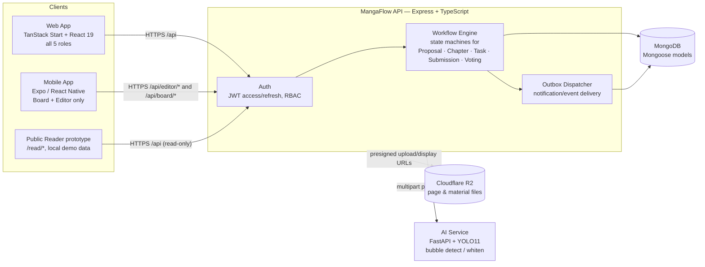
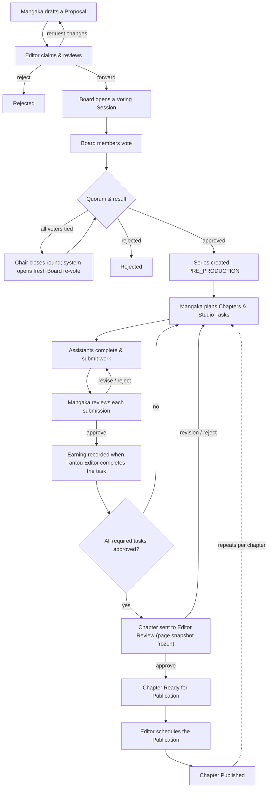
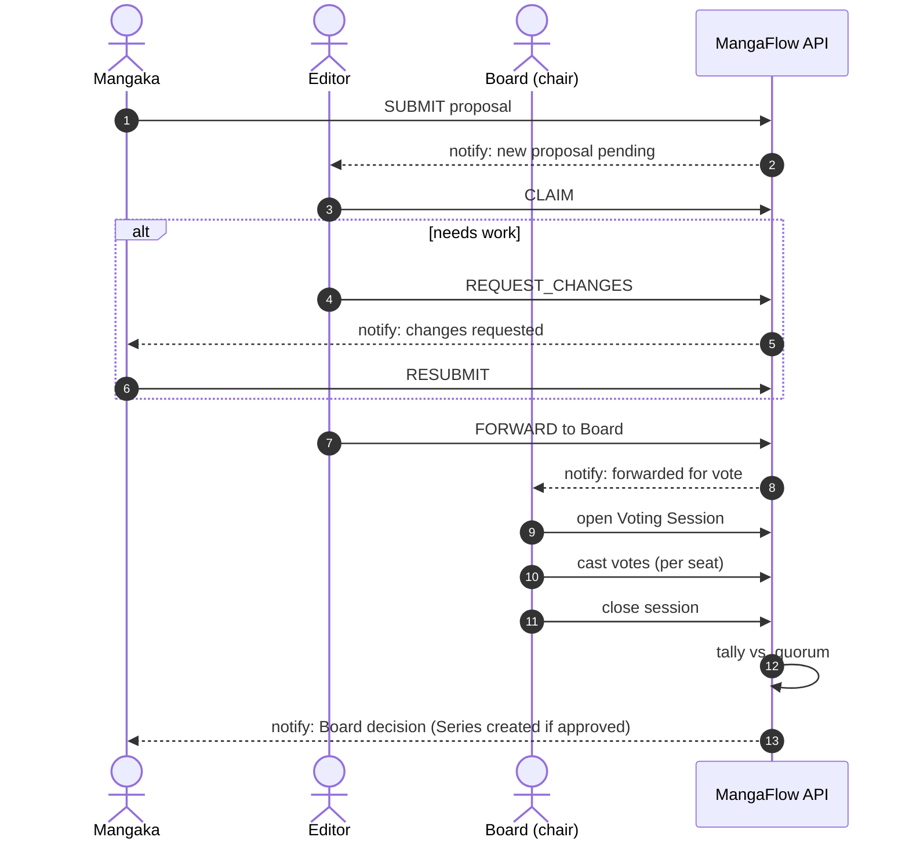
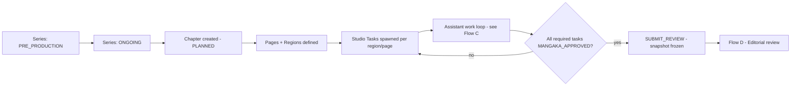
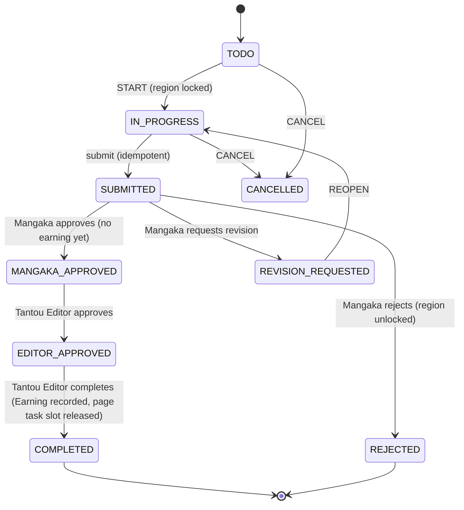
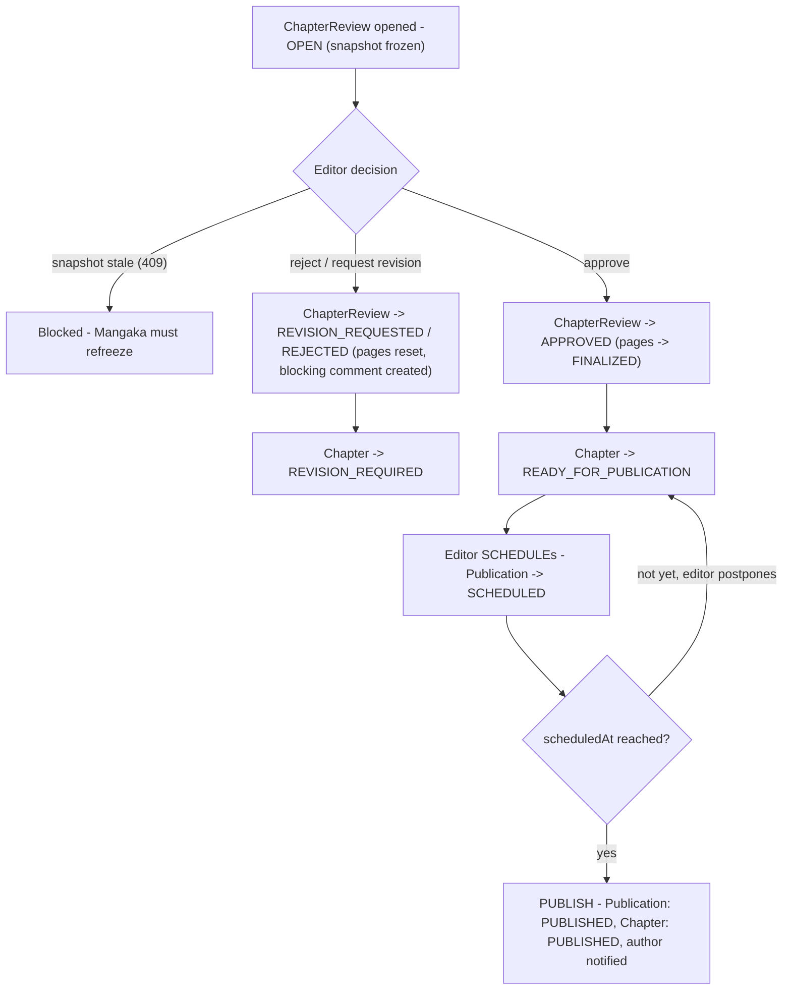
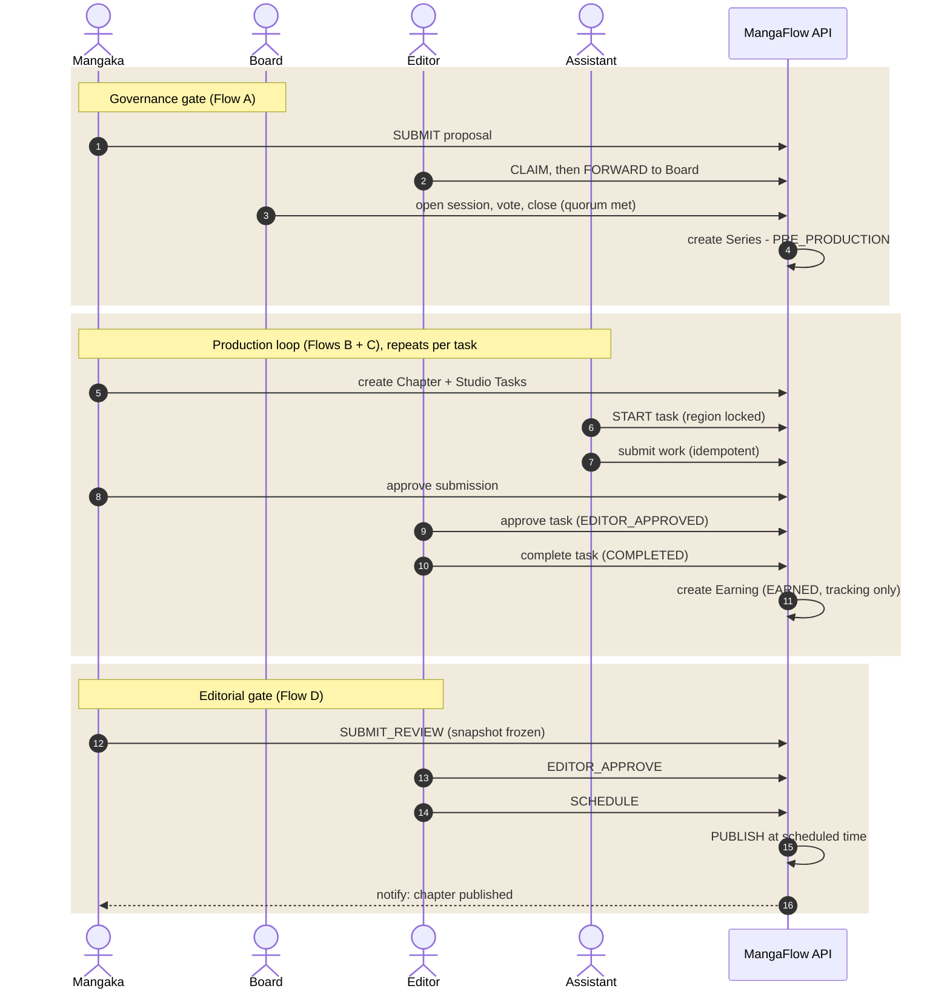
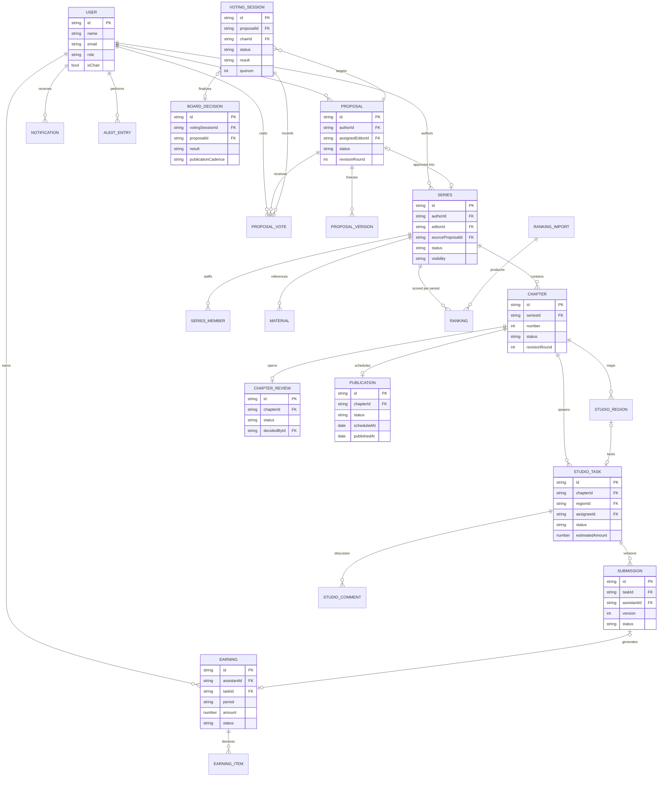

# MangaFlow — Business Flow &amp; Systems Reference

> **Deprecated historical reference (2026-07-28).** This file is not canonical
> and may describe removed routes or obsolete Admin bypasses. Use
> [`docs/business-flows/INDEX.md`](docs/business-flows/INDEX.md) for current
> business rules and follow its linked per-flow documents.

> **What this is.** An as-built reference for how a manga proposal becomes a
> published, paid chapter, compiled directly from the running codebase
> (`backend/src/services/workflow.service.ts`,
> `backend/src/services/authorization.service.ts`, `models.ts`, `types.ts`, and
> every route file) rather than from any aspirational spec.
>
> Compiled 2026-07-23. Re-generate after any change to `workflow.service.ts`,
> `authorization.service.ts`, route handlers, validators, or `models.ts`.

## Contents

1. [Overview](#1-overview)
2. [Roles &amp; access model](#2-roles--access-model)
3. [Architecture](#3-architecture)
4. [End-to-end business flow](#4-end-to-end-business-flow)
5. [Flow A — Proposal &amp; Board governance](#5-flow-a--proposal--board-governance)
6. [Flow B — Series &amp; chapter production](#6-flow-b--series--chapter-production)
7. [Flow C — Studio task &amp; submission review](#7-flow-c--studio-task--submission-review)
8. [Flow D — Editorial review &amp; publication](#8-flow-d--editorial-review--publication)
9. [Flow E — Earnings](#9-flow-e--earnings)
10. [Full lifecycle sequence](#10-full-lifecycle--one-chapter-all-five-roles)
11. [Data model (ERD)](#11-data-model)
12. [API reference](#12-api-reference)
13. [Business rules &amp; invariants](#13-business-rules--invariants)
14. [Notifications &amp; audit trail](#14-notifications--audit-trail)
15. [Status legend](#15-status-legend)
16. [Environments &amp; services](#16-environments--services)

---

## 1. Overview

MangaFlow is a production-and-publishing management system for a manga studio.
It replaces email/spreadsheet coordination between a creator (Mangaka), the
drawing assistants who execute panel-level work, an editorial layer (Tantou
Editor), and an editorial Board that governs which series get
greenlit — with one system of record for proposals, chapters, page-level tasks,
reviews, publication scheduling, and per-task earnings.

| Surface        | Stack                                                       | Serves                                                                                            |
| -------------- | ----------------------------------------------------------- | ------------------------------------------------------------------------------------------------- |
| **Web app**    | TanStack Start · React 19 · TanStack Router/Query · Zustand | All five roles; file-based routes under `/app/*`, plus a public reader at `/read/*`               |
| **API**        | Express · TypeScript · Mongoose/MongoDB                     | REST API, JWT auth, RBAC, the workflow state machine, audit log, outbox dispatcher                |
| **AI service** | FastAPI · YOLO11 segmentation · OpenCV                      | Speech-bubble detection and "whitening" (text removal) for scan/draft pages, proxied from the API |
| **Mobile app** | Expo · React Native · expo-router                           | A focused Board + Editor shell — review, vote, finalize, tie-break, at-risk decisions on the go   |

| Metric                                   | Value                                |
| ---------------------------------------- | ------------------------------------ |
| Roles                                    | 5                                    |
| Core domain entities (Mongo collections) | 21                                   |
| Workflow engine                          | ~2,940 lines (`workflow.service.ts`) |
| Route domains                            | 14                                   |

## 2. Roles &amp; access model

Access is enforced in two layers: route-level role gates first, then simple
record-level checks. In practice, the API checks whether the user owns the
record, is the assigned Tantou editor, is an active series member, or is the
assigned assistant for a task. This keeps the flow realistic without turning the
project into a large enterprise permissions system.

| Role        | Charter                                                                      | Primary navigation                                                             |
| ----------- | ---------------------------------------------------------------------------- | ------------------------------------------------------------------------------ |
| `ADMIN`     | Full system access: user management, materials, earnings tracking, settings  | Dashboard, Users, Material Library, Earnings Tracking, Settings, Notifications |
| `MANGAKA`   | Creator: drafts proposals, leads production, assigns and reviews studio work | My Series, Task Board, Review Queue, Publications, Rankings                    |
| `ASSISTANT` | Executes assigned panel/region work, submits it, tracks earnings             | My Tasks, Submissions, Earnings, Notifications                                 |
| `EDITOR`    | Tantou Editor: reviews proposals and chapters, gates publication readiness   | Review Queue, Series Monitor, Publications, Board Briefs                       |
| `BOARD`     | Governance: votes on proposals, owns ranking &amp; at-risk analytics         | Board Queue, Voting Sessions, Rankings, At-risk Reviews, Decisions             |

**Seat-level flags:**

| Flag              | Held by         | Unlocks                                                                                                                       |
| ----------------- | --------------- | ----------------------------------------------------------------------------------------------------------------------------- |
| `isChair`         | One BOARD seat  | Open / patch / close / cancel a Voting Session; finalize at-risk decisions                                                    |
| Tantou assignment | One active Editor per Series | Reviews that Series; no special editor authority |

> **Enforcement.** Every protected route runs `requireAuth` (JWT → active
> session → user), then the route role gate, then shared record checks from
> `authorization.service.ts`. `ADMIN` is the global bypass. Other roles are
> scoped to the records they own, are assigned to, or are allowed to review.

## 3. Architecture

One API is the single source of truth for both the web app and the mobile
shell. File storage and AI processing are external services the API brokers on
the client's behalf — clients never talk to R2 or the AI service directly
without a token/URL the API issued.

## 4. End-to-end business flow

The whole system is one long pipeline with two governance gates (editor review,
Board vote) and one production loop (task → review → revise) that repeats per
chapter for the life of a series.

## 5. Flow A — Proposal &amp; Board governance

A proposal has two gatekeepers in sequence: one Editor (individual judgment,
can bounce it back for changes) and then the Board (collective vote,
quorum-gated). Only a **Board approval** produces a production Series — there
is no other path to Series creation.

| From                 | Action               | Role                    | To                      | Side effects                                                   |
| -------------------- | -------------------- | ----------------------- | ----------------------- | -------------------------------------------------------------- |
| `DRAFT`              | `SUBMIT`             | author (Mangaka)        | `PENDING_EDITOR`        | Notifies the editor pool; audit entry                          |
| `PENDING_EDITOR`     | `CLAIM`              | Editor                  | `EDITOR_REVIEWING`      | Atomic claim (race-safe); notifies author                      |
| `EDITOR_REVIEWING`   | `REQUEST_CHANGES`    | claim owner             | `CHANGES_REQUESTED`     | Appends a change checklist; `revisionRound`++; notifies author |
| `CHANGES_REQUESTED`  | `RESUBMIT`           | author                  | `EDITOR_REVIEWING`      | Blocked unless every checklist item is resolved                |
| `EDITOR_REVIEWING`   | `FORWARD`            | claim owner             | `PENDING_BOARD`         | Notifies all active Board seats                               |
| `EDITOR_REVIEWING`   | `REJECT`             | claim owner             | `REJECTED`              | Requires a reason; notifies author                             |
| `PENDING_BOARD`      | chair opens session  | Board chair             | `BOARD_REVIEW`          | Creates a `VotingSession` (`OPEN`)                             |
| `BOARD_REVIEW`       | `VOTE`               | Board member            | —                       | One immutable `APPROVE` or `REJECT` vote per seat              |
| `BOARD_REVIEW`       | chair closes session | Board chair             | `APPROVED` / `REJECTED` | See outcome table below                                        |
| any pre-Board status | `WITHDRAW`           | author                  | `WITHDRAWN`             | —                                                              |
| any non-approved     | `ARCHIVE`            | Admin                   | `ARCHIVED`              | Requires a reason                                              |

**Voting session outcomes:**

| Outcome                  | Trigger                                                              | Result                                                                                                                          |
| ------------------------ | -------------------------------------------------------------------- | ------------------------------------------------------------------------------------------------------------------------------- |
| `NO_QUORUM`              | Fewer votes than `BOARD_QUORUM` (env, default 3, floor 2, ceiling 5) | Proposal reverts to `PENDING_BOARD`                                                                                             |
| `TIED`                    | All eligible voters voted and approve/reject are equal               | Close round and open a fresh Board re-vote                                                                                      |
| `FINALIZED` → `APPROVED` | Quorum met, approve majority                                         | Proposal → `APPROVED`; `BoardDecision` snapshot written; **Series created** (`PRE_PRODUCTION`) from the frozen proposal version |
| `FINALIZED` → `REJECTED` | Quorum met, reject majority                                          | Proposal → `REJECTED`                                                                                                           |

> **Edit lock.** A proposal cannot be edited once it is in `BOARD_REVIEW`, has
> an active voting session, or any non-terminal voting session exists for it —
> the version the Board is voting on must not move under them.
>
> **Publication cadence.** When the Board chair finalizes an approval, the
> Board-selected `publicationType` is stored on the approved Proposal as
> `boardApprovedPublicationType`; the generated Series inherits that cadence.

## 6. Flow B — Series &amp; chapter production

Once a Series exists, the Mangaka plans Chapters and breaks each one into
**Studio Tasks** scoped to a page or a drawn **region** on a page (panel-level
work: linework, tone, lettering, etc.). A region can only be actively worked by
one task at a time.

Series records are production records, not general editable drafts. They can
only be created from a Board-approved Proposal, and their `authorId`,
`authorName`, `editorId`, `editorName`, and `assistantIds` are server-owned.
Generic `POST /series` and `PATCH /series/:id` cannot assign or reassign the
Tantou editor or assistants. Tantou assignment is handled only through the
dedicated `/tantou/series/:id/editor` workflow, and assistant staffing goes
through the series member endpoints.

Manual Series promotion and automatic Board promotion share the same origin
link: `sourceProposalId`. That field is unique, so one approved Proposal cannot
produce two production Series even if two requests race.

| Action                        | From                              | To                      | Gate                          | Notes                                                                                |
| ----------------------------- | --------------------------------- | ----------------------- | ----------------------------- | ------------------------------------------------------------------------------------ |
| `START_DRAFT`                 | `PLANNED`                         | `IN_PRODUCTION`         | owner                         | —                                                                                    |
| `SUBMIT_REVIEW`               | `PLANNED` / `IN_PRODUCTION`       | `TANTOU_REVIEW`         | owner                         | Full pre-check below; freezes a review snapshot; opens a `ChapterReview`             |
| `REQUEST_REVISION` / `REJECT` | `TANTOU_REVIEW` / `EDITOR_REVIEW` | `REVISION_REQUIRED`     | Editor, not the series author | 409 if the snapshot is stale (pages changed since freeze); opens a blocking comment  |
| `RESUBMIT`                    | `REVISION_REQUIRED`               | `TANTOU_REVIEW`         | owner                         | —                                                                                    |
| `EDITOR_APPROVE`              | `TANTOU_REVIEW` / `EDITOR_REVIEW` | `READY_FOR_PUBLICATION` | Editor, not the author        | Pages → `FINALIZED`; `ChapterReview` → `APPROVED`                                    |
| `SCHEDULE`                    | `READY_FOR_PUBLICATION`           | `READY_FOR_PUBLICATION` | Editor                        | Requires a future date; creates/updates a `Publication` as `SCHEDULED`               |
| `PUBLISH`                     | `READY_FOR_PUBLICATION`           | `PUBLISHED`             | Editor                        | Requires a scheduled Publication whose `scheduledAt` has passed; notifies the author |
| `POSTPONE`                    | `READY_FOR_PUBLICATION`           | `READY_FOR_PUBLICATION` | Editor                        | Cancels the scheduled Publication row                                                |

**"Submit for review" pre-conditions** — a chapter cannot reach
`TANTOU_REVIEW` unless all of the following hold, which is what makes the
frozen snapshot trustworthy:

- The series is `ONGOING` and traces back to an `APPROVED` proposal.
- Every page has an uploaded asset.
- Every _required_ Studio Task is `MANGAKA_APPROVED`, each with a matching
  approved current Submission.
- No unresolved blocking `StudioComment` remains.

## 7. Flow C — Studio task &amp; submission review

This is the highest-frequency loop in the system — it runs once per assistant,
per task, potentially many times per chapter. Two safety mechanisms carry the
weight here: **region locking** (no two tasks fight over the same panel) and an
**idempotent submit** endpoint (a retried network request can never create a
duplicate submission).

Task creation claims the selected Studio Region before the task row is written.
If the region is already assigned or locked, the create request returns
`REGION_HAS_ACTIVE_TASK`; if task creation fails, the region claim is rolled
back.

| Step | Actor     | Action                   | Result                                                                                 |
| ---- | --------- | ------------------------ | -------------------------------------------------------------------------------------- |
| 1    | Assistant | `START`                  | Task → `IN_PROGRESS`; region locked to this task                                       |
| 2    | Assistant | `POST /tasks/:id/submit` | New `Submission` version created; supersedes any prior pending one; Task → `SUBMITTED` |
| 3    | Mangaka   | approve                  | Task → `MANGAKA_APPROVED`; no earning yet (editor step follows)         |
| 3b   | Mangaka   | request-revision         | Task → `REVISION_REQUESTED`                                                            |
| 3c   | Mangaka   | reject                   | Task → `REJECTED`; region unlocked                                                     |
| 4    | Assistant | `REOPEN`                 | From a revision request back to `IN_PROGRESS`                                          |

> **Self-review is blocked.** An assistant can never approve or reject their
> own submission — the reviewer must be a different account holding the
> Mangaka role for that series. In addition, Mangaka submission decisions are
> checked against the target task/series ownership, so a different Mangaka
> cannot approve, reject, or request revision for another creator's task.
>
> **Legacy note.** The retired submission-review aliases are disabled
> (HTTP 410): direct `POST /submissions` creation and
> `POST /submissions/:submissionId/editor-approve`. Mangaka decisions
> (`approve` / `request-revision` / `reject`) run through the Submission
> endpoints above, and the Tantou Editor's `EDITOR_APPROVE` / `COMPLETE`
> actions run on the task endpoint (`/studio/tasks/:taskId/actions/:action`).

## 8. Flow D — Editorial review &amp; publication

The Editor reviews the _frozen snapshot_ produced when the Mangaka submitted
for review — never a live, possibly-still-changing chapter. If any page
changed after the freeze, the snapshot is stale and the Editor's decision is
blocked until a fresh one is produced.

## 9. Flow E — Earnings

Earnings are **generated automatically** when the Tantou Editor completes a
Mangaka-approved task — there is no separate "log my hours" step.

1. Mangaka approves a Submission for Task `T` (task → `MANGAKA_APPROVED`; no
   earning yet).
2. Tantou Editor approves the task (`EDITOR_APPROVED`), then completes it
   (`COMPLETED`).
3. The workflow engine upserts an idempotent `Earning` row keyed by
   `TASK_APPROVAL:{taskId}:{submissionId}`, status `EARNED`, amount = quantity
   × rate snapshot — tracking only, not a payment.
4. An `earning.earned` event is placed on the outbox.

> **Rate configuration boundary.** Admin configures active RateTable entries;
> Mangaka creates tasks with `rateCode` and `quantity`, and the backend stores an
> immutable rate snapshot. Missing active configuration returns
> `RATE_CONFIGURATION_REQUIRED` rather than creating a zero-priced task. The
> admin payroll actions `confirm` /
> `mark-paid` / `void` all return HTTP 410 — the payment lifecycle was
> deliberately disabled; Earnings today are _tracking-only_ records, not a live
> payout pipeline. The active runtime record is `Earning`; `EarningItem` is
> retained only as a legacy/seed model and is not written by production code.

## 10. Full lifecycle — one chapter, all five roles

Stitching flows A–E together: everything a single chapter passes through, end
to end.

## 11. Data model

21 Mongoose collections. Relationships below are by convention (string ID
fields), not native Mongo foreign keys — the workflow engine is what actually
enforces referential integrity.

## 12. API reference

Every route below sits behind `requireAuth` except where marked _public_.
Roles are the route-level gate. For project records, the API also checks simple
ownership, assignment, or membership rules before returning or changing data.

**Auth &amp; files**

| Method | Path                         | Roles        | Purpose                                        |
| ------ | ---------------------------- | ------------ | ---------------------------------------------- |
| POST   | `/auth/login`                | public       | Issue access + refresh token                   |
| POST   | `/auth/refresh`              | public       | Rotate refresh session (old one revoked)       |
| GET    | `/auth/me`                   | any authed   | Current user                                   |
| POST   | `/auth/logout`               | any authed   | Revoke session                                 |
| PUT    | `/files/local-upload/:token` | signed token | Raw file upload via a token the API pre-issued |
| GET    | `/files/display/:token`      | signed token | Signed display URL                             |

**Proposal &amp; voting**

| Method | Path                                       | Roles                             | Purpose                                                                           |
| ------ | ------------------------------------------ | --------------------------------- | --------------------------------------------------------------------------------- |
| GET    | `/proposals`, `/proposals/:id`             | any authed + ownership/visibility | List / read; drafts are owner-only                                                |
| POST   | `/proposals`                               | Mangaka, Editor                   | Create draft                                                                      |
| PATCH  | `/proposals/:id`                           | any authed + ownership/assignment | Edit (ownership/assigned editor + edit-lock enforced in service)                  |
| POST   | `/proposals/:id/actions/:action`           | Mangaka, Editor, Board            | SUBMIT / CLAIM / REQUEST_CHANGES / FORWARD / REJECT / VOTE / WITHDRAW / ARCHIVE … |
| DELETE | `/proposals/:id`                           | Mangaka, Editor                   | Delete                                                                            |
| GET    | `/voting-sessions`, `/voting-sessions/:id` | Board, Editor                     | List / read sessions + decision history                                           |
| POST   | `/voting-sessions`                         | Board chair                       | Open a session                                                                    |
| POST   | `/voting-sessions/:id/close`, `/cancel`    | Board chair                       | Finalize or cancel                                                                |
| POST   | `/voting-sessions/:id/tie-break`           | Nobody (retired)                  | Retired compatibility route; new ties use a fresh Board re-vote                  |

**Series, chapters &amp; files**

| Method       | Path                                             | Roles                                                    | Purpose                                                                        |
| ------------ | ------------------------------------------------ | -------------------------------------------------------- | ------------------------------------------------------------------------------ |
| GET          | `/series`, `/series/:id`, `/series/:id/chapters` | any authed + ownership/membership                        | List / read scoped to owner, assigned editor, active member, or Board/Admin    |
| POST / PATCH | `/series`, `/series/:id`                         | Editor, Mangaka + ownership/assignment                   | Create from approved Proposal / edit metadata; cannot set Tantou or assistants |
| POST         | `/series/:id/actions/:action`                    | Admin, Editor, Mangaka + ownership/assignment            | Lifecycle actions (activate, archive, delete…)                                 |
| *            | `/series/:seriesId/members…`                     | Editor, Mangaka + ownership/assignment                   | Staff assistants through membership records                                    |
| GET / PATCH  | `/chapters`, `/chapters/:id`                     | Editor, Mangaka, Assistant, Admin + ownership/membership | List / read / edit scoped by series ownership, Tantou, or membership           |
| POST         | `/chapters/:id/actions/:action`                  | Editor, Mangaka, Assistant + ownership/membership        | See Flow B table; editorial decisions require assigned Tantou                  |
| GET          | `/chapters/:id/pages`, `/readiness`, `/reviews`  | role gate + ownership/membership                         | Page list, publish-readiness check, review history                             |
| POST         | `/files/presign-upload`, `/display-url`          | Editor, Mangaka, Assistant                               | Get a signed R2 URL                                                            |

**Studio production &amp; submissions**

| Method        | Path                                                         | Roles                                          | Purpose                                                                                                                |
| ------------- | ------------------------------------------------------------ | ---------------------------------------------- | ---------------------------------------------------------------------------------------------------------------------- |
| POST          | `/studio/chapters/:id/send-editor-review`                    | Mangaka                                        | Freeze snapshot, open ChapterReview                                                                                    |
| * (mutations) | `/studio/regions…`                                           | Mangaka + ownership                            | Define / edit panel regions only inside owned production scope                                                         |
| POST / PATCH  | `/studio/tasks`                                              | Mangaka + ownership                            | Create / edit tasks only inside owned production scope                                                                 |
| POST          | `/studio/tasks/:id/actions/:action`                          | Mangaka + assigned Assistant                   | ACCEPT / REJECT / START / CANCEL / REOPEN / REASSIGN (review actions moved to Submission, see below) |
| *             | `/studio/comments…`                                          | Editor, Mangaka, Assistant + target visibility | Blocking / non-blocking discussion threads                                                                             |
| GET           | `/submissions`, `/submissions/:id`, `/tasks/:id/submissions` | any authed + assignment/ownership              | List / read scoped to assigned assistant, owner, Tantou, or Admin                                                      |
| POST          | `/tasks/:id/submit`                                          | Assistant                                      | Idempotent submit (requires `Idempotency-Key`)                                                                         |
| POST          | `/tasks/:id/reopen`                                          | Assistant                                      | Reopen after a revision request                                                                                        |
| GET           | `/submissions/review-queue`                                  | Editor                                         | Editor's queue view                                                                                                    |
| POST          | `/submissions/:id/approve`, `/reject`, `/request-revision`   | Mangaka + task ownership                       | Review decision (self-review and cross-owner review blocked)                                                           |

**Admin, materials, tantou, notifications, mobile &amp; AI**

| Method        | Path                                                                       | Roles                                                    | Purpose                                                                             |
| ------------- | -------------------------------------------------------------------------- | -------------------------------------------------------- | ----------------------------------------------------------------------------------- |
| *             | `/materials…`                                                              | any authed read; Editor/Mangaka write + target ownership | Reference material library scoped by proposal/series/chapter/page target, versioned |
| GET/POST      | `/admin/materials`, `/admin/materials/:id/replace`, `/archive`, `/restore` | Admin                                                    | Admin material library: upload, replace version, archive, restore                   |
| *             | `/admin/users`, `/notifications`, `/workflow-summary`, `/storage-summary`  | Admin                                                    | User management, broadcast notices, system health                                   |
| POST          | `/admin/payroll/confirm`, `/mark-paid`, `/void`                            | Admin                                                    | **410 — disabled**, payroll lifecycle intentionally off                             |
| GET           | `/assistant/earnings`                                                      | Assistant                                                | Own earnings                                                                        |
| POST / DELETE | `/tantou/series/:id/editor`                                                | Board, Admin                                             | Assign / remove a Tantou editor from a series; generic Series patch cannot do this  |
| GET / POST    | `/notifications…`                                                          | any authed                                               | Read notifications and mark them read                                               |
| POST          | `/rankings/import`                                                         | Board, Admin                                             | Bulk ranking import (CSV)                                                           |
| *             | `/editor/*`, `/board/*`                                                    | Editor, Board + record visibility                        | Mobile aliases: review queue, cast vote, finalize, tie-break, at-risk decisions     |
| POST          | `/ai/bubble/detect`, `/whiten`, `/process`                                 | Editor, Mangaka                                          | Proxy to the YOLO11 bubble-detection service (≤15MB upload)                         |

## 13. Business rules &amp; invariants

**Concurrency &amp; integrity**

- **Role + record checks** — the API first checks the user's role, then checks
  whether the user owns, is assigned to, or is a member of the target record.
- **Idempotent task submission** — `POST /tasks/:id/submit` requires an
  `Idempotency-Key` header plus `expectedCurrentSubmissionId`; a replayed key
  returns the original result, a reused key with a different payload returns
  `409 IDEMPOTENCY_KEY_REUSED`.
- **Review snapshot freezing** — chapter/page version fingerprints are frozen
  at submit-time; any page edit afterward makes the snapshot stale and blocks
  the Editor's decision (`409 REVIEW_SNAPSHOT_STALE`) until it's refrozen.
- **Region locking** — a Studio Region is exclusively locked to one active
  task; task creation claims the region atomically and the region lock is
  released only when the task is cancelled (`CANCELLED`). Completion
  (`COMPLETED`), rejection, or cancellation releases the page task slot
  (page assignment) so the page can be reassigned.
- **Cross-entity attachment guard** — a submission's
  `seriesId/chapterId/pageId/regionId` must match the task it targets, or it's
  rejected as `CROSS_ENTITY_ATTACHMENT`.
- **MongoDB transactions required** for task-submit and submission-decision;
  on a non-replica-set deployment these fail fast with
  `503 MONGODB_REPLICA_SET_REQUIRED` rather than run non-atomically.

**Review integrity**

- **Self-review is always blocked** — an assistant cannot approve/reject their
  own submission; an editor cannot approve/reject a chapter they authored
  (`SELF_APPROVAL_BLOCKED`).
- **Proposal edit-lock** — editing is blocked while the proposal is in
  `BOARD_REVIEW` or has any non-terminal voting session
  (`PROPOSAL_VERSION_LOCKED`).
- **Proposal detail/version visibility** — proposal details and frozen proposal
  versions follow the same ownership and review visibility rules.
- **Material target ownership** — Material records must resolve to a visible
  proposal, series, chapter, or page target. Non-admin writes require permission
  on that target.
- **Comment target ownership** — Studio comments are readable only when the
  actor can read the target task, region, page, chapter, series, or submission.
- **Series assignment integrity** — `editorId`, `editorName`, and
  `assistantIds` are not accepted by generic Series create/patch schemas.
  Tantou assignment uses the Board/Admin Tantou workflow; assistants use
  membership endpoints.

**Governance**

- **Quorum** is env-configurable (`BOARD_QUORUM`), default 3, floor 2, ceiling
  `BOARD_TOTAL`=5.
- **Tie-break** is not an active action. A complete equal split is recorded as
  `TIED`, then the system opens a fresh Board re-vote with the same snapshot.
- Only one open Voting Session may exist per proposal at a time (partial
  unique index).
- Board-approved cadence is copied from Voting Session close into the approved
  Proposal, then into the generated Series.

**Uniqueness constraints**

- Chapter numbers are unique within a series.
- One open `ChapterReview` per chapter.
- One production Series per approved Proposal (`sourceProposalId` unique
  sparse index).
- One `EarningItem` per task — a task can only ever be paid once (model
  exists, not yet wired to a caller).

**Deliberately disabled**

- Payroll confirm / mark-paid / void — `410`, earnings are tracking-only
  today.
- Direct task-level review actions — `410`, superseded by the Submission
  review endpoints.
- Proposal `FORCE_STATUS` — `410`.

## 14. Notifications &amp; audit trail

Two parallel mechanisms record what happens, for two different audiences:

- **For people** — direct `Notification` rows (`notify` / `notifyMany` /
  `broadcastNotification`) — user-, role-, or all-audience, with priority and
  an optional action URL. Surfaced in-app via the bell icon in every role's
  shell.
- **For the system** — every mutation writes an `AuditEntry` (actor, action,
  request/correlation ID, and metadata). The schema reserves optional
  `before`/`after` fields, but current helpers do not populate them. Many also
  enqueue an `OutboxEvent`,
  drained by `processOutboxBatch` with exponential backoff, up to 5 attempts
  before `DEAD_LETTER`.

Auth itself: access tokens are short-lived JWTs; refresh tokens are stored as
SHA-256 hashes and rotated on every use — no refresh token is ever reused.

## 15. Status legend

Several enums carry values the service still _reads_ for backward
compatibility but no longer _writes_. Treat these as historical, not current
behavior.

| Entity     | Active values still written                                                                                                        | Legacy — read-only                                                                                                                             |
| ---------- | ---------------------------------------------------------------------------------------------------------------------------------- | ---------------------------------------------------------------------------------------------------------------------------------------------- |
| Proposal   | `DRAFT, PENDING_EDITOR, EDITOR_REVIEWING, CHANGES_REQUESTED, PENDING_BOARD, BOARD_REVIEW, APPROVED, REJECTED, WITHDRAWN, ARCHIVED` | `SUBMITTED, RESUBMITTED, READY_FOR_BOARD, BOARD_VOTING, TIE_BREAK`                                                                             |
| Chapter    | `PLANNED, IN_PRODUCTION, TANTOU_REVIEW, REVISION_REQUIRED, READY_FOR_PUBLICATION, PUBLISHED`                                       | `DRAFTING, ASSISTANT_WORKING, MANGAKA_REVIEW, EDITOR_REVIEW, REVISION, EDITOR_APPROVED, SCHEDULED (moved to Publication), IN_REVIEW, APPROVED, ARCHIVED` |
| StudioTask | `TODO, IN_PROGRESS, SUBMITTED, REVISION_REQUESTED, MANGAKA_APPROVED, EDITOR_APPROVED, COMPLETED, REJECTED, CANCELLED`                                       | `MANGAKA_REVIEWING, MANGAKA_REVISION_REQUESTED, EDITOR_REVIEWING, EDITOR_REVISION_REQUESTED, OPEN`                 |
| Submission | `PENDING, MANGAKA_APPROVED, REVISION_REQUESTED, SUPERSEDED, REJECTED`                                                              | `MANGAKA_REVISION_REQUESTED, EDITOR_APPROVED, EDITOR_REVISION_REQUESTED`                                                                       |

## 16. Environments &amp; services

| Variable                                   | Service    | Purpose                                                           |
| ------------------------------------------ | ---------- | ----------------------------------------------------------------- |
| `MONGO_URI`                                | Backend    | Primary datastore — must be a replica set (transactions required) |
| `JWT_ACCESS_SECRET` / `JWT_REFRESH_SECRET` | Backend    | Token signing, independent secrets                                |
| `AI_SERVICE_URL`                           | Backend    | Base URL the API proxies bubble-detection requests to             |
| `R2_*` (endpoint, keys, bucket)            | Backend    | Cloudflare R2 — page images and material files                    |
| `VITE_API_BASE_URL`                        | Web        | Frontend → API base path                                          |
| `BACKEND_ORIGIN`                           | AI service | CORS allow-list origin for the FastAPI service                    |

---

_Compiled from the storyboard-nexus repository via Grapuco's code graph and a
direct read of the workflow engine, domain models, and route layer._
