# MangaFlow — Business Workflow & System Documentation

> **Document type:** Canonical business-flow and current-implementation reference  
> **Prepared for:** Notion knowledge base / project documentation  
> **Source basis:** The 14 uploaded business-flow Markdown files and the canonical `INDEX.md`  
> **Last consolidated:** 29 July 2026

---

## 1. Document Purpose

This document consolidates MangaFlow's role boundaries, end-to-end business flow, lifecycle rules, readiness gates, supporting modules, error contracts, and current implementation references into one Notion-friendly source of truth.

MangaFlow is a manga creation workflow and publishing-management platform. It coordinates Proposal intake, editorial review, Board governance, Series and Chapter production, Assistant collaboration, Tantou quality review, publication, Materials, Comments, Pages, Regions, AI processing, file access, earnings tracking, and rankings.

> **Scope rule:** This consolidation preserves the terminology and workflow rules supported by the uploaded source files. It does not introduce new transitions, monetary values, payroll operations, or editorial powers for Admin.

## 2. How to Use This Document

- **For presentation:** Use Sections 3–8 for the project overview, roles, main workflow, gates, and core rules.
- **For business analysis:** Use the detailed module sections for actors, statuses, decisions, loops, and invariants.
- **For development and QA:** Use the module error codes, API endpoints, key files, and the implementation index appendix.
- **For Notion:** Import this Markdown file as the master page, or import the accompanying package to keep each module as a separate page.

## 3. Product Scope

### Included

- Authentication, refresh-session rotation, role gating and special designations
- Proposal editorial lifecycle and Board VotingSessions
- Automatic Series creation from approved Proposals
- Series, Chapter and Publication lifecycles
- Page, Region, Material and Comment production evidence
- Assistant Task → Submission → Mangaka review workflow
- RateTable-backed earnings tracking
- AI bubble detection/whitening and secure file management
- Rankings and role-scoped visibility

### Explicit boundaries

- Admin is not an editorial, production or governance workflow actor.
- A Series cannot be manually created to bypass Proposal approval.
- Assistant participation occurs through Task → Submission, not Chapter ownership.
- AI results are not human approval.
- Earnings tracking is not payroll or payment processing.
- Tied Board rounds create fresh Board re-votes; there is no special tie-break role.

## 4. Roles and Responsibilities

| Role | Primary responsibility | Explicit boundary |
|---|---|---|
| `ADMIN` | User-account lifecycle, managed notifications, read-only dashboards, RateTable, and development-only demo data | Does not execute editorial, production, governance, ranking-import, file-download, or payroll workflow actions |
| `MANGAKA` | Creates Proposals; owns Series and Chapter production; manages Pages, Regions, Materials, Tasks, and Submission review | Only the owning Mangaka may submit or resubmit a Chapter for Tantou review |
| `ASSISTANT` | Performs assigned Tasks, submits work, handles revision loops, and views own earnings | Participates through Task → Submission, not through Chapter ownership or direct Chapter submission |
| `EDITOR` | Reviews Proposals and Chapters, acts as assigned Tantou, manages publication scheduling | Cannot self-approve a production Chapter; blocking-comment authority is assignment-scoped |
| `BOARD` | Governs Proposal decisions through VotingSessions and imports ranking data | Votes only in the current `OPEN` session; Chair-only operations are separately guarded |


Special designation:

- `isChair` is valid only for an active `BOARD` user and controls VotingSession lifecycle.


## 5. Flowchart Presentation Standard

All business flowcharts in this document follow one presentation convention:

- Flow direction is left to right.
- A dark circle represents the start or end of a process.
- A white rectangle represents a business activity.
- A diamond represents a decision or branching condition.
- Green boxes represent successful business outcomes.
- Red-tinted boxes represent rejected, blocked, or failed outcomes.
- Technical guards and API details remain in the sections below each chart, while the chart itself focuses on the business story.

## 6. End-to-End Business Flow

```mermaid
flowchart LR
    S((Start)) --> A[Create Proposal]
    A --> B[Editor Review]
    B --> D1{Editorial Decision?}
    D1 -->|Request changes| C[Revise Proposal]
    C --> B
    D1 -->|Reject| R1[Proposal Rejected]
    R1 --> E((End))
    D1 -->|Forward| D[Board Voting]
    D --> D2{Board Decision?}
    D2 -->|Tie or no quorum| D3[Open New or Pending Session]
    D3 --> D
    D2 -->|Reject| R2[Proposal Rejected]
    R2 --> E
    D2 -->|Approve| F[Create PRE_PRODUCTION Series]
    F --> G[Start Series Production]
    G --> H[Create Chapters, Pages, Materials and Tasks]
    H --> I[Assistant Work and Mangaka Review]
    I --> J[Chapter Readiness Check]
    J --> D4{Ready for Review?}
    D4 -->|No| K[Complete Missing Requirements]
    K --> J
    D4 -->|Yes| L[Tantou Review]
    L --> D5{Review Decision?}
    D5 -->|Revision| M[Revise Chapter]
    M --> J
    D5 -->|Approve| N[Schedule Publication]
    N --> O[Publish Chapter]
    O --> E

    classDef default fill:#FFFFFF,stroke:#6B7280,stroke-width:1.5px,color:#991B1B;
    classDef terminal fill:#111827,stroke:#DC2626,stroke-width:3px,color:#FFFFFF;
    classDef decision fill:#FFF7ED,stroke:#DC2626,stroke-width:2px,color:#991B1B;
    classDef success fill:#F0FDF4,stroke:#16A34A,stroke-width:1.5px,color:#166534;
    classDef error fill:#FEF2F2,stroke:#DC2626,stroke-width:1.5px,color:#991B1B;
    class S,E terminal;
    class D1,D2,D4,D5 decision;
    class F,O success;
    class R1,R2 error;
    linkStyle default stroke:#374151,stroke-width:1.5px;
```


### Stage summary

| Stage | Primary actor | Business outcome |
|---|---|---|
| Proposal creation | Owning Mangaka | Proposal enters `DRAFT`, then `PENDING_EDITOR` after submission |
| Editorial review | Editor | Proposal is changed, rejected, or forwarded to Board |
| Governance decision | Board Chair and Board members | Snapshotted VotingSession finalizes approval/rejection or opens a fresh re-vote after a tie |
| Series promotion | System transaction | One approved Proposal creates at most one `PRE_PRODUCTION` Series |
| Production setup | Owning Mangaka and assigned Tantou | Series becomes `ONGOING`; Chapters, members, Pages, Regions, Materials, Tasks and invites are managed |
| Assistant collaboration | Assigned Assistant and owning Mangaka | Task work is submitted, revised, approved or rejected; approved work can create an Earning |
| Chapter quality gate | Owning Mangaka and assigned Tantou | Readiness is checked, a frozen review snapshot is reviewed, blockers are verified, and Chapter becomes publication-ready |
| Publication | Editor | A Publication is scheduled and, when due, the Chapter becomes `PUBLISHED` |
| Performance tracking | Board, Editor, owning Mangaka | Rankings are imported/viewed according to role and ownership scope |


## 7. Cross-Module Readiness Gates

| Gate | Must be true | Failure examples |
|---|---|---|
| Proposal Board decision | Active `OPEN` session, snapshotted electorate/quorum, valid votes | No quorum, cancelled session, tied electorate requiring a fresh re-vote |
| Series start | Source Proposal exists and is `APPROVED`; lifecycle transition is valid | `PROPOSAL_NOT_APPROVED`, `INVALID_TRANSITION` |
| Chapter submission | Actor is owning Mangaka; Series is `ONGOING`; source Proposal approved; Pages have assets; Tasks and Submissions approved; no unresolved blockers | `MANGAKA_OWNER_REQUIRED`, `PAGE_IMAGE_REQUIRED`, `TASKS_NOT_MANGAKA_APPROVED`, `BLOCKING_COMMENTS_UNRESOLVED` |
| Chapter approval | Current frozen review snapshot; targeted revisions replaced; blocking comments verified as `RESOLVED` | `ADDRESSED` alone is insufficient for approval; self-approval is blocked |
| Publication | Chapter is `READY_FOR_PUBLICATION`; Publication is scheduled and due | `PUBLICATION_NOT_DUE`; postponement cancels the Publication while Chapter remains ready |


## 8. Canonical Global Invariants

1. One approved Proposal creates at most one Series.
2. One Proposal has at most one active VotingSession.
3. One Board member has at most one vote per VotingSession.
4. One Series has at most one active Tantou assignment.
5. One Region has at most one active Task.
6. One Task has one current Submission.
7. One Chapter has at most one active Publication.
8. Frozen ProposalVersions and Chapter review snapshots are immutable.
9. Assistant work is performed only through Task → Submission.
10. Only the owning Mangaka submits or resubmits a Chapter to Tantou review.
11. Submission decisions use dedicated `/api/submissions/*` endpoints.
12. AI output is never treated as human-approved content.
13. A cancelled VotingSession returns its Proposal to `PENDING_BOARD`.
14. Only the assigned Tantou may raise, resolve, or reopen blocking comments.
15. Supporting Materials are optional status-free attachments owned by the Mangaka.
16. Admin does not perform editorial, production, or governance workflow actions.
17. The active Board has three to five seats and exactly one active Chair.
18. Every VotingSession snapshots the active Board electorate and quorum.
19. `READY_FOR_PUBLICATION` is reachable only through `EDITOR_APPROVE`.
20. Mangaka owns Page evidence; Tantou reviews the frozen snapshot without editing it.
21. `ADDRESSED` permits resubmission; only `RESOLVED` passes the approval gate.


---

# Detailed Business Modules

The following sections preserve the complete module-level content from the uploaded canonical business-flow files, while normalizing heading levels for one master document.

---

## 01. Authentication & Access Control

> **Canonical source:** `01-authentication(7).md`

### Description
User authenticates via email/password to receive JWT access + refresh tokens.
The backend issues short-lived access tokens and longer-lived refresh tokens
stored in a RefreshSession collection. All subsequent requests use Bearer token auth.

### Flowchart

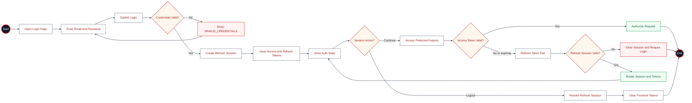

### Role Gating

All protected routes go through `requireAuth` middleware (`middleware/auth.ts:6`).
Role-specific routes additionally use:
- `requireRole(...roles)` — checks `req.actor.role` is in the allowed set
- `requireExactRole(...roles)` — alias of requireRole (identical check)
- `requireBoardChair` — checks `role === "BOARD" && isChair === true`
- `requireExactBoardChair` — alias of requireBoardChair

### Special Designation Management (Canonical)

Admin manages user accounts and the Board Chair designation through the normal user-update
function:

- `role = BOARD` may have `isChair = true`.
- A non-BOARD user must not retain `isChair`.
- The active Board roster contains three to five users.
- Exactly one active Board Chair may exist at a time.
- Reassigning a designation must clear it from the previous holder atomically.
- Deactivating or changing the role of a current Chair must clear the incompatible flag.

Assigning these flags is account administration only. Admin does not create or close
VotingSessions, vote, claim Proposals, review Chapters, or perform
any workflow action on behalf of the designated user.

### Key Files
- `backend/src/middleware/auth.ts` — requireAuth, requireRole, requireBoardChair
- `backend/src/services/auth.service.ts` — login, refresh, logout, userForAccessToken
- `backend/src/controllers/auth.controller.ts` — loginHandler, refreshHandler, meHandler, logoutHandler
- `backend/src/routes/auth.routes.ts` — route registration
- `backend/src/config/env.ts` — JWT_ACCESS_SECRET, JWT_REFRESH_SECRET, JWT_EXPIRES_IN
- `src/shared/auth/auth-store.ts` — frontend Zustand auth store
- `src/shared/api/auth.ts` — frontend API auth functions
- `src/shared/api/client.ts` — API client with Bearer token injection

### Error Codes
| Code | HTTP | Meaning |
|------|------|---------|
| MISSING_AUTH | 401 | No Bearer token in header |
| INVALID_ACCESS_TOKEN | 401 | JWT verification failed or expired |
| SESSION_EXPIRED | 401 | RefreshSession revoked or not found |
| USER_INACTIVE | 401 | User `active` flag is false |
| INVALID_CREDENTIALS | 401 | Email not found or password mismatch |
| INVALID_REFRESH_TOKEN | 401 | Refresh JWT invalid |
| INVALID_REFRESH_SESSION | 401 | Refresh session expired/revoked |
| FORBIDDEN | 403 | Authenticated but wrong role |
| BOARD_CHAIR_REQUIRED | 403 | Not a Board Chair |

### Notes
- Access token expiry is configurable via `JWT_EXPIRES_IN` env var
- Refresh tokens have a 7-day TTL stored in `expiresAt`
- Refresh is rotation-based: old session is revoked, new session created
- Demo mode: frontend can `loginAsRole(role)` without backend via Zustand persist
- Live mode: `loginWithCredentials(email, password)` hits `POST /api/auth/login`


---

## 02. Proposal Lifecycle

> **Canonical source:** `02-proposal-lifecycle(9).md`

### Description

A Mangaka creates and submits a Proposal, an Editor reviews it, and the Board decides it through
snapshotted VotingSessions. Approval creates a production Series; rejection ends the Proposal.

### Flowchart

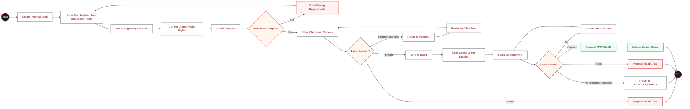

### Status Values

| Status | Description |
|--------|-------------|
| `DRAFT` | Mangaka-created, not yet submitted. |
| `PENDING_EDITOR` / `EDITOR_REVIEWING` / `CHANGES_REQUESTED` | Editorial review stages. |
| `PENDING_BOARD` | Editor forwarded the Proposal; awaiting an active session. |
| `BOARD_REVIEW` | An `OPEN` VotingSession is active. It remains so while a fresh re-vote opens after a tie. |
| `APPROVED` | Board approval; creates the production Series. |
| `REJECTED` | Editorial or Board rejection. |
| `WITHDRAWN` / `ARCHIVED` | Author withdrawal or allowed archive action. |

`TIED` is a VotingSession status, not a Proposal status. It is terminal audit history and is
immediately followed by a linked fresh `OPEN` round; the Proposal stays in `BOARD_REVIEW`.

### Board quorum and session integrity

Each session snapshots its ProposalVersion, eligible Board electorate, and quorum at opening.
Votes require the active session id and its expected version when supplied by the client. Closing
uses that session quorum. A complete tied electorate closes as `TIED` and creates an `OPEN`
re-vote with the same snapshots and no copied votes; the Proposal's active-session pointers move
to that new session.

### Role Access

| Action | Allowed Roles |
|--------|--------------|
| Submit, withdraw, edit, resubmit | Owning MANGAKA |
| Claim, request changes, forward, reject, recall | EDITOR (subject to workflow guard) |
| Create/close/cancel Board session | BOARD Chair |
| Vote in active Proposal round | BOARD, against the `OPEN` session only |
| View historical `TIED` or `TIE_BREAK_REQUIRED` record | BOARD, EDITOR |

### Invariants

- A Proposal has at most one active `OPEN` VotingSession.
- A Board member has at most one vote per VotingSession.
- A vote uses the active session id; historical `TIED`, `CANCELLED`, and legacy
  `TIE_BREAK_REQUIRED` sessions cannot receive new votes.
- The ProposalVersion, electorate, and quorum are immutable during a round.

### Historical compatibility

Existing `TIE_BREAK_REQUIRED` Proposal/session records remain readable for audit and display.
They do not authorize any special weighted tie-break request. All new tied Proposal rounds become
terminal `TIED` history and receive a fresh `OPEN` Board re-vote.


---

## 03. Series Lifecycle

> **Canonical source:** `03-series-lifecycle(9).md`

### Description
A Series enters the system only when Board approval is finalized. The approval
transaction idempotently creates one `PRE_PRODUCTION` Series for the approved
Proposal. There is no manual `POST /api/series` creation path.

The owning Mangaka manages production content. The assigned Tantou controls editorial
lifecycle actions such as hiatus and archive. Admin does not operate the Series lifecycle.

### Flowchart

```mermaid
flowchart LR
    S((Start)) --> A[Board Finalizes Proposal Approval]
    A --> B[System Auto-creates Series]
    B --> C[Status PRE_PRODUCTION and Visibility PRIVATE]
    C --> D1{Start Production?}
    D1 -->|Not yet| C
    D1 -->|Yes| D[Validate Source Proposal and Actor]
    D --> D2{Guards Pass?}
    D2 -->|No| X1[Return INVALID_TRANSITION or PROPOSAL_NOT_APPROVED]
    X1 --> C
    D2 -->|Yes| F[Set Series to ONGOING]
    F --> G[Manage Chapters, Members, Tasks and Invites]
    G --> D3{Lifecycle Action?}
    D3 -->|Continue| G
    D3 -->|Unpublish| H[Set Series to HIATUS]
    H --> E((End))
    D3 -->|Archive| I[Set Series to ARCHIVED]
    I --> E
    D3 -->|Delete eligible private series| J[Soft Delete]
    J --> E

    classDef default fill:#FFFFFF,stroke:#6B7280,stroke-width:1.5px,color:#991B1B;
    classDef terminal fill:#111827,stroke:#DC2626,stroke-width:3px,color:#FFFFFF;
    classDef decision fill:#FFF7ED,stroke:#DC2626,stroke-width:2px,color:#991B1B;
    classDef success fill:#F0FDF4,stroke:#16A34A,stroke-width:1.5px,color:#166534;
    classDef error fill:#FEF2F2,stroke:#DC2626,stroke-width:1.5px,color:#991B1B;
    class S,E terminal;
    class D1,D2,D3 decision;
    class F success;
    class X1 error;
    linkStyle default stroke:#374151,stroke-width:1.5px;
```

### Status Values

| Status | Description |
|---|---|
| `PRE_PRODUCTION` | Auto-created from an approved Proposal |
| `PLANNING` | Legacy data state retained for migration compatibility; new Series are not created in this state |
| `ONGOING` | Production active |
| `HIATUS` | Temporarily unpublished by the assigned Tantou |
| `COMPLETED` | Production complete |
| `ARCHIVED` | Lifecycle closed and retained |

### Series Visibility
`PRIVATE`, `PUBLIC`, `UNLISTED`, `ARCHIVED` control reader-facing availability.

### Creation Paths

#### Approved-Proposal path
`ensureProductionSeriesForApprovedProposal()` creates or finds one Series by
`sourceProposalId`, copies the approved Proposal data, sets `PRE_PRODUCTION`, and
stores the Board-approved publication cadence. The operation is idempotent.

#### Legacy `PLANNING` records
Existing records may still carry `PLANNING` during migration. They must reference
an approved source Proposal before `START_PRODUCTION`; the public creation route
has been removed.

### Role Access

| Action | Current implementation | Canonical actor and guard |
|---|---|---|
| Create | System transaction | Finalized Board approval auto-creates at most one Series |
| Patch | EDITOR, MANGAKA | Owning Mangaka or assigned Tantou |
| `START_PRODUCTION` | Owning Mangaka or assigned Tantou | Requires approved source Proposal; `ADMIN` removed (FLOW-GAP-04 — Resolved) |
| `UNPUBLISH` | Assigned Tantou only | `ADMIN` and general grant removed (FLOW-GAP-04 — Resolved) |
| `ARCHIVE` | Owner or assigned Tantou while never published; assigned Tantou only once published | A published Series may only be archived by its Tantou; `ADMIN` removed (FLOW-GAP-04 — Resolved) |
| Delete | Owning Mangaka (private/no-related-data guard) | `ADMIN` removed (FLOW-GAP-04 — Resolved) |

### Canonical Decision — FLOW-GAP-04 (Resolved)
Series routes no longer accept `ADMIN` for any lifecycle action. Admin is limited to
user account lifecycle and Chair designation management. Series lifecycle
permissions belong to the owning Mangaka and assigned Tantou, enforced by the
per-action matrix above (`series.controller.ts:270-384`). Implemented by CT-11.

### Invariants
- An approved Proposal creates at most one production Series.
- Manual creation does not bypass Proposal approval.
- Admin cannot create, start, pause, archive or delete a Series as a workflow actor.
- Assistant participation is through Series membership and Task assignment, not Series ownership.

### Key Files
- `backend/src/controllers/series.controller.ts:102-403` — CRUD and lifecycle
- `backend/src/services/workflow.service.ts:201-278` — auto-create from Proposal
- `backend/src/routes/series.routes.ts` — route registration
- `backend/src/validators/series.schema.ts` — validation
- `backend/src/db/models.ts:410-486` — Series model

### Error Codes
| Code | HTTP | Condition |
|---|---:|---|
| `PROPOSAL_REQUIRED` | 400 | No Proposal ID |
| `PROPOSAL_NOT_APPROVED` | 409 | Source Proposal missing or not approved |
| `PROPOSAL_ALREADY_PROMOTED` | 409 | Series already exists for the Proposal |
| `INVALID_TRANSITION` | 409 | Wrong lifecycle state |
| `FORBIDDEN` | 403 | Actor lacks record-level permission |
| `SERIES_NOT_FOUND` | 404 | Series does not exist |


---

## 04. Chapter Workflow & Publication

> **Canonical source:** `04-chapter-workflow(8).md`

### Description
Chapters go through a canonical lifecycle: PLANNED -> IN_PRODUCTION -> TANTOU_REVIEW
-> REVISION_REQUIRED (loop) -> READY_FOR_PUBLICATION -> PUBLISHED.
Scheduling lives on the Publication entity, not on the chapter itself.

### Flowchart

```mermaid
flowchart LR
    S((Start)) --> A[Create Chapter]
    A --> B[Start Draft]
    B --> C[Add Pages, Materials and Assistant Tasks]
    C --> D[Submit Chapter for Review]
    D --> D1{Readiness Passed?}
    D1 -->|No| X1[Show Missing Pages, Tasks, Materials or Blockers]
    X1 --> C
    D1 -->|Yes| E1[Freeze Review Snapshot]
    E1 --> F[Tantou Reviews Chapter]
    F --> D2{Review Decision?}
    D2 -->|Request revision or reject| G[Set REVISION_REQUIRED]
    G --> H[Replace Targeted Assets and Address Comments]
    H --> I[Resubmit Chapter]
    I --> J[Tantou Verifies Comments RESOLVED]
    J --> F
    D2 -->|Approve| K[Set READY_FOR_PUBLICATION]
    K --> L[Create Scheduled Publication]
    L --> D3{Publication Due?}
    D3 -->|No| M[Postpone or Wait]
    M --> K
    D3 -->|Yes| N[Publish Chapter]
    N --> O[Set Chapter PUBLISHED]
    O --> E((End))

    classDef default fill:#FFFFFF,stroke:#6B7280,stroke-width:1.5px,color:#991B1B;
    classDef terminal fill:#111827,stroke:#DC2626,stroke-width:3px,color:#FFFFFF;
    classDef decision fill:#FFF7ED,stroke:#DC2626,stroke-width:2px,color:#991B1B;
    classDef success fill:#F0FDF4,stroke:#16A34A,stroke-width:1.5px,color:#166534;
    classDef error fill:#FEF2F2,stroke:#DC2626,stroke-width:1.5px,color:#991B1B;
    class S,E terminal;
    class D1,D2,D3 decision;
    class K,N,O success;
    class X1 error;
    linkStyle default stroke:#374151,stroke-width:1.5px;
```

### Status Values (from `backend/src/types.ts:112-119`)

| Status | Description |
|--------|-------------|
| `PLANNED` | Chapter created, not started |
| `IN_PRODUCTION` | Active work in progress |
| `TANTOU_REVIEW` | Sent to Editor (Tantou) for review |
| `REVISION_REQUIRED` | Editor requested changes |
| `READY_FOR_PUBLICATION` | Approved, awaiting schedule/publish |
| `PUBLISHED` | Published |

### Chapter Actions (from `backend/src/types.ts:121-134`)

`START_DRAFT`, `START_ASSISTANT_WORK`, `SUBMIT_REVIEW`, `REQUEST_REVISION`,
`REJECT`, `RESUBMIT`, `EDITOR_APPROVE`, `SCHEDULE`, `POSTPONE`,
`PUBLISH`, `PUBLISH_EARLY`, `REASSIGN`

### Role Access

| Action | Allowed Roles | Guard |
|--------|--------------|-------|
| START_DRAFT | Owner (assigneeId matches) | `workflow.service.ts:1711` |
| SUBMIT_REVIEW, RESUBMIT | **Owning MANGAKA only** (`series.authorId`) | `chapter-review.service.ts` |
| START_ASSISTANT_WORK | EDITOR, MANGAKA | `workflow.service.ts:1712` |
| REQUEST_REVISION, REJECT | EDITOR (assigned Tantou) | `workflow.service.ts:1713-1714` |
| EDITOR_APPROVE | EDITOR (assigned Tantou); current frozen snapshot and all blockers `RESOLVED` | `workflow.service.ts` |
| SCHEDULE, POSTPONE, PUBLISH | EDITOR | `publication.service.ts` |
| REASSIGN | EDITOR | `workflow.service.ts` |

### Self-Approval Block
Editor cannot review their own production chapter (`workflow.service.ts:1748-1753`):
```
if (series.authorId === actor.id) throw 403 SELF_APPROVAL_BLOCKED
```

`MARK_READY` was removed because it bypassed the frozen review snapshot,
assistant-task readiness, material readiness, and blocking-comment verification.
`EDITOR_APPROVE` is the only path into `READY_FOR_PUBLICATION`.

#### Page revision replacement

`REQUEST_REVISION` and `REJECT` move the targeted Chapter pages to
`REVISION_REQUIRED`. The owning Mangaka must replace the existing page asset
through `PATCH /api/pages/:pageId`; creating an additional page does not satisfy
the revision because the original page remains part of the frozen review scope.
When a replacement asset is accepted, the backend preserves the page ID/order and
sets that page back to `UPLOADED`.

The Mangaka then marks the Tantou's blocking comment `ADDRESSED` and uses
`RESUBMIT`. `ADDRESSED` is sufficient to return work to Tantou review, but it is
not sufficient for approval. The assigned Tantou must verify the fix by changing
the comment to `RESOLVED`; only then can `EDITOR_APPROVE` move the Chapter to
`READY_FOR_PUBLICATION`.

### Canonical Decisions & Required Code Changes

#### Chapter submission authority (canonical — already enforced)
Only the owning Mangaka may submit or resubmit a whole Chapter to Tantou review.
`sendChapterToEditorReview` (`chapter-review.service.ts`) enforces `role === MANGAKA`
(`:1409`) **and** `series.authorId === actor.id` (`:1422`, `MANGAKA_OWNER_REQUIRED`).
Assistants work only through Region → Task → Submission; they cannot submit the
Chapter. **No FLOW-GAP** — earlier docs that listed "Mangaka/Assistant" here were
inaccurate and are corrected above.

> `applyChapterAction` delegates SUBMIT_REVIEW/RESUBMIT only when the actor is the
> owning Mangaka and returns `MANGAKA_OWNER_REQUIRED` for a non-owning Mangaka.
> Assigned chapter access alone is not sufficient to submit the whole Chapter.

#### Supporting Materials do not gate review
Supporting Materials are optional attachments. Chapter readiness depends on Pages,
Assistant Tasks/Submissions, blocking Comments, and the frozen review snapshot.

#### TECH-FINDING-06 — Generic `FORBIDDEN` vs ownership codes
**Status: Resolved.** The affected ownership/assignment failures now use the
specific codes (`MANGAKA_OWNER_REQUIRED`, `TANTOU_ASSIGNMENT_REQUIRED`,
`TASK_NOT_ASSIGNED`) while pure role/type denials remain `FORBIDDEN`. The chapter
action, comment, and submission-review paths are covered by the authorization
perimeter tests. → `CODE-TODO` P2 (Done).

### Key Files
- `backend/src/services/chapter-review.service.ts` — `sendChapterToEditorReview()`
- `backend/src/services/workflow.service.ts:1666-2079` — `applyChapterAction()`
- `backend/src/controllers/series.controller.ts:647-881` — chapter/page routes
- `backend/src/routes/series.routes.ts:71-99` — chapter + page routes
- `backend/src/db/models.ts:488-594` — ChapterRecord, chapterSchema


---

## 05. Assistant Tasks & Submissions

> **Canonical source:** `05-assistant-submission(6).md`

### Description

An Assistant is assigned a Task, starts work, submits work via POST /api/tasks/:taskId/submit,
and the Mangaka reviews (approve/reject/request-revision). On Mangaka approval, an
Earning record is created. The Assistant can reopen revision-requested tasks.

### Flowchart

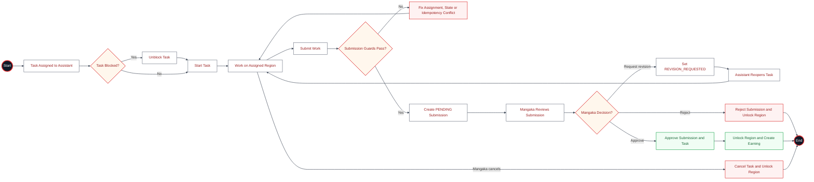

### Submission Status Values (from `backend/src/types.ts:203-212`)

| Status               | Description                             |
| -------------------- | --------------------------------------- |
| `PENDING`            | Just submitted, awaiting Mangaka review |
| `MANGAKA_APPROVED`   | Mangaka approved                        |
| `REVISION_REQUESTED` | Mangaka requested changes               |
| `SUPERSEDED`         | Replaced by a newer submission          |
| `REJECTED`           | Mangaka rejected                        |

### Task Status Values (from `backend/src/types.ts:163-176`)

| Status               | Description                 |
| -------------------- | --------------------------- |
| `TODO`               | Task created, not started   |
| `IN_PROGRESS`        | Assistant working           |
| `SUBMITTED`          | Work submitted (pre-review) |
| `REVISION_REQUESTED` | Mangaka requested revision  |
| `MANGAKA_APPROVED`   | Mangaka approved            |
| `REJECTED`           | Mangaka rejected            |
| `CANCELLED`          | Cancelled by Mangaka        |

### Role Access

**Genuine Task lifecycle actions** (via `POST /api/tasks/:taskId/actions/:action`):

| Action                        | Allowed Roles      | Guard                        |
| ----------------------------- | ------------------ | ---------------------------- |
| ACCEPT, REJECT                | Assigned ASSISTANT | Assignment decision required before work starts |
| START, REOPEN | Assigned ASSISTANT | `task-submission.service.ts` |
| CANCEL, REASSIGN              | MANGAKA            | `task-submission.service.ts` |

(`SUBMIT` via the actions endpoint is deprecated → use `POST /api/tasks/:taskId/submit`.)

**Submission decisions** use dedicated Submission endpoints, not the generic Task
action endpoint:

| Decision         | Canonical endpoint                                     | Actor                     |
| ---------------- | ------------------------------------------------------ | ------------------------- |
| Approve          | `POST /api/submissions/:submissionId/approve`          | Owning MANGAKA (not self) |
| Request revision | `POST /api/submissions/:submissionId/request-revision` | Owning MANGAKA            |
| Reject           | `POST /api/submissions/:submissionId/reject`           | Owning MANGAKA            |

The generic Task-action review aliases `APPROVE`, `MANGAKA_APPROVE`,
`REQUEST_REVISION`, and `EDITOR_APPROVE` have been removed from `TASK_ACTIONS`.
`REJECT` remains only as the assigned Assistant's assignment decision; it is not
a Submission review decision. Review aliases return `400 INVALID_ACTION`; the
canonical Submission endpoints remain the only submission decision contract
([TECH-FINDING-04](#tech-finding-04--deprecated-decision-aliases-in-task_actions)).

### Idempotency

Submissions use `Idempotency-Key` header + `requestFingerprint` (SHA-256 of sorted payload)
to prevent duplicate submissions. If same key + same fingerprint: returns existing submission.
If same key + different fingerprint: HTTP 409 `IDEMPOTENCY_KEY_REUSED`.

### Earning Creation (on MANGAKA_APPROVED)

Before a Task can be created, the owning Mangaka selects an active `rateCode` and
quantity. The backend resolves the Admin-owned `RateTable` entry and stores the
rate snapshot on the Task; `rateSnapshot` and `estimatedAmount` are never accepted
from the client. `EarningModel.findOneAndUpdate({ sourceKey })` with `$setOnInsert`:

- `sourceKey = "TASK_APPROVAL:{taskId}:{submissionId}"`
- `amount = quantity * rateSnapshot` (server-resolved immutable Task snapshot)
- `status = "EARNED"`
- `OutboxEvent` emitted: `earning.earned`

### Submission Error Codes

| Condition                                 | HTTP | Code                                   | Status                                   |
| ----------------------------------------- | ---- | -------------------------------------- | ---------------------------------------- |
| Missing `Idempotency-Key`                 | 400  | `IDEMPOTENCY_KEY_REQUIRED`             | Implemented (`workflow.service.ts:2238`) |
| Missing `expectedCurrentSubmissionId`     | 400  | `EXPECTED_CURRENT_SUBMISSION_REQUIRED` | Implemented (`:2240-2245`)               |
| Current submission changed since read     | 409  | `CURRENT_SUBMISSION_CONFLICT`          | Implemented (`workflow.service.ts:2291`) |
| Idempotency key reused, different payload | 409  | `IDEMPOTENCY_KEY_REUSED`               | Implemented (`:2303-2307`)               |
| Task not assigned to actor                | 403  | `TASK_NOT_ASSIGNED`                    | Implemented                              |
| BLOCK / MARK_BLOCKED / UNBLOCK action    | 400  | `INVALID_ACTION`                       | Retired; use assignment rejection or Mangaka reassignment |
| Invalid Task/Submission transition        | 409  | `INVALID_TRANSITION`                   | Implemented (`:2285`)                    |

### Region Locking (see [14-regions.md](14-regions.md))

A Task locks its Region at **creation** (`ASSIGNED` + `LOCKED` + `activeTaskId`,
`studio.controller.ts:300-306`) and the Region stays `LOCKED` through `START`,
`SUBMIT`, and `REQUEST_REVISION` (revision only changes the display status to
`REVISION_REQUIRED`, `workflow.service.ts:3132-3138`). The lock is released only on
`APPROVE`, `REJECT`, or `CANCEL`. One Region has at most one active Task
(`studio.controller.ts:271-311`).

### Verified frontend lifecycle

Live E2E exercises the Assistant-scoped Studio and Mangaka Review Queue:

1. Assigned Assistant opens an accepted TODO task, performs `START`, and uploads a real file.
2. `POST /api/tasks/:taskId/submit` returns `201`; the task becomes `SUBMITTED`
   and the Studio upload panel becomes read-only.
3. The submission appears in the owning Mangaka's Review Queue.
4. Mangaka approves through the review UI; the canonical Submission endpoint returns `200`
   and the item leaves the pending queue.

### Canonical Decisions & Required Code Changes

#### TECH-FINDING-04 — Deprecated decision aliases in `TASK_ACTIONS`

**Status: Resolved.** `TASK_ACTIONS` now contains only task lifecycle actions;
`APPROVE`, `MANGAKA_APPROVE`, `REQUEST_REVISION`, `REJECT`, and `EDITOR_APPROVE`
are rejected with `400 INVALID_ACTION` before task workflow execution. Canonical
Submission and Chapter review endpoints remain separate. → `CODE-TODO` CT-10 (Done).

#### TECH-FINDING-05 — Generic `CONFLICT` code

**Status: Resolved.**

The stale-current-submission check (`workflow.service.ts:2291`) now throws the
canonical `CURRENT_SUBMISSION_CONFLICT` code (HTTP 409). The prior generic
`CONFLICT` response is retired. → `CODE-TODO` P2 (Done).

### Key Files

- `backend/src/services/task-submission.service.ts` — `submitTaskWork()`
- `backend/src/services/task-submission.service.ts` — `submissionDecision()`
- `backend/src/services/task-submission.service.ts` — `applyTaskAction()`
- `backend/src/services/task-submission.service.ts` — `reopenTaskForRevision()`
- `backend/src/controllers/submission.controller.ts` — route handlers
- `backend/src/routes/submission.routes.ts` — route registration


---

## 06. Board Governance

> **Canonical source:** `06-board-governance(8).md`

### Description

The Board votes through `VotingSession` records. A Chair opens a session, Board members cast
`APPROVE` or `REJECT`; members who have not voted remain pending. The Chair closes the active session. A tied round is
terminal `TIED` history; closing it creates a new empty `OPEN` re-vote session using the same
Proposal snapshot, electorate, and quorum. The active Board has three to five seats; opening a
session snapshots the roster and requires at least three members and exactly one active Chair.

### Flowchart

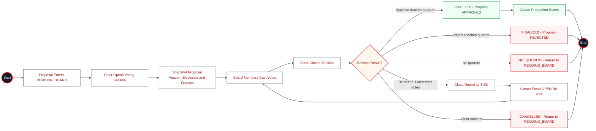

### VotingSession Status

| Status | Description |
|--------|-------------|
| `OPEN` | The only voteable Board session. |
| `TIED` | Terminal historical round; a fresh `OPEN` re-vote is linked by `reVoteOfSessionId`. |
| `NO_QUORUM` | Closed without sufficient votes; Proposal returns to `PENDING_BOARD`. |
| `FINALIZED` | Decision made (`APPROVED` or `REJECTED`). |
| `CANCELLED` | Cancelled by the Chair. |
| `TIE_BREAK_REQUIRED` | Historical compatibility status only; readable but not voteable. |

### Quorum and re-vote logic

The close operation uses the session's snapshotted `quorum`, not a mutable global value. It
approves or rejects when either tally reaches that quorum. Once every eligible voter has voted,
equal approve/reject tallies close the round as `TIED` and atomically create a linked `OPEN`
re-vote. The new round has no copied `ProposalVote` rows. Later account changes do not rewrite
the session's `eligibleVoterIds` or quorum.

### Queue and decision-history boundary

- The Board Queue uses the current `OPEN` session for a Proposal; `TIED` rounds are history.
- The Proposal remains `BOARD_REVIEW` after a tie and its active-session pointers move to the
  newly created `OPEN` re-vote session.
- Finalized, no-quorum, and cancelled sessions clear the active pointers as appropriate.
- Historical `TIE_BREAK_REQUIRED` records remain visible for compatibility, but the client must
  not send new special tie-break requests.

### Role Access

| Action | Allowed Roles | Guard |
|--------|--------------|-------|
| Create, patch, close, cancel session | BOARD (Chair) | VotingSession controller/service |
| Cast vote (`OPEN` only) | BOARD | Proposal `VOTE` action |
| Start re-vote after tie | System, within Chair close transaction | Governance service |
| View historical `TIED` or `TIE_BREAK_REQUIRED` session | BOARD, EDITOR | Decision/session history |
| Add/edit/delete notes | EDITOR, BOARD | VotingSession controller |

### Invariants

- A Proposal has at most one active `OPEN` VotingSession.
- A Board member has at most one vote per VotingSession.
- Votes and quorum are scoped to their session; historical, cancelled, and tied sessions cannot
  receive new votes.
- A tied session and its replacement re-vote are immutable audit history plus a fresh round.
- The Board Chair closes/cancels sessions; close creates the re-vote atomically when tied.

### Historical compatibility

Legacy `TIE_BREAK_REQUIRED` records and their display labels are retained so existing audits and
seeded history remain readable. They are not an active Proposal path: new ties use `TIED` plus a
fresh `OPEN` re-vote, with no weighted special-role action.


---

## 07. Supporting Materials

> **Canonical source:** `07-material-management(8).md`

### Description
Supporting Materials are optional versioned attachments scoped to a Proposal, Series,
Chapter, or Page. They provide context only and have no review or status lifecycle.

### Flowchart

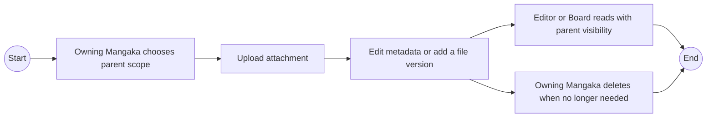

### No Material lifecycle

Material does not accept `DRAFT`, `ACTIVE`, `IN_REVIEW`, `APPROVED`, or `ARCHIVED`.
It never gates Chapter review, Tantou replacement, publication, or Board decisions.
Review feedback belongs to Proposal/Chapter review comments. Manuscripts remain
separate Proposal versions.

The dry-run-first `migrate:material-attachments` migration removes archived legacy
records and strips status fields from retained attachments.

### Material Scope
`PROPOSAL`, `SERIES`, `CHAPTER`, `PAGE` — controls ownership and visibility.

### Role Access

| Action | Allowed Roles | Guard |
|--------|--------------|-------|
| Create, Patch, Add version, Delete | Owning MANGAKA | Parent ownership guard |
| List | Authenticated actors | Parent visibility guard |

### Key Files
- `backend/src/controllers/material.controller.ts` — scoped CRUD handlers
- `backend/src/routes/material.routes.ts` — route registration
- `backend/src/db/models.ts` — MaterialRecord, MaterialVersion, materialSchema
- `backend/src/validators/material.schema.ts` — Zod validation schemas


---

## 08. Earnings & Rate Policy

> **Canonical source:** `08-earnings(7).md`

### Description
When the owning Mangaka approves an Assistant Submission, the system creates one
idempotent `EARNED` record for the Task. This module is earnings tracking only, not
payroll or payment processing. Rate policy is configured by Admin through the
narrow `MANAGE_RATE_TABLE` capability; Mangaka never writes monetary rates.

### Flowchart

```mermaid
flowchart LR
    S((Start)) --> A[Admin Configures Active RateTable]
    A --> B[Mangaka Creates Task with Rate Code and Quantity]
    B --> C[Backend Resolves and Snapshots Rate]
    C --> D[Assistant Completes and Submits Work]
    D --> E1[Mangaka Reviews Submission]
    E1 --> D1{Submission Approved?}
    D1 -->|Revision| F[Return Task to Assistant]
    F --> D
    D1 -->|Reject| G[Close Without Earning]
    G --> E((End))
    D1 -->|Approve| H[Create Idempotent Earning]
    H --> I[Set Status EARNED]
    I --> J[Assistant Views Own Earnings]
    J --> E

    classDef default fill:#FFFFFF,stroke:#6B7280,stroke-width:1.5px,color:#991B1B;
    classDef terminal fill:#111827,stroke:#DC2626,stroke-width:3px,color:#FFFFFF;
    classDef decision fill:#FFF7ED,stroke:#DC2626,stroke-width:2px,color:#991B1B;
    classDef success fill:#F0FDF4,stroke:#16A34A,stroke-width:1.5px,color:#166534;
    classDef error fill:#FEF2F2,stroke:#DC2626,stroke-width:1.5px,color:#991B1B;
    class S,E terminal;
    class D1 decision;
    class H,I success;
    class G error;
    linkStyle default stroke:#374151,stroke-width:1.5px;
```

### Earning Status Values

| Status | Description |
|---|---|
| `PENDING` | Legacy initial value |
| `EARNED` | Created when the Mangaka approves a Submission |
| `CONFIRMED`, `PAID`, `VOIDED`, `ADJUSTED`, `REVERSED` | Legacy/deprecated payroll states |

### Rate policy

`RateTable` is the source of truth for new task pricing. Each entry has a
`rateCode`, work unit, positive amount, currency, version, status, and effective
window. Active windows for the same code cannot overlap. The Admin manages these
entries through `GET /api/admin/rates`, `POST /api/admin/rates`, and
`PATCH /api/admin/rates/:id`. Task creation options come from
`GET /api/rates/active`.

Task creation accepts only `rateCode` and `quantity`. The backend resolves the
active entry and stores `rateCode`, `rateVersion`, `rateSnapshot`, `currency`, and
`estimatedAmount`. Later rate versions affect new tasks only. If no active rate
exists, creation returns `409 RATE_CONFIGURATION_REQUIRED` rather than creating a
zero-priced task. Production amounts are intentionally not defined in the
repository and must be configured by an authorized Admin.

### Role Access

| Capability | Current implementation | Canonical actor |
|---|---|---|
| View own earnings | ASSISTANT | Assistant owner only; Admin no longer has this route |
| Manage rate table | ADMIN | Dedicated `MANAGE_RATE_TABLE`; not Mangaka — kept exception |
| List payroll | **Removed** | `/admin/payroll` route and handler deleted |
| Confirm/mark-paid/void | **Removed** | `/admin/payroll/:earningId/*` routes and handlers deleted (already deprecated) |

### Canonical Decision — FLOW-GAP-04 (Resolved)
Admin payroll and earnings access was outside the minimal account-management role.
The canonical module exposes only the Assistant's own earnings view and automatic
Earning creation from Mangaka approval. `GET /api/admin/payroll` and
`POST /api/admin/payroll/:earningId/{confirm,mark-paid,void}` and their handlers
are deleted; `MANAGE_RATE_TABLE` (`/admin/rates*`) remains an explicit kept
exception. Implemented by CT-11.

### Key Files
- `backend/src/services/rate-table.service.ts` - Admin rate policy and active-rate resolution
- `backend/src/db/models/rate-table.model.ts` - versioned RateTable persistence
- `backend/src/controllers/studio.controller.ts` - server-side task rate snapshot
- `backend/src/services/earning.service.ts` — earning calculation, idempotent persistence, and the transactional `earning.earned` outbox event
- `backend/src/controllers/admin.controller.ts:113-158` — current-only/deprecated payroll routes
- `backend/src/db/models.ts:1379-1487` — Earning models


---

## 09. Rankings

> **Canonical source:** `09-rankings(7).md`

### Description
Rankings track Series performance by period. Board users import the ranking dataset;
a Mangaka sees only rankings for owned Series, while other authorized editorial
roles may view the permitted ranking set. Admin does not manage Rankings.

### Flowchart

```mermaid
flowchart LR
    S((Start)) --> A[Board Imports Ranking Dataset]
    A --> B[Create PENDING Import]
    B --> C[Validate Each Row]
    C --> D1{Row Valid?}
    D1 -->|No| X1[Append Row Error]
    X1 --> D2{More Rows?}
    D1 -->|Yes| E1[Upsert Ranking by Period and Series]
    E1 --> D2
    D2 -->|Yes| C
    D2 -->|No| D3{Any Row Imported?}
    D3 -->|No| F[Set Import FAILED]
    D3 -->|Yes| G[Set Import IMPORTED]
    F --> H[User Opens Rankings]
    G --> H
    H --> D4{Viewer Role?}
    D4 -->|Mangaka| I[Show Owned Series Only]
    D4 -->|Board or Editor| J[Show Permitted Ranking Set]
    I --> E((End))
    J --> E

    classDef default fill:#FFFFFF,stroke:#6B7280,stroke-width:1.5px,color:#991B1B;
    classDef terminal fill:#111827,stroke:#DC2626,stroke-width:3px,color:#FFFFFF;
    classDef decision fill:#FFF7ED,stroke:#DC2626,stroke-width:2px,color:#991B1B;
    classDef success fill:#F0FDF4,stroke:#16A34A,stroke-width:1.5px,color:#166534;
    classDef error fill:#FEF2F2,stroke:#DC2626,stroke-width:1.5px,color:#991B1B;
    class S,E terminal;
    class D1,D2,D3,D4 decision;
    class G success;
    class X1,F error;
    linkStyle default stroke:#374151,stroke-width:1.5px;
```

### Ranking Import Status

| Status | Description |
|---|---|
| `PENDING` | Import created |
| `VALIDATED` | Rows validated |
| `IMPORTED` | All or some valid rows imported |
| `FAILED` | No rows imported |

### Ranking Import Row Schema
Required: `period`; one to 500 rows. Rows may include `seriesId`, `seriesTitle`,
`score`, `finalScore`, `readerScore`, `votes`, `voteCount`, `status`, and `atRisk`.

### Role Access

| Action | Current implementation | Canonical actor |
|---|---|---|
| List rankings | BOARD, EDITOR, MANGAKA | Board/Editor see the permitted set; Mangaka only owned Series |
| Import rankings | BOARD | `ADMIN` removed (FLOW-GAP-04 — Resolved) |
| List Series rankings | BOARD, EDITOR, MANGAKA | Mangaka ownership guard; Admin/Assistant denied |

### Canonical Decision — FLOW-GAP-04 (Resolved)
Ranking import is governance/editorial data handling and does not belong to account
administration. `POST /rankings/import` requires `BOARD`; `ADMIN` no longer passes
the role guard (`notification.routes.ts:20`). Implemented by CT-11.

### Key Files
- `backend/src/controllers/notification.controller.ts:74-242` — ranking handlers
- `backend/src/routes/notification.routes.ts:19-21` — ranking routes
- `backend/src/db/models.ts:1289-1377` — Ranking and RankingImport models


---

## 10. AI Processing

> **Canonical source:** `10-ai-processing(6).md`

### Description
AI features include bubble detection (speech bubble detection in manga pages)
and bubble whitening (removing text from detected bubbles). The AI service is
an external Python service that the backend proxies to.

### Flowchart

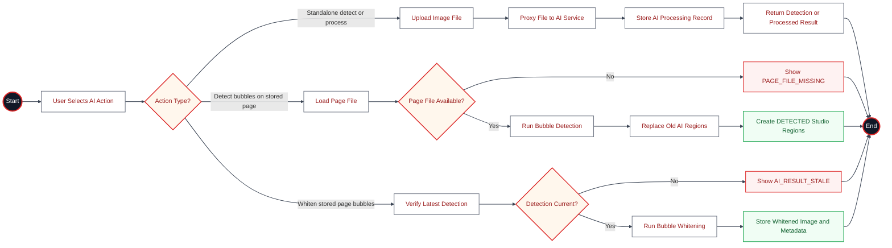

### AI Processing Actions
- `bubble.detect` — Detect bubbles in uploaded file
- `bubble.process` — Process bubbles in uploaded file
- `studio.page.bubble.detect` — Detect bubbles in a stored page
- `studio.page.bubble.whiten` — Whiten bubbles in a stored page

### Role Access

| Action | Allowed Roles |
|--------|--------------|
| Health | All authenticated users |
| Detect/process an uploaded standalone file | EDITOR, MANGAKA |
| Detect/whiten a stored Page | Owning MANGAKA only |

### Staleness Guard
Before whitening, `assertLatestAiDetection(pageId, expectedProcessingId)` checks that
the most recent AI detection for this page matches the `expectedProcessingId`. If stale,
returns HTTP 409 `AI_RESULT_STALE`.

### Key Files
- `backend/src/controllers/ai.controller.ts` — AI route handlers
- `backend/src/routes/ai.routes.ts` — AI route registration
- `backend/src/services/studio-access.service.ts` — `assertCanRunPageAi()`
- `backend/src/services/file-access.service.ts` — storage read/write
- `backend/src/db/models.ts:1489-1513` — AiProcessingRecord


---

## 11. File Management

> **Canonical source:** `11-file-management(6).md`

### Description
Files are stored in Cloudflare R2 (or local filesystem in development).
The backend provides presigned upload/download URLs and token-based display URLs
for secure file access.

### Flowchart

```mermaid
flowchart LR
    S((Start)) --> A[Client Requests File Upload]
    A --> B[Validate Content Type]
    B --> D1{Type Allowed?}
    D1 -->|No| X1[Show UNSUPPORTED_FILE_TYPE]
    X1 --> E((End))
    D1 -->|Yes| C[Generate Presigned Upload URL]
    C --> D2{Storage Mode?}
    D2 -->|Local development| D[Upload to Local Token URL]
    D2 -->|Cloudflare R2| F[Upload to R2 Presigned URL]
    D --> G[File Stored]
    F --> G
    G --> H[Request Display or Download URL]
    H --> I[Check Resource Visibility]
    I --> D3{Access Allowed?}
    D3 -->|No| X2[Return FORBIDDEN]
    X2 --> E
    D3 -->|Yes| J[Generate Time-limited Secure URL]
    J --> K[Browser Reads File Bytes]
    K --> E

    classDef default fill:#FFFFFF,stroke:#6B7280,stroke-width:1.5px,color:#991B1B;
    classDef terminal fill:#111827,stroke:#DC2626,stroke-width:3px,color:#FFFFFF;
    classDef decision fill:#FFF7ED,stroke:#DC2626,stroke-width:2px,color:#991B1B;
    classDef success fill:#F0FDF4,stroke:#16A34A,stroke-width:1.5px,color:#166534;
    classDef error fill:#FEF2F2,stroke:#DC2626,stroke-width:1.5px,color:#991B1B;
    class S,E terminal;
    class D1,D2,D3 decision;
    class G,J,K success;
    class X1,X2 error;
    linkStyle default stroke:#374151,stroke-width:1.5px;
```

### Content Type Restrictions
Allowed upload types (`series.controller.ts:66-71`):
- `image/*` (all image types)
- `application/pdf`
- `application/zip`, `application/x-zip-compressed`
- `application/octet-stream`

### File Token Flow
1. `presignR2Upload()` / `createDisplayUrl()` generate a signed token
2. Token encodes: `key`, `contentType`, `fileName`
3. `verifyFileAccessToken()` validates and decodes the token
4. Token is non-replayable for uploads, time-limited for display

### Role Access

| Action | Current implementation | Canonical actor |
|---|---|---|
| Presign upload | EDITOR, MANGAKA, ASSISTANT | Same, with resource-scope guard |
| Presign download | BOARD, EDITOR, MANGAKA, ASSISTANT | Resource owner/member/reviewer scope; `ADMIN` removed (FLOW-GAP-04 — Resolved) |
| Display URL | EDITOR, MANGAKA, ASSISTANT | Same, with resource-scope guard |
| Token upload/display | Token-authenticated | Unchanged |

Admin account management does not require access to editorial files. `POST
/api/files/presign-download` no longer accepts `ADMIN` (`series.routes.ts:108-110`).
Implemented by CT-11.

### CORS Headers
Display file responses set:
- `Cross-Origin-Resource-Policy: cross-origin`
- `Access-Control-Allow-Origin: {CLIENT_URL}` (if request origin matches)
- `Cache-Control: private, max-age=300`

### Key Files
- `backend/src/services/r2.service.ts` — presignR2Upload, presignR2Download
- `backend/src/services/file-access.service.ts` — createDisplayUrl, createLocalUploadUrl, putLocalObject, readStoredObject
- `backend/src/controllers/file-token.controller.ts` — putLocalUpload, displayFile
- `backend/src/routes/file-token.routes.ts` — token route registration
- `backend/src/controllers/series.controller.ts:831-881` — presign handlers
- `backend/src/routes/series.routes.ts:101-112` — file routes


---

## 12. Comments & Review Gates

> **Canonical source:** `12-comments(6).md`

### Description
Comments are created on chapters, pages, regions, tasks, or submissions.
A blocking comment (`isBlocking: true`) prevents resubmission until it is
ADDRESSED by the owning Mangaka. `ADDRESSED` means ready for Tantou verification;
the assigned Tantou must mark it `RESOLVED` before Chapter approval. See
**Canonical Decisions & Required Code Changes** below —
only the assigned Tantou may create or raise a blocking comment
([FLOW-GAP-01](#flow-gap-01--blocking-comment-write-authority), Resolved).

### Flowchart

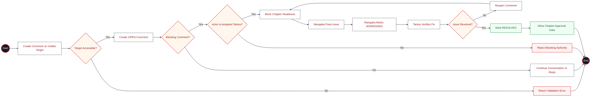

### Comment Status Values (from `backend/src/db/models.ts:861`)

| Status | Description |
|--------|-------------|
| `OPEN` | Active, not resolved (blocking) |
| `ADDRESSED` | Mangaka states the issue is handled; resubmission allowed, approval still blocked |
| `RESOLVED` | Assigned Tantou verifies the fix; approval allowed |
| `REOPENED` | Assigned Tantou determines the issue is unresolved (blocking) |

**Canonical two-gate rule:** `OPEN`/`REOPENED` block resubmission.
`ADDRESSED` allows resubmission but blocks `EDITOR_APPROVE`. Only `RESOLVED`
passes the publication-readiness gate.

### Blocking Comment Detection

**Resubmission gate** (`findChapterBlockingComments`,
`chapter-review.service.ts`) — a comment blocks entry into chapter review if:
1. `isBlocking === true`, **and**
2. `status` is NOT `ADDRESSED` or `RESOLVED`, **and**
3. it is scoped to the chapter or a related page/region/task/submission.

**Approval gate:** `EDITOR_APPROVE` runs the same scoped query with only
`RESOLVED` accepted. Therefore `ADDRESSED` is visible to the Tantou as pending
verification and cannot silently pass publication readiness.

The chapter-blocking query does **not** filter on `authorRole`, and this is
unchanged by the [FLOW-GAP-01](#flow-gap-01--blocking-comment-write-authority)
fix — detection stays independent of the author's *current* Tantou assignment
so a blocking comment remains valid after Tantou reassignment. The
`authorRole === "EDITOR"` filter lives only in `isTantouBlockingComment`
(`studio.controller.ts:108-113`), which gates *resolve/address/reopen*
authority, not *detection*.

**Write-time authority (implemented):** `createComment` and `patchComment` now
  reject any non-Tantou attempt to create or raise an `isBlocking` comment
(`assertCanRaiseBlockingComment`, `studio.controller.ts:151-161`), so new
orphan blockers can no longer be created through the API. This is a write
gate, not a data migration — it does not repair pre-existing records, and existing valid `isBlocking` comments remain detected by
  `findChapterBlockingComments`.

### Comment Target Types
`CHAPTER`, `PAGE`, `REGION`, `TASK`, `SUBMISSION`

### Reply Contract

- `POST /api/comments/:commentId/replies` accepts `body` (or legacy `text`).
- A reply stores `parentCommentId` and inherits the parent comment's target,
  Series, Chapter, Page, Region, Task, and Submission scope.
- Replies are always `OPEN` and `isBlocking: false`. A reply is conversation
  context; it cannot create a second readiness gate or silently escalate the
  parent's severity.
- The actor must be able to read the parent target. The API derives author and
  scope fields from authenticated context and the parent record.
- Replying does not change the parent status. `ADDRESS`, `RESOLVE`, and `REOPEN`
  remain explicit lifecycle actions on the parent comment.

### Role Access

| Action | Allowed Roles (current) | Canonical guard | Guard ref |
|--------|--------------|-------|-------|
| Create | EDITOR, MANGAKA, ASSISTANT | Any author may comment; **only assigned Tantou may set `isBlocking`** ([FLOW-GAP-01](#flow-gap-01--blocking-comment-write-authority), Resolved) | `studio.controller.ts:435-441` |
| Reply | EDITOR, MANGAKA, ASSISTANT | Must be able to read the parent target; reply inherits scope and is always non-blocking | `studio.controller.ts`, `studio.routes.ts` |
| Patch | Author only | Same; raising `isBlocking` from non-blocking requires assigned Tantou ([FLOW-GAP-01](#flow-gap-01--blocking-comment-write-authority), Resolved) | `studio.controller.ts` |
| Resolve | EDITOR | Assigned Tantou of the related Series, on a Tantou blocking comment ([FLOW-GAP-03](#flow-gap-03--comment-resolvereopen-assignment-guard), Resolved) | `studio.controller.ts:133-174,477` |
| Address | MANGAKA owner, Tantou blocking only | Owning Mangaka only (already enforced) | `studio.controller.ts:115-131,470` |
| Reopen | EDITOR | Assigned Tantou; only from `ADDRESSED`/`RESOLVED` ([FLOW-GAP-03](#flow-gap-03--comment-resolvereopen-assignment-guard), Resolved) | `studio.controller.ts:503-515` |
| List | All (scoped) | unchanged | `studio.routes.ts:55` |
| List by task | All (scoped) | unchanged | `studio.routes.ts:69` |

### Canonical Decisions & Required Code Changes

The action-specific guards below are implemented in the controller and remain the
canonical authorization boundary.

#### FLOW-GAP-01 — Blocking comment write authority (Resolved)
- **Implemented behavior:** `createComment` (`studio.controller.ts:435-441`) and
  `patchComment` (`:456-479`) call `assertCanRaiseBlockingComment`
  (`:151-161`) whenever a request sets `isBlocking` true on create, or
  raises a comment from non-blocking to blocking on patch. The guard requires the
  actor to be role `EDITOR` and the assigned Tantou (`series.editorId === actor.id`)
  of the related Series, else it throws `403 TANTOU_ASSIGNMENT_REQUIRED`. Mangaka and
  Assistant comments can no longer set `isBlocking` through the API.
- **Canonical business decision:** Only the assigned Tantou may create a blocking
  editorial comment or change a comment from non-blocking to blocking. Mangaka and
  Assistant comments must not block chapter submission by setting `isBlocking`.
- **Scope note:** this is a write-time gate, not a data migration or a change to
  detection. `findChapterBlockingComments` (`chapter-review.service.ts`)
  intentionally still detects blocking comments independent of the author's
  *current* Tantou assignment (a blocking comment must stay valid after Tantou
  reassignment), and `isTantouBlockingComment` still keys on
  `authorRole === "EDITOR"` for resolve/address/reopen — unchanged by this fix.
  Legacy records are normalized by `migrate:canonical-comments`; the runtime no
  longer reads or writes a second blocking field. → `CODE-TODO` CT-01, Done.

#### FLOW-GAP-03 — Comment resolve/reopen assignment guard (Resolved)
- **Implemented behavior:** `assertCanResolveTantouBlockingComment` and
  `assertCanReopenTantouBlockingComment` require an `EDITOR` to be the assigned
  Tantou of the related Series (`series.editorId === actor.id`); an unset or
  mismatched assignment returns `403 TANTOU_ASSIGNMENT_REQUIRED`.
- **Reopen transition:** `reopenComment` accepts only comments currently in
  `ADDRESSED` or `RESOLVED`; reopening from `OPEN` or any other status returns
  `409 INVALID_TRANSITION`. A valid reopen sets status to `REOPENED`.
- **Canonical business decision:** Resolve/Reopen require the assigned Tantou of the
  related Series, while the owning Mangaka may only `ADDRESS` a Tantou blocking
  comment. The controller keeps these action-specific guards separate from the
  route perimeter. Resolve/reopen accept only `EDITOR`, while address accepts
  only the owning `MANGAKA`. → `CODE-TODO` CT-03, Done.

#### TECH-FINDING-01 — Legacy `blocking` field
**Status: Resolved.**
`StudioComment` now exposes only `isBlocking`; the idempotent
`migrate:canonical-comments` command copies legacy `blocking:true` values and
removes the old field. Runtime queries and writes use only `isBlocking`.
→ `CODE-TODO` CT-07, Done.

#### TECH-FINDING-02 — Dead `FIXED` comment status
**Status: Resolved.**
The canonical status enum is `OPEN`/`ADDRESSED`/`RESOLVED`/`REOPENED`.
`migrate:canonical-comments` converts stored `FIXED` records to `ADDRESSED`, and
the API/UI no longer accepts or writes `FIXED`. → `CODE-TODO` CT-08, Done.

### Key Files
- `backend/src/controllers/studio.controller.ts:414-506` — comment handlers
- `backend/src/services/chapter-review.service.ts` — `findChapterBlockingComments()`
- `backend/src/routes/studio.routes.ts:55-69` — comment routes
- `backend/src/db/models.ts:811-868` — StudioCommentRecord


---

## 13. Pages

> **Canonical source:** `13-pages(6).md`

### Description
Pages are embedded sub-documents within a Chapter. Each page has a status,
image/file references, and metadata. Pages are production evidence owned by
the Series Mangaka. Only the owning Mangaka may create, update, delete, detect,
or whiten a stored Page. The assigned Tantou reviews a frozen snapshot without
modifying that evidence.

### Flowchart

```mermaid
flowchart LR
    S((Start)) --> A[Chapter Exists]
    A --> B[Create Page]
    B --> D1{File Asset Added?}
    D1 -->|No| C[Set PENDING_UPLOAD]
    C --> D[Upload Page Asset]
    D1 -->|Yes| E1[Set UPLOADED]
    D --> E1
    E1 --> F[Arrange Page Order]
    F --> G[Optional AI Region Detection or Whitening]
    G --> H[Submit Chapter for Review]
    H --> D2{Page Asset Check Passes?}
    D2 -->|No| X1[Return PAGE_IMAGE_REQUIRED]
    X1 --> D
    D2 -->|Yes| I[Set Chapter to TANTOU_REVIEW<br/>Keep Pages UPLOADED and lock editing]
    I --> D3{Tantou Decision?}
    D3 -->|Revision| J[Set REVISION_REQUIRED]
    J --> K[Replace Targeted Page Asset]
    K --> E1
    D3 -->|Approve| L[Set Pages FINALIZED]
    L --> E((End))

    classDef default fill:#FFFFFF,stroke:#6B7280,stroke-width:1.5px,color:#991B1B;
    classDef terminal fill:#111827,stroke:#DC2626,stroke-width:3px,color:#FFFFFF;
    classDef decision fill:#FFF7ED,stroke:#DC2626,stroke-width:2px,color:#991B1B;
    classDef success fill:#F0FDF4,stroke:#16A34A,stroke-width:1.5px,color:#166534;
    classDef error fill:#FEF2F2,stroke:#DC2626,stroke-width:1.5px,color:#991B1B;
    class S,E terminal;
    class D1,D2,D3 decision;
    class E1,L success;
    class X1,J error;
    linkStyle default stroke:#374151,stroke-width:1.5px;
```

### Page Status Values (from `backend/src/types.ts:146-155`)

| Status | Description |
|--------|-------------|
| `PENDING_UPLOAD` | Page created without file |
| `UPLOADED` | File uploaded |
| `REGIONING` | Regions being defined |
| `IN_PRODUCTION` | Work in progress |
| `MANGAKA_REVIEW` | Under Mangaka review |
| `REVISION_REQUIRED` | Changes needed |
| `TANTOU_REVIEW` | Under Editor (Tantou) review |
| `FINALIZED` | Editor approved, final |

### Page Asset Check (`chapter-readiness.service.ts`)
`pageHasUploadedAsset(page)` returns true if:
- `fileKey` exists and is non-empty, OR
- `fileUrl`/`imageUrl` exists and is not a placeholder/metadata URL
AND page status is not `PENDING_UPLOAD` or `REVISION_REQUIRED`

### Role Access

| Action | Allowed Roles |
|--------|--------------|
| Create page | Owning MANGAKA |
| Update page | Owning MANGAKA |
| Reorder pages | Owning MANGAKA |
| Delete page | Owning MANGAKA |

### Ordering Contract

- `PATCH /api/chapters/:chapterId/pages/reorder` accepts
  `orderedPageIds: string[]`.
- The array must be an exact permutation of every current Page ID: no missing,
  unknown, or duplicate IDs. Invalid input returns `400 INVALID_PAGE_ORDER`.
- Reorder writes the embedded Page array atomically and normalizes both `index`
  and `pageNumber` to contiguous values `1..N`.
- Delete is also atomic: the target Page is removed and every remaining Page is
  renumbered in the same Chapter update.
- Reorder and delete use the same Chapter-content ownership guard as create and
  update. Reviewers see persisted order but cannot mutate production evidence.

### Key Files
- `backend/src/controllers/series.controller.ts:763-829` — page CRUD handlers
- `backend/src/routes/series.routes.ts:84-99` — page routes
- `backend/src/services/chapter-readiness.service.ts` — `pageHasUploadedAsset()`
- `backend/src/db/models.ts:492-507` — ChapterPage type
- `src/shared/constants/status-constants.ts:111-133` — Page status constants


---

## 14. Regions & Locking

> **Canonical source:** `14-regions(6).md`

### Description
StudioRegions represent speech bubble / text areas on manga pages. They are created
by Mangaka (manually or via AI detection), can be assigned to tasks, and support
locking when a task is active. Region statuses track the work lifecycle.

### Flowchart

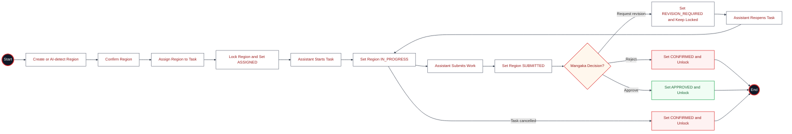

### Region Status Values (from `backend/src/db/models.ts:671-683`)

| Status | Description |
|--------|-------------|
| `DETECTED` | AI-detected or initially created |
| `CONFIRMED` | Manually confirmed |
| `ASSIGNED` | Task assigned to region |
| `IN_PROGRESS` | Work active |
| `SUBMITTED` | Work submitted |
| `REVISION_REQUIRED` | Changes needed |
| `APPROVED` | Work approved |
| `DONE` | Completed |
| `DISCARDED` | Discarded |

### Lock Status (from `backend/src/db/models.ts:688-692`)

| Status | Description |
|--------|-------------|
| `UNLOCKED` | No active task (schema default) |
| `LOCKED` | Task is active on this region |

**Canonical lock lifecycle (confirmed current, correct):** Region is `LOCKED` at
Task creation (`ASSIGNED`, `studio.controller.ts:300-306`), stays `LOCKED` through
`START`/`SUBMIT`/`REQUEST_REVISION` (revision changes only the region *status* to
`REVISION_REQUIRED`, `workflow.service.ts:3132-3138`), and is released to
`UNLOCKED` on `APPROVE`/`REJECT`/`CANCEL`. One Region has at most one active Task
(`studio.controller.ts:271-311`). Release history remains in audit data.

### Region Locking Logic
- `lockRegion(regionId, taskId)` (`task-submission.service.ts`): Sets `activeTaskId`, `lockedByTaskId`, `lockStatus: LOCKED`, `status: IN_PROGRESS`
- `releaseRegionLock(regionId, taskId, nextStatus)` (`task-submission.service.ts`): Sets `activeTaskId: null`, `lockStatus: UNLOCKED`, `status: nextStatus`

### Role Access

| Action | Allowed Roles |
|--------|--------------|
| Create region | MANGAKA |
| Patch region(s) | MANGAKA |
| Delete region | MANGAKA (only if not assigned) |
| List regions | All (scoped) |

### Verified frontend assignment flow

Live E2E validates the manual Studio path, not only API handlers:

1. Mangaka selects **Draw Region** and drags on the Konva page canvas.
2. The frontend posts natural-image coordinates to `POST /api/studio/regions`.
3. The new Region is selected automatically and exposes **Create Assistant Task**.
4. Mangaka chooses the Assistant, active rate, quantity, due date, and instructions.
5. `POST /api/studio/tasks` returns `201`, and the assigned Assistant sees the task
   on the task list.

### Canonical Decisions & Required Code Changes

#### TECH-FINDING-03 — `RELEASED` lock value
**Status: Resolved.**
The canonical binary lock model is now implemented: the schema/type enum is
`["UNLOCKED", "LOCKED"]`, all release paths write `UNLOCKED`, and
`migrate:region-lock-status --apply` converts legacy stored `RELEASED` values.
Release history is retained in audit entries.

### Key Files
- `backend/src/controllers/studio.controller.ts:151-226` — region CRUD
- `backend/src/routes/studio.routes.ts:34-39` — region routes
- `backend/src/services/task-submission.service.ts` — lock/unlock logic
- `backend/src/db/models.ts:632-697` — StudioRegionRecord, studioRegionSchema
- `backend/src/controllers/ai.controller.ts:206-237` — AI-created regions


---

# Glossary

| Term | Meaning in MangaFlow |
|---|---|
| Proposal | Mangaka's submitted project proposal reviewed by Editor and decided by Board |
| ProposalVersion | Immutable proposal snapshot used by a VotingSession |
| VotingSession | Snapshotted Board decision round with electorate, quorum and votes |
| Series | Production entity created automatically after Board approval |
| Tantou | Editor assigned to a Series and its editorial lifecycle |
| Chapter | Production unit moving from planning through review to publication |
| Page | Embedded Chapter evidence containing image/file references and production status |
| Region | Speech-bubble or text area on a Page; may be AI-detected and assigned to one active Task |
| Task | Unit of Assistant work linked to a Region and server-resolved rate snapshot |
| Submission | Versioned Assistant delivery reviewed by the owning Mangaka |
| Material | Versioned supporting file scoped to Proposal, Series, Chapter or Page |
| Blocking comment | Assigned-Tantou issue that controls resubmission and approval readiness |
| Publication | Scheduling entity that owns `SCHEDULED`, cancellation and publication timing |
| Earning | Idempotent `EARNED` record created when a Submission is approved; not payroll/payment processing |
| RateTable | Admin-managed source of truth for new Task pricing |
| AiProcessing | Audit record for bubble detection, processing or whitening operations |


---

# Appendix A — Canonical Feature and Current-Implementation Index

> This appendix preserves the uploaded route inventory, implementation status, global invariant register, and resolved workflow/technical findings.

> Combines the current route inventory with canonical role boundaries. Rows marked
> with a FLOW-GAP describe implemented access that must be reduced or corrected.

---

### Roles

| API Role | Web Role | Description |
|----------|----------|-------------|
| `ADMIN` | `admin` | User account lifecycle and Chair designation management; also owns managed notifications, read-only dashboards, RateTable, and dev-only demo data. No editorial/production/governance workflow authority (FLOW-GAP-04 — Resolved) |
| `MANGAKA` | `mangaka` | Creator: proposals, series authorship, chapter production, task review |
| `ASSISTANT` | `assistant` | Receives tasks, submits work, tracks earnings |
| `EDITOR` | `editor` | Reviews proposals/chapters, Tantou editor, publication scheduling |
| `BOARD` | `board` | Votes on proposals, governance, at-risk decisions |

Special flag: `isChair` (Board).

---

### Canonical Global Invariants

Invariants that must hold across the system. ✅ = enforced in current code;
⚠️ = canonical target with an open gap (see the Gap Register).

1. ✅ One approved Proposal creates at most one Series.
2. ✅ One Proposal has at most one active VotingSession.
3. ✅ One Board member has at most one vote per VotingSession.
4. ✅ One Series has at most one active Tantou assignment.
5. ✅ One Region has at most one active Task (`studio.controller.ts:271-311`).
6. ✅ One Task has one current Submission.
7. ✅ One Chapter has at most one active Publication.
8. ✅ Frozen ProposalVersions and Chapter review snapshots are immutable.
9. ✅ Assistant work is performed only through Task → Submission.
10. ✅ Only the owning Mangaka submits a Chapter to Tantou review
    (`chapter-review.service.ts`).
11. ✅ Submission decisions use the canonical `/api/submissions/*` endpoints; the
    generic Task-action decision aliases are removed (`400 INVALID_ACTION`).
12. ✅ AI output is never treated as human-approved content; Admin does not perform
    editorial approval or alter Board decisions.
13. ✅ A cancelled VotingSession must return its Proposal to `PENDING_BOARD`
    (**FLOW-GAP-02** — Resolved).
14. ✅ Only the assigned Tantou may create/raise/resolve/reopen a blocking comment;
    resolve/reopen require an assigned `editorId`, and reopen starts only from
    `ADDRESSED`/`RESOLVED` (**FLOW-GAP-01**/**FLOW-GAP-03** — Resolved).
15. ✅ Supporting Materials are optional status-free attachments; only the owning
    Mangaka mutates them and they never gate another workflow.
16. ✅ Admin cannot execute editorial or production workflow actions (rankings
    import, tantou assignment, series lifecycle, proposal claim/archive, material
    or payroll routes, workflow overrides, file download); Admin retains only
    account lifecycle, Chair designation, managed notifications, read-only
    dashboards, RateTable, and dev-only demo data (**FLOW-GAP-04** — Resolved).
17. ✅ At most five Board seats are active; exactly one active Board Chair and
    exist. Designation reassignment is transactional.
18. ✅ Every new VotingSession snapshots the current active Board electorate;
    no seed/demo user IDs are used as the live roster.
19. ✅ `MARK_READY` is removed. A Chapter reaches
    `READY_FOR_PUBLICATION` only through assigned-Tantou `EDITOR_APPROVE`.
20. ✅ Mangaka owns Chapter/Page content mutations. Tantou may review, comment,
    request revision, resolve blockers, and approve, but may not edit the evidence.
21. ✅ `ADDRESSED` permits resubmission but remains pending verification;
    `EDITOR_APPROVE` requires all blocking comments to be `RESOLVED`.

### Workflow Gap Register

Stable IDs joining these docs to `docs/CODE-TODO.md` (Phase 3). `FLOW-GAP-*` =
verified current-code ≠ canonical business rule; `TECH-FINDING-*` = general
technical debt with no business-rule conflict.

> **Documentation agreement ≠ implementation compliance.** The invariants above
> FLOW-GAP entries are tracked against the application code as well as the canonical
> docs. See the separated *Documentation consistency* vs *Current implementation
> compliance* matrices in
> [CODE-TODO.md → Project Status & Compliance](../CODE-TODO.md#project-status--compliance).

| ID | Summary | Evidence | Doc |
|----|---------|----------|-----|
| FLOW-GAP-01 | **Resolved.** Blocking-comment write authority not restricted to assigned Tantou | `studio.controller.ts:151-161,435-441` (`assertCanRaiseBlockingComment` gating `createComment`/`patchComment`) | [12](12-comments.md#flow-gap-01--blocking-comment-write-authority) |
| FLOW-GAP-02 | **Resolved.** VotingSession cancel restores Proposal to `PENDING_BOARD` (transactional, fail-closed) | `proposal-governance.service.ts` (`cancelVotingSession`); `voting.controller.ts:245` | [02](02-proposal-lifecycle.md#flow-gap-02--votingsession-cancel-must-restore-the-proposal) |
| FLOW-GAP-03 | **Resolved.** Comment resolve/reopen requires the assigned Tantou; reopen requires `ADDRESSED`/`RESOLVED` source status | `studio.controller.ts` (`assertCanResolveTantouBlockingComment`, `assertCanReopenTantouBlockingComment`) | [12](12-comments.md#flow-gap-03--comment-resolvereopen-assignment-guard) |
| FLOW-GAP-06 | **Resolved.** VotingSession electorate used hard-coded seed IDs | `activeBoardElectorate()`; `voting.controller.ts`; `board.test.ts` | [06](06-board-governance.md) |
| FLOW-GAP-07 | **Resolved.** `MARK_READY` bypassed canonical Chapter review | `types.ts`; `workflow.service.ts`; `workflow.test.ts` | [04](04-chapter-workflow.md) |
| FLOW-GAP-08 | **Resolved.** Tantou could mutate Page evidence and `ADDRESSED` could pass approval without verification | `authorization.service.ts`; `chapter-readiness.service.ts`; `workflow.service.ts` | [04](04-chapter-workflow.md), [12](12-comments.md), [13](13-pages.md) |
| TECH-FINDING-01 | **Resolved.** Legacy `blocking` field migrated and removed | `migrate-canonical-comments.ts`; `models.ts` | [12](12-comments.md#tech-finding-01--legacy-blocking-field) |
| TECH-FINDING-02 | **Resolved.** Dead `FIXED` status migrated to `ADDRESSED` and removed | `migrate-canonical-comments.ts`; `models.ts` | [12](12-comments.md#tech-finding-02--dead-fixed-comment-status) |
| TECH-FINDING-03 | **Resolved.** Region lock state is canonical `UNLOCKED`/`LOCKED`; migration covers stored `RELEASED` values | `models.ts`; `migrate-region-lock-status.ts` | [14](14-regions.md#tech-finding-03--released-lock-value) |
| TECH-FINDING-04 | **Resolved.** Deprecated decision aliases removed from `TASK_ACTIONS` | `types.ts`; `p0-workflow-refactor.test.ts` | [05](05-assistant-submission.md#tech-finding-04--deprecated-decision-aliases-in-task_actions) |
| TECH-FINDING-05 | **Resolved.** Submission current-conflict uses `CURRENT_SUBMISSION_CONFLICT` | `task-submission.service.ts`; `p0-workflow-refactor.test.ts` | [05](05-assistant-submission.md#tech-finding-05--generic-conflict-code) |
| TECH-FINDING-06 | **Resolved.** Ownership failures use specific assignment/owner codes where applicable | `workflow.service.ts`; `studio.controller.ts`; `authorization-perimeter.test.ts` | [04](04-chapter-workflow.md#tech-finding-06--generic-forbidden-vs-ownership-codes) |
| TECH-FINDING-07 | **Resolved.** Outbox processor is scheduled by the production server runner | `jobs/outbox-runner.ts`; `server.ts`; `outbox-delivery.service.ts` | [DESIGN.md §3/§12](../DESIGN.md) |
| FLOW-GAP-04 | **Resolved.** Admin's workflow/content routes removed or restricted to the canonical account-administration scope | `routes/{admin,tantou,series,notification,proposal}.routes.ts`; `series.controller.ts:270-384`; `workflow.service.ts:138-191`; `docs/reports/2026-07-27-ct11-admin-scope-completion.md` | [DESIGN.md §7](../DESIGN.md#7-authorization-model) |
| TECH-FINDING-09 | **Resolved.** Root flow documents competed with the canonical index | `README.md`; deprecation banners in root flow documents | [INDEX](INDEX.md) |

---

`TECH-FINDING-08` is resolved: new task rates are Admin-owned, server-resolved,
and snapshotted; client monetary fields are rejected. See
[08 - Earnings](08-earnings.md#rate-policy) and
`backend/src/__tests__/rate-table.test.ts`.

### Current implementation status (2026-07-26)

TECH-FINDING-01 through TECH-FINDING-07 are resolved in the current branch. The
redundant Chapter `ARCHIVE` transition has been removed; Chapters follow the
parent Series lifecycle. Supabase residual cleanup is also resolved.
The legacy comment/material/region migrations must be run against the deployed
database before rollout; see `docs/CODE-TODO.md` for the operational commands.
Admin workflow-scope reduction (FLOW-GAP-04 / CT-11) is implemented: the
admin-only materials/payroll/workflow-override routes are deleted, and the
shared rankings/tantou/series/proposal/file routes no longer accept `ADMIN`.
See `docs/reports/2026-07-27-ct11-admin-scope-completion.md`.

### Current service ownership (2026-07-27)

`proposal-governance.service.ts` owns VotingSession finalization/cancellation;
`chapter-readiness.service.ts` and `chapter-review.service.ts` own chapter
readiness/review; `task-submission.service.ts` owns Task → Submission commands;
`publication.service.ts` owns schedule/postpone/publish; and
`earning.service.ts` owns approval earning persistence and its outbox event;
`rate-table.service.ts` owns Admin rate configuration and active-rate resolution.
Historical line references below are retained as traceability snapshots; these
service names are the canonical current owners.

### 1. Authentication

| Capability | Method + Route | Key Files | Roles |
|---|---|---|---|
| Login (email/password) | `POST /api/auth/login` | `auth.controller.ts:9`, `auth.service.ts:52` | All |
| Refresh access token | `POST /api/auth/refresh` | `auth.controller.ts:15`, `auth.service.ts:81` | All |
| Get current user | `GET /api/auth/me` | `auth.controller.ts:20` | All (authed) |
| Logout | `POST /api/auth/logout` | `auth.controller.ts:24`, `auth.service.ts:108` | All (authed) |

---

### 2. Bootstrap / Dashboard

| Capability | Method + Route | Key Files | Roles |
|---|---|---|---|
| Bootstrap (user + nav + summary) | `GET /api/me/bootstrap` | `bootstrap.controller.ts:8` | All (authed) |
| Dashboard summary by role | `GET /api/dashboard/:role/summary` | `bootstrap.controller.ts:25` | All (authed, scoped) |

---

### 3. Proposals

| Capability | Method + Route | Key Files | Roles |
|---|---|---|---|
| List proposals | `GET /api/proposals` | `proposal.controller.ts:30` | Non-Admin roles (scoped) |
| Create proposal | `POST /api/proposals` | `proposal.controller.ts:75` | MANGAKA |
| Get proposal | `GET /api/proposals/:id` | `proposal.controller.ts:130` | Non-Admin roles (scoped) |
| List proposal versions | `GET /api/proposals/:id/versions` | `proposal.controller.ts:136` | BOARD, EDITOR, owning MANGAKA |
| Get proposal version | `GET /api/proposals/:id/versions/:versionId` | `proposal.controller.ts:146` | BOARD, EDITOR, owning MANGAKA |
| Patch proposal (EDIT) | `PATCH /api/proposals/:id` | `proposal.controller.ts:158` | MANGAKA (author) |
| Delete proposal (WITHDRAW) | `DELETE /api/proposals/:id` | `proposal.controller.ts:165` | MANGAKA, EDITOR |
| Proposal action | `POST /api/proposals/:id/actions/:action` | `proposal.controller.ts:170` | MANGAKA, EDITOR, BOARD |
| - SUBMIT | (action) | `workflow.service.ts:629` | MANGAKA (author) |
| - CLAIM | (action) | `workflow.service.ts:645` | EDITOR |
| - RELEASE_CLAIM | (action) | `workflow.service.ts:710` | EDITOR (claim owner) |
| - REQUEST_CHANGES | (action) | `workflow.service.ts:765` | EDITOR |
| - FORWARD | (action) | `workflow.service.ts:815` | EDITOR |
| - REJECT | (action) | `workflow.service.ts:850` | EDITOR |
| - RECALL | (action) | `workflow.service.ts:881` | EDITOR |
| - VOTE | (action) | `workflow.service.ts:892` | BOARD |
| - WITHDRAW | (action) | `workflow.service.ts:1012` | MANGAKA (author) |
| - RESUBMIT | (action) | `workflow.service.ts:1029` | MANGAKA (author) |
| - EDIT | (action) | `workflow.service.ts:1113` | MANGAKA (author) |
| - ARCHIVE | (action) | `workflow.service.ts:1158` | Owning MANGAKA; requires non-empty `reason` |

---

### 4. Series

| Capability | Method + Route | Key Files | Roles |
|---|---|---|---|
| List series | `GET /api/series` | `series.controller.ts:102` | Non-Admin roles (scoped) |
| Create series | Automatic on finalized Board approval | `proposal-lifecycle.service.ts` | System transaction |
| Get series | `GET /api/series/:id` | `series.controller.ts:240` | Non-Admin roles (scoped) |
| Patch series | `PATCH /api/series/:id` | `series.controller.ts:246` | EDITOR, MANGAKA |
| Series lifecycle action | `POST /api/series/:id/actions/:action` | `series.controller.ts:272` | EDITOR, MANGAKA |
| - START_PRODUCTION | (action) | `series.controller.ts:281` | Owning Mangaka or assigned Tantou |
| - UNPUBLISH | (action) | `series.controller.ts:336` | Assigned Tantou only |
| - ARCHIVE | (action) | `series.controller.ts:344` | Owner or assigned Tantou while never published; assigned Tantou only once published |
| Delete series | `DELETE /api/series/:id` | `series.controller.ts:352` | MANGAKA (owner) |
| Series summary | `GET /api/series/:seriesId/summary` | `series.controller.ts:473` | Non-Admin roles (scoped) |
| Series activity | `GET /api/series/:seriesId/activity` | `series.controller.ts:485` | Non-Admin roles (scoped) |

---

### 5. Series Members

| Capability | Method + Route | Key Files | Roles |
|---|---|---|---|
| List members | `GET /api/series/:seriesId/members` | `series.controller.ts:512` | Non-Admin roles (scoped) |
| Add member | `POST /api/series/:seriesId/members` | `series.controller.ts:520` | EDITOR, MANGAKA |
| Update member | `PATCH /api/series/:seriesId/members/:memberId` | `series.controller.ts:553` | EDITOR, MANGAKA |
| Remove member | `DELETE /api/series/:seriesId/members/:memberId` | `series.controller.ts:578` | EDITOR, MANGAKA |
| Invite assistant | `POST /api/series/:seriesId/invites` | `series.controller.ts:595` | EDITOR, MANGAKA |

---

### 6. Chapters

| Capability | Method + Route | Key Files | Roles |
|---|---|---|---|
| List chapters (standalone) | `GET /api/chapters` | `series.controller.ts:690` | EDITOR, MANGAKA, ASSISTANT |
| Get chapter | `GET /api/chapters/:chapterId` | `series.controller.ts:647` | Non-Admin roles (scoped) |
| Patch chapter | `PATCH /api/chapters/:chapterId` | `series.controller.ts` | Owning MANGAKA |
| Chapter action | `POST /api/chapters/:chapterId/actions/:action` | `series.controller.ts:678` | EDITOR, MANGAKA, ASSISTANT |
| - START_DRAFT | (action) | `workflow.service.ts:1711` | Owner |
| - SUBMIT_REVIEW | (action) | `workflow.service.ts:1409,1422` | Owning MANGAKA only |
| - RESUBMIT | (action) | `workflow.service.ts:1409,1422` | Owning MANGAKA only |
| - REQUEST_REVISION | (action) | `workflow.service.ts:1713` | EDITOR |
| - REJECT | (action) | `workflow.service.ts:1714` | EDITOR |
| - EDITOR_APPROVE | (action) | `workflow.service.ts:1715` | EDITOR |
| - SCHEDULE | (action) | `workflow.service.ts:1728` | EDITOR |
| - POSTPONE | (action) | `workflow.service.ts:1729` | EDITOR |
| - PUBLISH | (action) | `workflow.service.ts:1730` | EDITOR |
| - REASSIGN | (action) | `workflow.service.ts:1731` | EDITOR |
| - ARCHIVE | (action) | `workflow.service.ts:1732` | EDITOR |
| List chapters (under series) | `GET /api/series/:id/chapters` | `series.controller.ts:405` | Non-Admin roles (scoped) |
| Create chapter (under series) | `POST /api/series/:id/chapters` | `series.controller.ts` | Owning MANGAKA |
| Get chapter pages | `GET /api/chapters/:chapterId/pages` | `series.controller.ts:724` | Non-Admin roles (scoped) |
| Chapter readiness | `GET /api/chapters/:chapterId/readiness` | `series.controller.ts:730` | Non-Admin roles (scoped) |
| List chapter reviews | `GET /api/chapters/:chapterId/reviews` | `series.controller.ts:753` | EDITOR, MANGAKA |

---

### 7. Pages

| Capability | Method + Route | Key Files | Roles |
|---|---|---|---|
| Create page | `POST /api/chapters/:chapterId/pages` | `series.controller.ts` | Owning MANGAKA |
| Update page | `PATCH /api/pages/:pageId` | `series.controller.ts` | Owning MANGAKA |
| Delete page | `DELETE /api/pages/:pageId` | `series.controller.ts` | Owning MANGAKA |

---

### 8. Studio Regions

| Capability | Method + Route | Key Files | Roles |
|---|---|---|---|
| List regions | `GET /api/studio/regions` | `studio.controller.ts:152` | Non-Admin roles (scoped) |
| Create region | `POST /api/studio/regions` | `studio.controller.ts:161` | MANGAKA |
| Patch regions (bulk) | `PATCH /api/studio/regions` | `studio.controller.ts:169` | MANGAKA |
| Patch region | `PATCH /api/studio/regions/:id` | `studio.controller.ts:180` | MANGAKA |
| Delete region | `DELETE /api/studio/regions/:id` | `studio.controller.ts:212` | MANGAKA |

---

### 9. Studio Tasks

| Capability | Method + Route | Key Files | Roles |
|---|---|---|---|
| List tasks | `GET /api/studio/tasks` | `studio.controller.ts:229` | Non-Admin roles (scoped) |
| Create task | `POST /api/studio/tasks` | `studio.controller.ts:242` | MANGAKA |
| Patch tasks (bulk) | `PATCH /api/studio/tasks` | `studio.controller.ts:343` | MANGAKA |
| Patch task | `PATCH /api/studio/tasks/:id` | `studio.controller.ts:350` | MANGAKA |
| Get task detail | `GET /api/tasks/:taskId` | `studio.controller.ts:392` | Non-Admin roles (scoped) |
| Get task detail (alias) | `GET /api/studio/tasks/:taskId` | `studio.controller.ts:392` | Non-Admin roles (scoped) |
| Task action | `POST /api/studio/tasks/:taskId/actions/:action` | `studio.controller.ts:398` | EDITOR, MANGAKA, ASSISTANT |
| - START | (action) | `workflow.service.ts:2105` | Assigned ASSISTANT |
| - CANCEL | (action) | `workflow.service.ts:2144` | MANGAKA |
| - REASSIGN | (action) | `workflow.service.ts:2165` | MANGAKA |
| - REOPEN | (action) | `workflow.service.ts:2098` | Assigned ASSISTANT |
| Send to editor review | `POST /api/studio/chapters/:chapterId/send-editor-review` | `studio.controller.ts:409` | MANGAKA |

---

### 10. Submissions

| Capability | Method + Route | Key Files | Roles |
|---|---|---|---|
| List submissions | `GET /api/submissions` | `submission.controller.ts:14` | Non-Admin roles (scoped) |
| Submit task work | `POST /api/tasks/:taskId/submit` | `submission.controller.ts:43` | ASSISTANT |
| Reopen task for revision | `POST /api/tasks/:taskId/reopen` | `submission.controller.ts:47` | ASSISTANT |
| Review queue (editor) | `GET /api/submissions/review-queue` | `submission.controller.ts:50` | EDITOR |
| Get submission | `GET /api/submissions/:submissionId` | `submission.controller.ts:73` | Non-Admin roles (scoped) |
| List task submissions | `GET /api/tasks/:taskId/submissions` | `submission.controller.ts:80` | Non-Admin roles (scoped) |
| Approve submission (Mangaka) | `POST /api/submissions/:submissionId/approve` | `submission.controller.ts:90` | MANGAKA |
| Reject submission (Mangaka) | `POST /api/submissions/:submissionId/reject` | `submission.controller.ts:102` | MANGAKA |
| Request revision (Mangaka) | `POST /api/submissions/:submissionId/request-revision` | `submission.controller.ts:114` | MANGAKA |
| ~~Create submission~~ | `POST /api/submissions` | `submission.controller.ts:29` | **DEPRECATED** (HTTP 410) |
| ~~Editor approve submission~~ | `POST /api/submissions/:submissionId/editor-approve` | `submission.controller.ts:36` | **DEPRECATED** (HTTP 410) |

---

### 11. Supporting Materials

| Capability | Method + Route | Key Files | Roles |
|---|---|---|---|
| List attachments | `GET /api/materials` | `material.controller.ts` | Authenticated, parent-scoped |
| Create attachment | `POST /api/materials` | `material.controller.ts` | Owning MANGAKA |
| Patch metadata | `PATCH /api/materials/:id` | `material.controller.ts` | Owning MANGAKA |
| Add attachment version | `POST /api/materials/:id/versions` | `material.controller.ts` | Owning MANGAKA |
| Delete attachment | `DELETE /api/materials/:id` | `material.controller.ts` | Owning MANGAKA |

Material has no status or review workflow. `migrate:material-attachments` removes
archived legacy records and strips status fields from retained attachments.

---

### 12. Admin Materials (removed — CT-11)

`GET/POST /api/admin/materials`, `POST /api/admin/materials/:id/replace`,
`/archive`, `/restore` and their handlers were **deleted** by CT-11
(FLOW-GAP-04 — Resolved). Materials are managed exclusively through
`/api/materials*` by the owning Mangaka (see §11).

---

### 13. Voting Sessions (Board Governance)

| Capability | Method + Route | Key Files | Roles |
|---|---|---|---|
| List voting sessions | `GET /api/voting-sessions` | `voting.controller.ts:54` | BOARD, EDITOR |
| Get voting session | `GET /api/voting-sessions/:id` | `voting.controller.ts:138` | BOARD, EDITOR |
| Create voting session | `POST /api/voting-sessions` | `voting.controller.ts:144` | BOARD (Chair) |
| Patch voting session | `PATCH /api/voting-sessions/:id` | `voting.controller.ts:256` | BOARD (Chair) |
| Close session | `POST /api/voting-sessions/:id/close` | `voting.controller.ts:292` | BOARD (Chair) |
| Cancel session | `POST /api/voting-sessions/:id/cancel` | `voting.controller.ts:298` | BOARD (Chair) |
| Add session note | `POST /api/voting-sessions/:id/notes` | `voting.controller.ts:302` | EDITOR, BOARD |
| Patch session note | `PATCH /api/voting-sessions/:id/notes/:noteId` | `voting.controller.ts:324` | EDITOR, BOARD (author) |
| Delete session note | `DELETE /api/voting-sessions/:id/notes/:noteId` | `voting.controller.ts:351` | EDITOR, BOARD (author) |
| Decision history | `GET /api/board/decisions/history` | `voting.controller.ts:58` | BOARD, EDITOR |

---

### 14. Notifications

| Capability | Method + Route | Key Files | Roles |
|---|---|---|---|
| List notifications | `GET /api/notifications` | `notification.controller.ts:33` | All (authed) |
| Mark read | `POST /api/notifications/:id/read` | `notification.controller.ts:44` | Owner only |

---

### 15. Rankings

| Capability | Method + Route | Key Files | Roles |
|---|---|---|---|
| List rankings | `GET /api/rankings` | `notification.controller.ts:74` | BOARD, EDITOR; MANGAKA scoped to owned Series |
| Import rankings | `POST /api/rankings/import` | `notification.controller.ts:120` | BOARD |
| List series rankings | `GET /api/series/:seriesId/rankings` | `notification.controller.ts:101` | BOARD, EDITOR; owning MANGAKA |

---

### 16. AI Processing

| Capability | Method + Route | Key Files | Roles |
|---|---|---|---|
| AI health check | `GET /api/ai/health` | `ai.controller.ts:158` | All (authed) |
| Detect bubbles (file) | `POST /api/ai/bubbles/detect` | `ai.controller.ts:163` | EDITOR, MANGAKA |
| Process bubbles (file) | `POST /api/ai/bubbles/process` | `ai.controller.ts:167` | EDITOR, MANGAKA |
| Detect page bubbles | `POST /api/studio/pages/:pageId/ai/detect-bubbles` | `ai.controller.ts:171` | Owning MANGAKA |
| Whiten page bubbles | `POST /api/studio/pages/:pageId/ai/whiten-bubbles` | `ai.controller.ts:246` | Owning MANGAKA |

---

### 17. File Management

| Capability | Method + Route | Key Files | Roles |
|---|---|---|---|
| Presign upload | `POST /api/files/presign-upload` | `series.controller.ts:831` | EDITOR, MANGAKA, ASSISTANT |
| Presign download | `POST /api/files/presign-download` | `series.controller.ts:861` | BOARD, EDITOR, MANGAKA, ASSISTANT |
| Display URL | `POST /api/files/display-url` | `series.controller.ts:869` | EDITOR, MANGAKA, ASSISTANT |
| Local upload (PUT) | `PUT /api/files/local-upload/:token` | `file-token.controller.ts:34` | All (token-authed) |
| Display file (GET) | `GET /api/files/display/:token` | `file-token.controller.ts:46` | All (token-authed) |

---

### 18. Tantou (Series Editor Assignment)

| Capability | Method + Route | Key Files | Roles |
|---|---|---|---|
| Get series editor | `GET /api/series/:seriesId/editor` | `tantou.controller.ts:7` | All (authed) |
| Assign series editor | `POST /api/series/:seriesId/editor` | `tantou.controller.ts:13` | Owning MANGAKA |
| Remove series editor | `DELETE /api/series/:seriesId/editor` | `tantou.controller.ts:20` | Owning MANGAKA |

---

### 19. Comments

| Capability | Method + Route | Key Files | Roles |
|---|---|---|---|
| List comments | `GET /api/comments` | `studio.controller.ts:414` | Non-Admin roles (scoped) |
| Create comment | `POST /api/comments` | `studio.controller.ts:423` | EDITOR, MANGAKA, ASSISTANT |
| Patch comment | `PATCH /api/comments/:commentId` | `studio.controller.ts:441` | EDITOR, MANGAKA (author) |
| Resolve comment | `POST /api/comments/:commentId/resolve` | `studio.controller.ts:457` | Assigned Tantou (EDITOR) |
| Address comment | `POST /api/comments/:commentId/address` | `studio.controller.ts:470` | Owning MANGAKA |
| Reopen comment | `POST /api/comments/:commentId/reopen` | `studio.controller.ts:483` | Assigned Tantou (EDITOR), from `ADDRESSED`/`RESOLVED` |
| List task comments | `GET /api/comments/task/:taskId` | `studio.controller.ts:496` | Non-Admin roles (scoped) |

---

### 20. Admin — User Management

| Capability | Method + Route | Key Files | Roles |
|---|---|---|---|
| List users | `GET /api/admin/users` | `admin.controller.ts:12` | ADMIN |
| Get user | `GET /api/admin/users/:userId` | `admin.controller.ts:17` | ADMIN |
| Create user | `POST /api/admin/users` | `admin.controller.ts:26` | ADMIN |
| Update user | `PATCH /api/admin/users/:userId` | `admin.controller.ts:40` | ADMIN |
| Deactivate user | `POST /api/admin/users/:userId/deactivate` | `admin.controller.ts:55` | ADMIN |
| Delete user | `DELETE /api/admin/users/:userId` | `admin.controller.ts:61` | ADMIN |

---

### 21. Admin — Notifications

| Capability | Method + Route | Key Files | Roles |
|---|---|---|---|
| List managed notifications | `GET /api/admin/notifications` | `admin.controller.ts:67` | ADMIN |
| Create notification | `POST /api/admin/notifications` | `admin.controller.ts:76` | ADMIN |
| Patch notification | `PATCH /api/admin/notifications/:notificationId` | `admin.controller.ts:89` | ADMIN |
| Delete notification | `DELETE /api/admin/notifications/:notificationId` | `admin.controller.ts:109` | ADMIN |

---

### 22. Admin — Payroll / Earnings (removed — CT-11)

`GET /api/admin/payroll` and `POST /api/admin/payroll/:earningId/{confirm,mark-paid,void}`
and their handlers were **deleted** by CT-11 (already deprecated; FLOW-GAP-04 —
Resolved). Only `GET /api/assistant/earnings` (ASSISTANT — the owner's own
earnings) remains.

---

### 23. Admin — Workflow Overrides (removed — CT-11)

`POST /api/admin/workflow-overrides` and `POST /api/admin/override` and the
`executeOverride` handler were **deleted** by CT-11 (FLOW-GAP-04 — Resolved).

---

### 24. Admin — System

| Capability | Method + Route | Key Files | Roles |
|---|---|---|---|
| Workflow summary | `GET /api/admin/workflow-summary` | `admin.controller.ts:128` | ADMIN |
| Storage summary | `GET /api/admin/storage-summary` | `admin.controller.ts:132` | ADMIN |
| Reset demo data | `POST /api/admin/demo/reset` | `admin.controller.ts:192` | ADMIN |
| Clear demo data | `POST /api/admin/demo/clear` | `admin.controller.ts:198` | ADMIN |

---

### 25. Mobile Aliases (Editor/Board quick-access)

| Capability | Method + Route | Key Files | Roles |
|---|---|---|---|
| Editor Proposal review queue | `GET /api/editor/proposals/review-queue` | `mobile.controller.ts` | EDITOR |
| Start review | `POST /api/editor/series/:seriesId/start-review` | `mobile.controller.ts:49` | EDITOR |
| Request revision | `POST /api/editor/series/:seriesId/request-revision` | `mobile.controller.ts:52` | EDITOR |
| Reject series | `POST /api/editor/series/:seriesId/reject` | `mobile.controller.ts:55` | EDITOR |
| Forward to board | `POST /api/editor/series/:seriesId/forward-to-board` | `mobile.controller.ts:64` | EDITOR |
| Board queue | `GET /api/board/queue` | `mobile.controller.ts:20` | BOARD, EDITOR |
| Get board votes | `GET /api/board/series/:seriesId/votes` | `mobile.controller.ts:24` | BOARD, EDITOR |
| Cast vote | `POST /api/board/series/:seriesId/votes` | `mobile.controller.ts:67` | BOARD |
| Finalize decision | `POST /api/board/series/:seriesId/decisions/finalize` | `mobile.controller.ts:70` | BOARD (Chair) |
| At-risk decision | `POST /api/board/series/:seriesId/at-risk-decisions` | `mobile.controller.ts:85` | BOARD (Chair) |

---

### 26. Health / Readiness

| Capability | Method + Route | Key Files | Roles |
|---|---|---|---|
| Health check | `GET /health` | `app.ts:45` | Public |
| Readiness check | `GET /ready` | `app.ts:47` | Public |

---

### 27. Public Reader API (unauthenticated)

Read-only endpoints mounted **before** `requireAuth` (`routes/index.ts`). They
expose only series with `visibility: PUBLIC` that have at least one `PUBLISHED`
chapter; drafts, private series, and unpublished chapters are never returned.

| Capability | Method + Route | Key Files | Roles |
|---|---|---|---|
| List published series | `GET /api/public/series` | `public.controller.ts:55` | Public |
| Get published series | `GET /api/public/series/:slug` | `public.controller.ts:78` | Public |
| Get published chapter (with page images) | `GET /api/public/series/:slug/chapters/:chapterNumber` | `public.controller.ts:87` | Public |

Page image URLs are resolved through `file-access.service.createDisplayUrl`;
the reader receives display URLs only and never signed working-file URLs.

---

### Frontend Routes (React / TanStack Router)

| Route | Description | Primary Role |
|---|---|---|
| `/` | Landing / marketing page | Public |
| `/login` | Login page | Public |
| `/read` | Public reader — published series list, backed by `GET /api/public/series` | Public |
| `/read/:slug` | Public reader series view, backed by `GET /api/public/series/:slug` | Public |
| `/read/:slug/:chapter` | Public reader chapter view with page images, backed by `GET /api/public/series/:slug/chapters/:chapterNumber` | Public |
| `/app` | App shell | All (authed) |
| `/app/dashboard` | Role-aware dashboard | All |
| `/app/admin/*` | Admin section (dashboard, users, rates, notifications) | ADMIN |
| `/app/editor/*` | Editor section (proposals, review, chapters, publications, series, dashboard, notifications) | EDITOR |
| `/app/board/*` | Board section (proposals, sessions, queue, rankings, at-risk, decisions, dashboard, notifications) | BOARD |
| `/app/mangaka/*` | Mangaka section (submissions review) | MANGAKA |
| `/app/assistant/*` | Assistant section (tasks, submissions, series studio, earnings, dashboard, notifications) | ASSISTANT |
| `/app/series/*` | Series list and detail (tabs) | All (authed) |
| `/app/tasks` | Tasks view | All (authed) |
| `/app/submissions/*` | Submissions list and detail | All (authed) |
| `/app/rankings` | Rankings view | MANGAKA, EDITOR, BOARD |
| `/app/notifications` | Notifications view | All (authed) |

---

*Generated from backend route registrations (`routes/*.ts`), controller handlers (`controllers/*.ts`), and workflow service logic (`services/workflow.service.ts`).*

---

# Appendix B — Source Register

| No. | Source file | Coverage |
|---:|---|---|
| 01 | `01-authentication(7).md` | Authentication, JWT sessions, role gates, Chair designation |
| 02 | `02-proposal-lifecycle(9).md` | Proposal statuses, Editor review, Board hand-off and re-votes |
| 03 | `03-series-lifecycle(9).md` | Series promotion, production, hiatus/archive and ownership |
| 04 | `04-chapter-workflow(8).md` | Chapter readiness, review loop and publication |
| 05 | `05-assistant-submission(6).md` | Assistant Task and Submission lifecycle, idempotency and earnings trigger |
| 06 | `06-board-governance(8).md` | Board roster, quorum, VotingSession closure and re-votes |
| 07 | `07-material-management(8).md` | Material scopes, versions, statuses and immutability |
| 08 | `08-earnings(7).md` | RateTable policy and earnings tracking boundaries |
| 09 | `09-rankings(7).md` | Ranking import, validation and visibility |
| 10 | `10-ai-processing(6).md` | AI bubble processing and staleness guard |
| 11 | `11-file-management(6).md` | Secure upload, display and download flow |
| 12 | `12-comments(6).md` | Comments, blocking gates, replies and Tantou authority |
| 13 | `13-pages(6).md` | Page lifecycle, assets, ordering and ownership |
| 14 | `14-regions(6).md` | Region lifecycle, task locking and AI-created regions |
| — | `INDEX(9).md` | Canonical feature inventory, routes, invariants, implementation and gap register |

## Consolidation Notes

- All source modules remain available as separate Notion-importable Markdown pages in the package.
- Status names, endpoint paths, actor names, error codes and implementation boundaries are preserved.
- Visible encoding artifacts in source punctuation were normalized to standard dashes; business meaning was not changed.
