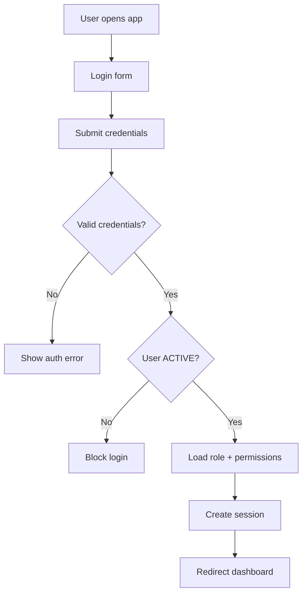

## 1. Tổng quan

Flow 00 mô tả nền tảng đăng nhập, user, role và quyền truy cập của MangaFlow. Đây là flow nền tảng, phải có trước khi Series, Chapter, Page, Task, Board Decision, Payment Tracking và các màn Production Hub / Page Studio / Task Studio hoạt động.

## 2. Mục tiêu nghiệp vụ

- Cho phép user đăng nhập an toàn.
- Phân quyền theo vai trò: Admin, Mangaka, Assistant, Tantou Editor, Editorial Board.
- Chặn user inactive/suspended.
- Điều hướng đúng dashboard theo role.
- Làm nền cho permission theo Series, Chapter, Page, Region, Task và các screen/action liên quan.
- Không thiết kế permission dựa trên Workspace entity trong MVP.

## 3. Phạm vi

In scope: login, logout, get current user, user status, role assignment, permission guard, audit log cho thay đổi role/status.

Out of scope: tạo Series, production team, task assignment, payroll, board voting, payment gateway, multi-workspace management.

## 4. Actor tham gia

| Actor | Vai trò |
| --- | --- |
| Admin | Tạo user, đổi role, khóa/mở tài khoản |
| Mangaka | Login vào Mangaka dashboard và các màn production được phép |
| Assistant | Login vào Assistant dashboard và Task Studio của task được assign |
| Tantou Editor | Login vào Editor dashboard và các màn review được phép |
| Editorial Board | Login vào Board dashboard và các màn Board decision |
| System | Authenticate, authorize, audit |

## 5. Điều kiện bắt đầu / kết thúc

Bắt đầu khi user truy cập app hoặc Admin tạo user mới.

Kết thúc thành công khi user login được và được redirect đúng dashboard.

Kết thúc thất bại khi email/password sai, user inactive, user suspended hoặc role không hợp lệ.

## 6. Entity liên quan

```
User
Role
Permission
UserSession
AuditLog
Notification
```

Không phải core entity trong MVP:

```
Workspace
Production Hub
Page Studio
Task Studio
```

`Production Hub`, `Page Studio` và `Task Studio` là UI/screen layer, không phải database entity.

## 7. User Status

| Status | Ý nghĩa |
| --- | --- |
| PENDING_INVITE | Đã được tạo nhưng chưa kích hoạt |
| ACTIVE | Có thể login và dùng hệ thống |
| INACTIVE | Không thể login |
| SUSPENDED | Bị khóa vì lý do bảo mật/quản trị |

## 8. Role / Permission Status

Role chính:

```
ADMIN
MANGAKA
ASSISTANT
EDITOR
BOARD
```

Permission được check theo 3 lớp:

```
Role-level permission
Entity-level permission
Action/screen-level permission
```

Ví dụ action/screen permission:

```
PRODUCTION_HUB_VIEW
PAGE_STUDIO_OPEN
TASK_STUDIO_OPEN
TASK_ASSIGN
TASK_SUBMIT
TASK_REVIEW
EDITOR_FINAL_REVIEW
BOARD_DECISION_FINALIZE
ADMIN_CONFIG_MANAGE
```

Không tạo permission quanh `Workspace` entity trong MVP.

## 9. Step-by-step flow

```
Admin creates user
↓
System stores user with role/status
↓
User logs in
↓
System validates credentials
↓
System checks user status
↓
System loads role + permissions
↓
System creates session/token
↓
Redirect to role dashboard
```

## 10. Revision loop

Flow này không có revision loop nghiệp vụ. Loop tương ứng là Admin update user role/status khi cần.

```
Admin updates role/status
↓
System validates permission
↓
System updates User
↓
AuditLog created
↓
Active sessions refresh permission or require relogin
```

## 11. Permission Matrix

| Action | Admin | Mangaka | Assistant | Editor | Board |
| --- | --- | --- | --- | --- | --- |
| --- | ---: | ---: | ---: | ---: | ---: |
| Create user | Có | Không | Không | Không | Không |
| Update user role | Có | Không | Không | Không | Không |
| Suspend user | Có | Không | Không | Không | Không |
| Login | Có | Có | Có | Có | Có |
| View own profile | Có | Có | Có | Có | Có |
| Access admin config | Có | Không | Không | Không | Không |
| Open Production Hub | Có | Có nếu có quyền với Series | Không mặc định | Có nếu có quyền | Summary/Không tùy rule |
| Open Page Studio | Có | Có nếu có quyền với Page | Chỉ khi task assigned | Có nếu có quyền | Không |
| Open Task Studio | Có | Không | Chỉ task được assign | Optional review | Không |

## 12. API đề xuất

```
POST /api/auth/login
POST /api/auth/logout
GET  /api/auth/me
POST /api/admin/users
GET  /api/admin/users
PATCH /api/admin/users/:userId
PATCH /api/admin/users/:userId/status
PATCH /api/admin/users/:userId/role
GET  /api/auth/permissions
```

## 13. UI screens đề xuất

```
/login
/app/admin/users
/app/admin/users/:userId
/app/profile
/app/mangaka/dashboard
/app/assistant/dashboard
/app/editor/dashboard
/app/board/dashboard
```

Screen naming rule:

```
Production Hub = Series-level UI aggregate
Page Studio = Page-level UI screen
Task Studio = Task-level UI screen
```

## 14. Notification events

```
USER_INVITED
USER_ACTIVATED
USER_SUSPENDED
USER_ROLE_UPDATED
PASSWORD_RESET_REQUESTED
```

## 15. Audit log events

```
USER_CREATED
USER_STATUS_UPDATED
USER_ROLE_UPDATED
USER_LOGIN_SUCCESS
USER_LOGIN_FAILED
USER_LOGOUT
PERMISSION_DENIED
```

## 16. Business rules

- User inactive/suspended không được login.
- Role quyết định dashboard mặc định.
- Permission chi tiết phải check ở backend, không chỉ frontend.
- Admin không tự động có quyền editorial decision nếu không được thiết kế rõ.
- Assistant không được thấy Page/Task/Region nếu chưa được assign Task hợp lệ.
- `Production Hub`, `Page Studio`, `Task Studio` là UI layer, không phải core entity.
- Không thiết kế permission quanh `Workspace` entity trong MVP.
- Permission nên bám theo role, entity thật, action và screen access.

## 17. Edge cases

| Case | Expected behavior |
| --- | --- |
| Wrong password | Return auth error |
| User suspended | Block login |
| User inactive | Block login |
| User has no role | Block login, ask Admin fix |
| Role changed while logged in | Refresh permission or force relogin |
| Token expired | Require login again |
| Assistant opens unassigned Task Studio | Block |
| User calls API without backend permission | Return forbidden and optionally audit |

## 18. Mermaid activity flow



## 19. Acceptance Criteria

- Active user login được.
- Inactive/suspended user bị block.
- User được redirect đúng dashboard theo role.
- API admin chỉ Admin gọi được.
- Role/status update có audit log.
- Backend enforce permission cho Production Hub, Page Studio và Task Studio.
- Không tồn tại dependency bắt buộc vào Workspace entity trong MVP.

## 20. MVP implementation priority

```
1. Login/logout
2. GET current user
3. Role enum
4. User status guard
5. Role-based dashboard redirect
6. Admin user management
7. Action/screen permission model
8. Backend permission guard
9. AuditLog for user changes and permission denial
```