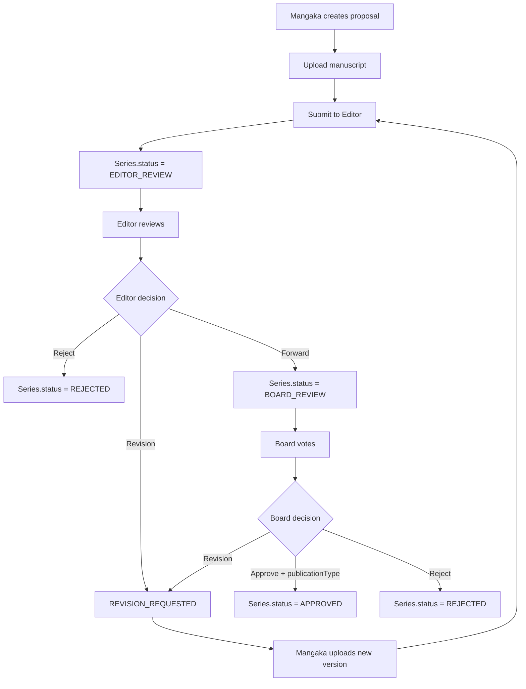

## 1. Tổng quan

Flow 01 mô tả quá trình Mangaka đề xuất Series mới, upload Manuscript sơ bộ, Tantou Editor review và Editorial Board quyết định Series có được approve để vào production hay không.

Khi approve, Board phải chốt lịch xuất bản chính thức:

```
publicationType = WEEKLY | MONTHLY
```

## 2. Mục tiêu nghiệp vụ

- Cho phép Mangaka tạo Series Proposal.
- Cho phép Mangaka upload Manuscript sơ bộ.
- Cho phép Tantou Editor review, request revision, reject hoặc forward to Board.
- Cho phép Editorial Board vote và finalize decision.
- Board quyết định `publicationType` chính thức cho Series.
- Chỉ Series approved và có `publicationType` mới được tạo Chapter production.

## 3. Phạm vi

In scope: create proposal, upload manuscript, editor review, revision loop, board voting, board decision, publication type decision, notification, audit log.

Out of scope: Chapter creation, page upload, production team, task assignment, assistant submission, publication scheduling, ranking, earning/payment tracking.

## 4. Actor tham gia

| Actor           | Vai trò                                                       |
| --------------- | ------------------------------------------------------------- |
| Mangaka         | Tạo proposal, upload manuscript, sửa revision                 |
| Tantou Editor   | Review manuscript, request revision, reject, forward to Board |
| Editorial Board | Vote và quyết định Series có được approve không               |
| Board Chair     | Finalize decision nếu cần tie-break                           |
| System          | Validate, update status, notify, audit                        |

## 5. Điều kiện bắt đầu / kết thúc

Bắt đầu khi Mangaka active tạo Series Proposal mới.

Kết thúc thành công khi:

```
Series.status = APPROVED
Series.publicationType = WEEKLY | MONTHLY
```

Kết thúc thất bại khi:

```
Series.status = REJECTED
```

Có thể tạm dừng ở revision loop khi Editor hoặc Board yêu cầu sửa.

## 6. Entity liên quan

```
Series
SeriesProposal
Manuscript
ManuscriptVersion
EditorReview
BoardVote
BoardDecision
Notification
AuditLog
```

## 7. Series Status

| Status             | Ý nghĩa                                      |
| ------------------ | -------------------------------------------- |
| DRAFT              | Mangaka đang soạn proposal                   |
| EDITOR_REVIEW      | Đã submit cho Editor review                  |
| REVISION_REQUESTED | Cần Mangaka sửa proposal/manuscript          |
| BOARD_REVIEW       | Editor đã forward cho Board                  |
| APPROVED           | Board approve Series và chốt publicationType |
| REJECTED           | Series bị từ chối                            |
| ONGOING            | Series đã vào sản xuất/xuất bản              |
| AT_RISK            | Series có rủi ro do ranking/performance      |
| CANCELLED          | Series bị hủy                                |
| COMPLETED          | Series hoàn thành                            |

## 8. Manuscript Status

| Status              | Ý nghĩa                                  |
| ------------------- | ---------------------------------------- |
| DRAFT               | Bản thảo đang được chuẩn bị              |
| SUBMITTED           | Mangaka đã submit                        |
| UNDER_EDITOR_REVIEW | Editor đang review                       |
| REVISION_REQUESTED  | Cần sửa bản thảo                         |
| FORWARDED_TO_BOARD  | Đã chuyển lên Board                      |
| APPROVED            | Manuscript được chấp nhận trong proposal |
| REJECTED            | Manuscript bị từ chối                    |

## 9. Step-by-step flow

```
Mangaka creates Series Proposal
↓
Mangaka fills title, synopsis, genre, target audience, requestedPublicationType
↓
Mangaka uploads Manuscript draft
↓
Mangaka submits to Editor
↓
Series.status = EDITOR_REVIEW
↓
Tantou Editor reviews proposal/manuscript
↓
Editor decides: Request Revision / Reject / Forward to Board
↓
If forwarded: Series.status = BOARD_REVIEW
↓
Board members vote
↓
Board finalizes: APPROVED + publicationType / REJECTED / NEEDS_REVISION
```

## 10. Revision loop

Editor revision loop:

```
Editor request revision
↓
Series.status = REVISION_REQUESTED
↓
Mangaka reads feedback
↓
Mangaka uploads new ManuscriptVersion
↓
Mangaka resubmits
↓
Series.status = EDITOR_REVIEW
```

Board revision loop:

```
Board requests revision
↓
Series.status = REVISION_REQUESTED
↓
Mangaka updates proposal/manuscript
↓
Editor checks again
↓
Forward to Board again if valid
```

Manuscript version không được ghi đè.

## 11. Permission Matrix

| Action                    | Mangaka          | Editor   | Board               | Admin    |
| ------------------------- | ---------------- | -------- | ------------------- | -------- |
| ---                       | ---:             | ---:     | ---:                | ---:     |
| Create proposal           | Có               | Không    | Không               | Optional |
| Edit draft proposal       | Có               | Không    | Không               | Optional |
| Submit to Editor          | Có               | Không    | Không               | Không    |
| Review manuscript         | Không            | Có       | Có khi Board review | Không    |
| Request revision          | Không            | Có       | Có                  | Không    |
| Reject proposal           | Không            | Có       | Có                  | Không    |
| Forward to Board          | Không            | Có       | Không               | Không    |
| Vote Series               | Không            | Không    | Có                  | Không    |
| Finalize Board decision   | Không            | Không    | Có                  | Không    |
| Create Chapter production | Sau khi APPROVED | Optional | Không               | Optional |

## 12. API đề xuất

```
POST   /api/series
PATCH  /api/series/:seriesId
GET    /api/series/:seriesId
POST   /api/series/:seriesId/manuscripts
POST   /api/series/:seriesId/submit-to-editor
GET    /api/editor/series-review-queue
POST   /api/editor/series/:seriesId/request-revision
POST   /api/editor/series/:seriesId/reject
POST   /api/editor/series/:seriesId/forward-to-board
GET    /api/board/series-review-queue
POST   /api/board/series/:seriesId/votes
POST   /api/board/series/:seriesId/finalize-decision
```

## 13. UI screens đề xuất

```
/app/mangaka/series/new
/app/mangaka/series/:seriesId/proposal
/app/mangaka/series/:seriesId/revisions
/app/editor/series-review
/app/editor/series/:seriesId/review
/app/board/series-review
/app/board/series/:seriesId/vote
```

Sau khi Series được approve, user có thể vào Series Production Hub. Production Hub là UI aggregate, không phải core entity.

## 14. Notification events

```
SERIES_CREATED
SERIES_SUBMITTED_TO_EDITOR
EDITOR_REQUESTED_REVISION
EDITOR_REJECTED_SERIES
SERIES_FORWARDED_TO_BOARD
BOARD_VOTE_CAST
BOARD_APPROVED_SERIES
BOARD_REJECTED_SERIES
BOARD_REQUESTED_REVISION
```

## 15. Audit log events

```
SERIES_CREATED
MANUSCRIPT_VERSION_UPLOADED
SERIES_SUBMITTED_TO_EDITOR
EDITOR_REVIEW_STARTED
EDITOR_REVISION_REQUESTED
EDITOR_REJECTED_SERIES
SERIES_FORWARDED_TO_BOARD
BOARD_VOTE_CREATED
BOARD_DECISION_FINALIZED
SERIES_APPROVED
SERIES_REJECTED
```

## 16. Business rules

- Series chỉ được production sau Board approval.
- Board approval bắt buộc có `publicationType`.
- `publicationType` chỉ nhận `WEEKLY` hoặc `MONTHLY` trong MVP.
- Mangaka có thể request publication type, nhưng Board quyết định cuối.
- Editor có thể suggest publication type, nhưng không quyết định cuối.
- Board không vote từng Chapter trong MVP.
- Manuscript revision phải tạo version mới, không ghi đè.
- Approved Series mở khóa Chapter Creation; rejected Series không tạo Chapter được.
- Production Hub sau approval chỉ là UI layer của Series, không phải database entity.

## 17. Edge cases

| Case                                             | Expected behavior                        |
| ------------------------------------------------ | ---------------------------------------- |
| Submit proposal thiếu manuscript                 | Block submit                             |
| Editor reject                                    | Series.status = REJECTED                 |
| Board approve thiếu publicationType              | Block finalize decision                  |
| Board vote hòa                                   | Board Chair finalizes                    |
| Mangaka resubmit revision                        | Tạo ManuscriptVersion mới                |
| Series rejected                                  | Không tạo Chapter được                   |
| Series approved thiếu publicationType vì data cũ | Block Chapter Creation, require data fix |

## 18. Mermaid activity flow



## 19. Acceptance Criteria

- Mangaka tạo được proposal draft.
- Không submit được nếu thiếu manuscript.
- Editor request revision/reject/forward được.
- Board vote được khi Series ở `BOARD_REVIEW`.
- Board approve bắt buộc chọn `WEEKLY` hoặc `MONTHLY`.
- Approved Series có publicationType mới mở khóa Chapter Creation.
- Rejected Series không tạo Chapter được.
- Board không có flow approve từng Chapter trong MVP.

## 20. MVP implementation priority

```
1. Series proposal CRUD
2. Manuscript upload + versioning
3. Submit to Editor
4. Editor review queue
5. Editor decision actions
6. Board review queue
7. Board vote
8. Board finalize with publicationType
9. Status gate for Chapter Creation
10. Notification + AuditLog
```
