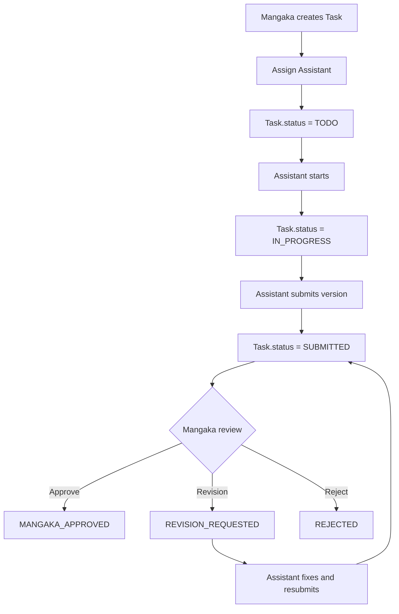

## 1. Tổng quan

Flow 05 mô tả task lifecycle phía Assistant: Mangaka tạo Page-level hoặc Region-level Task, assign Assistant, Assistant start task và submit nhiều version.

Task là đơn vị giao việc thật. Task Studio là UI screen cho Assistant làm task được assign, không phải database entity.

## 2. Mục tiêu nghiệp vụ

- Dùng Task làm đơn vị công việc chính.
- Assign Assistant thuộc Production Team.
- Quản lý Submission theo version.
- Cho phép Assistant submit/resubmit work.
- Feedback gắn đúng Task, Page/Region và Submission version.
- Chống nhiều Assistant cùng làm trùng một target/task type trong MVP.

## 3. Phạm vi

In scope: create task, assign assistant, assistant start task, submit v1/v2/v3, resubmit version, notification, audit log.

Out of scope: Mangaka review queue chi tiết, Editor final approval, payroll, publication, Board decision, Workspace entity.

## 4. Actor tham gia

| Actor     | Vai trò                                    |
| --------- | ------------------------------------------ |
| Mangaka   | Tạo Task, assign Assistant                 |
| Assistant | Nhận Task, làm việc, submit version mới    |
| System    | Validate, versioning, status, notification |
| Editor    | Final review ở Flow 07                     |
| Board     | Không tham gia                             |

## 5. Điều kiện bắt đầu / kết thúc

Bắt đầu khi Page/Region đã sẵn sàng và Assistant đã thuộc Production Team.

```
Series.status in [APPROVED, ONGOING, AT_RISK]
Chapter.status = IN_PRODUCTION
Page.status = UPLOADED
Assistant is active SeriesMember
TaskType is active
```

Kết thúc chính khi:

```
Task.status = MANGAKA_APPROVED
```

Hoặc kết thúc phụ khi Task bị `REJECTED` hoặc `CANCELLED`.

## 6. Entity liên quan

```
Task
Submission
Comment
Annotation
FileAsset
Page
Region
SeriesMember
Notification
AuditLog
```

Không phải core entity:

```
Task Studio
Workspace
```

## 7. Task Status

| Status             | Ý nghĩa                          |
| ------------------ | -------------------------------- |
| TODO               | Task mới assign, chưa bắt đầu    |
| IN_PROGRESS        | Assistant đang làm               |
| SUBMITTED          | Assistant đã nộp current version |
| REVISION_REQUESTED | Mangaka hoặc Editor yêu cầu sửa  |
| MANGAKA_APPROVED   | Mangaka đã approve               |
| EDITOR_APPROVED    | Editor đã approve cuối           |
| REJECTED           | Task bị từ chối                  |
| CANCELLED          | Task bị hủy                      |

## 8. Submission Status

| Status             | Ý nghĩa                      |
| ------------------ | ---------------------------- |
| SUBMITTED          | Assistant đã nộp             |
| REVISION_REQUESTED | Version này cần sửa          |
| MANGAKA_APPROVED   | Version được Mangaka approve |
| EDITOR_APPROVED    | Version được Editor approve  |
| REJECTED           | Version bị reject            |

## 9. Step-by-step flow

```
Mangaka opens Page Studio
↓
Mangaka creates Page-level or Region-level Task
↓
System validates Assistant eligibility
↓
System checks duplicate active task for same target + taskType
↓
Assign Assistant A
↓
Task.status = TODO
↓
Assistant opens Task Studio
↓
Assistant starts Task
↓
Task.status = IN_PROGRESS
↓
Assistant submits v1
↓
Submission.version = 1
Task.status = SUBMITTED
↓
Task enters Mangaka Review Queue in Flow 06
```

## 10. Revision loop

```
Assistant submit v1
↓
Reviewer requests revision
↓
Task.status = REVISION_REQUESTED
Submission.status = REVISION_REQUESTED
Feedback/comment/annotation created
↓
Assistant fixes
↓
Assistant submit v2
↓
Task.status = SUBMITTED
↓
Loop until approved, rejected, or cancelled
```

Submission không được ghi đè. Mỗi lần submit tạo version mới.

## 11. Permission Matrix

| Action             | Mangaka | Assigned Assistant | Other Assistant | Editor          | Board |
| ------------------ | ------- | ------------------ | --------------- | --------------- | ----- |
| ---                | ---:    | ---:               | ---:            | ---:            | ---:  |
| Create Task        | Có      | Không              | Không           | Optional        | Không |
| Assign Task        | Có      | Không              | Không           | Optional        | Không |
| View assigned Task | Có      | Có                 | Không           | Có              | Không |
| Open Task Studio   | Không   | Có nếu assigned    | Không           | Optional review | Không |
| Start Task         | Không   | Có                 | Không           | Không           | Không |
| Submit work        | Không   | Có                 | Không           | Không           | Không |
| Review submission  | Flow 06 | Không              | Không           | Flow 07         | Không |
| Request revision   | Flow 06 | Không              | Không           | Flow 07         | Không |
| Approve            | Flow 06 | Không              | Không           | Flow 07         | Không |

## 12. API đề xuất

```
POST   /api/pages/:pageId/tasks
POST   /api/regions/:regionId/tasks
GET    /api/tasks/:taskId
POST   /api/tasks/:taskId/start
POST   /api/tasks/:taskId/submissions
GET    /api/tasks/:taskId/submissions
POST   /api/submissions/:submissionId/approve
POST   /api/submissions/:submissionId/request-revision
POST   /api/submissions/:submissionId/reject
POST   /api/tasks/:taskId/comments
POST   /api/pages/:pageId/annotations
```

## 13. UI screens đề xuất

```
/app/mangaka/pages/:pageId/studio
/app/mangaka/tasks/:taskId/review
/app/assistant/tasks
/app/assistant/tasks/:taskId/studio
```

`Task Studio` là UI screen cho assigned Task, không phải database entity.

## 14. Notification events

```
TASK_ASSIGNED
TASK_STARTED
TASK_SUBMITTED
TASK_RESUBMITTED
REVISION_REQUESTED
TASK_MANGAKA_APPROVED
TASK_REJECTED
COMMENT_CREATED
```

## 15. Audit log events

```
TASK_CREATED
TASK_ASSIGNED
TASK_STARTED
SUBMISSION_CREATED
SUBMISSION_VERSION_CREATED
TASK_REVISION_REQUESTED
TASK_MANGAKA_APPROVED
TASK_REJECTED
COMMENT_CREATED
ANNOTATION_CREATED
```

## 16. Business rules

- Không giao trực tiếp Page cho Assistant; phải tạo Task.
- Assistant chỉ submit Task được assign cho mình.
- Assistant không thấy Task của Assistant khác.
- Submission không ghi đè version cũ.
- Request revision bắt buộc có feedback.
- Annotation dùng coordinates trên Working Image.
- Không tạo 2 active Task trùng `targetType + targetId + taskType` khi Task trước chưa kết thúc.
- Active Task kết thúc khi `EDITOR_APPROVED`, `REJECTED` hoặc `CANCELLED`.
- Payroll chưa tính ở `MANGAKA_APPROVED`.
- Task Studio là UI screen, không phải core entity.

## 17. Edge cases

| Case                                    | Expected behavior              |
| --------------------------------------- | ------------------------------ |
| Assistant không thuộc team              | Block assign                   |
| Assistant inactive                      | Block assign                   |
| Submit khi không assigned               | Block                          |
| Approve submission cũ                   | Block                          |
| Request revision thiếu comment          | Block                          |
| Task cancelled                          | Block submit                   |
| Tạo active Task trùng target + taskType | Block tới khi task cũ kết thúc |

## 18. Mermaid activity flow



## 19. Acceptance Criteria

- Mangaka tạo được Page/Region Task.
- Chỉ assign được Assistant eligible.
- Assistant thấy và submit Task của mình.
- Assistant mở được Task Studio cho assigned Task.
- Submit lại tạo version mới.
- Request revision phải có feedback.
- Loop lặp tới khi approve/reject/cancel.
- Task `MANGAKA_APPROVED` sẵn sàng cho Editor final review.
- Không tạo active task trùng target + taskType.

## 20. MVP implementation priority

```
1. Task model
2. Eligibility check
3. Duplicate active task guard
4. Assign Assistant
5. Assistant Task Studio
6. Submission upload
7. Submission versioning
8. Mangaka review action handoff
9. Revision comment
10. Notification
11. AuditLog
```
