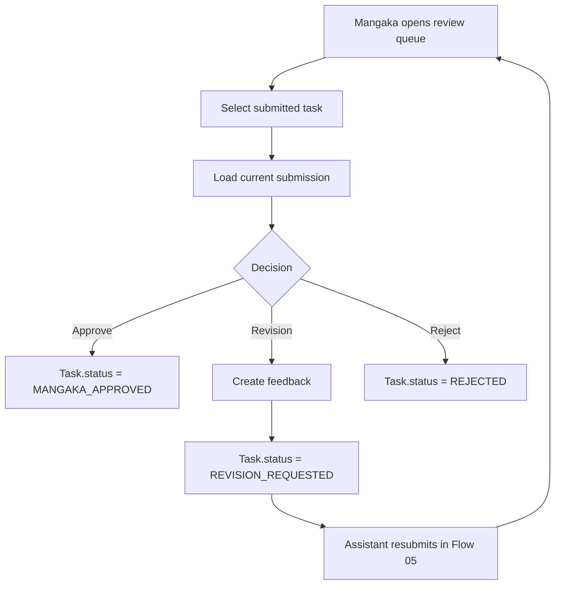

## 1. Tổng quan

Flow 06 mô tả review queue của Mangaka sau khi Assistant submit Task. Đây là bước Mangaka kiểm tra chất lượng trước khi Task được chuyển sang Editor final review.

Flow 06 chỉ tập trung vào review queue. Việc tạo Task, assign và Assistant submit thuộc Flow 05.

## 2. Mục tiêu nghiệp vụ

- Gom các Submission đang chờ Mangaka review.
- Cho phép Mangaka xem current Submission.
- Cho phép Mangaka approve, request revision hoặc reject.
- Đảm bảo feedback gắn đúng version.
- Chỉ current Submission được approve.
- Không tính earning ở bước Mangaka approval.

## 3. Phạm vi

In scope: review queue, compare submission, approve, request revision, reject, comment/annotation, notification, audit log.

Out of scope: create Task, Assistant doing work, Editor final approval, payroll, publication.

## 4. Actor tham gia

| Actor     | Vai trò                                    |
| --------- | ------------------------------------------ |
| Mangaka   | Review submission và quyết định            |
| Assistant | Nhận feedback hoặc approval                |
| System    | Quản lý queue, status, notification, audit |
| Editor    | Nhận task sau Mangaka approval             |

## 5. Điều kiện bắt đầu / kết thúc

Bắt đầu khi:

```
Task.status = SUBMITTED
Task.currentSubmissionId exists
Submission.status = SUBMITTED
Reviewer is ownerMangaka or permitted Co-Mangaka
```

Kết thúc khi Mangaka approve, request revision hoặc reject.

## 6. Entity liên quan

```
Task
Submission
Comment
Annotation
Page
Region
FileAsset
Notification
AuditLog
```

## 7. Task Status

| Status             | Ý nghĩa                             |
| ------------------ | ----------------------------------- |
| SUBMITTED          | Chờ Mangaka review                  |
| REVISION_REQUESTED | Mangaka yêu cầu sửa                 |
| MANGAKA_APPROVED   | Mangaka approved current submission |
| REJECTED           | Mangaka reject task/submission      |

## 8. Submission Status

| Status             | Ý nghĩa                          |
| ------------------ | -------------------------------- |
| SUBMITTED          | Current version đang chờ review  |
| REVISION_REQUESTED | Version này bị yêu cầu sửa       |
| MANGAKA_APPROVED   | Version này được Mangaka approve |
| REJECTED           | Version này bị reject            |

## 9. Step-by-step flow

```
Mangaka opens Review Queue
↓
System lists Tasks with status SUBMITTED
↓
Mangaka selects Task
↓
System loads current Submission
↓
Mangaka reviews result, task description, comments, working image
↓
Mangaka chooses: Approve / Request Revision / Reject
```

## 10. Revision loop

```
Mangaka request revision
↓
Task.status = REVISION_REQUESTED
Submission.status = REVISION_REQUESTED
Mangaka creates feedback
↓
Assistant receives notification
↓
Assistant submits new version in Flow 05
↓
Task.status = SUBMITTED
↓
Back to Mangaka review queue
```

## 11. Permission Matrix

| Action                  | Mangaka | Assigned Assistant | Other Assistant | Editor   | Board |
| ----------------------- | ------- | ------------------ | --------------- | -------- | ----- |
| ---                     | ---:    | ---:               | ---:            | ---:     | ---:  |
| View review queue       | Có      | Không              | Không           | Optional | Không |
| View current submission | Có      | Có nếu own task    | Không           | Có       | Không |
| Approve submission      | Có      | Không              | Không           | Không    | Không |
| Request revision        | Có      | Không              | Không           | Không    | Không |
| Reject submission       | Có      | Không              | Không           | Optional | Không |

## 12. API đề xuất

```
GET  /api/mangaka/reviews
GET  /api/mangaka/tasks/:taskId/review
POST /api/submissions/:submissionId/approve
POST /api/submissions/:submissionId/request-revision
POST /api/submissions/:submissionId/reject
POST /api/tasks/:taskId/comments
POST /api/pages/:pageId/annotations
```

## 13. UI screens đề xuất

```
/app/mangaka/reviews
/app/mangaka/tasks/:taskId/review
/app/mangaka/pages/:pageId/studio
```

Components:

```
ReviewQueueList
SubmissionViewer
VersionHistory
RevisionCommentPanel
AnnotationCanvas
ApproveRejectActions
```

## 14. Notification events

```
TASK_SUBMITTED
REVISION_REQUESTED
TASK_MANGAKA_APPROVED
TASK_REJECTED
COMMENT_CREATED
ANNOTATION_CREATED
```

## 15. Audit log events

```
MANGAKA_REVIEW_OPENED
TASK_MANGAKA_APPROVED
TASK_REVISION_REQUESTED
TASK_REJECTED
COMMENT_CREATED
ANNOTATION_CREATED
```

## 16. Business rules

- Mangaka chỉ approve current Submission.
- Request revision bắt buộc có feedback.
- Feedback phải link với submissionId.
- Annotation coordinates dùng trên Working Image.
- Khi request revision, Assistant phải submit version mới.
- `MANGAKA_APPROVED` chưa đủ để tính earning.
- Task `MANGAKA_APPROVED` sẽ đi tiếp sang Editor final review ở Flow 07.

## 17. Edge cases

| Case                                | Expected behavior         |
| ----------------------------------- | ------------------------- |
| Submission không phải current       | Block approve             |
| Missing feedback when revision      | Block                     |
| Task already approved               | Block duplicate action    |
| Assistant submits while review open | Reload current submission |
| Mangaka lacks permission            | Block                     |

## 18. Mermaid activity flow



## 19. Acceptance Criteria

- Mangaka thấy review queue.
- Review queue chỉ hiện Task `SUBMITTED`.
- Approve chuyển Task sang `MANGAKA_APPROVED`.
- Request revision chuyển Task sang `REVISION_REQUESTED`.
- Reject chuyển Task sang `REJECTED`.
- Feedback gắn đúng submission version.
- `MANGAKA_APPROVED` không tạo earning.
- Notification và AuditLog được tạo.

## 20. MVP implementation priority

```
1. Review queue API
2. Review detail UI
3. Current submission viewer
4. Approve action
5. Request revision with comment
6. Reject action
7. Annotation support
8. Handoff to Editor final review
9. Notification
10. AuditLog
```
