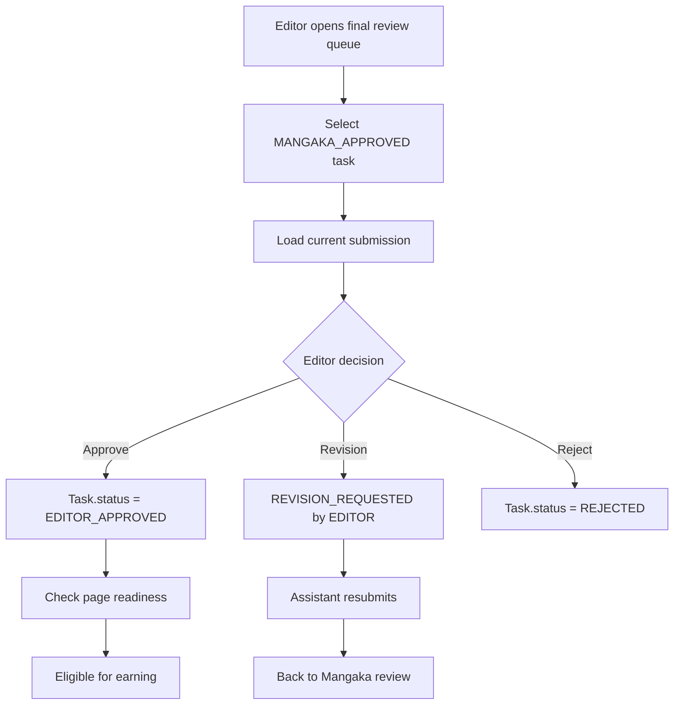

## 1. Tổng quan

Flow 07 mô tả Editor Final Review sau khi Task được Mangaka approve. Đây là bước final quality gate trước khi Page/Task được xem là hoàn tất về mặt production và đủ điều kiện tạo Assistant Earning ở Flow 11.

## 2. Mục tiêu nghiệp vụ

- Cho phép Editor review Task đã `MANGAKA_APPROVED`.
- Cho phép Editor approve cuối, request revision hoặc reject.
- Phân biệt revision do Mangaka yêu cầu và revision do Editor yêu cầu bằng metadata.
- Cập nhật Page/Chapter readiness khi các required Task đã hoàn tất.
- Tạo điều kiện cho earning sau `EDITOR_APPROVED`.

## 3. Phạm vi

In scope: Editor final review queue, approve, request revision, reject, page approval check, earning eligibility signal, notification, audit log.

Out of scope: Assistant doing work, Mangaka review queue, actual payment, publication scheduling.

## 4. Actor tham gia

| Actor         | Vai trò                                           |
| ------------- | ------------------------------------------------- |
| Tantou Editor | Final review và quyết định                        |
| Mangaka       | Nhận thông tin nếu Editor request revision/reject |
| Assistant     | Nhận revision nếu cần sửa                         |
| System        | Validate, update status, notify, audit            |

## 5. Điều kiện bắt đầu / kết thúc

Bắt đầu khi:

```
Task.status = MANGAKA_APPROVED
Submission.status = MANGAKA_APPROVED
Task.currentSubmissionId exists
```

Kết thúc thành công khi:

```
Task.status = EDITOR_APPROVED
Submission.status = EDITOR_APPROVED
```

Kết thúc phụ khi Editor request revision hoặc reject.

## 6. Entity liên quan

```
Task
Submission
Page
Region
Chapter
Comment
Annotation
Notification
AuditLog
AssistantEarning
```

## 7. Task Status

| Status             | Ý nghĩa                       |
| ------------------ | ----------------------------- |
| MANGAKA_APPROVED   | Chờ Editor final review       |
| EDITOR_APPROVED    | Editor đã approve cuối        |
| REVISION_REQUESTED | Editor yêu cầu sửa            |
| REJECTED           | Editor reject task/submission |

## 8. Submission Status

| Status             | Ý nghĩa                             |
| ------------------ | ----------------------------------- |
| MANGAKA_APPROVED   | Version đã được Mangaka approve     |
| EDITOR_APPROVED    | Version đã được Editor approve cuối |
| REVISION_REQUESTED | Version cần sửa tiếp                |
| REJECTED           | Version bị reject                   |

## 9. Step-by-step flow

```
Editor opens Final Review Queue
↓
System lists Tasks with status MANGAKA_APPROVED
↓
Editor selects Task
↓
System loads current Submission, Page/Region context and comments
↓
Editor reviews quality
↓
Editor chooses: Approve / Request Revision / Reject
```

Approve flow:

```
Editor approves
↓
Task.status = EDITOR_APPROVED
Submission.status = EDITOR_APPROVED
↓
System checks Page/Chapter readiness
↓
Task becomes eligible for earning calculation
```

## 10. Revision loop

```
Editor request revision
↓
Task.status = REVISION_REQUESTED
Submission.status = REVISION_REQUESTED
Task.revisionRequestedByRole = EDITOR
Task.revisionRequestedByUserId = editorId
Task.revisionRequestedAt = now
↓
Assistant receives feedback
↓
Assistant submits new version in Flow 05
↓
Mangaka reviews again in Flow 06
↓
Back to Editor final review if Mangaka approves
```

## 11. Permission Matrix

| Action                      | Editor | Mangaka  | Assistant       | Board | Admin    |
| --------------------------- | ------ | -------- | --------------- | ----- | -------- |
| ---                         | ---:   | ---:     | ---:            | ---:  | ---:     |
| View final review queue     | Có     | Optional | Không           | Không | Có       |
| View current submission     | Có     | Có       | Có nếu own task | Không | Có       |
| Final approve               | Có     | Không    | Không           | Không | Optional |
| Request revision            | Có     | Không    | Không           | Không | Optional |
| Reject                      | Có     | Không    | Không           | Không | Optional |
| Trigger earning eligibility | System | Không    | Không           | Không | Optional |

## 12. API đề xuất

```
GET  /api/editor/final-reviews
GET  /api/editor/tasks/:taskId/final-review
POST /api/editor/submissions/:submissionId/approve
POST /api/editor/submissions/:submissionId/request-revision
POST /api/editor/submissions/:submissionId/reject
GET  /api/pages/:pageId/readiness
```

## 13. UI screens đề xuất

```
/app/editor/final-reviews
/app/editor/tasks/:taskId/final-review
/app/editor/pages/:pageId/studio
```

## 14. Notification events

```
TASK_MANGAKA_APPROVED
TASK_EDITOR_APPROVED
EDITOR_REQUESTED_REVISION
EDITOR_REJECTED_TASK
PAGE_APPROVED
```

## 15. Audit log events

```
EDITOR_FINAL_REVIEW_OPENED
TASK_EDITOR_APPROVED
EDITOR_REVISION_REQUESTED
EDITOR_REJECTED_TASK
PAGE_APPROVAL_CHECKED
PAGE_APPROVED
```

## 16. Business rules

- Task phải `MANGAKA_APPROVED` mới vào Editor final queue.
- Editor approve mới chuyển Task sang `EDITOR_APPROVED`.
- `EDITOR_APPROVED` là điều kiện để Flow 11 tạo earning.
- Editor có thể request revision sau Mangaka approval.
- Revision dùng chung status `REVISION_REQUESTED` nhưng phải lưu metadata `revisionRequestedByRole`, `revisionRequestedByUserId`, `revisionRequestedAt`.
- Page chỉ approved khi tất cả required Task của Page đã `EDITOR_APPROVED`.
- Board không tham gia approve Task/Page trong MVP.

## 17. Edge cases

| Case                               | Expected behavior         |
| ---------------------------------- | ------------------------- |
| Task chưa MANGAKA_APPROVED         | Block Editor final action |
| Approve old submission             | Block                     |
| Request revision thiếu feedback    | Block                     |
| Duplicate final approve            | Idempotent hoặc block     |
| Page còn Task chưa EDITOR_APPROVED | Page chưa APPROVED        |

## 18. Mermaid activity flow



## 19. Acceptance Criteria

- Editor thấy queue Task `MANGAKA_APPROVED`.
- Editor approve chuyển Task/Submission sang `EDITOR_APPROVED`.
- Editor request revision lưu được feedback và metadata revision source.
- Task `EDITOR_APPROVED` đủ điều kiện tạo earning ở Flow 11.
- Page approved khi tất cả required Task đã Editor approved.
- Board không có action trong flow này.

## 20. MVP implementation priority

```
1. Editor final review queue
2. Final review detail UI
3. Editor approve action
4. Editor request revision with metadata
5. Editor reject action
6. Page readiness checker
7. Earning eligibility signal
8. Notification
9. AuditLog
```
