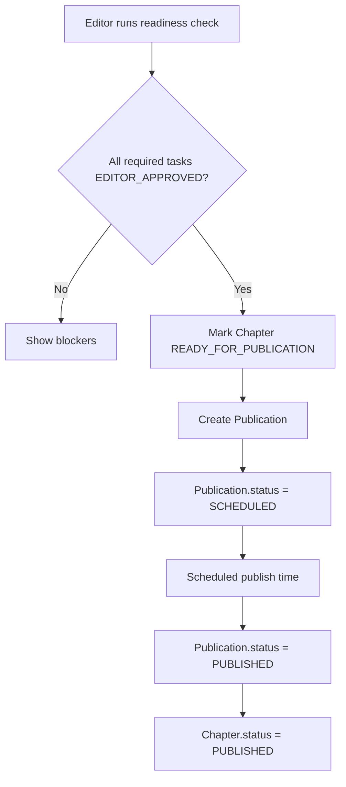

## 1. Tổng quan

Flow 08 mô tả cách kiểm tra Chapter readiness và lên lịch publication sau khi production đã hoàn tất.

Điểm chốt:

```
Chapter.status = READY_FOR_PUBLICATION
Publication.status = SCHEDULED
```

Chapter không dùng status `SCHEDULED` trong MVP. Schedule thuộc về `Publication`.

## 2. Mục tiêu nghiệp vụ

- Kiểm tra Chapter đã đủ điều kiện publish chưa.
- Đảm bảo tất cả required Task đã `EDITOR_APPROVED`.
- Cho phép Editor/Admin tạo lịch publication.
- Tách rõ Chapter readiness và Publication scheduling.
- Không kéo Board vào duyệt từng Chapter trong MVP.

## 3. Phạm vi

In scope: readiness check, mark Chapter ready, create Publication record, schedule publish, notification, audit log.

Out of scope: Reader view, ranking input, board ranking decision, payment tracking.

## 4. Actor tham gia

| Actor   | Vai trò                                              |
| ------- | ---------------------------------------------------- |
| Editor  | Kiểm tra readiness và schedule publication           |
| Mangaka | Theo dõi trạng thái Chapter                          |
| Admin   | Optional manage schedule                             |
| System  | Validate readiness, schedule, publish trigger, audit |
| Board   | Không duyệt từng Chapter trong MVP                   |

## 5. Điều kiện bắt đầu / kết thúc

Bắt đầu khi Chapter đã production gần xong.

Preconditions:

```
Chapter.status = IN_PRODUCTION
Series.status in [APPROVED, ONGOING, AT_RISK]
Series.publicationType in [WEEKLY, MONTHLY]
All required Tasks are EDITOR_APPROVED
No blocking Page/Task remains
```

Kết thúc thành công khi:

```
Chapter.status = READY_FOR_PUBLICATION
Publication.status = SCHEDULED
```

Hoặc sau publish:

```
Publication.status = PUBLISHED
Chapter.status = PUBLISHED
```

## 6. Entity liên quan

```
Series
Chapter
Page
Task
Publication
Notification
AuditLog
```

## 7. Chapter Status

| Status                | Ý nghĩa                         |
| --------------------- | ------------------------------- |
| IN_PRODUCTION         | Chapter đang production         |
| READY_FOR_PUBLICATION | Chapter đã đủ điều kiện publish |
| PUBLISHED             | Chapter đã xuất bản             |
| ARCHIVED              | Chapter không còn active        |

Không dùng `SCHEDULED` cho Chapter trong MVP.

## 8. Publication Status

| Status    | Ý nghĩa                                      |
| --------- | -------------------------------------------- |
| DRAFT     | Publication record mới tạo hoặc chưa có lịch |
| SCHEDULED | Đã có lịch publish                           |
| PUBLISHED | Đã publish thành công                        |
| CANCELLED | Lịch publish bị hủy                          |

## 9. Step-by-step flow

```
Editor opens Chapter readiness screen
↓
System checks Pages and required Tasks
↓
If all required Tasks are EDITOR_APPROVED
↓
Editor marks Chapter ready
↓
Chapter.status = READY_FOR_PUBLICATION
↓
Editor creates Publication schedule
↓
Publication.status = SCHEDULED
↓
System publishes at scheduled time
↓
Publication.status = PUBLISHED
Chapter.status = PUBLISHED
```

## 10. Revision loop

Flow này không có revision loop nội dung. Nếu readiness fail:

```
Readiness check fails
↓
System shows missing tasks/pages/blockers
↓
Team resolves blockers in Flow 05–07
↓
Editor runs readiness check again
```

## 11. Permission Matrix

| Action               | Mangaka  | Editor | Admin    | Board        | Assistant |
| -------------------- | -------- | ------ | -------- | ------------ | --------- |
| ---                  | ---:     | ---:   | ---:     | ---:         | ---:      |
| View readiness       | Có       | Có     | Có       | Summary only | Không     |
| Run readiness check  | Optional | Có     | Có       | Không        | Không     |
| Mark ready           | Không    | Có     | Optional | Không        | Không     |
| Schedule publication | Không    | Có     | Có       | Không        | Không     |
| Cancel schedule      | Không    | Có     | Có       | Không        | Không     |

## 12. API đề xuất

```
GET  /api/chapters/:chapterId/readiness
POST /api/chapters/:chapterId/mark-ready
POST /api/chapters/:chapterId/publications
PATCH /api/publications/:publicationId
POST /api/publications/:publicationId/cancel
POST /api/publications/:publicationId/publish
```

## 13. UI screens đề xuất

```
/app/editor/chapters/:chapterId/readiness
/app/editor/chapters/:chapterId/schedule
/app/mangaka/chapters/:chapterId/status
/app/admin/publications
```

## 14. Notification events

```
CHAPTER_READY_FOR_PUBLICATION
PUBLICATION_SCHEDULED
PUBLICATION_CANCELLED
CHAPTER_PUBLISHED
PUBLICATION_FAILED
```

## 15. Audit log events

```
CHAPTER_READINESS_CHECKED
CHAPTER_MARKED_READY
PUBLICATION_CREATED
PUBLICATION_SCHEDULED
PUBLICATION_CANCELLED
PUBLICATION_PUBLISHED
CHAPTER_PUBLISHED
```

## 16. Business rules

- Chapter chỉ ready khi tất cả required Task đã `EDITOR_APPROVED`.
- `MANGAKA_APPROVED` chưa đủ để publish.
- Chapter không dùng status `SCHEDULED` trong MVP.
- Schedule thuộc về `Publication.status = SCHEDULED`.
- Board không approve từng Chapter trong MVP.
- Publication phải có scheduledAt hợp lệ nếu status là `SCHEDULED`.
- Published Chapter phải có immutable publication record để phục vụ Reader View và Ranking Input.

## 17. Edge cases

| Case                          | Expected behavior                           |
| ----------------------------- | ------------------------------------------- |
| Còn Task chưa EDITOR_APPROVED | Block mark ready                            |
| Series cancelled              | Block schedule                              |
| Missing publicationType       | Block schedule                              |
| scheduledAt ở quá khứ         | Block hoặc require publish immediately rule |
| Publication already published | Block duplicate publish                     |
| Cancel published publication  | Block hoặc require admin correction flow    |

## 18. Mermaid activity flow



## 19. Acceptance Criteria

- Readiness check hiển thị đúng blockers.
- Chapter chỉ chuyển `READY_FOR_PUBLICATION` khi required Task đã `EDITOR_APPROVED`.
- Publication schedule tạo được với `Publication.status = SCHEDULED`.
- Chapter không có `SCHEDULED` status.
- Publish thành công chuyển `Publication.status = PUBLISHED` và `Chapter.status = PUBLISHED`.
- Board không có approval action trong flow này.

## 20. MVP implementation priority

```
1. Chapter readiness checker
2. Required task completion check
3. Mark ready action
4. Publication model
5. Schedule publication
6. Publish job/manual publish action
7. Cancel schedule
8. Notification
9. AuditLog
```
