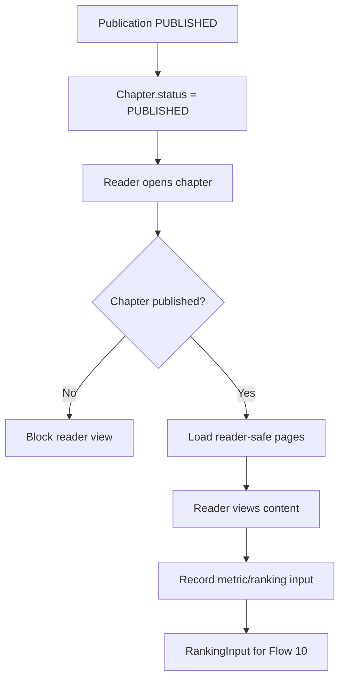

## 1. Tổng quan

Flow 09 mô tả Reader View sau khi Chapter đã được publish và cách hệ thống ghi nhận Ranking Input để phục vụ đánh giá Series ở Flow 10.

Reader chỉ thấy nội dung đã publish. Internal production data như Task, Submission, Comment, Annotation và AuditLog không được expose cho Reader.

## 2. Mục tiêu nghiệp vụ

- Cho phép Reader xem Published Chapter.
- Đảm bảo chỉ Chapter `PUBLISHED` mới xuất hiện ở Reader View.
- Tách Reader View khỏi production/internal data.
- Ghi nhận Ranking Input theo kỳ đánh giá.
- Chuẩn bị dữ liệu cho Board đánh giá Series ở Flow 10.

## 3. Phạm vi

In scope: published chapter access, reader view, basic reading metrics, ranking input, notification/audit if needed.

Out of scope: production task review, payment tracking, board decision, advanced recommendation engine.

## 4. Actor tham gia

| Actor        | Vai trò                                     |
| ------------ | ------------------------------------------- |
| Reader       | Đọc Chapter đã publish                      |
| System       | Hiển thị nội dung, ghi metric/ranking input |
| Editor/Admin | Kiểm tra published state và ranking input   |
| Board        | Sử dụng ranking report ở Flow 10            |

## 5. Điều kiện bắt đầu / kết thúc

Bắt đầu khi Publication đã được publish thành công.

```
Publication.status = PUBLISHED
Chapter.status = PUBLISHED
```

Kết thúc khi Reader xem Chapter hoặc Ranking Input được ghi nhận/finalized cho kỳ đánh giá.

## 6. Entity liên quan

```
Series
Chapter
Page
Publication
ReaderMetric
RankingInput
Notification
AuditLog
```

Không expose ra Reader:

```
Task
Submission
Internal Comment
Internal Annotation
AuditLog
```

## 7. Chapter Publication Status

| Status                | Ý nghĩa                                       |
| --------------------- | --------------------------------------------- |
| READY_FOR_PUBLICATION | Chapter đã sẵn sàng nhưng chưa publish        |
| PUBLISHED             | Chapter đã publish và reader có thể xem       |
| ARCHIVED              | Chapter không còn active trong reader listing |

## 8. RankingInput Status

| Status    | Ý nghĩa                          |
| --------- | -------------------------------- |
| DRAFT     | Ranking input đang được chuẩn bị |
| SUBMITTED | Đã submit cho kỳ đánh giá        |
| FINALIZED | Đã chốt cho Flow 10              |
| VOIDED    | Bị hủy/không dùng                |

## 9. Step-by-step flow

```
Publication is published
↓
Chapter.status = PUBLISHED
↓
Reader opens Series/Chapter page
↓
System checks Chapter published state
↓
System loads reader-safe pages/assets
↓
Reader views Chapter
↓
System records metric/ranking input if enabled
↓
RankingInput prepared for evaluation period
```

## 10. Revision loop

Reader View không có revision loop production. Nếu published content có lỗi:

```
Editor/Admin flags published issue
↓
Internal correction flow is opened
↓
If correction is needed, create new controlled update/version
↓
AuditLog records correction
```

## 11. Permission Matrix

| Action                        | Reader | Mangaka         | Editor   | Admin | Board |
| ----------------------------- | ------ | --------------- | -------- | ----- | ----- |
| ---                           | ---:   | ---:            | ---:     | ---:  | ---:  |
| View published chapter        | Có     | Có              | Có       | Có    | Có    |
| View unpublished chapter      | Không  | Có nếu có quyền | Có       | Có    | Không |
| View internal task/submission | Không  | Có nếu có quyền | Có       | Có    | Không |
| Create ranking input          | Không  | Không           | Optional | Có    | Không |
| Finalize ranking input        | Không  | Không           | Optional | Có    | Không |
| View ranking report           | Không  | Optional        | Có       | Có    | Có    |

## 12. API đề xuất

```
GET  /api/public/series/:seriesSlug
GET  /api/public/chapters/:chapterSlug
GET  /api/public/chapters/:chapterId/pages
POST /api/reader-metrics
GET  /api/admin/ranking-inputs
POST /api/admin/ranking-inputs
POST /api/admin/ranking-inputs/:rankingInputId/finalize
```

## 13. UI screens đề xuất

```
/series/:seriesSlug
/series/:seriesSlug/chapters/:chapterSlug
/app/admin/ranking-inputs
/app/editor/ranking-inputs
```

## 14. Notification events

```
CHAPTER_PUBLISHED
RANKING_INPUT_CREATED
RANKING_INPUT_SUBMITTED
RANKING_INPUT_FINALIZED
```

## 15. Audit log events

```
PUBLIC_CHAPTER_VIEWED_OPTIONAL
RANKING_INPUT_CREATED
RANKING_INPUT_UPDATED
RANKING_INPUT_SUBMITTED
RANKING_INPUT_FINALIZED
RANKING_INPUT_VOIDED
```

## 16. Business rules

- Reader chỉ thấy Chapter đã `PUBLISHED`.
- Internal production data không được expose cho Reader.
- Published Chapter phải lấy từ approved/published assets.
- RankingInput là dữ liệu đầu vào cho Flow 10.
- MVP có thể nhập ranking thủ công hoặc import đơn giản.
- RankingInput finalized không nên sửa trực tiếp; nếu sai thì void/correct theo audit.

## 17. Edge cases

| Case                                                   | Expected behavior                   |
| ------------------------------------------------------ | ----------------------------------- |
| Reader mở unpublished chapter                          | Return not found/forbidden          |
| Publication published nhưng Chapter chưa PUBLISHED     | Block reader view, require data fix |
| Missing page asset                                     | Hide page or show controlled error  |
| Duplicate ranking input for same period/series/chapter | Block or merge by rule              |
| Finalized ranking input bị sai                         | Void/correct with AuditLog          |

## 18. Mermaid activity flow



## 19. Acceptance Criteria

- Reader xem được Chapter đã `PUBLISHED`.
- Reader không xem được Chapter chưa publish.
- Reader View không expose Task/Submission/Comment/AuditLog nội bộ.
- RankingInput tạo được cho kỳ đánh giá.
- RankingInput finalized dùng được cho Flow 10.
- Finalized data có audit khi sửa/void.

## 20. MVP implementation priority

```
1. Public Series/Chapter routes
2. Published Chapter guard
3. Reader-safe page asset loading
4. Basic reader metric capture
5. RankingInput model
6. Admin ranking input UI
7. Finalize ranking input
8. AuditLog for ranking input changes
```
