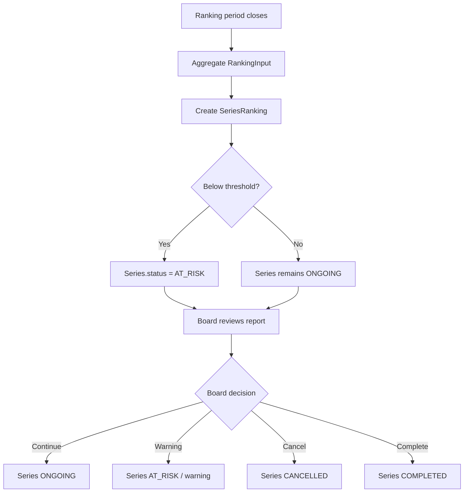

## 1. Tổng quan

Flow 10 mô tả cách hệ thống tổng hợp ranking, đánh dấu Series at-risk và hỗ trợ Editorial Board ra quyết định sau khi Chapter đã publish.

MVP không dùng `HIATUS`. Board decision trong MVP chỉ gồm:

```
CONTINUE
WARNING
CANCEL
COMPLETE
```

## 2. Mục tiêu nghiệp vụ

- Tổng hợp ranking input theo kỳ đánh giá.
- Xác định Series có rơi vào at-risk không.
- Cho phép Board xem report và ra quyết định.
- Cập nhật Series status theo Board decision.
- Lưu decision history và audit đầy đủ.

## 3. Phạm vi

In scope: ranking evaluation, at-risk detection, Board review, Board decision, Series status update, notification, audit log.

Out of scope: reader view, ranking input creation, publication scheduling, payment tracking.

## 4. Actor tham gia

| Actor | Vai trò |
| --- | --- |
| Editorial Board | Review ranking report và quyết định |
| Board Chair | Finalize decision nếu cần |
| Editor | Chuẩn bị/giải thích report, theo dõi Series |
| System | Aggregate ranking, detect at-risk, update status, audit |
| Mangaka | Nhận thông báo kết quả |

## 5. Điều kiện bắt đầu / kết thúc

Bắt đầu khi ranking period có dữ liệu finalized.

```
RankingPeriod.status = READY_FOR_EVALUATION
RankingInput.status = FINALIZED
```

Kết thúc khi BoardDecision được finalize.

```
BoardDecision.status = FINALIZED
Series.status updated if needed
```

## 6. Entity liên quan

```
Series
RankingPeriod
RankingInput
SeriesRanking
BoardDecision
BoardVote
Notification
AuditLog
```

## 7. Series Status

| Status | Ý nghĩa |
| --- | --- |
| ONGOING | Series tiếp tục sản xuất/xuất bản |
| AT_RISK | Series có rủi ro do ranking/performance |
| CANCELLED | Series bị hủy |
| COMPLETED | Series hoàn thành |

MVP không dùng `HIATUS`.

## 8. BoardDecision Status / Type

Decision status:

| Status | Ý nghĩa |
| --- | --- |
| DRAFT | Decision đang chuẩn bị |
| VOTING | Board đang vote |
| FINALIZED | Đã chốt quyết định |
| VOIDED | Decision bị hủy/không dùng |

Decision type:

| Type | Ý nghĩa |
| --- | --- |
| CONTINUE | Series tiếp tục bình thường |
| WARNING | Cảnh báo / theo dõi sát |
| CANCEL | Hủy Series |
| COMPLETE | Chốt hoàn thành Series |

## 9. Step-by-step flow

```
Ranking period closes
↓
System aggregates finalized RankingInput
↓
System creates SeriesRanking report
↓
System checks at-risk threshold
↓
If below threshold, Series.status = AT_RISK
↓
Board opens ranking review
↓
Board members vote/discuss
↓
Board finalizes decision
↓
System updates Series status if needed
↓
Notify stakeholders
```

## 10. Revision loop

Ranking/decision correction loop:

```
Ranking data issue found before decision
↓
Admin/Editor voids or corrects RankingInput with reason
↓
System recalculates report
↓
Board reviews updated report
```

After BoardDecision is finalized, correction should create a new decision or void existing decision with strong audit.

## 11. Permission Matrix

| Action | Board | Board Chair | Editor | Admin | Mangaka |
| --- | --- | --- | --- | --- | --- |
| --- | ---: | ---: | ---: | ---: | ---: |
| View ranking report | Có | Có | Có | Có | Optional summary |
| Vote decision | Có | Có | Không | Không | Không |
| Finalize decision | Optional | Có | Không | Optional | Không |
| Update threshold config | Không | Không | Không | Có | Không |
| View finalized decision | Có | Có | Có | Có | Có |

## 12. API đề xuất

```
GET  /api/ranking-periods/:periodId/report
POST /api/ranking-periods/:periodId/evaluate
GET  /api/board/ranking-reviews
GET  /api/board/series/:seriesId/ranking
POST /api/board/series/:seriesId/decisions
POST /api/board/decisions/:decisionId/votes
POST /api/board/decisions/:decisionId/finalize
POST /api/board/decisions/:decisionId/void
```

## 13. UI screens đề xuất

```
/app/board/ranking-reviews
/app/board/series/:seriesId/ranking
/app/board/decisions/:decisionId
/app/editor/ranking-reports
/app/admin/ranking-config
```

## 14. Notification events

```
SERIES_MARKED_AT_RISK
BOARD_RANKING_REVIEW_CREATED
BOARD_DECISION_FINALIZED
SERIES_CANCELLED
SERIES_COMPLETED
SERIES_CONTINUED
```

## 15. Audit log events

```
RANKING_PERIOD_EVALUATED
SERIES_RANKING_CREATED
SERIES_MARKED_AT_RISK
BOARD_DECISION_CREATED
BOARD_VOTE_CREATED
BOARD_DECISION_FINALIZED
BOARD_DECISION_VOIDED
SERIES_STATUS_UPDATED_BY_BOARD
```

## 16. Business rules

- At-risk threshold lấy từ config, không hardcode.
- MVP không dùng `HIATUS`.
- Board decision type chỉ gồm `CONTINUE`, `WARNING`, `CANCEL`, `COMPLETE`.
- BoardDecision phải có reason khi finalized.
- Series `CANCELLED` không tạo Chapter mới.
- Series `COMPLETED` không tạo Chapter mới trừ khi có reopen flow riêng.
- Board decision history phải được lưu và audit.
- Critical Board decision phải đảm bảo AuditLog bằng transaction hoặc outbox pattern.

## 17. Edge cases

| Case | Expected behavior |
| --- | --- |
| RankingInput chưa finalized | Block evaluation |
| Missing ranking config | Block evaluation, require Admin config |
| Tie vote | Board Chair finalizes |
| Finalize decision thiếu reason | Block |
| Series already CANCELLED | Block duplicate cancel |
| Data correction after finalized decision | Void/create new decision with audit |

## 18. Mermaid activity flow



## 19. Acceptance Criteria

- Ranking period được evaluate từ finalized RankingInput.
- System đánh dấu `AT_RISK` theo config.
- Board tạo và finalize decision được.
- Decision finalized bắt buộc có reason.
- Không có `HIATUS` trong MVP.
- Series `CANCELLED` không tạo Chapter mới.
- Decision và Series status update có AuditLog.

## 20. MVP implementation priority

```
1. RankingPeriod + RankingInput evaluation
2. RankingConfig threshold
3. SeriesRanking report
4. At-risk status update
5. Board review UI
6. BoardDecision model
7. Vote/finalize decision
8. Series status update by decision
9. Notification
10. AuditLog
```