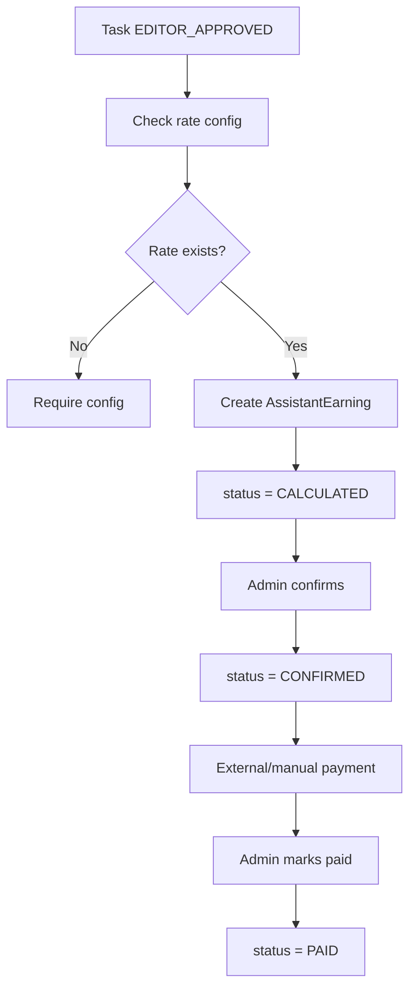

## 1. Tổng quan

Flow 11 mô tả cách hệ thống tính earning cho Assistant sau khi Task được Editor final approved và tracking trạng thái payment.

Payment trong MVP chỉ là tracking. Actual payment được xử lý ngoài hệ thống bởi Admin/Finance.

## 2. Mục tiêu nghiệp vụ

- Tạo earning sau `EDITOR_APPROVED`.
- Gắn earning với Task/Assistant.
- Quản lý trạng thái calculated/confirmed/paid/voided.
- Chặn tính tiền cho Task chưa final approved.
- Hỗ trợ payment tracking MVP mà chưa cần payment gateway.
- Lưu rate snapshot để dữ liệu cũ không bị lệch khi config thay đổi.

## 3. Phạm vi

In scope: earning calculation, earning confirmation, mark paid, void earning, Assistant earning view, admin/finance tracking.

Out of scope: real payment gateway, automatic payout, tax/compliance, invoice export nâng cao.

## 4. Actor tham gia

| Actor | Vai trò |
| --- | --- |
| Assistant | Xem earning của mình |
| Admin/Finance | Confirm earning và mark paid |
| Editor | Approval kích hoạt earning candidate |
| System | Calculate earning dựa trên TaskType rate |
| Mangaka | Không xử lý payment trong MVP |

## 5. Điều kiện bắt đầu / kết thúc

Bắt đầu khi:

```
Task.status = EDITOR_APPROVED
Task.assigneeId exists
TaskType has active rate config
No active earning exists for same task
```

Kết thúc khi earning được `PAID`, `VOIDED` hoặc vẫn pending ở `CALCULATED/CONFIRMED`.

## 6. Entity liên quan

```
AssistantEarning
Task
TaskType
PaymentRateConfig
User
Notification
AuditLog
```

## 7. Task Payment Status

| Status | Ý nghĩa |
| --- | --- |
| NOT_ELIGIBLE | Task chưa đủ điều kiện tính tiền |
| EARNING_CALCULATED | Đã tạo earning |
| PAYMENT_CONFIRMED | Admin/Finance đã confirm |
| PAID | Đã được mark paid sau khi thanh toán ngoài hệ thống |

## 8. AssistantEarning Status

| Status | Ý nghĩa |
| --- | --- |
| CALCULATED | Hệ thống đã tính earning |
| CONFIRMED | Admin/Finance xác nhận |
| PAID | Admin/Finance đánh dấu đã thanh toán ngoài hệ thống |
| VOIDED | Earning bị hủy |

## 9. Step-by-step flow

```
Editor approves Task
↓
Task.status = EDITOR_APPROVED
↓
System checks rate config
↓
System creates AssistantEarning
↓
AssistantEarning.status = CALCULATED
↓
Admin/Finance reviews earning
↓
Admin confirms earning
↓
AssistantEarning.status = CONFIRMED
↓
Payment is made externally/manual
↓
Admin marks paid
↓
AssistantEarning.status = PAID
```

## 10. Revision loop

Flow này không có revision loop production. Correction loop là earning adjustment:

```
Admin finds incorrect earning
↓
Admin voids earning with reason
↓
System records AuditLog
↓
Optional: create corrected earning
```

## 11. Permission Matrix

| Action | Assistant | Admin/Finance | Editor | Mangaka | Board |
| --- | --- | --- | --- | --- | --- |
| --- | ---: | ---: | ---: | ---: | ---: |
| View own earning | Có | Có | Không | Không | Không |
| View all earnings | Không | Có | Optional | Không | Không |
| Confirm earning | Không | Có | Không | Không | Không |
| Mark paid | Không | Có | Không | Không | Không |
| Void earning | Không | Có | Không | Không | Không |

## 12. API đề xuất

```
GET  /api/assistant/earnings
GET  /api/admin/earnings
POST /api/tasks/:taskId/calculate-earning
POST /api/earnings/:earningId/confirm
POST /api/earnings/:earningId/mark-paid
POST /api/earnings/:earningId/void
```

## 13. UI screens đề xuất

```
/app/assistant/earnings
/app/admin/earnings
/app/admin/earnings/:earningId
/app/admin/payment-rates
```

## 14. Notification events

```
EARNING_CALCULATED
EARNING_CONFIRMED
EARNING_PAID
EARNING_VOIDED
```

## 15. Audit log events

```
EARNING_CREATED
EARNING_CONFIRMED
EARNING_MARKED_PAID
EARNING_VOIDED
PAYMENT_RATE_USED
```

## 16. Business rules

- Không tạo earning trước `EDITOR_APPROVED`.
- `MANGAKA_APPROVED` chưa đủ để tính tiền.
- Một Task chỉ có một active earning.
- Rejected/Cancelled Task không tạo earning.
- Rate phải dùng snapshot tại thời điểm earning được tính.
- Payment gateway không bắt buộc trong MVP.
- MangaFlow chỉ tracking earning/payment status trong MVP.
- Actual payment được xử lý ngoài hệ thống bởi Admin/Finance.
- `PAID` nghĩa là Admin/Finance đã mark paid, không có nghĩa app tự chuyển tiền.

## 17. Edge cases

| Case | Expected behavior |
| --- | --- |
| Task chưa Editor approved | Block calculate earning |
| Missing rate config | Mark error / require admin config |
| Duplicate earning | Block duplicate |
| Earning paid rồi void | Require admin reason |
| Rate changed after approval | Existing earning keeps snapshot |
| Payment made outside but not marked paid | Earning remains CONFIRMED |

## 18. Mermaid activity flow



## 19. Acceptance Criteria

- Earning tạo sau Editor approval.
- Assistant xem được earning của mình.
- Admin confirm/mark paid/void được.
- Không tạo duplicate earning cho cùng Task.
- Earning lưu rate snapshot.
- `PAID` là tracking status do Admin/Finance mark.
- Không có payment gateway/autopayout trong MVP.
- AuditLog ghi mọi thay đổi payment status.

## 20. MVP implementation priority

```
1. AssistantEarning model
2. Trigger after EDITOR_APPROVED
3. TaskType rate config
4. Rate snapshot
5. Assistant earning page
6. Admin earning list
7. Confirm earning
8. Mark paid
9. Void earning with reason
10. Notification + AuditLog
```