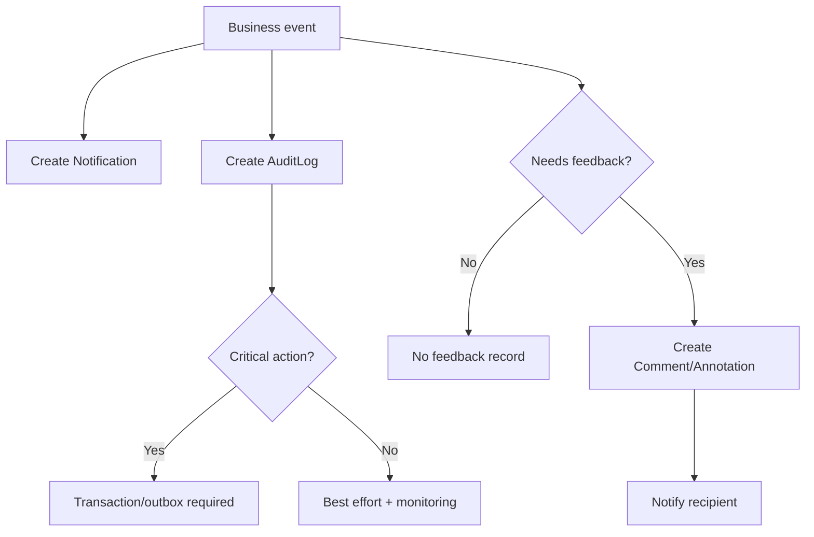

## 1. Tổng quan

Flow 12 mô tả các cơ chế cross-cutting của MangaFlow: Notification, Comment, Annotation và AuditLog. Flow này chạy xuyên suốt các nghiệp vụ khác.

AuditLog là phần đặc biệt quan trọng cho các business action nhạy cảm như Board decision, Editor approval, role change và payment tracking.

## 2. Mục tiêu nghiệp vụ

- Gửi notification cho user đúng thời điểm.
- Cho phép comment/feedback trong Task, Review và Revision.
- Cho phép annotation trên Page/Working Image.
- Ghi AuditLog cho các hành động quan trọng.
- Đảm bảo critical business action không mất audit.
- Không expose internal AuditLog cho user thường.

## 3. Phạm vi

In scope: notification, comment, annotation, audit log, read/unread, resolve/reopen comment, critical audit handling.

Out of scope: chat realtime phức tạp, external email provider nâng cao, analytics nâng cao.

## 4. Actor tham gia

| Actor | Vai trò |
| --- | --- |
| Mangaka | Nhận notification, comment, annotation |
| Assistant | Nhận task/revision notification, comment |
| Editor | Comment, annotation, audit-sensitive actions |
| Board | Board decision actions cần audit |
| Admin | User/config/payment tracking actions cần audit |
| System | Gửi notification, lưu comment/annotation/audit |

## 5. Điều kiện bắt đầu / kết thúc

Bắt đầu khi một business event xảy ra trong bất kỳ flow nào.

```
Task assigned
Submission submitted
Revision requested
Board decision finalized
Earning marked paid
User role changed
```

Kết thúc khi notification/comment/annotation/audit được ghi nhận đúng rule.

## 6. Entity liên quan

```
Notification
Comment
Annotation
AuditLog
User
Task
Submission
Page
Region
Series
BoardDecision
AssistantEarning
```

## 7. Notification Status

| Status | Ý nghĩa |
| --- | --- |
| UNREAD | User chưa đọc |
| READ | User đã đọc |
| ARCHIVED | User đã ẩn/lưu trữ notification |

## 8. Comment / Annotation Status

| Status | Ý nghĩa |
| --- | --- |
| OPEN | Comment/annotation còn cần xử lý |
| RESOLVED | Đã xử lý |
| REOPENED | Đã mở lại sau khi resolved |

## 9. Step-by-step flow

Notification flow:

```
Business event occurs
↓
System identifies recipients
↓
System creates Notification records
↓
User sees unread count/list
↓
User marks read/archive
```

Comment/annotation flow:

```
Reviewer creates feedback
↓
System links feedback to target entity
↓
Recipient receives notification
↓
Feedback is resolved/reopened if needed
```

Audit flow:

```
Business action happens
↓
System writes AuditLog with actor, action, target, metadata
↓
For critical actions: transaction/outbox must ensure audit is not lost
```

## 10. Revision loop

Revision feedback loop:

```
Reviewer requests revision
↓
Comment/Annotation created with feedback
↓
Task/Submission status = REVISION_REQUESTED
↓
Assistant fixes and submits new version
↓
Reviewer resolves or reopens feedback
```

## 11. Permission Matrix

| Action | Admin | Mangaka | Assistant | Editor | Board |
| --- | --- | --- | --- | --- | --- |
| --- | ---: | ---: | ---: | ---: | ---: |
| View own notifications | Có | Có | Có | Có | Có |
| Mark own notification read | Có | Có | Có | Có | Có |
| Create task comment | Optional | Có | Có nếu assigned | Có | Không |
| Create page annotation | Optional | Có | Có nếu assigned | Có | Không |
| Resolve comment | Có | Có nếu owner/reviewer | Có nếu assigned/allowed | Có | Không |
| View AuditLog | Có | Không mặc định | Không | Optional | Optional summary |

## 12. API đề xuất

```
GET    /api/notifications
PATCH  /api/notifications/:notificationId/read
PATCH  /api/notifications/:notificationId/archive
POST   /api/tasks/:taskId/comments
PATCH  /api/comments/:commentId
POST   /api/pages/:pageId/annotations
PATCH  /api/annotations/:annotationId
GET    /api/admin/audit-logs
```

## 13. UI screens đề xuất

```
/app/notifications
/app/tasks/:taskId/comments
/app/mangaka/pages/:pageId/studio
/app/editor/pages/:pageId/studio
/app/admin/audit-logs
```

`Annotation` hiển thị trong Page Studio/Task Studio nhưng entity thật vẫn là `Annotation`.

## 14. Notification events

```
TASK_ASSIGNED
TASK_SUBMITTED
REVISION_REQUESTED
TASK_MANGAKA_APPROVED
TASK_EDITOR_APPROVED
CHAPTER_READY_FOR_PUBLICATION
PUBLICATION_SCHEDULED
CHAPTER_PUBLISHED
SERIES_MARKED_AT_RISK
BOARD_DECISION_FINALIZED
EARNING_CALCULATED
EARNING_PAID
USER_ROLE_UPDATED
```

## 15. Audit log events

```
USER_ROLE_UPDATED
USER_STATUS_UPDATED
SERIES_APPROVED
SERIES_REJECTED
BOARD_DECISION_FINALIZED
TASK_CREATED
TASK_ASSIGNED
SUBMISSION_CREATED
TASK_MANGAKA_APPROVED
TASK_EDITOR_APPROVED
TASK_REVISION_REQUESTED
PUBLICATION_PUBLISHED
SERIES_STATUS_UPDATED_BY_BOARD
EARNING_MARKED_PAID
CONFIG_UPDATED
```

## 16. Business rules

- Notification phải gắn recipient cụ thể.
- Comment phải gắn target rõ ràng: Task, Submission, Page, Region hoặc Series.
- Revision feedback phải link đúng Task/Submission version.
- Annotation coordinates dùng theo Working Image.
- AuditLog phải append-only.
- Internal AuditLog không expose cho user thường.
- Critical business action phải đảm bảo ghi AuditLog bằng transaction hoặc outbox pattern.
- Critical actions gồm Board approve/reject/finalize decision, Editor approve Task, Earning marked paid, User role/status changed, Series cancelled/completed, config updated.

## 17. Edge cases

| Case | Expected behavior |
| --- | --- |
| Notification recipient missing | Do not create invalid notification, log error |
| Comment target missing | Block create comment |
| Annotation coordinate invalid | Block save |
| User tries to view another user's notification | Block |
| AuditLog write fails for critical action | Rollback or outbox retry depending design |
| AuditLog write fails for non-critical action | Monitor and alert; business action may continue if accepted by policy |

## 18. Mermaid activity flow



## 19. Acceptance Criteria

- User thấy notification của mình.
- User không thấy notification của user khác.
- Comment/annotation gắn đúng target.
- Revision feedback gắn đúng submission version.
- AuditLog được ghi cho các action quan trọng.
- Critical action không được mất AuditLog.
- AuditLog không bị sửa/xóa tùy tiện.

## 20. MVP implementation priority

```
1. Notification model
2. Notification list/read/archive
3. Comment model
4. Annotation model
5. Link feedback to Task/Submission/Page/Region
6. AuditLog model
7. AuditLog write helper
8. Critical action transaction/outbox rule
9. Admin audit log viewer
```