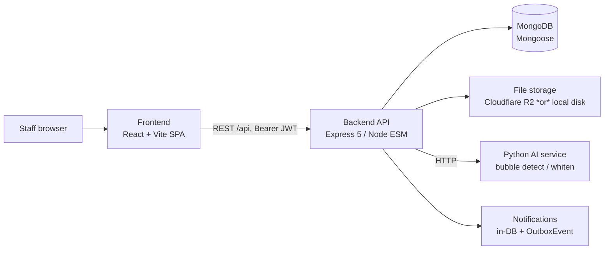
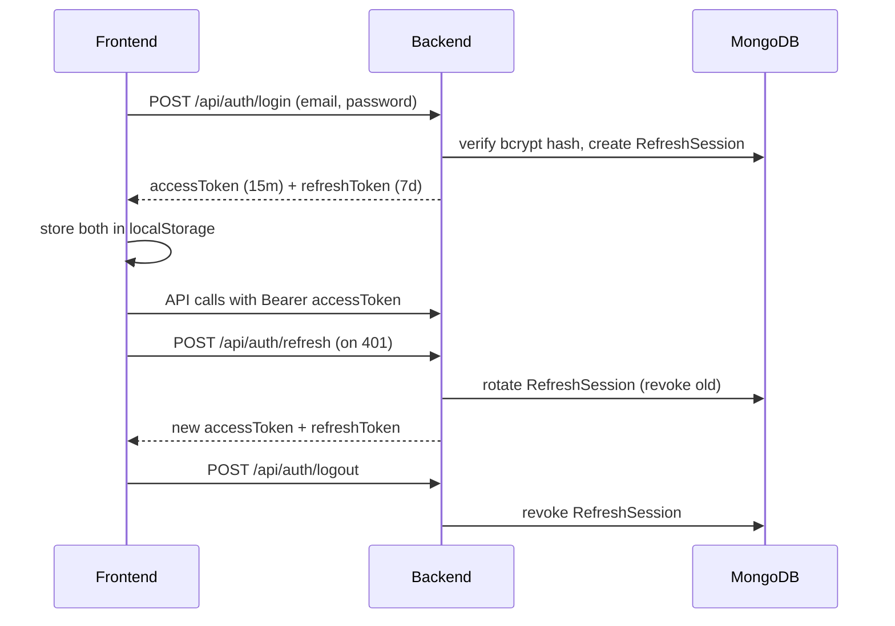
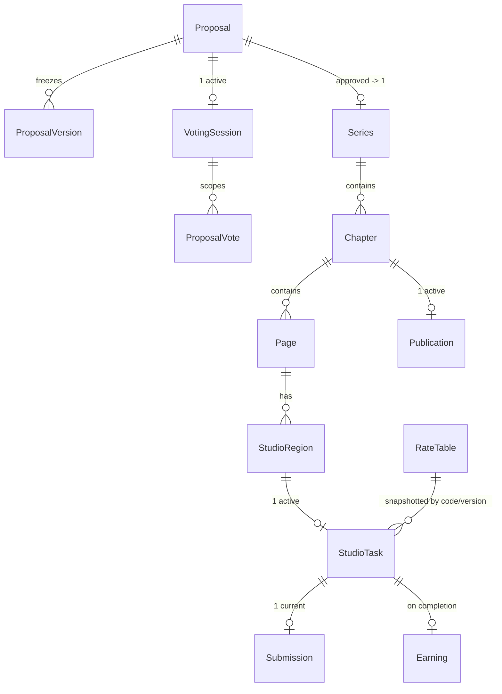

# MangaFlow — Architecture Design

**Type:** Architecture overview (concise, pointer-based)
**Audience:** BA, developers, testers, lecturers
**Canonical workflow source:** [`docs/business-flows/`](business-flows/INDEX.md) (Phase 1 approved)
**Deep current-state inventory:** `docs/superpowers/specs/2026-07-25-current-state-reconstruction-gap-analysis.md` (repository reference; not included in this export)

> **How to read this document.** Each section states enough to stand alone, then
> points to the owning file for detail. Four labels are used throughout:
> **[Implemented]** confirmed in code (with `file:line`); **[Canonical]** the target
> business rule (may differ from code); **[Gap]** a verified divergence
> (`FLOW-GAP-*` / `TECH-FINDING-*`, see the
> [Gap Register](business-flows/INDEX.md#workflow-gap-register)); **[Unresolved]**
> could not be confirmed from code in Phase 1. This document does not modify code.

---

## 1. Purpose and scope

MangaFlow is an **internal tool for a manga production department**: it runs the
pipeline from story proposal through editorial review, board approval, chapter
production, assistant task work, editorial (Tantou) review, and publication, plus
supporting rankings and earnings tracking. Users are staff in five roles (below);
there is no public sign-up — accounts are provisioned by an Administrator
**[Implemented]**. Admin is limited to user account lifecycle, assignment of the
Board Chair designation, managed notifications, read-only dashboards, RateTable
configuration, and dev-only demo data; Admin does not operate editorial, production,
Board, Material, Ranking, payroll or workflow functions **[Implemented — FLOW-GAP-04 /
CT-11 Resolved]**. The boundary is deliberate: **editorial governance** (proposals,
board voting, Tantou review) is separated from **production execution** (regions,
tasks, submissions). Out of scope by design: payroll/payments, accounting,
contract management, public registration. Detail: reconstruction spec §1.

## 2. System context

**Required:** Frontend, Backend, MongoDB, file storage. **Optional / degradable:**
R2 (falls back to local disk when unconfigured), the Python AI service
(`AI_SERVICE_URL`), and any external notification provider — **none exists today**;
notifications are DB rows plus an `OutboxEvent` collection (no external email/push).
**[Implemented]** `app.ts:15-63`, `config/env.ts`.

## 3. Runtime architecture

Single Express app (`app.ts`): `helmet`, `cors({ origin: CLIENT_URL, credentials })`,
`express.json({ limit: "2mb" })`, `cookie-parser`, request-id + structured request
logging, `/health` and `/ready` (Mongo `readyState`) probes, all feature routers
mounted under `/api` (`routes/index.ts`). Persistence is MongoDB via Mongoose models
(`db/models.ts`). File storage is abstracted (`services/r2.service.ts`,
`file-access.service.ts`) with presigned-URL and token-based local upload/display
paths. The AI service is called over HTTP as a proxy (`controllers/ai.controller.ts`).
The server owns a bounded in-process outbox runner (`jobs/outbox-runner.ts`) that
invokes the retry/dead-letter batch processor and a concrete delivery handler
(`services/outbox-delivery.service.ts`). It starts after the HTTP listener is ready
and stops before MongoDB disconnects. Batch size, retry budget, and interval are
configured with `OUTBOX_BATCH_SIZE`, `OUTBOX_MAX_ATTEMPTS`, and `OUTBOX_INTERVAL_MS`.
**[Implemented]**.

## 4. Frontend architecture

React + TanStack Router (file-based routes `src/routes/app.<actor>.*`), TanStack
Query for server state, Vite build. A **single API-contract module**
(`src/shared/api/services.ts`) is the choke-point for every backend call; auth state
and token refresh live in `src/shared/api/client.ts`. Route protection is role-aware
(`/app/<role>/*` sections). Access + refresh tokens are stored in **`localStorage`**
(`client.ts:94,115`) and sent as `Authorization: Bearer`; refresh rotates via
`POST /auth/refresh` (`client.ts:133-138`). Deprecated endpoints are avoided by not
being present in `services.ts`. **[Implemented]**; **[Gap]** token-in-`localStorage`
is XSS-exposed — see §13. Note: `services.ts` is centralised but growing (448 lines) —
a monolith-risk split candidate. Feature-module inventory: reconstruction spec §4.

## 5. Backend architecture

Layering per request: **route** (`routes/*.ts`, role middleware) → **controller**
(`controllers/*.ts`, parse + authorize + shape response) → **service**
(`services/*.ts`, business rules + transactions) → **model** (`db/models.ts`).
Validation is Zod (`validators/*.ts`, `parseBody` uses `safeParse`). Bounded areas:
Authentication, Proposal/editorial review, Board governance, Series & Chapter
production, Studio Regions & Tasks, Submissions, Materials, Files, AI processing,
Comments, Rankings, Earnings, minimal User Administration, Notifications/Outbox — mapped to
endpoints in [INDEX.md](business-flows/INDEX.md). Workflow ownership is now
decomposed by bounded context: Proposal/Board finalization lives in
`proposal-governance.service.ts`, chapter readiness/review in
`chapter-readiness.service.ts`/`chapter-review.service.ts`, Task/Submission in
`task-submission.service.ts`, Publication in `publication.service.ts`, and
earning persistence in `earning.service.ts`. `workflow.service.ts` remains the
compatibility coordinator for Proposal and Chapter state-machine operations.

## 6. Authentication flow

Email/password login (bcrypt) issues a short-lived **access JWT** (`JWT_EXPIRES_IN`,
default 15m) and a **refresh token** (default 7d) backed by a `RefreshSession`
record; refresh **rotates** the session and revokes the prior one; logout revokes the
session; inactive users are rejected. **[Implemented]** `auth.service.ts`,
`config/env.ts`.

Full lifecycle: [01-authentication.md](business-flows/01-authentication.md).
Token storage location is a known gap (§13).

## 7. Authorization model

**Three-layer authorization model** — every protected action passes all three:

1. **Authentication** — valid access JWT (`middleware/auth.ts`).
2. **Role / capability** — role in the allowed set; special flags `isChair` (Board),
3. **Resource ownership / assignment / relationship** — the record-level check.

**[Canonical] examples:** Mangaka **and** owns the Series; Editor **and** is the
assigned Tantou; Assistant **and** is assigned the Task; Board **and** in the active
VotingSession; Board Chair (`isChair`). Tantou is a normal active Editor membership on a Series.

**Canonical Admin boundary [Implemented — FLOW-GAP-04 / CT-11 Resolved]:** Admin may
list, create, update, deactivate and conditionally delete users. User update may
assign `isChair` only to an active BOARD user and
active EDITOR user. At most one active holder of each designation exists. Admin
assigns the designation but cannot execute its workflow actions. Admin also
retains managed notifications (`/admin/notifications*`), read-only dashboards
(`/admin/workflow-summary`, `/admin/storage-summary`), RateTable
(`/admin/rates*`, `MANAGE_RATE_TABLE`), and demo data reset/clear (mounted only
when `NODE_ENV !== "production"`, with a handler-level environment guard as a
backstop). Admin no longer has: materials, payroll, or workflow-override routes
(deleted); rankings import (BOARD only); tantou assign/remove (owning Mangaka only — not
general BOARD); series lifecycle actions (owning Mangaka/assigned Tantou per the
§3.1 matrix in the CT-11 design spec); proposal `RELEASE_CLAIM` (claiming Editor
only) and `ARCHIVE` (owning Mangaka, requires a non-empty `reason`);
file presign-download (resource owner/member/reviewer scope only).
Reusable guard expectations: `assertCanRaiseBlockingComment`,
`assertCanResolveTantouBlockingComment`, `assertCanMutateTask`, etc.
**[Implemented]** Layer-3 authorization is enforced at the workflow boundary:
blocking-comment writes and comment resolve/reopen require the assigned Tantou,
and ownership/assignment failures use specific error codes where the actor has
the relevant role. Pure role/type denials remain `FORBIDDEN`. See the
[Gap Register](business-flows/INDEX.md#workflow-gap-register).

## 8. Domain model overview

Current inventory (grouped; see reconstruction spec §6 for fields/relationships and
`db/models.ts` for schemas):

- **Identity:** User, RefreshSession
- **Editorial:** Proposal, ProposalVersion, VotingSession, ProposalVote, BoardDecision
- **Production:** Series, SeriesMember, Chapter, Page, StudioRegion, StudioTask,
  Submission, StudioComment
- **Assets:** Material, MaterialVersion, Publication
- **Tracking / platform:** Earning, RateTable, Ranking, RankingImport, AiProcessing,
  Notification, OutboxEvent, and historical records where implemented (no canonical Admin audit console)

**[Gap]** Series/Proposal/VotingSession use loose (`strict:false`) schemas with no
status enum; Chapter/Task/Submission/Region are enum-constrained (reconstruction
spec §8). State-machine detail: §9.

## 9. State-machine overview

Summaries only — the business-flow docs own the full status + transition tables:

- **Proposal:** [02-proposal-lifecycle.md](business-flows/02-proposal-lifecycle.md)
- **VotingSession:** [06-board-governance.md](business-flows/06-board-governance.md)
- **Series:** [03-series-lifecycle.md](business-flows/03-series-lifecycle.md)
- **Chapter:** [04-chapter-workflow.md](business-flows/04-chapter-workflow.md)
- **Task / Submission:** [05-assistant-submission.md](business-flows/05-assistant-submission.md)
- **Region:** [14-regions.md](business-flows/14-regions.md)
- **Comment:** [12-comments.md](business-flows/12-comments.md)

Cross-flow principles: the owning Mangaka retains Chapter ownership and canonically
initiates `START_DRAFT`, while Assistants work through Task → Submission; Board tallies
remain provisional until Chair close; the active Board roster contains three to five
seats with a fixed decision threshold of three and is snapshotted per session; finalized
Board approval is the only Series-creation path. Supporting Materials are optional
attachments and do not participate in Chapter readiness or editorial transitions.

## 10. API conventions

**[Implemented]** REST under `/api`; resource + `/actions/:action` endpoints for
state transitions; JSON envelope `{ success, data, message }` (`lib/http.ts`);
Zod validation returning `400 VALIDATION_ERROR`; submissions use `Idempotency-Key`
+ request fingerprint and `expectedCurrentSubmissionId` optimistic concurrency
([05](business-flows/05-assistant-submission.md#submission-error-codes)); deprecated
endpoints return `410 WORKFLOW_REMOVED`. Ownership and submission concurrency
errors now use the canonical `MANGAKA_OWNER_REQUIRED`, `TANTOU_ASSIGNMENT_REQUIRED`,
and `CURRENT_SUBMISSION_CONFLICT` codes. Endpoint catalogue:
[INDEX.md](business-flows/INDEX.md).

## 11. Transaction boundaries

Multi-entity actions run in `runWorkflowTransaction`; external effects
(notifications, AI calls) are **outside** the committed business transaction.

| Action | Atomic set | Detail |
|--------|-----------|--------|
| Board finalization | VotingSession, Proposal, BoardDecision, Series, OutboxEvent | [06](business-flows/06-board-governance.md) |
| Submission approval | Submission, Task | [05](business-flows/05-assistant-submission.md) |
| Task completion (Tantou) | Task, Earning, Page task slot release, OutboxEvent | [05](business-flows/05-assistant-submission.md) |
| Chapter submit for review | readiness validation, Chapter, Pages, review snapshot | [04](business-flows/04-chapter-workflow.md) |
| Task creation | Task, Region assignment, Region lock, active RateTable resolution | [08](business-flows/08-earnings.md), [14](business-flows/14-regions.md) |
| Publication | Publication, Chapter, timestamps, notifications | [04](business-flows/04-chapter-workflow.md) |

**[Implemented]** VotingSession **cancel** runs transactionally with the Proposal
and restores it to `PENDING_BOARD` (FLOW-GAP-02 resolved).

## 12. File and AI processing

**[Implemented]** Presigned R2 upload/download and token-based local upload/display
(`file-token.controller.ts`); storage keys and file ownership scoped by resource;
Material versioning; AI bubble-detect/whiten proxied to the Python service;
AI-created Regions start `DETECTED` and require human confirmation before use
([14](business-flows/14-regions.md), [10](business-flows/10-ai-processing.md)).
**[Canonical]** AI output is never treated as human-approved content; stale AI results
should be invalidated when a Page's file version changes. `OutboxEvent` rows are
written transactionally and the server runner delivers supported event types with
retry/dead-letter semantics. AI-result staleness binding to Page/file version is
partial (reconstruction spec §7, §10).

## 13. Security model

**[Implemented]:** bcrypt password hashing; short access-token expiry + refresh
rotation + session revocation; role + record-level authorization (three layers);
Zod input validation; `helmet`; CORS pinned to `CLIENT_URL` with credentials; secrets
via env with a production guard that rejects default JWT secrets (`config/env.ts:27-36`).

Record-level authorization for blocking-comment write/resolve/reopen and ownership
error taxonomy are implemented in the current branch (CT-01/CT-03/CT-06). Login
and refresh also use a configurable per-IP rate limiter. The remaining security
notes below are accepted deployment risks, not unresolved workflow gaps.

### Accepted Risk — Tokens stored in `localStorage`
- **Current state:** the frontend persists both access and refresh tokens in
  `localStorage` (`src/shared/api/client.ts:94,115`). `localStorage` is **not
  secure storage**.
- **Known risk:** a successful XSS could read the persisted access or refresh token.
- **Reason accepted:** the current course-project/internal-deployment scope accepts
  this to avoid expanding the authentication redesign. An httpOnly refresh-cookie +
  CSRF design is a **non-implemented alternative** for a future public deployment —
  it is **not** implemented today.
- **Revisit triggers:** public production deployment; handling sensitive real-user
  data; introducing third-party scripts; raising the app's security-assurance
  requirements.
- **Backlog treatment:** no CODE-TODO (intentionally accepted); no TECH-FINDING ID.

### Implemented control — Authentication rate limiting
- **Current state:** `POST /api/auth/login` and `POST /api/auth/refresh` use the
  configurable per-IP `authRateLimit` middleware. Limits are controlled by
  `AUTH_RATE_LIMIT_WINDOW_MS` and `AUTH_RATE_LIMIT_MAX`; rejected requests return
  `429 RATE_LIMITED` with `Retry-After`.
- **Verification:** `backend/src/__tests__/rate-limit.test.ts` covers the limiter
  contract and the backend full suite passes.
- **Deployment note:** the bucket store is process-local. Multi-instance
  deployments should replace it with Redis or another shared limiter before
  horizontal scaling.

Distinguish the accepted risks and the actionable gaps above from the implemented
controls. Deeper list: reconstruction spec §12.

## 14. Testing strategy

**[Implemented]** Backend: Vitest + Supertest + `mongodb-memory-server` (single-fork),
covering workflow transitions, authorization, board governance, and validation
guardrails (`backend/src/__tests__/`). Web behavior is covered by Playwright role
flows plus the focused `tests/business-flow-contracts.spec.ts` contract suite
(6/6). **[Gap]** Frontend still has no colocated unit/component tests
(repo-wide: no `src/**/*.test.*`); component behavior is currently verified through
browser contracts and E2E. **Business invariants that must stay tested:** voting
finalize/cancel, task completion → earning, chapter readiness gate, region
one-active-task, blocking-comment gate, canonical comment actions, and the
status-free Supporting Material attachment contract.

## 15. Deployment and environments

**[Implemented]** Node ESM backend (default port 3001) + Vite frontend
(`CLIENT_URL` default `http://localhost:5173`). Storage degrades to **local disk**
when R2 env is unset; R2 used when configured. AI service at `AI_SERVICE_URL`
(default `http://localhost:8000`). Tests use `mongodb-memory-server` (no external DB).
Production guard requires real `MONGO_URI` and non-default JWT secrets
(`config/env.ts:27-36`). Key env vars: `MONGO_URI`, `JWT_*`, `CLIENT_URL`,
`AI_SERVICE_URL`, `R2_*`, `ADMIN_*`.

## 16. Known gaps

Canonical-workflow gaps and general technical debt are tracked in one place —
the [Gap Register](business-flows/INDEX.md#workflow-gap-register)
(FLOW-GAP-01/02/03/04, TECH-FINDING-01…08) — all four FLOW-GAP entries are now
resolved. Architecture-level debt (already
inventoried, reconstruction spec §8/§10/§12): remaining `models.ts` registry
size; loose `strict:false` schemas; `dashboardSummary` full-collection scans;
frontend test coverage; and the explicitly accepted localStorage token risk. The
outbox scheduler (TECH-FINDING-07) is implemented; the remaining
items feed Phase 3
(`CODE-TODO.md`) only where direct code evidence supports them. Token-in-`localStorage`
is an **[Accepted Risk]** (§13), not an actionable TODO.

**[Implemented] Supporting Material simplification.** Material is a versioned,
status-free attachment. Only the owning Mangaka mutates it; Editor/Board access is
read-only and Chapter readiness is independent of attachment state. The legacy-data
migration removes archived records and strips status fields from retained records.
See [07-material-management.md](business-flows/07-material-management.md).

## 17. Architecture decisions

| Decision | Reason | Trade-off | Status | Related |
|----------|--------|-----------|--------|---------|
| Admin is limited to account lifecycle and Board Chair designation | Keeps account administration separate from editorial, production and governance | Admin workflow routes remain restricted | Implemented | [INDEX](business-flows/INDEX.md) |
| Finalized Board approval auto-creates at most one production Series; public manual creation is removed | Preserves one governance gate and one source of truth | Legacy `PLANNING` records require migration handling | Implemented | [02](business-flows/02-proposal-lifecycle.md), [03](business-flows/03-series-lifecycle.md) |
| Assistant works only through Task → Submission | Clear ownership; Mangaka owns the Chapter | Extra indirection for small edits | Implemented | [05](business-flows/05-assistant-submission.md) |
| Tantou (assigned Editor) owns editorial review | Accountable single reviewer per Series | Assignment must remain enforced on every mutation | Implemented | [12](business-flows/12-comments.md) |
| Board Chair finalizes voting outcomes | One authority closes a session | Chair availability bottleneck | Implemented | [06](business-flows/06-board-governance.md) |
| Board sessions snapshot three to five active seats and use a fixed decision threshold of three | Prevents hard-coded demo identities and keeps in-progress sessions stable | Roster expansion requires revisiting the threshold | Implemented | [06](business-flows/06-board-governance.md) |
| Mangaka alone mutates Chapter/Page evidence; Tantou reviews a frozen snapshot | Enforces separation of production and approval duties | Editor corrections require a revision request | Implemented | [04](business-flows/04-chapter-workflow.md), [13](business-flows/13-pages.md) |
| `ADDRESSED` allows resubmission, while only `RESOLVED` allows approval | Separates creator attestation from reviewer verification | Adds one explicit Tantou verification step | Implemented | [12](business-flows/12-comments.md) |
| `MARK_READY` is removed; `EDITOR_APPROVE` is the sole readiness transition | Prevents bypassing snapshots, tasks, materials, and comments | No emergency editorial bypass | Implemented | [04](business-flows/04-chapter-workflow.md) |
| Scheduling lives on Publication, not Chapter | Separates "ready" from "when published" | Two entities to reason about | Implemented | [04](business-flows/04-chapter-workflow.md) |
| AI output requires human confirmation | AI is assistive, not authoritative | Manual confirm step | Implemented | [10](business-flows/10-ai-processing.md) |
| Earnings are tracking, not payroll | Internal scope; no payments | No settlement/tax | Implemented | [08](business-flows/08-earnings.md) |
| RateTable is an Admin-only configuration boundary; Tasks snapshot rates at creation | Keeps monetary policy out of client/task mutation and preserves historical earnings | Production must configure real amounts; future Operations role can receive the capability | Implemented | [08](business-flows/08-earnings.md) |
| Single in-process app, no worker | Simplicity for a student-sized system | Outbox not externally dispatched | Implemented w/ gap | §3, §12 |
| Auth hardening (login/refresh rate limiting) | Reduces credential-guessing risk with a small bounded control | Process-local buckets do not coordinate across instances | Implemented; shared store needed before horizontal scaling | §13 |
