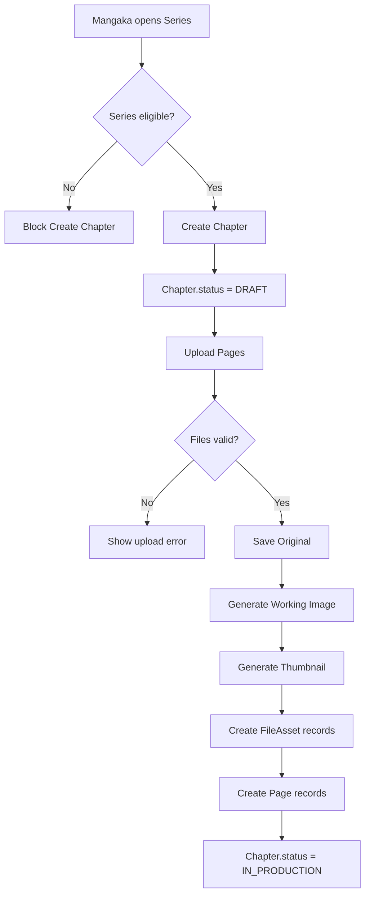

## 1. Tổng quan

Flow 02 mô tả quá trình Mangaka tạo Chapter chính thức và upload Page production sau khi Series đã được Board approve.

Điểm chốt của flow:

```
1 Page upload vào
↓
System lưu/tạo 3 file chính:
Original
Working Image
Thumbnail
```

`Working Image` dùng chung cho Page Studio và AI để tránh tạo trùng `Preview` và `AI processing copy`.

## 2. Mục tiêu nghiệp vụ

- Cho phép Mangaka tạo Chapter cho Series đã approved.
- Block tạo Chapter nếu Series chưa có `publicationType` chính thức.
- Cho phép Mangaka upload Page production.
- Lưu Original để bảo toàn chất lượng.
- Tạo Working Image cho Page Studio và AI.
- Tạo Thumbnail cho grid/list.
- Chuẩn bị Page cho Region, AI segmentation và Task Assignment ở flow sau.
- Giữ Production Hub là UI layer, không phải core entity.

## 3. Phạm vi

In scope: create Chapter, upload Page, validate file, save Original, generate Working Image, generate Thumbnail, create Page/FileAsset records, update Chapter status.

Out of scope: Region creation, AI execution, Production Team setup, Task Assignment, Assistant Submission, Editor final approval, Publication, Workspace entity management.

## 4. Actor tham gia

| Actor | Vai trò |
| --- | --- |
| Mangaka | Tạo Chapter, upload Page, reorder/delete page trước task |
| Tantou Editor | Monitor progress |
| System | Validate, store files, generate images, create records |
| Assistant | Chưa tham gia |
| Editorial Board | Không vote từng Chapter trong MVP |

## 5. Điều kiện bắt đầu / kết thúc

Bắt đầu khi Mangaka mở một Series đủ điều kiện production.

Preconditions:

```
User.role = MANGAKA
Series.status in [APPROVED, ONGOING, AT_RISK]
Series.publicationType in [WEEKLY, MONTHLY]
Series.status != CANCELLED
Series.status != COMPLETED
```

Kết thúc thành công khi:

```
Chapter.status = IN_PRODUCTION
Page.status = UPLOADED
Page has originalFileAssetId, workingFileAssetId, thumbnailFileAssetId
```

Kết thúc thất bại khi validation hoặc processing file lỗi.

## 6. Entity liên quan

```
Series
Chapter
Page
FileAsset
Notification
AuditLog
```

Không phải core entity trong MVP:

```
Workspace
Production Hub
```

`Production Hub` là UI aggregate của Series, không phải database entity.

## 7. Chapter Status

| Status | Ý nghĩa |
| --- | --- |
| DRAFT | Chapter mới tạo, chưa có page |
| IN_PRODUCTION | Chapter đã có page và đang production |
| READY_FOR_PUBLICATION | Chapter đủ điều kiện publish |
| PUBLISHED | Chapter đã xuất bản |
| ARCHIVED | Chapter không còn active |

Flow này dùng chính: `DRAFT`, `IN_PRODUCTION`.

## 8. Page Status

| Status | Ý nghĩa |
| --- | --- |
| UPLOADING | File đang upload/xử lý |
| UPLOADED | Page có đủ Original/Working/Thumbnail, sẵn sàng mở Page Studio và tạo Region |
| PROCESSING_FAILED | Lỗi tạo Working Image hoặc Thumbnail |
| TASK_ASSIGNED | Page đã có Task |
| IN_PROGRESS | Task đang làm |
| UNDER_REVIEW | Submission đang review |
| APPROVED | Page approved |

MVP không dùng `READY_FOR_REGION` riêng. `UPLOADED` đã đồng nghĩa với việc Page có đủ Original + Working Image + Thumbnail và đủ điều kiện mở Page Studio.

## 9. Step-by-step flow

```
Mangaka opens approved Series
↓
System checks Series gate
↓
Mangaka clicks Create Chapter
↓
System creates Chapter
↓
Chapter.status = DRAFT
↓
Mangaka uploads Page files
↓
Frontend pre-validates files
↓
Backend validates permission + files
↓
System saves Original
↓
System generates Working Image
↓
System generates Thumbnail
↓
System creates FileAsset records
↓
System creates Page records
↓
Chapter.status = IN_PRODUCTION
↓
Page appears in Chapter page grid
```

## 10. Revision loop

Flow này không có revision loop nội dung. Loop tương ứng là upload/process retry khi file processing fail.

```
Upload/process failed
↓
System shows failed reason
↓
Mangaka retries upload or system retries processing
↓
If success, Page.status = UPLOADED
```

Nếu chưa có background worker, MVP nên rollback toàn bộ upload khi processing fail.

## 11. Permission Matrix

| Action | Mangaka | Co-Mangaka | Editor | Board | Assistant | Admin |
| --- | --- | --- | --- | --- | --- | --- |
| --- | ---: | ---: | ---: | ---: | ---: | ---: |
| Create Chapter | Có | Có nếu có quyền | Optional | Không | Không | Optional |
| Upload Page | Có | Có nếu có quyền | Optional | Không | Không | Optional |
| Reorder Page | Có | Có nếu có quyền | Optional | Không | Không | Optional |
| Delete Page before task | Có | Có nếu có quyền | Optional | Không | Không | Optional |
| View progress | Có | Có | Có | Summary only | Không mặc định | Có |
| Open Production Hub | Có | Có nếu có quyền | Có nếu có quyền | Summary only | Không mặc định | Có |

## 12. API đề xuất

```
POST   /api/series/:seriesId/chapters
GET    /api/series/:seriesId/chapters
GET    /api/chapters/:chapterId
PATCH  /api/chapters/:chapterId
POST   /api/chapters/:chapterId/pages/upload
GET    /api/chapters/:chapterId/pages
GET    /api/pages/:pageId
PATCH  /api/chapters/:chapterId/pages/reorder
DELETE /api/pages/:pageId
GET    /api/file-assets/:fileAssetId/signed-url
```

## 13. UI screens đề xuất

```
/app/mangaka/series/:seriesId/overview
/app/mangaka/series/:seriesId/chapters
/app/mangaka/series/:seriesId/chapters/create
/app/mangaka/chapters/:chapterId
/app/mangaka/chapters/:chapterId/pages/upload
/app/editor/chapters/:chapterId/progress
```

Naming rule:

```
Production Hub = Series-level UI aggregate
Page Studio = Page-level UI screen
Task Studio = Task-level UI screen
```

## 14. Notification events

```
CHAPTER_CREATED
PAGES_UPLOADED
PAGE_PROCESSING_FAILED
CHAPTER_ENTERED_PRODUCTION
PAGE_DELETED
PAGES_REORDERED
```

## 15. Audit log events

```
CHAPTER_CREATED
CHAPTER_UPDATED
PAGE_UPLOAD_STARTED
PAGE_ORIGINAL_UPLOADED
PAGE_WORKING_IMAGE_GENERATED
PAGE_THUMBNAIL_GENERATED
PAGE_UPLOADED
PAGE_PROCESSING_FAILED
PAGE_DELETED
PAGES_REORDERED
CHAPTER_ENTERED_PRODUCTION
```

## 16. Business rules

- Chỉ Series approved/ongoing/at-risk mới tạo Chapter được.
- Series bắt buộc có `publicationType`.
- Board không vote từng Chapter trong MVP.
- Chapter lấy `publicationTypeSnapshot` từ Series.
- Sau khi Page upload confirm thành công lần đầu, Series tự chuyển `APPROVED` sang `ONGOING`.
- Original không resize/overwrite.
- Working Image dùng cho Page Studio và AI.
- Không tạo riêng Preview và AI copy trong MVP.
- Assistant không thấy Page chỉ vì Page đã upload.
- Page delete/reorder nên block nếu đã có Task.
- Production Hub chỉ là UI aggregate của Series, không phải core entity.
- Không tạo Workspace entity trong MVP.

## 17. Edge cases

| Case | Expected behavior |
| --- | --- |
| Series chưa approved | Block create Chapter |
| Series thiếu publicationType | Block create Chapter |
| Chapter number trùng | Block |
| Upload quá 50 files | Block batch |
| File > max size | Block |
| Unsupported file type | Block |
| Storage fail | Rollback hoặc PROCESSING_FAILED |
| Working Image fail | Rollback hoặc retry |
| Reorder sau khi có Task | MVP block |
| Delete Page đã có Task | Block |

## 18. Mermaid activity flow



## 19. Acceptance Criteria

- Mangaka chỉ tạo Chapter khi Series đủ điều kiện.
- Chapter tạo ra ở `DRAFT`.
- Upload Page tạo đủ Original/Working/Thumbnail.
- Page record có 3 fileAsset IDs.
- Không tạo AI copy riêng.
- Chapter có Page chuyển `IN_PRODUCTION`.
- Page `UPLOADED` mở được Page Studio ở Flow 04.
- Assistant chưa thấy Page nếu chưa được assign Task.
- Không có dependency vào Workspace entity trong MVP.

## 20. MVP implementation priority

```
1. Series gate for Chapter create
2. Chapter CRUD basic
3. Chapter number uniqueness
4. Page upload API
5. File validation
6. Store Original
7. Generate Working Image
8. Generate Thumbnail
9. Create Page records
10. Update Chapter to IN_PRODUCTION
11. Page grid UI
12. Editor read-only progress
13. AuditLog + Notification
```

## 21. Current implementation: submit chapter branches

This flow supports two production branches after Board approval and page upload.
Assistant work is optional production support, not a mandatory Chapter gate.

Branch A: Assistant-assisted production

```
Mangaka/Editor creates Page-level or Region-level Tasks
Assistant submits Task work
Mangaka approves the Submission
Editor final-approves the Submission
Existing/required Tasks are resolved before readiness/publication
```

Branch B: Direct final-page upload

```
Mangaka uploads completed/final pages produced outside the system
No Assistant Task is required
Mangaka sends the Chapter to Tantou Editor review
Uploaded Page assets become the reviewable Chapter package
```

`POST /api/chapters/:chapterId/send-to-editor` is a Chapter handoff/readiness
validation endpoint. It does not create Assistant submissions and does not
require `Submission.status = MANGAKA_APPROVED` for Branch B.

Current route references:

```
POST /api/chapters/:chapterId/send-to-editor
POST /api/chapters/:chapterId/mark-ready
```

Additional acceptance criteria:

- A Chapter with final uploaded pages can be sent to Editor without creating Assistant Tasks.
- Assistant cannot see uploaded pages unless assigned through a Task.
- If Tasks exist, they must be resolved through the Task/Submission lifecycle before publication readiness.

## 22. Current implementation: versioned Chapter submit

Direct final-page upload now has a versioned review package after page upload:

```
POST /api/chapters/:chapterId/review-versions
GET  /api/chapters/:chapterId/review-versions
```

Each submit creates a new immutable `ChapterVersion` (`v1`, `v2`, `vN`) with
page snapshots. Older versions are not overwritten. `send-to-editor` remains a
handoff/readiness validation endpoint and does not create `ChapterVersion`.

Acceptance criteria:

- No Assistant Task is required when pages are already final.
- Every Mangaka submit creates a new version.
- Version snapshots are the package Editor reviews.
