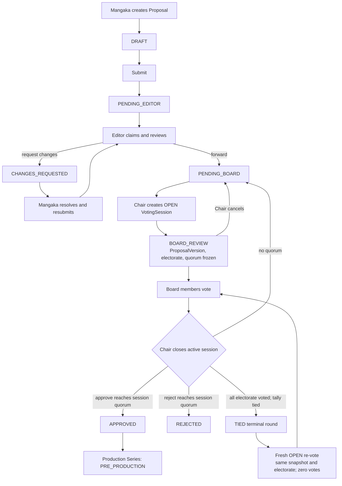

# Proposal Lifecycle

## Description

A Mangaka creates and submits a Proposal, an Editor reviews it, and the Board decides it through
snapshotted VotingSessions. Approval creates a production Series; rejection ends the Proposal.

## Flowchart

## Status Values

| Status | Description |
|--------|-------------|
| `DRAFT` | Mangaka-created, not yet submitted. |
| `PENDING_EDITOR` / `EDITOR_REVIEWING` / `CHANGES_REQUESTED` | Editorial review stages. |
| `PENDING_BOARD` | Editor forwarded the Proposal; awaiting an active session. |
| `BOARD_REVIEW` | An `OPEN` VotingSession is active. It remains so while a fresh re-vote opens after a tie. |
| `APPROVED` | Board approval; creates the production Series. |
| `REJECTED` | Editorial or Board rejection. |
| `WITHDRAWN` / `ARCHIVED` | Author withdrawal or allowed archive action. |

`TIED` is a VotingSession status, not a Proposal status. It is terminal audit history and is
immediately followed by a linked fresh `OPEN` round; the Proposal stays in `BOARD_REVIEW`.

## Board quorum and session integrity

Each session snapshots its ProposalVersion, eligible Board electorate, and quorum at opening.
Votes require the active session id and its expected version when supplied by the client. Closing
uses that session quorum. A complete tied electorate closes as `TIED` and creates an `OPEN`
re-vote with the same snapshots and no copied votes; the Proposal's active-session pointers move
to that new session.

## Role Access

| Action | Allowed Roles |
|--------|--------------|
| Submit, withdraw, edit, resubmit | Owning MANGAKA |
| Claim, request changes, forward, reject, recall | EDITOR (subject to workflow guard) |
| Create/close/cancel Board session | BOARD Chair |
| Vote in active Proposal round | BOARD, against the `OPEN` session only |
| View historical `TIED` or `TIE_BREAK_REQUIRED` record | BOARD, EDITOR |

## Invariants

- A Proposal has at most one active `OPEN` VotingSession.
- A Board member has at most one vote per VotingSession.
- A vote uses the active session id; historical `TIED`, `CANCELLED`, and legacy
  `TIE_BREAK_REQUIRED` sessions cannot receive new votes.
- The ProposalVersion, electorate, and quorum are immutable during a round.

## Historical compatibility

Existing `TIE_BREAK_REQUIRED` Proposal/session records remain readable for audit and display.
They do not authorize new weighted special-editor tie-break requests. All new tied Proposal rounds become
terminal `TIED` history and receive a fresh `OPEN` Board re-vote.
