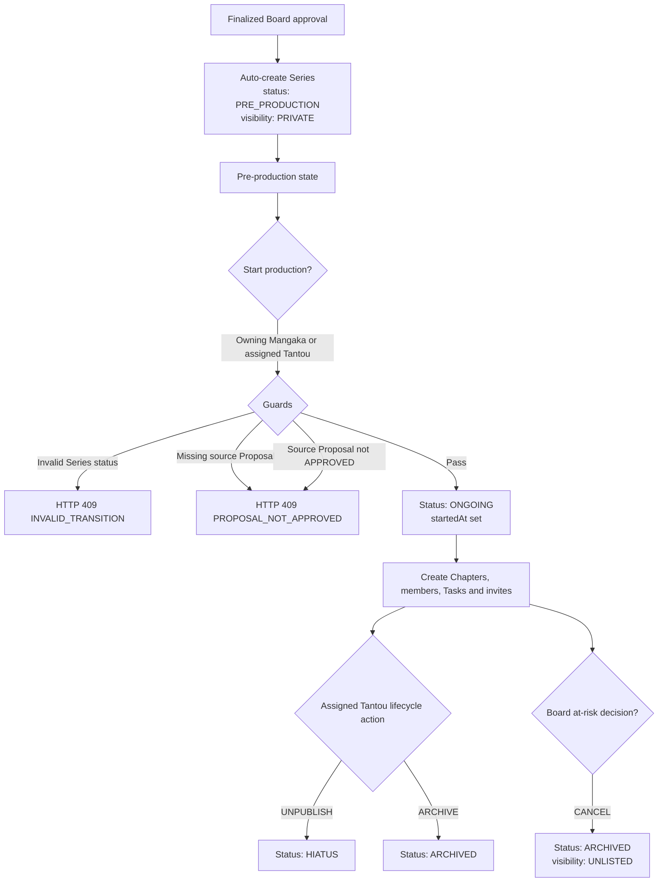

# Series Lifecycle

## Description
A Series enters the system only when Board approval is finalized. The approval
transaction idempotently creates one `PRE_PRODUCTION` Series for the approved
Proposal. There is no manual `POST /api/series` creation path.

The owning Mangaka manages production content. The assigned Tantou controls editorial
lifecycle actions such as hiatus and archive. Admin does not operate the Series lifecycle.

## Flowchart

## Status Values

| Status | Description |
|---|---|
| `PRE_PRODUCTION` | Auto-created from an approved Proposal |
| `PLANNING` | Legacy data state retained for migration compatibility; new Series are not created in this state |
| `ONGOING` | Production active |
| `HIATUS` | Temporarily unpublished by the assigned Tantou |
| `COMPLETED` | Production complete |
| `ARCHIVED` | Lifecycle closed and retained |

## Lifecycle transition guard

The action endpoint validates the current status before checking the actor permission.
The supported transitions are:

| Current status | Action | Next status | Actor |
|---|---|---|---|
| `PLANNING`, `PRE_PRODUCTION` | `START_PRODUCTION` | `ONGOING` | Owning Mangaka or assigned Tantou |
| `ONGOING`, `PUBLISHED`, `PUBLIC` | `UNPUBLISH` | `HIATUS` | Assigned Tantou only |
| `PLANNING`, `PRE_PRODUCTION`, `ONGOING`, `PUBLISHED`, `PUBLIC` | `ARCHIVE` | `ARCHIVED` | Owner/Tantou before publication; Tantou only after publication |

`ARCHIVED` cannot transition again. `HIATUS` cannot be archived or unpublished through
these actions. Therefore transitions such as `PRE_PRODUCTION → HIATUS`,
`HIATUS → ARCHIVED`, and `ARCHIVED → HIATUS` return `409 INVALID_TRANSITION`.

## Series Visibility
`PRIVATE`, `PUBLIC`, `UNLISTED`, `ARCHIVED` control reader-facing availability.

## Creation Paths

### Approved-Proposal path
`ensureProductionSeriesForApprovedProposal()` creates or finds one Series by
`sourceProposalId`, copies the approved Proposal data, sets `PRE_PRODUCTION`, and
stores the Board-approved publication cadence. The operation is idempotent.

### Legacy `PLANNING` records
Existing records may still carry `PLANNING` during migration. They must reference
an approved source Proposal before `START_PRODUCTION`; the public creation route
has been removed.

## Role Access

| Action | Current implementation | Canonical actor and guard |
|---|---|---|
| Create | System transaction | Finalized Board approval auto-creates at most one Series |
| Patch | MANGAKA, assigned EDITOR | Owning Mangaka or assigned Tantou |
| `START_PRODUCTION` | Owning Mangaka or assigned Tantou | Requires approved source Proposal; `ADMIN` removed (FLOW-GAP-04 — Resolved) |
| `UNPUBLISH` | Assigned Tantou only | `ADMIN` and general grant removed (FLOW-GAP-04 — Resolved) |
| `ARCHIVE` | Owner or assigned Tantou while never published; assigned Tantou only once published | A published Series may only be archived by its Tantou; `ADMIN` removed (FLOW-GAP-04 — Resolved) |
| Delete | Owning Mangaka (private/no-related-data guard) | `ADMIN` removed (FLOW-GAP-04 — Resolved) |

## Canonical Decision — FLOW-GAP-04 (Resolved)
> **Series retention update:** self-delete is no longer supported. A Board-approved Series
> remains linked to its Proposal for audit; Board governance owns cancellation. The Delete
> row above describes the retired soft-delete behavior.

Series routes no longer accept `ADMIN` for any lifecycle action. Admin is limited to
user account lifecycle and Board Chair designation management. Series lifecycle
permissions belong to the owning Mangaka and assigned Tantou, enforced by the
per-action matrix above (`series.controller.ts:270-384`). Implemented by CT-11.

## Invariants
- An approved Proposal creates at most one production Series.
- Manual creation does not bypass Proposal approval.
- No workflow actor can delete a Series; the approved Proposal-Series link is retained for audit.
- Assistant participation is through Series membership and Task assignment, not Series ownership.

## Key Files
- `backend/src/controllers/series.controller.ts:102-403` — CRUD and lifecycle
- `backend/src/services/workflow.service.ts:201-278` — auto-create from Proposal
- `backend/src/routes/series.routes.ts` — route registration
- `backend/src/validators/series.schema.ts` — validation
- `backend/src/db/models.ts:410-486` — Series model

## Error Codes
| Code | HTTP | Condition |
|---|---:|---|
| `PROPOSAL_REQUIRED` | 400 | No Proposal ID |
| `PROPOSAL_NOT_APPROVED` | 409 | Source Proposal missing or not approved |
| `PROPOSAL_ALREADY_PROMOTED` | 409 | Series already exists for the Proposal |
| `INVALID_TRANSITION` | 409 | Wrong lifecycle state |
| `FORBIDDEN` | 403 | Actor lacks record-level permission |
| `SERIES_NOT_FOUND` | 404 | Series does not exist |
