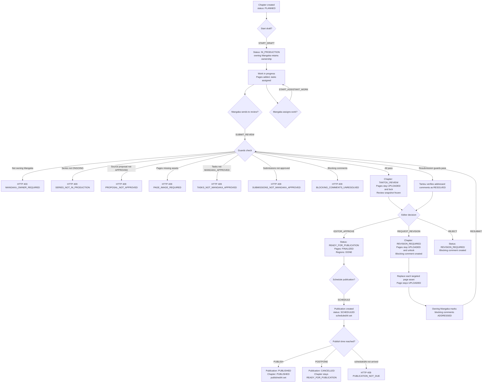

# Chapter Workflow

## Description
Chapters go through a canonical lifecycle: PLANNED -> IN_PRODUCTION -> TANTOU_REVIEW
-> REVISION_REQUIRED (loop) -> READY_FOR_PUBLICATION -> PUBLISHED.
Scheduling lives on the Publication entity, not on the chapter itself.
Chapters follow the lifecycle of their parent Series and are never archived independently.

## Delivery plan dates

When creating or updating a Chapter, the Mangaka may optionally set a delivery
plan. `draftDueAt` means **the draft is ready to hand off to Tantou**;
`reviewDueAt` means **Tantou review is complete**. They are planning signals,
not workflow gates: a Chapter can be created without either date.

When both are present, the review date must be at least one full day after the
draft-ready date. Each date must be a valid ISO timestamp and may not be in the
past. The same rule is applied to `PATCH /api/chapters/:chapterId` after merging
the request with the stored date, so a one-field edit cannot silently create an
impossible plan.

## Tantou Review Canvas

During `TANTOU_REVIEW`, the assigned Tantou can open **Review Canvas** and pin
feedback directly on a Page. A pin stores its Page target and normalized `x/y`
coordinates, and can be marked blocking when it must be resolved before chapter
approval. This is editorial evidence on the frozen Review Snapshot: it never
grants access to upload or replace Page assets, or to create, edit, or delete
production Regions. The owning Mangaka remains responsible for production
changes after a revision is requested.

## Flowchart



## Status Values (from `backend/src/types.ts:112-119`)

| Status | Description |
|--------|-------------|
| `PLANNED` | Chapter created, not started |
| `IN_PRODUCTION` | Active work in progress |
| `TANTOU_REVIEW` | Sent to Editor (Tantou) for review |
| `REVISION_REQUIRED` | Editor requested changes |
| `READY_FOR_PUBLICATION` | Approved, awaiting schedule/publish |
| `PUBLISHED` | Published |

## Chapter Actions (from `backend/src/types.ts:121-134`)

`START_DRAFT`, `START_ASSISTANT_WORK`, `SUBMIT_REVIEW`, `REQUEST_REVISION`,
`REJECT`, `RESUBMIT`, `EDITOR_APPROVE`, `SCHEDULE`, `POSTPONE`,
`PUBLISH`, `PUBLISH_EARLY`, `REASSIGN`

## Role Access

| Action | Allowed Roles | Guard |
|--------|--------------|-------|
| START_DRAFT | Owner (assigneeId matches) | `workflow.service.ts:1711` |
| SUBMIT_REVIEW, RESUBMIT | **Owning MANGAKA only** (`series.authorId`) | `chapter-review.service.ts` |
| START_ASSISTANT_WORK | EDITOR, MANGAKA | `workflow.service.ts:1712` |
| REQUEST_REVISION, REJECT | EDITOR (assigned Tantou) | `workflow.service.ts:1713-1714` |
| EDITOR_APPROVE | EDITOR (assigned Tantou); current frozen snapshot and all blockers `RESOLVED` | `workflow.service.ts` |
| SCHEDULE, POSTPONE, PUBLISH | EDITOR | `publication.service.ts` |
| REASSIGN | EDITOR | `workflow.service.ts` |

## Self-Approval Block
Editor cannot review their own production chapter (`workflow.service.ts:1748-1753`):
```
if (series.authorId === actor.id) throw 403 SELF_APPROVAL_BLOCKED
```

`MARK_READY` was removed because it bypassed the frozen review snapshot,
assistant-task readiness and blocking-comment verification.
`EDITOR_APPROVE` is the only path into `READY_FOR_PUBLICATION`.

### Page revision replacement

`REQUEST_REVISION` and `REJECT` move only the Chapter to `REVISION_REQUIRED`.
Pages remain `UPLOADED`; the blocking Page/Region comment identifies which
asset needs work. The owning Mangaka replaces that existing asset through
`PATCH /api/pages/:pageId`, preserving its Page ID and order.

The Mangaka then marks the Tantou's blocking comment `ADDRESSED` and uses
`RESUBMIT`. `ADDRESSED` is sufficient to return work to Tantou review, but it is
not sufficient for approval. The assigned Tantou must verify the fix by changing
the comment to `RESOLVED`; only then can `EDITOR_APPROVE` move the Chapter to
`READY_FOR_PUBLICATION`.

While the Chapter is `TANTOU_REVIEW`, Page creation, deletion, reorder, asset
replacement and Page AI writes return `409 CHAPTER_REVIEW_LOCKED`. New Page
Tasks and additional Assistant submissions are blocked by the same invariant.

## Canonical Decisions & Required Code Changes

### Chapter submission authority (canonical — already enforced)
Only the owning Mangaka may submit or resubmit a whole Chapter to Tantou review.
`sendChapterToEditorReview` (`chapter-review.service.ts`) enforces `role === MANGAKA`
(`:1409`) **and** `series.authorId === actor.id` (`:1422`, `MANGAKA_OWNER_REQUIRED`).
Assistants work only through Page Task → Submission; regions are annotations, not
assignment units. They cannot submit the
Chapter. **No FLOW-GAP** — earlier docs that listed "Mangaka/Assistant" here were
inaccurate and are corrected above.

> `applyChapterAction` delegates SUBMIT_REVIEW/RESUBMIT only when the actor is the
> owning Mangaka and returns `MANGAKA_OWNER_REQUIRED` for a non-owning Mangaka.
> Assigned chapter access alone is not sufficient to submit the whole Chapter.

### Supporting Materials do not gate review
Supporting Materials are optional attachments. Chapter readiness depends on Pages,
required Assistant Tasks/Submissions, blocking Comments, and the frozen review
snapshot. It never depends on a Material status or attachment count. See
[07-material-management.md](07-material-management.md).

### TECH-FINDING-06 — Generic `FORBIDDEN` vs ownership codes
**Status: Resolved.** The affected ownership/assignment failures now use the
specific codes (`MANGAKA_OWNER_REQUIRED`, `TANTOU_ASSIGNMENT_REQUIRED`,
`TASK_NOT_ASSIGNED`) while pure role/type denials remain `FORBIDDEN`. The chapter
action, comment, and submission-review paths are covered by the authorization
perimeter tests. → `CODE-TODO` P2 (Done).

## Key Files
- `backend/src/services/chapter-review.service.ts` � `sendChapterToEditorReview()`
- `backend/src/services/workflow.service.ts:1666-2079` � `applyChapterAction()`
- `backend/src/controllers/series.controller.ts:647-881` � chapter/page routes
- `backend/src/routes/series.routes.ts:71-99` � chapter + page routes
- `backend/src/db/models.ts:488-594` � ChapterRecord, chapterSchema
