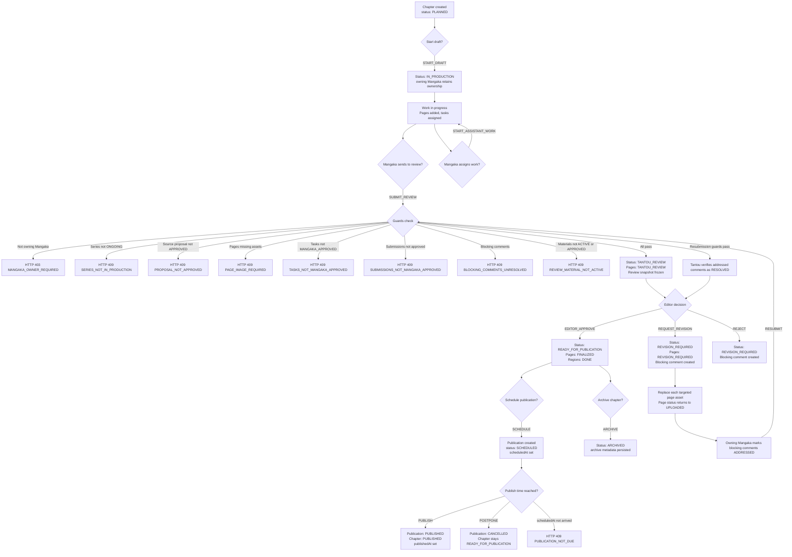

# Chapter Workflow

## Description
Chapters go through a canonical lifecycle: PLANNED -> IN_PRODUCTION -> TANTOU_REVIEW
-> REVISION_REQUIRED (loop) -> READY_FOR_PUBLICATION -> PUBLISHED (+ ARCHIVED).
Scheduling lives on the Publication entity, not on the chapter itself.

## Flowchart



## Status Values (from `backend/src/types.ts:112-119`)

| Status | Description |
|--------|-------------|
| `PLANNED` | Chapter created, not started |
| `IN_PRODUCTION` | Active work in progress |
| `TANTOU_REVIEW` | Sent to Editor (Tantou) for review |
| `REVISION_REQUIRED` | Editor requested changes |
| `READY_FOR_PUBLICATION` | Approved, awaiting schedule/publish |
| `PUBLISHED` | Published |
| `ARCHIVED` | Archived |

## Chapter Actions (from `backend/src/types.ts:121-134`)

`START_DRAFT`, `START_ASSISTANT_WORK`, `SUBMIT_REVIEW`, `REQUEST_REVISION`,
`REJECT`, `RESUBMIT`, `EDITOR_APPROVE`, `SCHEDULE`, `POSTPONE`,
`PUBLISH`, `REASSIGN`, `ARCHIVE`

`ARCHIVE` persists `status: ARCHIVED` and archive metadata. It is available to
the assigned Tantou Editor for any non-archived chapter; repeated archive
attempts return `409 INVALID_TRANSITION`.

## Role Access

| Action | Allowed Roles | Guard |
|--------|--------------|-------|
| START_DRAFT | Owner (assigneeId matches) | `workflow.service.ts:1711` |
| SUBMIT_REVIEW, RESUBMIT | **Owning MANGAKA only** (`series.authorId`) | `chapter-review.service.ts` |
| START_ASSISTANT_WORK | EDITOR, MANGAKA | `workflow.service.ts:1712` |
| REQUEST_REVISION, REJECT | EDITOR (assigned Tantou) | `workflow.service.ts:1713-1714` |
| EDITOR_APPROVE | EDITOR (assigned Tantou); current frozen snapshot and all blockers `RESOLVED` | `workflow.service.ts` |
| SCHEDULE, POSTPONE, PUBLISH | EDITOR | `publication.service.ts` |
| REASSIGN, ARCHIVE | EDITOR | `workflow.service.ts:1731-1732` |

## Self-Approval Block
Editor cannot review their own production chapter (`workflow.service.ts:1748-1753`):
```
if (series.authorId === actor.id) throw 403 SELF_APPROVAL_BLOCKED
```

`MARK_READY` was removed because it bypassed the frozen review snapshot,
assistant-task readiness, material readiness, and blocking-comment verification.
`EDITOR_APPROVE` is the only path into `READY_FOR_PUBLICATION`.

### Page revision replacement

`REQUEST_REVISION` and `REJECT` move the targeted Chapter pages to
`REVISION_REQUIRED`. The owning Mangaka must replace the existing page asset
through `PATCH /api/pages/:pageId`; creating an additional page does not satisfy
the revision because the original page remains part of the frozen review scope.
When a replacement asset is accepted, the backend preserves the page ID/order and
sets that page back to `UPLOADED`.

The Mangaka then marks the Tantou's blocking comment `ADDRESSED` and uses
`RESUBMIT`. `ADDRESSED` is sufficient to return work to Tantou review, but it is
not sufficient for approval. The assigned Tantou must verify the fix by changing
the comment to `RESOLVED`; only then can `EDITOR_APPROVE` move the Chapter to
`READY_FOR_PUBLICATION`.

## Canonical Decisions & Required Code Changes

### Chapter submission authority (canonical — already enforced)
Only the owning Mangaka may submit or resubmit a whole Chapter to Tantou review.
`sendChapterToEditorReview` (`chapter-review.service.ts`) enforces `role === MANGAKA`
(`:1409`) **and** `series.authorId === actor.id` (`:1422`, `MANGAKA_OWNER_REQUIRED`).
Assistants work only through Region → Task → Submission; they cannot submit the
Chapter. **No FLOW-GAP** — earlier docs that listed "Mangaka/Assistant" here were
inaccurate and are corrected above.

> `applyChapterAction` delegates SUBMIT_REVIEW/RESUBMIT only when the actor is the
> owning Mangaka and returns `MANGAKA_OWNER_REQUIRED` for a non-owning Mangaka.
> Assigned chapter access alone is not sufficient to submit the whole Chapter.

### Material readiness for review (canonical — already enforced)
Before `TANTOU_REVIEW`, review materials must be usable: status `ACTIVE` or
`APPROVED`, with an accessible file (`fileKey`/`url`), scoped to the chapter or its
pages (`chapter-review.service.ts`, `REVIEW_MATERIAL_NOT_ACTIVE`). See
[07-material-management.md](07-material-management.md). `APPROVED` is written by
the assigned Tantou only through the guarded material transition API; the owner or
an assigned Tantou may move a material to `ACTIVE` or `ARCHIVED`.

### TECH-FINDING-06 — Generic `FORBIDDEN` vs ownership codes
**Status: Resolved.** The affected ownership/assignment failures now use the
specific codes (`MANGAKA_OWNER_REQUIRED`, `TANTOU_ASSIGNMENT_REQUIRED`,
`TASK_NOT_ASSIGNED`) while pure role/type denials remain `FORBIDDEN`. The chapter
action, comment, and submission-review paths are covered by the authorization
perimeter tests. → `CODE-TODO` P2 (Done).

## Key Files
- `backend/src/services/chapter-review.service.ts` � `sendChapterToEditorReview()`
- `backend/src/services/workflow.service.ts:1666-2079` � `applyChapterAction()`
- `backend/src/controllers/series.controller.ts:647-881` � chapter/page routes
- `backend/src/routes/series.routes.ts:71-99` � chapter + page routes
- `backend/src/db/models.ts:488-594` � ChapterRecord, chapterSchema
