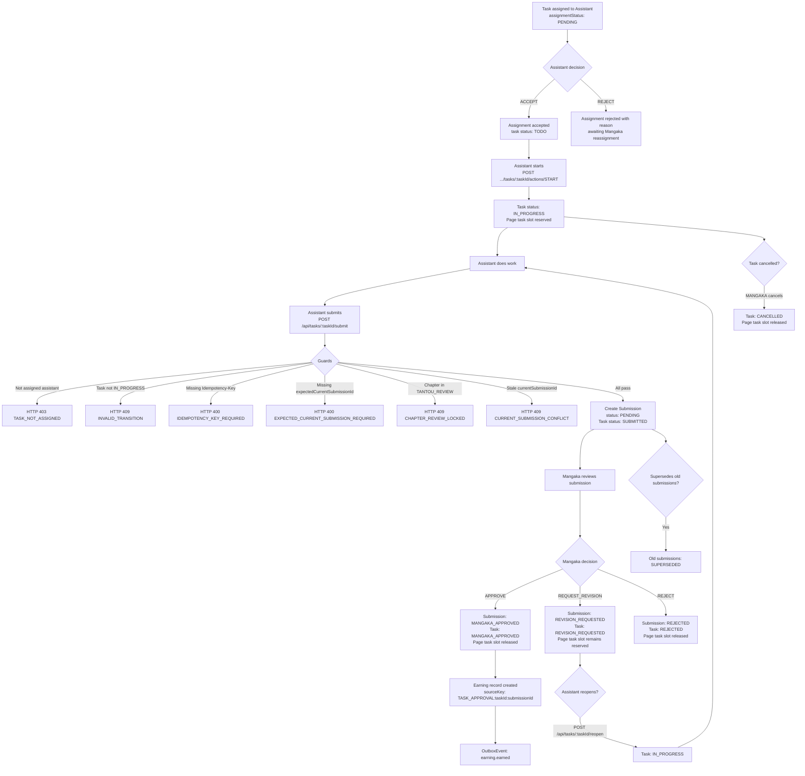

# Assistant Submission Flow

## Description

An Assistant is assigned a Task, starts work, submits work via POST /api/tasks/:taskId/submit,
and the Mangaka reviews (approve/reject/request-revision). A new task always targets
one Page, one Assistant, one active submission, and one earning record. On Mangaka
approval, the Page task slot is released and an Earning record is created.

## Flowchart

## Submission Status Values (from `backend/src/types.ts:203-212`)

| Status               | Description                             |
| -------------------- | --------------------------------------- |
| `PENDING`            | Just submitted, awaiting Mangaka review |
| `MANGAKA_APPROVED`   | Mangaka approved                        |
| `REVISION_REQUESTED` | Mangaka requested changes               |
| `SUPERSEDED`         | Replaced by a newer submission          |
| `REJECTED`           | Mangaka rejected                        |

## Task Status Values (from `backend/src/types.ts:163-176`)

| Status               | Description                 |
| -------------------- | --------------------------- |
| `TODO`               | Task created, not started   |
| `IN_PROGRESS`        | Assistant working           |
| `SUBMITTED`          | Work submitted (pre-review) |
| `REVISION_REQUESTED` | Mangaka requested revision  |
| `MANGAKA_APPROVED`   | Mangaka approved            |
| `REJECTED`           | Mangaka rejected            |
| `CANCELLED`          | Cancelled by Mangaka        |

## Assignment decision values

| Assignment status | Meaning |
| --- | --- |
| `PENDING` | Assistant must accept or reject before starting |
| `ACCEPTED` | Assistant may start the Page Task |
| `REJECTED` | Assistant declined with a reason; the task remains available for Mangaka reassignment |

## Role Access

**Genuine Task lifecycle actions** (via `POST /api/tasks/:taskId/actions/:action`):

| Action                        | Allowed Roles      | Guard                        |
| ----------------------------- | ------------------ | ---------------------------- |
| ACCEPT, REJECT                | Assigned ASSISTANT | Assignment decision required before work starts |
| START, REOPEN | Assigned ASSISTANT | `task-submission.service.ts` |
| CANCEL, REASSIGN              | MANGAKA            | `task-submission.service.ts` |

(`SUBMIT` via the actions endpoint is deprecated → use `POST /api/tasks/:taskId/submit`.)

Assistant submission is a production write. It is rejected with
`409 CHAPTER_REVIEW_LOCKED` after the Mangaka submits the complete Chapter to
Tantou review, so the frozen review snapshot cannot receive late work.

**Submission decisions** use dedicated Submission endpoints, not the generic Task
action endpoint:

| Decision         | Canonical endpoint                                     | Actor                     |
| ---------------- | ------------------------------------------------------ | ------------------------- |
| Approve          | `POST /api/submissions/:submissionId/approve`          | Owning MANGAKA (not self) |
| Request revision | `POST /api/submissions/:submissionId/request-revision` | Owning MANGAKA            |
| Reject           | `POST /api/submissions/:submissionId/reject`           | Owning MANGAKA            |

The generic Task-action review aliases `APPROVE`, `MANGAKA_APPROVE`,
`REQUEST_REVISION`, and `EDITOR_APPROVE` have been removed from `TASK_ACTIONS`.
`REJECT` remains only as the assigned Assistant's assignment decision; it is not
a Submission review decision. Review aliases return `400 INVALID_ACTION`; the
canonical Submission endpoints remain the only submission decision contract
([TECH-FINDING-04](#tech-finding-04--deprecated-decision-aliases-in-task_actions)).

## Idempotency

Submissions use `Idempotency-Key` header + `requestFingerprint` (SHA-256 of sorted payload)
to prevent duplicate submissions. If same key + same fingerprint: returns existing submission.
If same key + different fingerprint: HTTP 409 `IDEMPOTENCY_KEY_REUSED`.

## Earning Creation (on MANGAKA_APPROVED)

Before a Task can be created, the owning Mangaka selects an active `rateCode` and
quantity (the page flow uses one payable page unit). The backend resolves the
Admin-owned `RateTable` entry and stores the rate snapshot on the Task;
`rateSnapshot` and `estimatedAmount` are never accepted from the client.
`EarningModel.findOneAndUpdate({ taskId })` with `$setOnInsert`:

- `sourceKey = "TASK_APPROVAL:{taskId}:{submissionId}"`
- `amount = quantity * rateSnapshot` (server-resolved immutable Task snapshot)
- `status = "EARNED"`
- `OutboxEvent` emitted: `earning.earned`

## Submission Error Codes

| Condition                                 | HTTP | Code                                   | Status                                   |
| ----------------------------------------- | ---- | -------------------------------------- | ---------------------------------------- |
| Missing `Idempotency-Key`                 | 400  | `IDEMPOTENCY_KEY_REQUIRED`             | Implemented (`workflow.service.ts:2238`) |
| Missing `expectedCurrentSubmissionId`     | 400  | `EXPECTED_CURRENT_SUBMISSION_REQUIRED` | Implemented (`:2240-2245`)               |
| Current submission changed since read     | 409  | `CURRENT_SUBMISSION_CONFLICT`          | Implemented (`workflow.service.ts:2291`) |
| Idempotency key reused, different payload | 409  | `IDEMPOTENCY_KEY_REUSED`               | Implemented (`:2303-2307`)               |
| Task not assigned to actor                | 403  | `TASK_NOT_ASSIGNED`                    | Implemented                              |
| BLOCK / MARK_BLOCKED / UNBLOCK action    | 400  | `INVALID_ACTION`                       | Retired; use assignment rejection or Mangaka reassignment |
| Invalid Task/Submission transition        | 409  | `INVALID_TRANSITION`                   | Implemented (`:2285`)                    |

## Page task contract

New task creation requires `pageId` and rejects `regionId` with
`REGION_TASKS_RETIRED`. A Page can have only one active task. The invariant is
enforced twice: the API checks existing active work, and MongoDB enforces the
`pageTaskActive` unique partial index for concurrent requests.

Regions remain available for coordinates, comments, and AI detection. They are
not task assignment units and are not locked by new page tasks. Legacy tasks that
still contain `regionId` continue to be readable during migration only.

Reassignment is allowed only while the task is `TODO`, before the Assistant starts.
After `START`, the original task owns its submission history; create a new task only
after the old task is cancelled or reaches a terminal review state.

## Verified frontend lifecycle

Live E2E exercises the Assistant-scoped Studio and Mangaka Review Queue:

1. Assigned Assistant opens an accepted TODO task, performs `START`, and uploads a real file.
2. `POST /api/tasks/:taskId/submit` returns `201`; the task becomes `SUBMITTED`
   and the Studio upload panel becomes read-only.
3. The submission appears in the owning Mangaka's Review Queue.
4. Mangaka approves through the review UI; the canonical Submission endpoint returns `200`
   and the item leaves the pending queue.

## Canonical Decisions & Required Code Changes

### TECH-FINDING-04 — Deprecated decision aliases in `TASK_ACTIONS`

**Status: Resolved.** `TASK_ACTIONS` now contains only task lifecycle actions;
`APPROVE`, `MANGAKA_APPROVE`, `REQUEST_REVISION`, `REJECT`, and `EDITOR_APPROVE`
are rejected with `400 INVALID_ACTION` before task workflow execution. Canonical
Submission and Chapter review endpoints remain separate. → `CODE-TODO` CT-10 (Done).

### TECH-FINDING-05 — Generic `CONFLICT` code

**Status: Resolved.**

The stale-current-submission check (`workflow.service.ts:2291`) now throws the
canonical `CURRENT_SUBMISSION_CONFLICT` code (HTTP 409). The prior generic
`CONFLICT` response is retired. → `CODE-TODO` P2 (Done).

## Key Files

- `backend/src/services/task-submission.service.ts` — `submitTaskWork()`
- `backend/src/services/task-submission.service.ts` — `submissionDecision()`
- `backend/src/services/task-submission.service.ts` — `applyTaskAction()`
- `backend/src/services/task-submission.service.ts` — `reopenTaskForRevision()`
- `backend/src/controllers/submission.controller.ts` — route handlers
- `backend/src/routes/submission.routes.ts` — route registration
