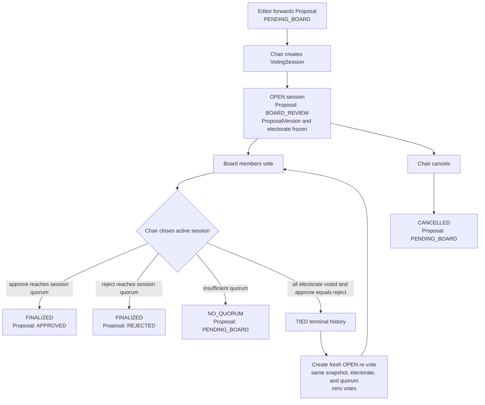

# Board Governance

## Description

The Board votes through `VotingSession` records. A Chair opens a session, Board members cast
`APPROVE`, `REJECT`, or `ABSTAIN`, and the Chair closes the active session. A tied round is
terminal `TIED` history; closing it creates a new empty `OPEN` re-vote session using the same
Proposal snapshot, electorate, and quorum. The active Board has three to five seats; opening a
session snapshots the roster and requires at least three members and exactly one active Chair.

## Flowchart

## VotingSession Status

| Status | Description |
|--------|-------------|
| `OPEN` | The only voteable Board session. |
| `TIED` | Terminal historical round; a fresh `OPEN` re-vote is linked by `reVoteOfSessionId`. |
| `NO_QUORUM` | Closed without sufficient votes; Proposal returns to `PENDING_BOARD`. |
| `FINALIZED` | Decision made (`APPROVED` or `REJECTED`). |
| `CANCELLED` | Cancelled by the Chair. |
| `TIE_BREAK_REQUIRED` | Historical compatibility status only; readable but not voteable. |

## Quorum and re-vote logic

The close operation uses the session's snapshotted `quorum`, not a mutable global value. It
approves or rejects when either tally reaches that quorum. Once every eligible voter has voted,
equal approve/reject tallies close the round as `TIED` and atomically create a linked `OPEN`
re-vote. The new round has no copied `ProposalVote` rows. Later account changes do not rewrite
the session's `eligibleVoterIds` or quorum.

## Queue and decision-history boundary

- The Board Queue uses the current `OPEN` session for a Proposal; `TIED` rounds are history.
- The Proposal remains `BOARD_REVIEW` after a tie and its active-session pointers move to the
  newly created `OPEN` re-vote session.
- Finalized, no-quorum, and cancelled sessions clear the active pointers as appropriate.
- Historical `TIE_BREAK_REQUIRED` records remain visible for compatibility, but the client must
  not send new EIC tie-break requests.

## Role Access

| Action | Allowed Roles | Guard |
|--------|--------------|-------|
| Create, patch, close, cancel session | BOARD (Chair) | VotingSession controller/service |
| Cast vote (`OPEN` only) | BOARD | Proposal `VOTE` action |
| Start re-vote after tie | System, within Chair close transaction | Governance service |
| View historical `TIED` or `TIE_BREAK_REQUIRED` session | BOARD, EDITOR | Decision/session history |
| Cast EIC tie-break | Nobody for new Proposal flows | Retired route returns `410 TIE_BREAK_RETIRED` |
| Add/edit/delete notes | EDITOR, BOARD | VotingSession controller |

## Invariants

- A Proposal has at most one active `OPEN` VotingSession.
- A Board member has at most one vote per VotingSession.
- Votes and quorum are scoped to their session; historical, cancelled, and tied sessions cannot
  receive new votes.
- A tied session and its replacement re-vote are immutable audit history plus a fresh round.
- The Board Chair closes/cancels sessions; close creates the re-vote atomically when tied.

## Historical compatibility

Legacy `TIE_BREAK_REQUIRED` records and their display labels are retained so existing audits and
seeded history remain readable. They are not an active Proposal path: new ties use `TIED` plus a
fresh `OPEN` re-vote, with no weighted Editor-in-Chief action.
