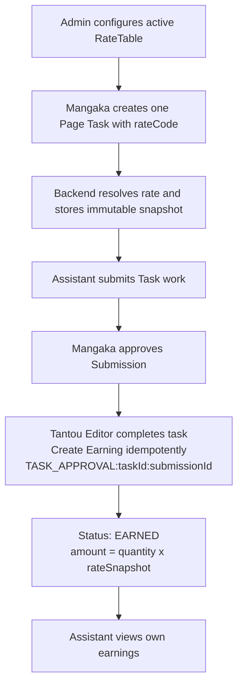

# Earnings Tracking

## Description
When the Tantou Editor completes a Mangaka-approved Page Task, the system creates
one idempotent `EARNED` record for it. The unit is one Page assigned to one
Assistant; regions never create separate tasks or earnings. This module is earnings tracking only, not
payroll or payment processing. Rate policy is configured by Admin through the
narrow `MANAGE_RATE_TABLE` capability; Mangaka never writes monetary rates.

## Flowchart

## Earning Status Values

| Status | Description |
|---|---|
| `PENDING` | Legacy initial value |
| `EARNED` | Created when the Tantou Editor completes the task |
| `CONFIRMED`, `PAID`, `VOIDED`, `ADJUSTED`, `REVERSED` | Legacy/deprecated payroll states |

## Rate policy

`RateTable` is the source of truth for new task pricing. Each entry has a
`rateCode`, work unit, positive amount, currency, version, status, and effective
window. Active windows for the same code cannot overlap. The Admin manages these
entries through `GET /api/admin/rates`, `POST /api/admin/rates`, and
`PATCH /api/admin/rates/:id`. Task creation options come from
`GET /api/rates/active`.

Task creation accepts only `rateCode` and `quantity`. The backend resolves the
active entry and stores `rateCode`, `rateVersion`, `rateSnapshot`, `currency`, and
`estimatedAmount`. Later rate versions affect new tasks only. If no active rate
exists, creation returns `409 RATE_CONFIGURATION_REQUIRED` rather than creating a
zero-priced task. Production amounts are intentionally not defined in the
repository and must be configured by an authorized Admin.

The task pricing snapshot is immutable after creation. A later patch cannot change
`quantity`, `rateSnapshot`, or the calculated earning; changing the work scope
requires cancelling the task and creating a new Page Task.

## Role Access

| Capability | Current implementation | Canonical actor |
|---|---|---|
| View own earnings | ASSISTANT | Assistant owner only; Admin no longer has this route |
| Manage rate table | ADMIN | Dedicated `MANAGE_RATE_TABLE`; not Mangaka — kept exception |
| List payroll | **Removed** | `/admin/payroll` route and handler deleted |
| Confirm/mark-paid/void | **Removed** | `/admin/payroll/:earningId/*` routes and handlers deleted (already deprecated) |

## Canonical Decision — FLOW-GAP-04 (Resolved)
Admin payroll and earnings access was outside the minimal account-management role.
The canonical module exposes only the Assistant's own earnings view and automatic
Earning creation when the Tantou Editor completes the task. `GET /api/admin/payroll` and
`POST /api/admin/payroll/:earningId/{confirm,mark-paid,void}` and their handlers
are deleted; `MANAGE_RATE_TABLE` (`/admin/rates*`) remains an explicit kept
exception. Implemented by CT-11.

## Key Files
- `backend/src/services/rate-table.service.ts` - Admin rate policy and active-rate resolution
- `backend/src/db/models/rate-table.model.ts` - versioned RateTable persistence
- `backend/src/controllers/studio.controller.ts` - server-side task rate snapshot
- `backend/src/services/earning.service.ts` — earning calculation, idempotent persistence, and the transactional `earning.earned` outbox event
- `backend/src/controllers/admin.controller.ts:113-158` — current-only/deprecated payroll routes
- `backend/src/db/models.ts:1379-1487` — Earning models
