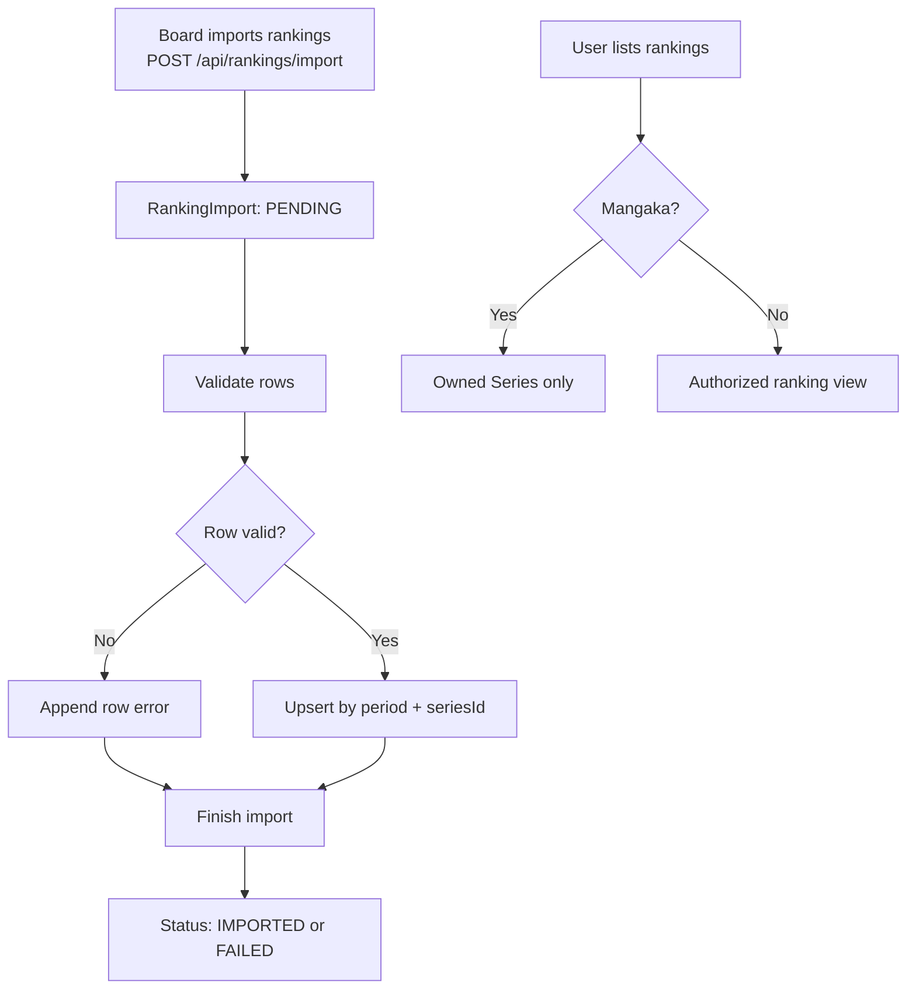

# Rankings

## Description
Rankings track Series performance by period. Board users import the ranking dataset;
a Mangaka sees only rankings for owned Series, while other authorized editorial
roles may view the permitted ranking set. Admin does not manage Rankings.

## Flowchart

## Ranking Import Status

| Status | Description |
|---|---|
| `PENDING` | Import created |
| `VALIDATED` | Rows validated |
| `IMPORTED` | All or some valid rows imported |
| `FAILED` | No rows imported |

## Ranking Import Row Schema
Required: `period`; one to 500 rows. Rows may include `seriesId`, `seriesTitle`,
`score`, `finalScore`, `readerScore`, `votes`, `voteCount`, `status`, and `atRisk`.

## Role Access

| Action | Current implementation | Canonical actor |
|---|---|---|
| List rankings | BOARD, EDITOR, MANGAKA | Board/Editor see the permitted set; Mangaka only owned Series |
| Import rankings | BOARD | `ADMIN` removed (FLOW-GAP-04 — Resolved) |
| List Series rankings | BOARD, EDITOR, MANGAKA | Mangaka ownership guard; Admin/Assistant denied |

## Canonical Decision — FLOW-GAP-04 (Resolved)
Ranking import is governance/editorial data handling and does not belong to account
administration. `POST /rankings/import` requires `BOARD`; `ADMIN` no longer passes
the role guard (`notification.routes.ts:20`). Implemented by CT-11.

## Key Files
- `backend/src/controllers/notification.controller.ts:74-242` — ranking handlers
- `backend/src/routes/notification.routes.ts:19-21` — ranking routes
- `backend/src/db/models.ts:1289-1377` — Ranking and RankingImport models
