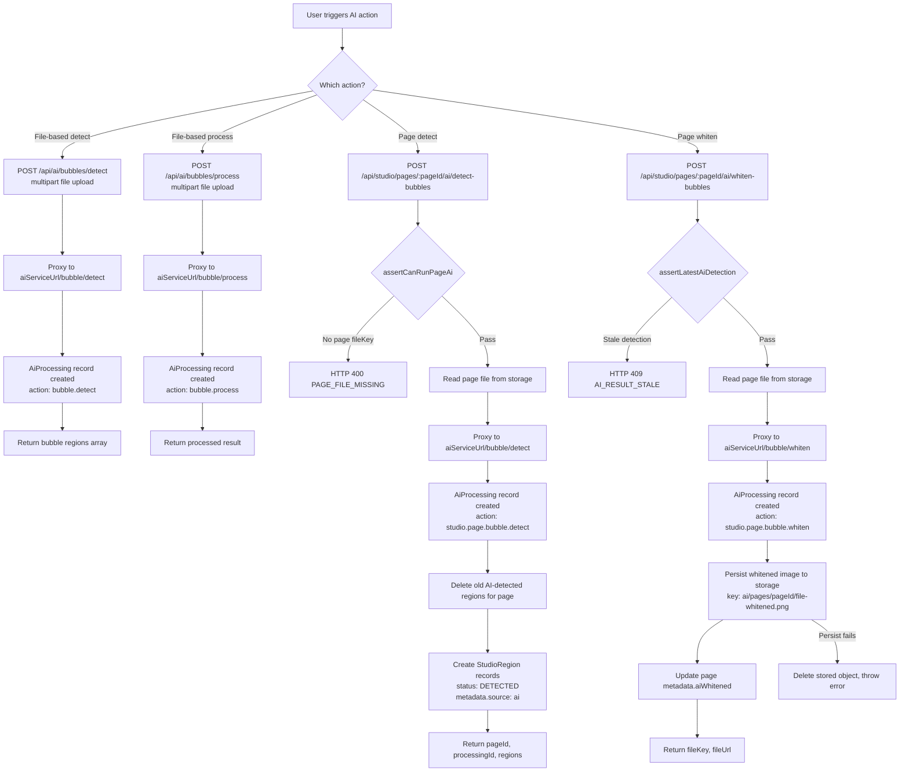

# AI Processing

## Description
AI features include bubble detection (speech bubble detection in manga pages)
and bubble whitening (removing text from detected bubbles). The AI service is
an external Python service that the backend proxies to.

## Flowchart

## AI Processing Actions
- `bubble.detect` — Detect bubbles in uploaded file
- `bubble.process` — Process bubbles in uploaded file
- `studio.page.bubble.detect` — Detect bubbles in a stored page
- `studio.page.bubble.whiten` — Whiten bubbles in a stored page

## Role Access

| Action | Allowed Roles |
|--------|--------------|
| Health | All authenticated users |
| Detect/process an uploaded standalone file | EDITOR, MANGAKA |
| Detect/whiten a stored Page | Owning MANGAKA only |

## Staleness Guard
Before whitening, `assertLatestAiDetection(pageId, expectedProcessingId)` checks that
the most recent AI detection for this page matches the `expectedProcessingId`. If stale,
returns HTTP 409 `AI_RESULT_STALE`.

## Key Files
- `backend/src/controllers/ai.controller.ts` — AI route handlers
- `backend/src/routes/ai.routes.ts` — AI route registration
- `backend/src/services/studio-access.service.ts` — `assertCanRunPageAi()`
- `backend/src/services/file-access.service.ts` — storage read/write
- `backend/src/db/models.ts:1489-1513` — AiProcessingRecord
