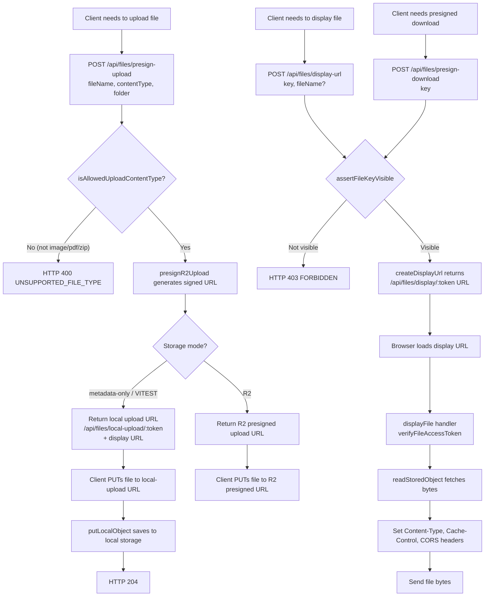

# File Management

## Description
Files are stored in Cloudflare R2 (or local filesystem in development).
The backend provides presigned upload/download URLs and token-based display URLs
for secure file access.

## Flowchart

## Content Type Restrictions
Allowed upload types (`series.controller.ts:66-71`):
- `image/*` (all image types)
- `application/pdf`
- `application/zip`, `application/x-zip-compressed`
- `application/octet-stream`

## File Token Flow
1. `presignR2Upload()` / `createDisplayUrl()` generate a signed token
2. Token encodes: `key`, `contentType`, `fileName`
3. `verifyFileAccessToken()` validates and decodes the token
4. Token is non-replayable for uploads, time-limited for display

## Role Access

| Action | Current implementation | Canonical actor |
|---|---|---|
| Presign upload | EDITOR, MANGAKA, ASSISTANT | Same, with resource-scope guard |
| Presign download | BOARD, EDITOR, MANGAKA, ASSISTANT | Resource owner/member/reviewer scope; `ADMIN` removed (FLOW-GAP-04 — Resolved) |
| Display URL | BOARD, EDITOR, MANGAKA, ASSISTANT | Same, with resource-scope guard |
| Token upload/display | Token-authenticated | Unchanged |

Admin account management does not require access to editorial files. `POST
/api/files/presign-download` no longer accepts `ADMIN` (`series.routes.ts:108-110`).
Implemented by CT-11.

## Mobile submitted-file review

Board and the assigned Tantou Editor can list review-file metadata through
`GET /api/review-files/:context/:id`. The endpoint returns file identity and
display metadata only: it does not return a signed or token display URL.

- **Board:** Proposal context only, and only when the Proposal is visible to
  Board. A Board display-URL request is restricted to a matching Proposal key;
  series, chapter, page, task, submission, and production material keys return
  `403 FORBIDDEN`.
- **Editor:** Proposal and assigned Chapter review contexts only. Both the
  metadata endpoint and every display-URL request enforce the current server
  assignment/scope.
- **Mobile lease:** the client POSTs `/api/files/display-url` only when the
  reviewer opens a file. The response URL remains in memory; when `expiresAt`
  is absent, mobile uses an eight-minute fallback lease and refreshes 30
  seconds before the normal 900-second expiry. A failed preview triggers one
  refresh/retry; `403` closes the viewer and `404` is presented as unavailable.

The mobile client never signs, persists, logs, or fabricates a display URL.

## CORS Headers
Display file responses set:
- `Cross-Origin-Resource-Policy: cross-origin`
- `Access-Control-Allow-Origin: {CLIENT_URL}` (if request origin matches)
- `Cache-Control: private, max-age=300`

## Key Files
- `backend/src/services/r2.service.ts` — presignR2Upload, presignR2Download
- `backend/src/services/file-access.service.ts` — createDisplayUrl, createLocalUploadUrl, putLocalObject, readStoredObject
- `backend/src/controllers/file-token.controller.ts` — putLocalUpload, displayFile
- `backend/src/routes/file-token.routes.ts` — token route registration
- `backend/src/controllers/series.controller.ts:831-881` — presign handlers
- `backend/src/routes/series.routes.ts:101-112` — file routes
