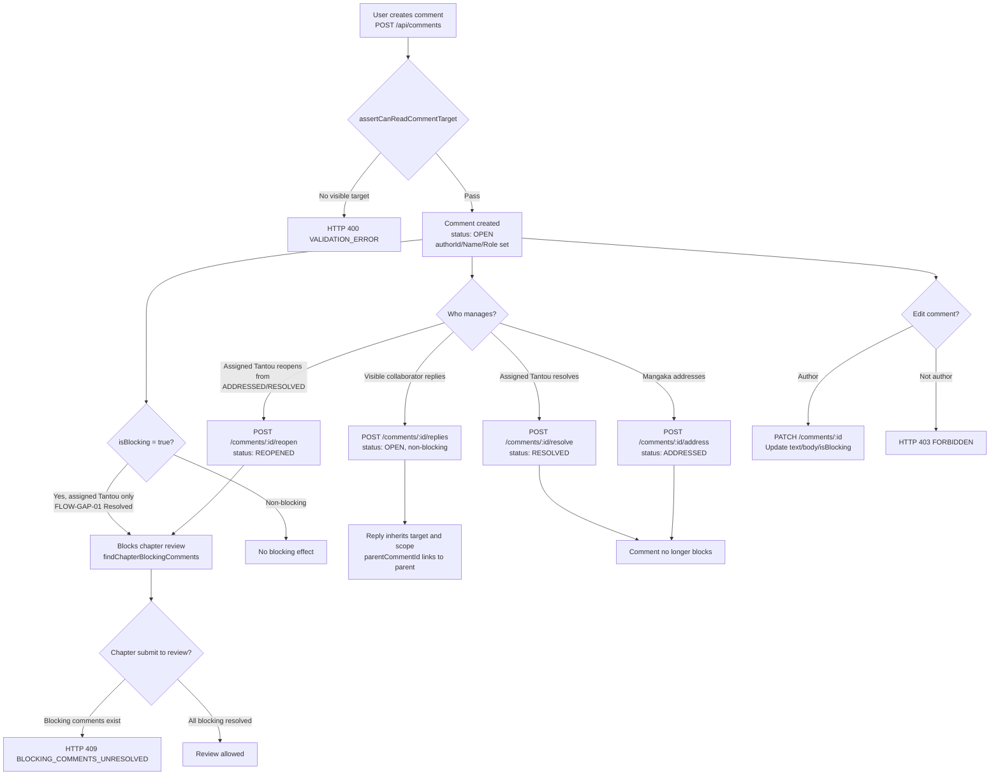

# Comments

## Description
Comments are created on chapters, pages, regions, tasks, or submissions.
A blocking comment (`isBlocking: true`) prevents resubmission until it is
ADDRESSED by the owning Mangaka. `ADDRESSED` means ready for Tantou verification;
the assigned Tantou must mark it `RESOLVED` before Chapter approval. See
**Canonical Decisions & Required Code Changes** below —
only the assigned Tantou may create or raise a blocking comment
([FLOW-GAP-01](#flow-gap-01--blocking-comment-write-authority), Resolved).

## Flowchart

## Comment Status Values (from `backend/src/db/models.ts:861`)

| Status | Description |
|--------|-------------|
| `OPEN` | Active, not resolved (blocking) |
| `ADDRESSED` | Mangaka states the issue is handled; resubmission allowed, approval still blocked |
| `RESOLVED` | Assigned Tantou verifies the fix; approval allowed |
| `REOPENED` | Assigned Tantou determines the issue is unresolved (blocking) |

**Canonical two-gate rule:** `OPEN`/`REOPENED` block resubmission.
`ADDRESSED` allows resubmission but blocks `EDITOR_APPROVE`. Only `RESOLVED`
passes the publication-readiness gate.

## Blocking Comment Detection

**Resubmission gate** (`findChapterBlockingComments`,
`chapter-review.service.ts`) — a comment blocks entry into chapter review if:
1. `isBlocking === true`, **and**
2. `status` is NOT `ADDRESSED` or `RESOLVED`, **and**
3. it is scoped to the chapter or a related page/region/task/submission.

**Approval gate:** `EDITOR_APPROVE` runs the same scoped query with only
`RESOLVED` accepted. Therefore `ADDRESSED` is visible to the Tantou as pending
verification and cannot silently pass publication readiness.

The chapter-blocking query does **not** filter on `authorRole`, and this is
unchanged by the [FLOW-GAP-01](#flow-gap-01--blocking-comment-write-authority)
fix — detection stays independent of the author's *current* Tantou assignment
so a blocking comment remains valid after Tantou reassignment. The
`authorRole === "EDITOR"` filter lives only in `isTantouBlockingComment`
(`studio.controller.ts:108-113`), which gates *resolve/address/reopen*
authority, not *detection*.

**Write-time authority (implemented):** `createComment` and `patchComment` now
  reject any non-Tantou attempt to create or raise an `isBlocking` comment
(`assertCanRaiseBlockingComment`, `studio.controller.ts:151-161`), so new
orphan blockers can no longer be created through the API. This is a write
gate, not a data migration — it does not repair pre-existing records, and existing valid `isBlocking` comments remain detected by
  `findChapterBlockingComments`.

## Comment Target Types
`CHAPTER`, `PAGE`, `REGION`, `TASK`, `SUBMISSION`

## Reply Contract

- `POST /api/comments/:commentId/replies` accepts `body` (or legacy `text`).
- A reply stores `parentCommentId` and inherits the parent comment's target,
  Series, Chapter, Page, Region, Task, and Submission scope.
- Replies are always `OPEN` and `isBlocking: false`. A reply is conversation
  context; it cannot create a second readiness gate or silently escalate the
  parent's severity.
- The actor must be able to read the parent target. The API derives author and
  scope fields from authenticated context and the parent record.
- Replying does not change the parent status. `ADDRESS`, `RESOLVE`, and `REOPEN`
  remain explicit lifecycle actions on the parent comment.

## Role Access

| Action | Allowed Roles (current) | Canonical guard | Guard ref |
|--------|--------------|-------|-------|
| Create | EDITOR, MANGAKA, ASSISTANT | Any author may comment; **only assigned Tantou may set `isBlocking`** ([FLOW-GAP-01](#flow-gap-01--blocking-comment-write-authority), Resolved) | `studio.controller.ts:435-441` |
| Reply | EDITOR, MANGAKA, ASSISTANT | Must be able to read the parent target; reply inherits scope and is always non-blocking | `studio.controller.ts`, `studio.routes.ts` |
| Patch | Author only | Same; raising `isBlocking` from non-blocking requires assigned Tantou ([FLOW-GAP-01](#flow-gap-01--blocking-comment-write-authority), Resolved) | `studio.controller.ts` |
| Resolve | EDITOR | Assigned Tantou of the related Series, on a Tantou blocking comment ([FLOW-GAP-03](#flow-gap-03--comment-resolvereopen-assignment-guard), Resolved) | `studio.controller.ts:133-174,477` |
| Address | MANGAKA owner, Tantou blocking only | Owning Mangaka only (already enforced) | `studio.controller.ts:115-131,470` |
| Reopen | EDITOR | Assigned Tantou; only from `ADDRESSED`/`RESOLVED` ([FLOW-GAP-03](#flow-gap-03--comment-resolvereopen-assignment-guard), Resolved) | `studio.controller.ts:503-515` |
| List | All (scoped) | unchanged | `studio.routes.ts:55` |
| List by task | All (scoped) | unchanged | `studio.routes.ts:69` |

## Canonical Decisions & Required Code Changes

The action-specific guards below are implemented in the controller and remain the
canonical authorization boundary.

### FLOW-GAP-01 — Blocking comment write authority (Resolved)
- **Implemented behavior:** `createComment` (`studio.controller.ts:435-441`) and
  `patchComment` (`:456-479`) call `assertCanRaiseBlockingComment`
  (`:151-161`) whenever a request sets `isBlocking` true on create, or
  raises a comment from non-blocking to blocking on patch. The guard requires the
  actor to be role `EDITOR` and the assigned Tantou (`series.editorId === actor.id`)
  of the related Series, else it throws `403 TANTOU_ASSIGNMENT_REQUIRED`. Mangaka and
  Assistant comments can no longer set `isBlocking` through the API.
- **Canonical business decision:** Only the assigned Tantou may create a blocking
  editorial comment or change a comment from non-blocking to blocking. Mangaka and
  Assistant comments must not block chapter submission by setting `isBlocking`.
- **Scope note:** this is a write-time gate, not a data migration or a change to
  detection. `findChapterBlockingComments` (`chapter-review.service.ts`)
  intentionally still detects blocking comments independent of the author's
  *current* Tantou assignment (a blocking comment must stay valid after Tantou
  reassignment), and `isTantouBlockingComment` still keys on
  `authorRole === "EDITOR"` for resolve/address/reopen — unchanged by this fix.
  Legacy records are normalized by `migrate:canonical-comments`; the runtime no
  longer reads or writes a second blocking field. → `CODE-TODO` CT-01, Done.

### FLOW-GAP-03 — Comment resolve/reopen assignment guard (Resolved)
- **Implemented behavior:** `assertCanResolveTantouBlockingComment` and
  `assertCanReopenTantouBlockingComment` require an `EDITOR` to be the assigned
  Tantou of the related Series (`series.editorId === actor.id`); an unset or
  mismatched assignment returns `403 TANTOU_ASSIGNMENT_REQUIRED`.
- **Reopen transition:** `reopenComment` accepts only comments currently in
  `ADDRESSED` or `RESOLVED`; reopening from `OPEN` or any other status returns
  `409 INVALID_TRANSITION`. A valid reopen sets status to `REOPENED`.
- **Canonical business decision:** Resolve/Reopen require the assigned Tantou of the
  related Series, while the owning Mangaka may only `ADDRESS` a Tantou blocking
  comment. The controller keeps these action-specific guards separate from the
  route perimeter. Resolve/reopen accept only `EDITOR`, while address accepts
  only the owning `MANGAKA`. → `CODE-TODO` CT-03, Done.

### TECH-FINDING-01 — Legacy `blocking` field
**Status: Resolved.**
`StudioComment` now exposes only `isBlocking`; the idempotent
`migrate:canonical-comments` command copies legacy `blocking:true` values and
removes the old field. Runtime queries and writes use only `isBlocking`.
→ `CODE-TODO` CT-07, Done.

### TECH-FINDING-02 — Dead `FIXED` comment status
**Status: Resolved.**
The canonical status enum is `OPEN`/`ADDRESSED`/`RESOLVED`/`REOPENED`.
`migrate:canonical-comments` converts stored `FIXED` records to `ADDRESSED`, and
the API/UI no longer accepts or writes `FIXED`. → `CODE-TODO` CT-08, Done.

## Key Files
- `backend/src/controllers/studio.controller.ts:414-506` � comment handlers
- `backend/src/services/chapter-review.service.ts` � `findChapterBlockingComments()`
- `backend/src/routes/studio.routes.ts:55-69` � comment routes
- `backend/src/db/models.ts:811-868` � StudioCommentRecord
