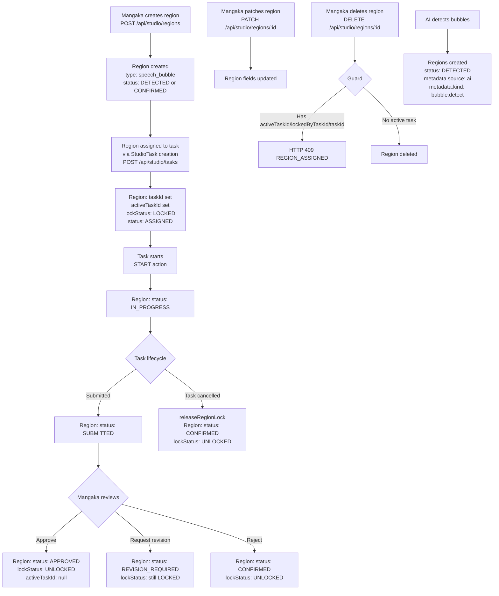

# Regions

## Description
StudioRegions represent speech bubble / text areas on manga pages. They are created
by Mangaka (manually or via AI detection), can be assigned to tasks, and support
locking when a task is active. Region statuses track the work lifecycle.

## Flowchart

## Region Status Values (from `backend/src/db/models.ts:671-683`)

| Status | Description |
|--------|-------------|
| `DETECTED` | AI-detected or initially created |
| `CONFIRMED` | Manually confirmed |
| `ASSIGNED` | Task assigned to region |
| `IN_PROGRESS` | Work active |
| `SUBMITTED` | Work submitted |
| `REVISION_REQUIRED` | Changes needed |
| `APPROVED` | Work approved |
| `DONE` | Completed |
| `DISCARDED` | Discarded |

## Lock Status (from `backend/src/db/models.ts:688-692`)

| Status | Description |
|--------|-------------|
| `UNLOCKED` | No active task (schema default) |
| `LOCKED` | Task is active on this region |

**Canonical lock lifecycle (confirmed current, correct):** Region is `LOCKED` at
Task creation (`ASSIGNED`, `studio.controller.ts:300-306`), stays `LOCKED` through
`START`/`SUBMIT`/`REQUEST_REVISION` (revision changes only the region *status* to
`REVISION_REQUIRED`, `workflow.service.ts:3132-3138`), and is released to
`UNLOCKED` on `APPROVE`/`REJECT`/`CANCEL`. One Region has at most one active Task
(`studio.controller.ts:271-311`). Release history remains in audit data.

## Region Locking Logic
- `lockRegion(regionId, taskId)` (`task-submission.service.ts`): Sets `activeTaskId`, `lockedByTaskId`, `lockStatus: LOCKED`, `status: IN_PROGRESS`
- `releaseRegionLock(regionId, taskId, nextStatus)` (`task-submission.service.ts`): Sets `activeTaskId: null`, `lockStatus: UNLOCKED`, `status: nextStatus`

## Role Access

| Action | Allowed Roles |
|--------|--------------|
| Create region | MANGAKA |
| Patch region(s) | MANGAKA |
| Delete region | MANGAKA (only if not assigned) |
| List regions | All (scoped) |

## Verified frontend assignment flow

Live E2E validates the manual Studio path, not only API handlers:

1. Mangaka selects **Draw Region** and drags on the Konva page canvas.
2. The frontend posts natural-image coordinates to `POST /api/studio/regions`.
3. The new Region is selected automatically and exposes **Create Assistant Task**.
4. Mangaka chooses the Assistant, active rate, quantity, due date, and instructions.
5. `POST /api/studio/tasks` returns `201`, and the assigned Assistant sees the task
   on the task list.

## Canonical Decisions & Required Code Changes

### TECH-FINDING-03 — `RELEASED` lock value
**Status: Resolved.**
The canonical binary lock model is now implemented: the schema/type enum is
`["UNLOCKED", "LOCKED"]`, all release paths write `UNLOCKED`, and
`migrate:region-lock-status --apply` converts legacy stored `RELEASED` values.
Release history is retained in audit entries.

## Key Files
- `backend/src/controllers/studio.controller.ts:151-226` � region CRUD
- `backend/src/routes/studio.routes.ts:34-39` � region routes
- `backend/src/services/task-submission.service.ts` � lock/unlock logic
- `backend/src/db/models.ts:632-697` � StudioRegionRecord, studioRegionSchema
- `backend/src/controllers/ai.controller.ts:206-237` � AI-created regions
