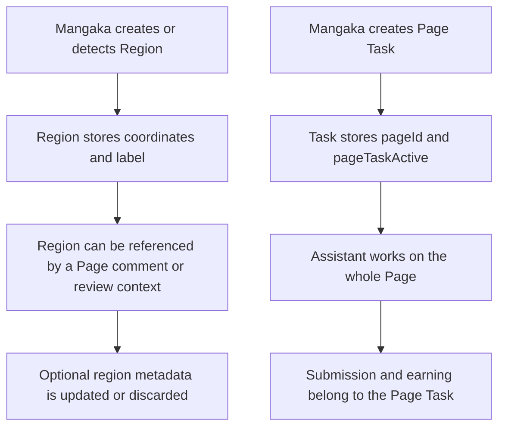

# Regions

## Description

`StudioRegion` represents a coordinate annotation on a manga Page: speech bubbles,
text areas, or AI-detected regions. A region is not a work assignment. Assistant
work is assigned at Page level, so a Page has at most one active task regardless of
how many regions it contains.

## Canonical flow



Regions support:

- coordinate-based comments and visual review;
- AI detection metadata;
- page annotation updates and deletion when no dependent comment/review blocks it.

Regions do not support:

- task assignment or task splitting;
- separate assistant claims;
- separate submissions or earnings;
- task locks.

## Region status values

| Status | Meaning |
| --- | --- |
| `DETECTED` | Created by AI or imported detection |
| `CONFIRMED` | Confirmed by the Mangaka |
| `DISCARDED` | Annotation intentionally discarded |

Older persisted records may still contain lifecycle values such as `ASSIGNED`,
`IN_PROGRESS`, `SUBMITTED`, `REVISION_REQUIRED`, `APPROVED`, or `DONE`. Those values
are legacy display data only; new Page Tasks never write them.

## Migration and compatibility

New `POST /api/studio/tasks` requests require `pageId` and reject `regionId` with
`REGION_TASKS_RETIRED`. Existing region-scoped tasks remain readable while they are
completed or cancelled. The migration command is:

```text
npm run migrate:page-task-contract
npm run migrate:page-task-contract:apply
```

The migration is dry-run by default. Pages with more than one active legacy task
are reported and are not merged automatically. Resolve those tasks explicitly,
then enable the unique active-page index.

## Role access

| Action | Allowed roles |
| --- | --- |
| Create region | `MANGAKA` |
| Patch region | `MANGAKA` |
| Delete region | `MANGAKA`, when no dependent work blocks deletion |
| View regions | Scoped production users |

## Key files

- `backend/src/controllers/studio.controller.ts` — region CRUD and Page Task boundary
- `backend/src/db/models.ts` — `StudioRegion` and `StudioTask.pageTaskActive`
- `backend/src/services/task-submission.service.ts` — legacy region compatibility only
- `backend/src/scripts/migrate-page-task-contract.ts` — page-level task migration
