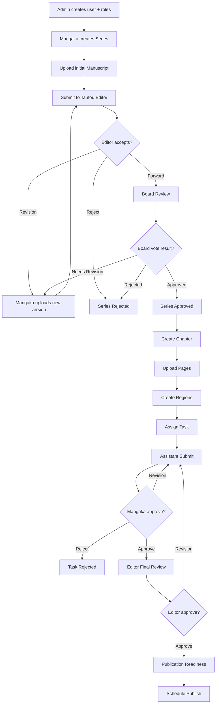

# Main User Flow

## Full production flow

```mermaid
flowchart TD
  A["Admin creates user + roles"] --> B["Mangaka creates Series"]
  B --> C["Upload initial Manuscript"]
  C --> D["Submit to Tantou Editor"]
  D --> E{"Editor accepts?"}
  E -->|Revision| F["Mangaka uploads new version"]
  F --> D
  E -->|Reject| R["Series Rejected"]
  E -->|Forward| G["Board Review"]
  G --> H{"Board vote result?"}
  H -->|Approved| I["Series Approved"]
  H -->|Needs Revision| F
  H -->|Rejected| R
  I --> J["Create Chapter"]
  J --> K["Upload Pages"]
  K --> L["Create Regions"]
  L --> M["Assign Task"]
  M --> N["Assistant Submit"]
  N --> O{"Mangaka approve?"}
  O -->|Revision| N
  O -->|Reject| X["Task Rejected"]
  O -->|Approve| P["Editor Final Review"]
  P --> Q{"Editor approve?"}
  Q -->|Revision| N
  Q -->|Approve| S["Publication Readiness"]
  S --> T["Schedule Publish"]
```
