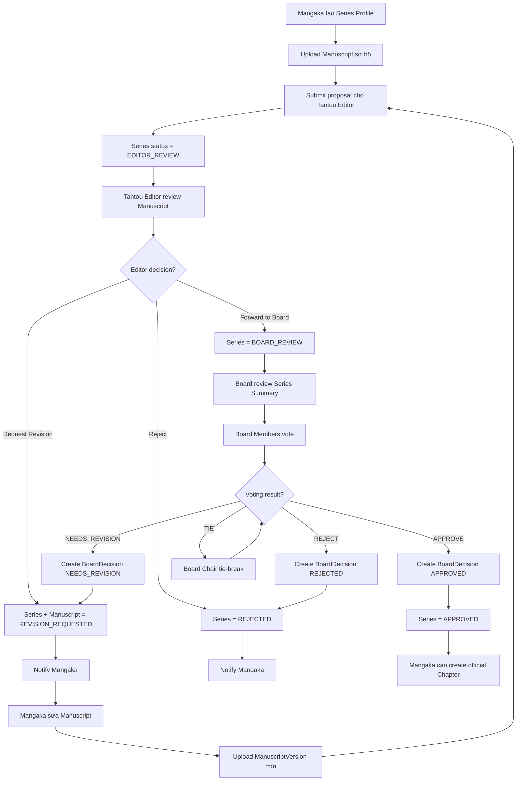
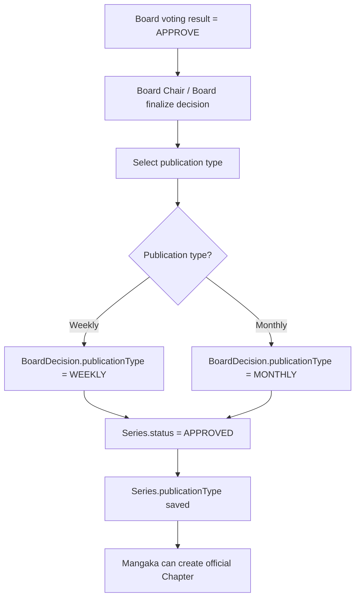

## 0. Tổng quan

Luồng này mô tả toàn bộ quá trình từ lúc Mangaka tạo hồ sơ đề xuất series mới cho đến khi Tantou Editor review và Editorial Board đưa ra quyết định cuối cùng.

Đây là gate đầu tiên của toàn hệ thống MangaFlow. Trước khi series được Editorial Board approve, Mangaka chưa được tạo Chapter chính thức, chưa được upload page production, chưa được tạo task cho Assistant và chưa phát sinh payroll.

---

## 1. Mục tiêu nghiệp vụ

Mục tiêu của luồng này là đảm bảo một series mới phải được kiểm duyệt qua hai tầng trước khi bước vào giai đoạn sản xuất chính thức:

1. Tantou Editor kiểm tra chất lượng bản thảo sơ bộ.
2. Editorial Board bỏ phiếu để quyết định series có được triển khai chính thức hay không.

Luồng này giúp hệ thống quản lý rõ:

- Ai là người tạo proposal.
- Bản thảo đang ở version nào.
- Editor đã feedback gì.
- Series đã được forward lên Board hay chưa.
- Board đã vote ra sao.
- Khi nào series được phép tạo Chapter chính thức.

---

## 2. Phạm vi

### In scope

- Mangaka tạo Series Profile.
- Mangaka upload Manuscript sơ bộ.
- Mangaka submit proposal cho Tantou Editor.
- Tantou Editor review manuscript.
- Tantou Editor request revision, reject hoặc forward to Board.
- Mangaka upload manuscript version mới khi bị request revision.
- Editorial Board review Series Summary.
- Board Member vote approve, reject hoặc needs revision.
- Board Chair tie-break khi kết quả vote hòa.
- System cập nhật Series Status, Manuscript Status, BoardDecision, Notification và AuditLog.

### Out of scope

- Tạo Chapter chính thức.
- Upload Page production.
- Tạo Region.
- Assign Task cho Assistant.
- Assistant Submission.
- Publication.
- Ranking.
- Payroll.

Các phần out of scope chỉ được kích hoạt sau khi Series đạt trạng thái `APPROVED` hoặc `ONGOING`.

---

## 3. Actor tham gia

| Actor           | Vai trò trong luồng                                                                                  |
| --------------- | ---------------------------------------------------------------------------------------------------- |
| Mangaka         | Tạo Series Profile, upload manuscript sơ bộ, submit proposal, sửa manuscript khi bị request revision |
| Tantou Editor   | Review manuscript sơ bộ, tạo feedback, request revision, reject hoặc forward to Board                |
| Editorial Board | Review series summary và vote quyết định series mới                                                  |
| Board Chair     | Chốt quyết định khi kết quả vote bị tie                                                              |
| System          | Validate permission, cập nhật status, tạo notification, ghi audit log                                |
| Admin           | Không tham gia quyết định nghiệp vụ, chỉ đảm bảo user/role đã được cấu hình                          |

---

## 4. Điều kiện bắt đầu

Luồng bắt đầu khi Mangaka muốn đề xuất một series mới.

Preconditions:

- User đã login.
- User có role `MANGAKA`.
- User status = `ACTIVE`.
- Hệ thống đã có ít nhất một Tantou Editor active.
- File upload service đã sẵn sàng.
- Series chưa bước vào production.

Nếu user không phải Mangaka thì không được tạo Series Proposal.

---

## 5. Điều kiện kết thúc

Luồng có thể kết thúc theo 3 nhánh:

| Kết quả            | Series Status        | Ý nghĩa                                                |
| ------------------ | -------------------- | ------------------------------------------------------ |
| Approved           | `APPROVED`           | Series được duyệt, Mangaka được tạo Chapter chính thức |
| Rejected           | `REJECTED`           | Series bị từ chối, flow dừng                           |
| Revision Requested | `REVISION_REQUESTED` | Mangaka cần sửa manuscript và submit lại               |

Sau khi Series được approve, hệ thống có thể chuyển series sang `ONGOING` khi chapter đầu tiên được tạo hoặc khi Editor/Board xác nhận bắt đầu production.

---

## 6. Entity liên quan

### Core entities

| Entity              | Mục đích                                                     |
| ------------------- | ------------------------------------------------------------ |
| `Series`            | Lưu hồ sơ đề xuất và trạng thái tổng thể của series          |
| `Manuscript`        | Đại diện cho bản thảo sơ bộ của series                       |
| `ManuscriptVersion` | Lưu từng version manuscript khi Mangaka sửa và upload lại    |
| `FileAsset`         | Lưu metadata file PDF, image, cover draft, character concept |
| `Comment`           | Lưu feedback dạng text từ Editor                             |
| `Annotation`        | Lưu feedback trực tiếp trên page hoặc file manuscript        |
| `BoardVote`         | Lưu vote của từng Board Member                               |
| `BoardDecision`     | Lưu quyết định cuối cùng của Board                           |
| `Notification`      | Thông báo cho Mangaka, Editor, Board                         |
| `AuditLog`          | Ghi nhận các hành động quan trọng                            |

---

## 7. Series Status trong luồng 1

| Status               | Mô tả                                          |
| -------------------- | ---------------------------------------------- |
| `DRAFT`              | Mangaka đang tạo hồ sơ, chưa submit            |
| `EDITOR_REVIEW`      | Proposal đã được submit cho Tantou Editor      |
| `REVISION_REQUESTED` | Editor hoặc Board yêu cầu Mangaka sửa lại      |
| `BOARD_REVIEW`       | Editor đã forward proposal lên Editorial Board |
| `APPROVED`           | Board đã approve series                        |
| `REJECTED`           | Editor hoặc Board đã reject series             |

Status không dùng trong luồng này nhưng liên quan về sau:

| Status      | Dùng khi nào                                                  |
| ----------- | ------------------------------------------------------------- |
| `ONGOING`   | Series đã bắt đầu production/publishing                       |
| `AT_RISK`   | Series đang có nguy cơ bị warning hoặc cancel do ranking thấp |
| `CANCELLED` | Board quyết định hủy series                                   |
| `COMPLETED` | Series kết thúc bình thường                                   |

---

## 8. Manuscript Status

| Status                | Mô tả                                           |
| --------------------- | ----------------------------------------------- |
| `DRAFT`               | Manuscript đã upload nhưng chưa submit          |
| `SUBMITTED`           | Manuscript đã được gửi review                   |
| `UNDER_EDITOR_REVIEW` | Editor đang review                              |
| `REVISION_REQUESTED`  | Cần sửa manuscript                              |
| `FORWARDED_TO_BOARD`  | Đã được Editor chuyển lên Board                 |
| `APPROVED`            | Manuscript được chấp nhận theo quyết định Board |
| `REJECTED`            | Manuscript bị từ chối                           |

---

## 9. Luồng nghiệp vụ chính

### Step 1 — Mangaka tạo Series Profile

Mangaka mở màn hình Create Series Proposal và nhập thông tin cơ bản.

Required fields:

| Field                      | Required | Ghi chú              |
| -------------------------- | -------- | -------------------- |
| ---                        | ---:     | ---                  |
| Series Title               | Có       | Tên series           |
| Synopsis / Description     | Có       | Mô tả nội dung chính |
| Genre                      | Có       | Thể loại             |
| Target Audience            | Có       | Đối tượng độc giả    |
| Requested Publication Type | Có       | Weekly hoặc Monthly  |
| Tags                       | Không    | Dùng cho phân loại   |
| Cover Draft                | Không    | Ảnh bìa nháp         |

System action:

```
Create Series
Series.status = DRAFT
Series.createdBy = currentUser._id
Series.ownerMangakaId = currentUser._id
Create AuditLog: SERIES_CREATED
```

---

### Step 2 — Mangaka upload Manuscript sơ bộ

Mangaka upload file bản thảo sơ bộ.

Supported files:

```
PDF
PNG
JPG
JPEG
WEBP
PSD optional
```

File có thể gồm:

- PDF bản thảo sơ bộ.
- Sample pages.
- Character concept.
- Cover draft.
- Reference images.

System action:

```
Validate file type
Validate file size
Upload original file to storage
Create FileAsset
Create Manuscript if not exists
Create ManuscriptVersion versionNo = 1
Manuscript.status = DRAFT
```

Business rule:

- Manuscript không bị ghi đè.
- Mỗi lần upload lại sau revision sẽ tạo version mới.
- Version mới nhất là version đang được review.

---

### Step 3 — Mangaka submit proposal cho Tantou Editor

Mangaka click Submit Proposal.

Validation trước khi submit:

```
Series.title exists
Series.synopsis exists
Series.genre exists
Series.targetAudience exists
Series.requestedPublicationType exists
At least one manuscript file exists
User is owner Mangaka
Series.status in [DRAFT, REVISION_REQUESTED]
```

System action:

```
Series.status = EDITOR_REVIEW
Manuscript.status = SUBMITTED
Current ManuscriptVersion.status = SUBMITTED
Create Notification for Tantou Editor
Create AuditLog: SERIES_SUBMITTED_TO_EDITOR
```

UI label:

```
Pending Editor Review
```

---

### Step 4 — Tantou Editor review manuscript

Editor mở hàng chờ review.

Route đề xuất:

```
/app/editor/manuscripts/review-queue
/app/editor/series/:seriesId/review
```

Editor xem:

- Series information.
- Manuscript latest version.
- Version history.
- Mangaka note.
- Uploaded files.
- Previous comments nếu có.
- Board readiness checklist.

Editor có thể tạo:

- Text feedback.
- Inline comment.
- Page annotation.
- General recommendation.

System action khi Editor bắt đầu review:

```
Manuscript.status = UNDER_EDITOR_REVIEW
Create AuditLog: EDITOR_STARTED_REVIEW
```

---

### Step 5A — Editor request revision

Dùng khi manuscript chưa đủ tốt nhưng có thể sửa.

Editor bắt buộc nhập feedback.

Required fields:

| Field                | Required |
| -------------------- | -------- |
| ---                  | ---:     |
| Revision reason      | Có       |
| Feedback summary     | Có       |
| Comment / Annotation | Optional |

System action:

```
Series.status = REVISION_REQUESTED
Manuscript.status = REVISION_REQUESTED
Current ManuscriptVersion.status = REVISION_REQUESTED
Create Notification for Mangaka
Create AuditLog: EDITOR_REQUESTED_REVISION
```

Mangaka sau đó upload version mới và submit lại.

---

### Step 5B — Editor reject

Dùng khi manuscript không phù hợp hoặc không đủ điều kiện để đưa lên Board.

Editor bắt buộc nhập reject reason.

System action:

```
Series.status = REJECTED
Manuscript.status = REJECTED
Current ManuscriptVersion.status = REJECTED
Create Notification for Mangaka
Create AuditLog: EDITOR_REJECTED_SERIES
```

Business rule:

- Series bị reject không được tạo Chapter.
- Series bị reject không được forward lên Board.
- Mangaka chỉ xem được reason và history.

---

### Step 5C — Editor forward to Board

Dùng khi Editor đánh giá proposal đủ điều kiện đưa lên Editorial Board.

Editor cần điền recommendation.

Required fields:

| Field                      | Required |
| -------------------------- | -------- |
| ---                        | ---:     |
| Editor recommendation      | Có       |
| Feasibility note           | Có       |
| Suggested publication type | Có       |
| Risk note                  | Optional |

System action:

```
Series.status = BOARD_REVIEW
Manuscript.status = FORWARDED_TO_BOARD
Current ManuscriptVersion.status = FORWARDED_TO_BOARD
Create BoardReviewSession
Create Notification for Board Members
Create AuditLog: SERIES_FORWARDED_TO_BOARD
```

---

### Step 6 — Editorial Board review Series Summary

Board chỉ review summary, không cần xem toàn bộ production detail.

Board xem:

- Series title.
- Synopsis.
- Genre.
- Target audience.
- Requested publication type.
- Manuscript summary.
- Latest manuscript version.
- Editor recommendation.
- Feasibility note.
- Risk note.
- Vote status.

Route đề xuất:

```
/app/board/series-review
/app/board/series/:seriesId/summary
```

---

### Step 7 — Board Member vote

Mỗi Board Member được vote một lần trong một review session.

Vote options:

```
APPROVE
REJECT
NEEDS_REVISION
```

Validation:

```
User role = BOARD
User status = ACTIVE
Series.status = BOARD_REVIEW
BoardReviewSession.status = OPEN
User has not voted in this session
```

System action:

```
Create BoardVote
Create AuditLog: BOARD_MEMBER_VOTED
Update vote count
```

Board Member có thể nhập note kèm vote.

---

### Step 8 — System finalize voting result

Khi đạt quorum hoặc Board Chair chọn finalize, hệ thống tính kết quả.

Voting rule:

```
Result is the option with the highest vote count after quorum is met.
If two or more options tie for highest vote count, Board Chair must make the tie-break decision.
```

Quorum rule đề xuất cho MVP:

```
quorum = ceil(totalActiveBoardMembers / 2)
```

Ví dụ:

| Total active Board Members | Quorum |
| -------------------------- | ------ |
| ---:                       | ---:   |
| 3                          | 2      |
| 4                          | 2      |
| 5                          | 3      |
| 6                          | 3      |

---

### Step 9A — Board approve

Khi kết quả là `APPROVE`.

System action:

```
Create BoardDecision = APPROVED
Series.status = APPROVED
Manuscript.status = APPROVED
Current ManuscriptVersion.status = APPROVED
Close BoardReviewSession
Notify Mangaka
Notify Tantou Editor
Create AuditLog: BOARD_APPROVED_SERIES
```

Business rule sau approve:

```
Mangaka được phép tạo Chapter chính thức.
Mangaka được phép thêm Assistant vào Production Team.
Mangaka được phép upload Page production.
```

---

### Step 9B — Board needs revision

Khi kết quả là `NEEDS_REVISION`.

System action:

```
Create BoardDecision = NEEDS_REVISION
Series.status = REVISION_REQUESTED
Manuscript.status = REVISION_REQUESTED
Current ManuscriptVersion.status = REVISION_REQUESTED
Close BoardReviewSession
Notify Mangaka
Notify Tantou Editor
Create AuditLog: BOARD_REQUESTED_REVISION
```

Business rule:

- Mangaka phải sửa manuscript.
- Mangaka upload version mới.
- Proposal quay lại Tantou Editor trước, không nhảy thẳng lên Board.

---

### Step 9C — Board reject

Khi kết quả là `REJECT`.

System action:

```
Create BoardDecision = REJECTED
Series.status = REJECTED
Manuscript.status = REJECTED
Current ManuscriptVersion.status = REJECTED
Close BoardReviewSession
Notify Mangaka
Notify Tantou Editor
Create AuditLog: BOARD_REJECTED_SERIES
```

Business rule:

- Flow dừng.
- Không tạo Chapter.
- Không tạo Production Team.
- Không assign Assistant.
- Không publication.

---

## 10. Revision loop

Revision có thể đến từ Editor hoặc Board.

Flow:

```
REVISION_REQUESTED
↓
Mangaka reads feedback
↓
Mangaka updates manuscript
↓
Upload ManuscriptVersion mới
↓
Submit lại cho Editor
↓
Series.status = EDITOR_REVIEW
```

Version rule:

```
Version 1: initial submission
Version 2: first revision
Version 3: second revision
...
```

Không xóa version cũ để giữ lịch sử review.

---

## 11. Permission Matrix

| Action                        | Mangaka | Editor   | Board                | Admin    | Assistant |
| ----------------------------- | ------- | -------- | -------------------- | -------- | --------- |
| ---                           | ---:    | ---:     | ---:                 | ---:     | ---:      |
| Create Series Proposal        | Có      | Không    | Không                | Optional | Không     |
| Edit own Draft Series         | Có      | Không    | Không                | Optional | Không     |
| Upload Manuscript             | Có      | Không    | Không                | Optional | Không     |
| Submit to Editor              | Có      | Không    | Không                | Không    | Không     |
| Review Manuscript             | Không   | Có       | Read summary only    | Không    | Không     |
| Request Revision              | Không   | Có       | Có qua BoardDecision | Không    | Không     |
| Reject before Board           | Không   | Có       | Không                | Không    | Không     |
| Forward to Board              | Không   | Có       | Không                | Không    | Không     |
| Vote Series                   | Không   | Không    | Có                   | Không    | Không     |
| Tie-break                     | Không   | Không    | Board Chair only     | Không    | Không     |
| Create Chapter after approval | Có      | Optional | Không                | Optional | Không     |

---

## 12. API đề xuất

### Series Proposal APIs

```
POST   /api/series
GET    /api/series/my
GET    /api/series/:seriesId
PATCH  /api/series/:seriesId
POST   /api/series/:seriesId/submit-to-editor
```

### Manuscript APIs

```
POST   /api/series/:seriesId/manuscripts
POST   /api/manuscripts/:manuscriptId/versions
GET    /api/manuscripts/:manuscriptId/versions
GET    /api/manuscripts/:manuscriptId/versions/:versionId
```

### Editor Review APIs

```
GET    /api/editor/manuscripts/review-queue
GET    /api/editor/series/:seriesId/review
POST   /api/editor/series/:seriesId/request-revision
POST   /api/editor/series/:seriesId/reject
POST   /api/editor/series/:seriesId/forward-to-board
POST   /api/editor/series/:seriesId/comments
POST   /api/editor/series/:seriesId/annotations
```

### Board APIs

```
GET    /api/board/series-review
GET    /api/board/series/:seriesId/summary
POST   /api/board/series/:seriesId/vote
POST   /api/board/series/:seriesId/finalize-decision
POST   /api/board/series/:seriesId/tie-break
```

---

## 13. UI screens đề xuất

### Mangaka

```
/app/mangaka/series
/app/mangaka/series/create
/app/mangaka/series/:seriesId/proposal
/app/mangaka/series/:seriesId/manuscript
/app/mangaka/series/:seriesId/revision-feedback
```

### Editor

```
/app/editor/dashboard
/app/editor/manuscripts/review-queue
/app/editor/series/:seriesId/review
```

### Board

```
/app/board/dashboard
/app/board/series-review
/app/board/series/:seriesId/summary
/app/board/series/:seriesId/voting
```

---

## 14. Notification events

| Event                        | Receiver               |
| ---------------------------- | ---------------------- |
| `SERIES_SUBMITTED_TO_EDITOR` | Tantou Editor          |
| `EDITOR_REQUESTED_REVISION`  | Mangaka                |
| `EDITOR_REJECTED_SERIES`     | Mangaka                |
| `SERIES_FORWARDED_TO_BOARD`  | Board Members          |
| `BOARD_MEMBER_VOTED`         | Board Chair optional   |
| `BOARD_APPROVED_SERIES`      | Mangaka, Tantou Editor |
| `BOARD_REQUESTED_REVISION`   | Mangaka, Tantou Editor |
| `BOARD_REJECTED_SERIES`      | Mangaka, Tantou Editor |

---

## 15. Audit log events

```
SERIES_CREATED
MANUSCRIPT_VERSION_UPLOADED
SERIES_SUBMITTED_TO_EDITOR
EDITOR_STARTED_REVIEW
EDITOR_REQUESTED_REVISION
EDITOR_REJECTED_SERIES
SERIES_FORWARDED_TO_BOARD
BOARD_MEMBER_VOTED
BOARD_TIE_BREAK_DECIDED
BOARD_APPROVED_SERIES
BOARD_REQUESTED_REVISION
BOARD_REJECTED_SERIES
```

---

## 16. Business rules quan trọng

1. Chỉ Mangaka owner mới được submit proposal.
2. Series chưa `APPROVED` thì không được tạo Chapter chính thức.
3. Series bị `REJECTED` thì không được submit lại trong cùng flow.
4. Manuscript version cũ không bị ghi đè.
5. Editor phải nhập reason khi reject hoặc request revision.
6. Editor phải nhập recommendation khi forward to Board.
7. Board chỉ vote khi Series status = `BOARD_REVIEW`.
8. Mỗi Board Member chỉ vote một lần trong một review session.
9. Nếu kết quả vote hòa, Board Chair phải tie-break.
10. Board needs revision thì proposal quay lại Editor Review sau khi Mangaka sửa, không quay thẳng lại Board.
11. Admin không được quyết định approve/reject series về mặt nghiệp vụ.
12. Assistant không tham gia luồng proposal.

---

## 17. Edge cases

| Case                                            | Expected behavior                                                 |
| ----------------------------------------------- | ----------------------------------------------------------------- |
| Mangaka submit thiếu manuscript                 | Block submit, show validation error                               |
| Mangaka submit khi Series đã `BOARD_REVIEW`     | Block action                                                      |
| Editor request revision nhưng không nhập reason | Block action                                                      |
| Editor forward to Board thiếu recommendation    | Block action                                                      |
| Board Member vote lần thứ hai                   | Block action hoặc update vote nếu product cho phép, MVP nên block |
| Vote chưa đủ quorum                             | Không finalize tự động                                            |
| Vote bị tie                                     | Chờ Board Chair tie-break                                         |
| Board Chair inactive                            | Admin phải set Board Chair khác                                   |
| Manuscript file upload fail                     | Không tạo ManuscriptVersion                                       |
| Series đã rejected                              | Chỉ read-only, không cho tạo Chapter                              |

---

## 18. Mermaid activity flow



---

## 19. Acceptance Criteria

- Mangaka có thể tạo Series Proposal ở trạng thái `DRAFT`.
- Mangaka có thể upload manuscript sơ bộ và hệ thống lưu thành `ManuscriptVersion`.
- Mangaka chỉ submit được khi đủ required fields và có manuscript file.
- Khi submit, Series chuyển sang `EDITOR_REVIEW`.
- Editor có thể request revision, reject hoặc forward to Board.
- Khi request revision, Mangaka nhận notification và có thể upload version mới.
- Khi reject, Series chuyển `REJECTED` và không thể tạo Chapter.
- Khi forward to Board, Series chuyển `BOARD_REVIEW`.
- Board Member có thể vote một lần trong review session.
- Khi đủ quorum, hệ thống xác định result theo highest vote count.
- Khi tie, Board Chair tie-break.
- Nếu Board approve, Series chuyển `APPROVED` và mở khóa Chapter Creation Flow.
- Nếu Board reject, Series chuyển `REJECTED`.
- Nếu Board needs revision, Series chuyển `REVISION_REQUESTED` và quay lại Mangaka sửa manuscript.

---

## 20. Ghi chú triển khai MVP

MVP nên ưu tiên làm rõ gate giữa proposal và production.

Priority đề xuất:

```
1. Series CRUD
2. Manuscript upload + versioning
3. Submit to Editor
4. Editor review queue
5. Editor revision/reject/forward actions
6. Board review queue
7. Board vote
8. Board decision finalize
9. Approval gate before Chapter creation
10. Notification + AuditLog cơ bản
```

Chỉ khi flow này ổn mới triển khai tiếp `Chapter Creation & Page Upload Flow`.

---

## Update — Board quyết định Publication Type khi approve series

Theo đề bài, Editorial Board không chỉ bỏ phiếu thông qua series mới mà còn quyết định hình thức/lịch xuất bản của series.

Vì vậy, khi Board approve series, `BoardDecision` bắt buộc phải lưu thêm `publicationType`.

Publication type options:

```
WEEKLY
MONTHLY
```

### Business rule bổ sung

1. Mangaka có thể đề xuất `requestedPublicationType` khi tạo Series Proposal.
2. Tantou Editor có thể đề xuất `suggestedPublicationType` khi forward series lên Board.
3. Editorial Board là bên có quyền quyết định cuối cùng `approvedPublicationType`.
4. Khi Board approve, hệ thống phải lưu publication type vào `Series.publicationType`.
5. Series được approve nhưng chưa có `publicationType` thì chưa được xem là approval hợp lệ.
6. Editor quản lý publication date cụ thể của từng chapter sau này, nhưng phải bám theo publication type mà Board đã duyệt.

### Board approve action sau khi cập nhật

```
Create BoardDecision = APPROVED
BoardDecision.publicationType = WEEKLY | MONTHLY
Series.status = APPROVED
Series.publicationType = BoardDecision.publicationType
Manuscript.status = APPROVED
Current ManuscriptVersion.status = APPROVED
Close BoardReviewSession
Notify Mangaka
Notify Tantou Editor
Create AuditLog: BOARD_APPROVED_SERIES
```

### UI cập nhật cho Board Decision

Khi Board finalize decision = `APPROVE`, UI phải bắt buộc chọn:

| Field            | Required       | Ghi chú                           |
| ---------------- | -------------- | --------------------------------- |
| ---              | ---:           | ---                               |
| Decision         | Có             | APPROVE / REJECT / NEEDS_REVISION |
| Publication Type | Có nếu APPROVE | WEEKLY hoặc MONTHLY               |
| Decision Note    | Optional       | Lý do hoặc ghi chú của Board      |

Nếu Board chọn `REJECT` hoặc `NEEDS_REVISION`, không cần chọn publication type.

### Entity cập nhật

`Series` cần có thêm field:

```
requestedPublicationType: WEEKLY | MONTHLY
publicationType: WEEKLY | MONTHLY | null
```

`BoardDecision` cần có thêm field:

```
decisionType: APPROVED | REJECTED | NEEDS_REVISION
publicationType: WEEKLY | MONTHLY | null
finalizedBy: boardChairId | systemId
finalizedAt: Date
```

### API validation cập nhật

`POST /api/board/series/:seriesId/finalize-decision`

Nếu result = `APPROVED`, request body bắt buộc có:

```json
{
  "decision": "APPROVED",
  "publicationType": "WEEKLY"
}
```

Hoặc:

```json
{
  "decision": "APPROVED",
  "publicationType": "MONTHLY"
}
```

Nếu thiếu `publicationType`, backend trả lỗi validation.

### Mermaid update



---

## Update — Board quyết định Publication Type khi approve series

Theo đề bài, Editorial Board không chỉ bỏ phiếu thông qua series mới mà còn quyết định hình thức/lịch xuất bản của series.

Vì vậy, khi Board approve series, `BoardDecision` bắt buộc phải lưu thêm `publicationType`.

Publication type options:

```
WEEKLY
MONTHLY
```

### Business rule bổ sung

1. Mangaka có thể đề xuất `requestedPublicationType` khi tạo Series Proposal.
2. Tantou Editor có thể đề xuất `suggestedPublicationType` khi forward series lên Board.
3. Editorial Board là bên có quyền quyết định cuối cùng `approvedPublicationType`.
4. Khi Board approve, hệ thống phải lưu publication type vào `Series.publicationType`.
5. Series được approve nhưng chưa có `publicationType` thì chưa được xem là approval hợp lệ.
6. Editor quản lý publication date cụ thể của từng chapter sau này, nhưng phải bám theo publication type mà Board đã duyệt.

### Board approve action sau khi cập nhật

```
Create BoardDecision = APPROVED
BoardDecision.publicationType = WEEKLY | MONTHLY
Series.status = APPROVED
Series.publicationType = BoardDecision.publicationType
Manuscript.status = APPROVED
Current ManuscriptVersion.status = APPROVED
Close BoardReviewSession
Notify Mangaka
Notify Tantou Editor
Create AuditLog: BOARD_APPROVED_SERIES
```

### UI cập nhật cho Board Decision

Khi Board finalize decision = `APPROVE`, UI phải bắt buộc chọn:

| Field            | Required       | Ghi chú                           |
| ---------------- | -------------- | --------------------------------- |
| ---              | ---:           | ---                               |
| Decision         | Có             | APPROVE / REJECT / NEEDS_REVISION |
| Publication Type | Có nếu APPROVE | WEEKLY hoặc MONTHLY               |
| Decision Note    | Optional       | Lý do hoặc ghi chú của Board      |

Nếu Board chọn `REJECT` hoặc `NEEDS_REVISION`, không cần chọn publication type.

### Entity cập nhật

`Series` cần có thêm field:

```
requestedPublicationType: WEEKLY | MONTHLY
publicationType: WEEKLY | MONTHLY | null
```

`BoardDecision` cần có thêm field:

```
decisionType: APPROVED | REJECTED | NEEDS_REVISION
publicationType: WEEKLY | MONTHLY | null
finalizedBy: boardChairId | systemId
finalizedAt: Date
```

### API validation cập nhật

`POST /api/board/series/:seriesId/finalize-decision`

Nếu result = `APPROVED`, request body bắt buộc có:

```json
{
  "decision": "APPROVED",
  "publicationType": "WEEKLY"
}
```

Hoặc:

```json
{
  "decision": "APPROVED",
  "publicationType": "MONTHLY"
}
```

Nếu thiếu `publicationType`, backend trả lỗi validation.

### Mermaid update


