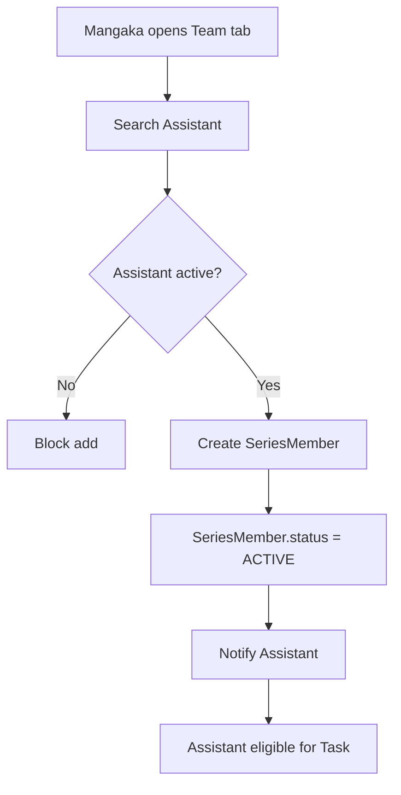

## 1. Tổng quan

Flow 03 mô tả cách tạo Production Team cho một Series. Assistant chỉ đủ điều kiện nhận Task nếu đã là member active của Production Team trong Series đó.

## 2. Mục tiêu nghiệp vụ

- Quản lý danh sách nhân sự production của Series.
- Cho phép Mangaka thêm Assistant vào team.
- Chặn assign Task cho Assistant không thuộc team.
- Tạo nền permission trước khi giao Page/Region Task.

## 3. Phạm vi

In scope: add member, remove member, check assistant eligibility, team member status, notification, audit log.

Out of scope: Task creation, submission, payroll, board decision, publication.

## 4. Actor tham gia

| Actor         | Vai trò                         |
| ------------- | ------------------------------- |
| Mangaka       | Quản lý Production Team         |
| Assistant     | Được thêm vào team để nhận Task |
| Tantou Editor | Monitor team                    |
| System        | Validate user/team/status       |
| Admin         | Quản lý tài khoản user          |

## 5. Điều kiện bắt đầu / kết thúc

Bắt đầu khi Series đã approved/ongoing/at-risk và Mangaka muốn chuẩn bị nhân sự production.

Kết thúc thành công khi:

```
SeriesMember.status = ACTIVE
SeriesMember.roleInSeries = ASSISTANT
```

Kết thúc thất bại khi Assistant không active, không tồn tại hoặc Series không cho production.

## 6. Entity liên quan

```
Series
User
SeriesMember
Notification
AuditLog
```

## 7. SeriesMember Status

| Status  | Ý nghĩa                       |
| ------- | ----------------------------- |
| INVITED | Đã mời nhưng chưa active      |
| ACTIVE  | Đang thuộc Production Team    |
| REMOVED | Đã rời khỏi team              |
| PAUSED  | Tạm dừng nhận việc trong team |

## 8. Assistant Eligibility Status

Assistant eligible khi:

```
User.role = ASSISTANT
User.status = ACTIVE
SeriesMember.seriesId = target series
SeriesMember.userId = assistantId
SeriesMember.status = ACTIVE
```

Không eligible thì không được assign Task.

## 9. Step-by-step flow

```
Mangaka opens Production Team tab
↓
System loads current SeriesMember list
↓
Mangaka searches Assistant
↓
System validates Assistant active
↓
Mangaka adds Assistant to team
↓
System creates SeriesMember
↓
SeriesMember.status = ACTIVE
↓
Notify Assistant
↓
Assistant becomes eligible for Task Assignment
```

Remove flow:

```
Mangaka removes Assistant
↓
System checks active tasks
↓
If no blocking tasks, SeriesMember.status = REMOVED
↓
Assistant cannot receive new tasks
```

## 10. Revision loop

Flow này không có revision loop. Loop tương ứng là quản lý membership:

```
Add member
↓
Member active
↓
Pause/remove if needed
↓
Re-add later if allowed
```

## 11. Permission Matrix

| Action            | Mangaka | Assistant     | Editor   | Board | Admin    |
| ----------------- | ------- | ------------- | -------- | ----- | -------- |
| ---               | ---:    | ---:          | ---:     | ---:  | ---:     |
| View team         | Có      | Có nếu member | Có       | Không | Có       |
| Add Assistant     | Có      | Không         | Optional | Không | Optional |
| Remove Assistant  | Có      | Không         | Optional | Không | Optional |
| Check eligibility | Có      | Không         | Có       | Không | Có       |
| Assign Task       | Flow 05 | Không         | Optional | Không | Optional |

## 12. API đề xuất

```
GET    /api/series/:seriesId/members
POST   /api/series/:seriesId/members
PATCH  /api/series/:seriesId/members/:memberId
DELETE /api/series/:seriesId/members/:memberId
GET    /api/series/:seriesId/eligible-assistants
GET    /api/assistants/search
```

## 13. UI screens đề xuất

```
/app/mangaka/series/:seriesId/team
/app/mangaka/series/:seriesId/team/add
/app/editor/series/:seriesId/team
/app/assistant/series
```

## 14. Notification events

```
ASSISTANT_ADDED_TO_TEAM
ASSISTANT_REMOVED_FROM_TEAM
TEAM_MEMBER_PAUSED
TEAM_MEMBER_REACTIVATED
```

## 15. Audit log events

```
SERIES_MEMBER_ADDED
SERIES_MEMBER_REMOVED
SERIES_MEMBER_PAUSED
SERIES_MEMBER_REACTIVATED
ASSISTANT_ELIGIBILITY_CHECK_FAILED
```

## 16. Business rules

- Assistant phải thuộc Production Team trước khi nhận Task.
- Team membership không đồng nghĩa được xem toàn bộ Page/Chapter.
- Assistant chỉ thấy Task được assign.
- Remove Assistant không xóa lịch sử Task/Submission.
- Không nên remove Assistant nếu đang có active Task, trừ khi reassign/cancel trước.

## 17. Edge cases

| Case                            | Expected behavior                 |
| ------------------------------- | --------------------------------- |
| Add Assistant inactive          | Block                             |
| Add duplicate Assistant         | Block hoặc return existing member |
| Remove Assistant có active Task | Block hoặc require reassignment   |
| Series cancelled                | Block add new member              |
| Assistant removed               | Cannot receive new task           |

## 18. Mermaid activity flow



## 19. Acceptance Criteria

- Mangaka thêm được Assistant active vào team.
- Assistant active trong team mới nhận Task được.
- Assistant không thuộc team bị block khi assign.
- Remove member chặn nếu còn active Task.
- Add/remove member có AuditLog.

## 20. MVP implementation priority

```
1. SeriesMember model
2. Add Assistant to team
3. Remove Assistant from team
4. Eligible assistants API
5. Eligibility check in Task Assignment
6. Team UI
7. Notification + AuditLog
```
