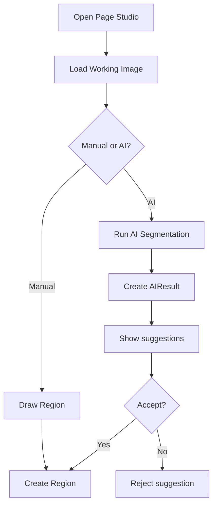

## 1. Tổng quan

Flow 04 mô tả Page Studio: nơi Mangaka/Editor mở Page, xem Working Image, tạo Region thủ công hoặc chạy AI segmentation để gợi ý vùng làm việc.

## 2. Mục tiêu nghiệp vụ

- Hiển thị Page bằng Working Image để tối ưu hiệu năng.
- Cho phép tạo/sửa/xóa Region.
- Cho phép AI gợi ý Region nếu AI module bật.
- Lưu coordinates để dùng cho Task Assignment.
- Đảm bảo AI không tạo ảnh trùng không cần thiết.

## 3. Phạm vi

In scope: Page Studio, manual region, AI suggestion, accept/reject AI region, annotation basic, audit log.

Out of scope: Assistant submission, Mangaka review, Editor final approval, publication, payroll.

## 4. Actor tham gia

| Actor         | Vai trò                                        |
| ------------- | ---------------------------------------------- |
| Mangaka       | Tạo/sửa/xóa Region, chạy AI suggestion         |
| Tantou Editor | Xem/annotate, optional tạo Region              |
| Assistant     | Chỉ thấy Region nếu Task liên quan được assign |
| AI Service    | Gợi ý panel/bubble/area                        |
| System        | Lưu Region, AIResult, audit                    |

## 5. Điều kiện bắt đầu / kết thúc

Bắt đầu khi Page đã upload và có Working Image.

```
Page.status in [UPLOADED, READY_FOR_REGION]
Page.workingFileAssetId exists
User has Page Studio permission
```

Kết thúc thành công khi Region được tạo hoặc AI suggestion được accept/reject rõ ràng.

## 6. Entity liên quan

```
Page
Region
AIResult
FileAsset
Annotation
AuditLog
Notification
```

## 7. Region Status

| Status         | Ý nghĩa                        |
| -------------- | ------------------------------ |
| CREATED        | Region được tạo thủ công       |
| AI_SUGGESTED   | AI gợi ý nhưng chưa accept     |
| ACCEPTED       | AI suggestion đã được accept   |
| REJECTED       | AI suggestion bị bỏ qua        |
| LINKED_TO_TASK | Region đã được dùng trong Task |

## 8. AIResult Status

| Status             | Ý nghĩa                         |
| ------------------ | ------------------------------- |
| PENDING            | Đang chờ xử lý AI               |
| COMPLETED          | AI trả kết quả thành công       |
| FAILED             | AI xử lý lỗi                    |
| PARTIALLY_ACCEPTED | Một phần suggestion được accept |

## 9. Step-by-step flow

Manual flow:

```
Mangaka opens Page Studio
↓
System loads Working Image
↓
Mangaka draws Region
↓
Mangaka selects Region type
↓
System creates Region
↓
Region.status = CREATED
```

AI flow:

```
Mangaka clicks Run AI Segmentation
↓
System sends workingFileAssetId to AI service
↓
AI returns boxes/masks/metadata
↓
System creates AIResult
↓
UI shows suggested Regions
↓
Mangaka accepts/edits/rejects suggestions
↓
Accepted suggestions become Region records
```

## 10. Revision loop

Region edit loop:

```
Region created or suggested
↓
Mangaka adjusts coordinates/type
↓
Save Region
↓
Use Region for Task Assignment
```

AI retry loop:

```
AIResult FAILED
↓
User retries AI segmentation
↓
System creates new AIResult
```

## 11. Permission Matrix

| Action               | Mangaka | Editor   | Assistant assigned   | Assistant khác | Board |
| -------------------- | ------- | -------- | -------------------- | -------------- | ----- |
| ---                  | ---:    | ---:     | ---:                 | ---:           | ---:  |
| Open Page Studio     | Có      | Có       | Có nếu task assigned | Không          | Không |
| Create Region        | Có      | Optional | Không                | Không          | Không |
| Run AI               | Có      | Optional | Không                | Không          | Không |
| Accept AI suggestion | Có      | Optional | Không                | Không          | Không |
| View assigned Region | Có      | Có       | Có                   | Không          | Không |

## 12. API đề xuất

```
GET    /api/pages/:pageId/studio
POST   /api/pages/:pageId/regions
PATCH  /api/regions/:regionId
DELETE /api/regions/:regionId
POST   /api/pages/:pageId/ai/segment
GET    /api/pages/:pageId/ai-results
POST   /api/ai-results/:aiResultId/accept-region
POST   /api/ai-results/:aiResultId/reject-region
```

## 13. UI screens đề xuất

```
/app/mangaka/pages/:pageId/studio
/app/editor/pages/:pageId/studio
/app/assistant/tasks/:taskId/studio
```

Components:

```
WorkingImageCanvas
RegionToolbar
RegionLayer
AISuggestionPanel
AnnotationLayer
```

## 14. Notification events

```
AI_SEGMENTATION_COMPLETED
AI_SEGMENTATION_FAILED
REGION_CREATED
REGION_UPDATED
REGION_DELETED
```

## 15. Audit log events

```
PAGE_STUDIO_OPENED
REGION_CREATED
REGION_UPDATED
REGION_DELETED
AI_SEGMENTATION_REQUESTED
AI_SEGMENTATION_COMPLETED
AI_REGION_ACCEPTED
AI_REGION_REJECTED
```

## 16. Business rules

- AI dùng `workingFileAssetId` làm input mặc định.
- AIResult lưu JSON/metadata, không lưu ảnh trùng nếu không cần.
- AI suggestion chưa phải Region production cho tới khi Mangaka accept.
- Region không nên xóa nếu đã link với active Task.
- Manual Region luôn dùng được dù AI disabled.

## 17. Edge cases

| Case                             | Expected behavior |
| -------------------------------- | ----------------- |
| Missing working image            | Block Page Studio |
| AI service timeout               | AIResult = FAILED |
| User reject all suggestions      | No Region created |
| Edit Region linked to Task       | Warn hoặc block   |
| Assistant mở Page không assigned | Block             |

## 18. Mermaid activity flow



## 19. Acceptance Criteria

- Page Studio load Working Image.
- Mangaka tạo Region thủ công được.
- AI suggestion hoạt động khi module bật.
- AIResult không tạo ảnh copy trùng.
- Accepted AI suggestion tạo Region.
- Assistant không thấy Region/Page nếu chưa assigned.

## 20. MVP implementation priority

```
1. Page Studio load Working Image
2. Manual Region CRUD
3. Region canvas coordinates
4. Basic annotation layer
5. AI segmentation API stub
6. AIResult model
7. Accept/reject AI suggestions
8. AuditLog + Notification
```
