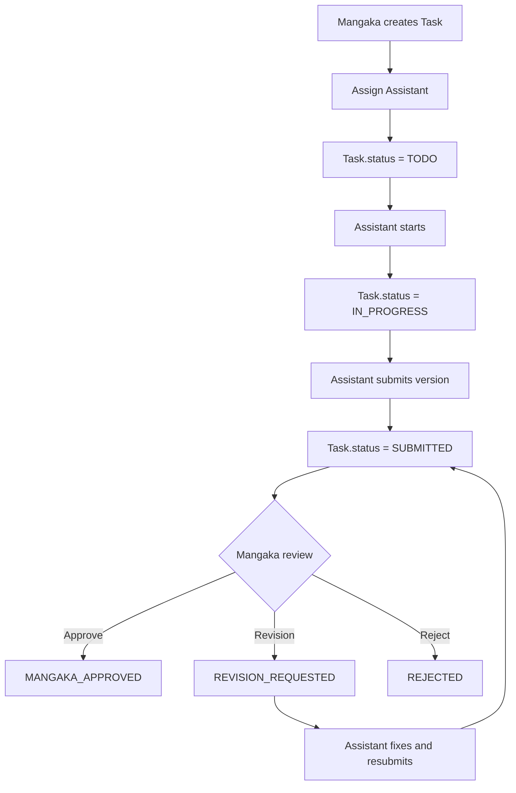

## 1. Tổng quan

Flow 05 tập trung vào task lifecycle phía Assistant: Mangaka tạo Task trên Page hoặc Region, assign Assistant, Assistant start và submit nhiều version, resubmit sau khi bị revision. Phần Mangaka review queue chi tiết (approve / request revision / reject) được mô tả riêng ở Flow 06.

## 2. Mục tiêu nghiệp vụ

- Dùng Task làm đơn vị công việc chính.
- Assign Assistant thuộc Production Team.
- Quản lý Submission theo version.
- Cho phép Mangaka approve, request revision hoặc reject.
- Feedback gắn đúng Task, Page/Region và Submission version.

## 3. Phạm vi

In scope: create task, assign assistant, assistant start task, submit v1/v2/v3, resubmit version, notification, audit log.

Out of scope: Mangaka review queue chi tiết (Flow 06), Editor final approval, payroll, publication, Board decision.

## 4. Actor tham gia

| Actor | Vai trò |
| --- | --- |
| Mangaka | Tạo Task, assign, review, approve/revision/reject |
| Assistant | Nhận Task, làm việc, submit version mới |
| System | Validate, versioning, status, notification |
| Editor | Final review ở Flow 07 |
| Board | Không tham gia |

## 5. Điều kiện bắt đầu / kết thúc

Bắt đầu khi Page/Region đã sẵn sàng và Assistant đã thuộc Production Team.

```
Series.status in [APPROVED, ONGOING, AT_RISK]
Chapter.status = IN_PRODUCTION
Page.status = UPLOADED
Assistant is active SeriesMember
TaskType is active
```

Kết thúc chính khi:

```
Task.status = MANGAKA_APPROVED
```

Hoặc thất bại/kết thúc phụ khi Task bị `REJECTED` hoặc `CANCELLED`.

## 6. Entity liên quan

```
Task
Submission
Comment
Annotation
FileAsset
Page
Region
SeriesMember
Notification
AuditLog
```

## 7. Task Status

| Status | Ý nghĩa |
| --- | --- |
| TODO | Task mới assign, chưa bắt đầu |
| IN_PROGRESS | Assistant đang làm |
| SUBMITTED | Assistant đã nộp current version |
| REVISION_REQUESTED | Mangaka yêu cầu sửa |
| MANGAKA_APPROVED | Mangaka đã approve |
| EDITOR_APPROVED | Editor đã approve cuối |
| REJECTED | Task bị từ chối |
| CANCELLED | Task bị hủy |

## 8. Submission Status

| Status | Ý nghĩa |
| --- | --- |
| SUBMITTED | Assistant đã nộp |
| REVISION_REQUESTED | Version này cần sửa |
| MANGAKA_APPROVED | Version được Mangaka approve |
| EDITOR_APPROVED | Version được Editor approve |
| REJECTED | Version bị reject |

## 9. Step-by-step flow

```
Mangaka opens Page Studio
↓
Mangaka creates Page-level or Region-level Task
↓
System validates Assistant eligibility
↓
Assign Assistant A
↓
Task.status = TODO
↓
Assistant opens Task Studio
↓
Assistant starts Task
↓
Task.status = IN_PROGRESS
↓
Assistant submits v1
↓
Submission.version = 1
Task.status = SUBMITTED
↓
Mangaka reviews current submission
↓
Approve / Request Revision / Reject
```

## 10. Revision loop

```
Assistant submit v1
↓
Mangaka review v1
↓
If not good:
    Task.status = REVISION_REQUESTED
    Submission.status = REVISION_REQUESTED
    Mangaka creates comment/annotation
↓
Assistant fixes
↓
Assistant submit v2
↓
Task.status = SUBMITTED
↓
Mangaka review v2
↓
Loop until MANGAKA_APPROVED or REJECTED
```

Submission không được ghi đè. Mỗi lần submit tạo version mới.

## 11. Permission Matrix

| Action | Mangaka | Assigned Assistant | Other Assistant | Editor | Board |
| --- | --- | --- | --- | --- | --- |
| --- | ---: | ---: | ---: | ---: | ---: |
| Create Task | Có | Không | Không | Optional | Không |
| Assign Task | Có | Không | Không | Optional | Không |
| View assigned Task | Có | Có | Không | Có | Không |
| Start Task | Không | Có | Không | Không | Không |
| Submit work | Không | Có | Không | Không | Không |
| Review submission | Có | Không | Không | Flow 07 | Không |
| Request revision | Có | Không | Không | Flow 07 | Không |
| Approve | Có | Không | Không | Flow 07 | Không |

## 12. API đề xuất

```
POST   /api/pages/:pageId/tasks
POST   /api/regions/:regionId/tasks
GET    /api/tasks/:taskId
POST   /api/tasks/:taskId/start
POST   /api/tasks/:taskId/submissions
GET    /api/tasks/:taskId/submissions
POST   /api/submissions/:submissionId/approve
POST   /api/submissions/:submissionId/request-revision
POST   /api/submissions/:submissionId/reject
POST   /api/tasks/:taskId/comments
POST   /api/pages/:pageId/annotations
```

## 13. UI screens đề xuất

```
/app/mangaka/pages/:pageId/studio
/app/mangaka/tasks/:taskId/review
/app/assistant/tasks
/app/assistant/tasks/:taskId/studio
```

## 14. Notification events

```
TASK_ASSIGNED
TASK_STARTED
TASK_SUBMITTED
TASK_RESUBMITTED
REVISION_REQUESTED
TASK_MANGAKA_APPROVED
TASK_REJECTED
COMMENT_CREATED
```

## 15. Audit log events

```
TASK_CREATED
TASK_ASSIGNED
TASK_STARTED
SUBMISSION_CREATED
SUBMISSION_VERSION_CREATED
TASK_REVISION_REQUESTED
TASK_MANGAKA_APPROVED
TASK_REJECTED
COMMENT_CREATED
ANNOTATION_CREATED
```

## 16. Business rules

- Không giao trực tiếp Page cho Assistant; phải tạo Task.
- Assistant chỉ submit Task được assign cho mình.
- Assistant không thấy Task của Assistant khác.
- Submission không ghi đè version cũ.
- Request revision bắt buộc có feedback.
- Annotation dùng coordinates trên Working Image.
- Không tạo 2 active Task trùng `targetType + targetId + taskType` khi Task trước chưa kết thúc (`EDITOR_APPROVED`, `REJECTED` hoặc `CANCELLED`). Ví dụ: `Page 01 - COLORING - Assistant A - IN_PROGRESS` thì chưa được tạo `Page 01 - COLORING - Assistant B - TODO`. Mục tiêu: tránh 2 Assistant cùng sửa một Page/Region.
- Payroll chưa tính ở `MANGAKA_APPROVED`.

## 17. Edge cases

| Case | Expected behavior |
| --- | --- |
| Assistant không thuộc team | Block assign |
| Assistant inactive | Block assign |
| Submit khi không assigned | Block |
| Approve submission cũ | Block |
| Request revision thiếu comment | Block |
| Task cancelled | Block submit |
| Tạo active Task trùng target + taskType | Block tới khi task cũ EDITOR_APPROVED/REJECTED/CANCELLED |

## 18. Mermaid activity flow



## 19. Acceptance Criteria

- Mangaka tạo được Page/Region Task.
- Chỉ assign được Assistant eligible.
- Assistant thấy và submit Task của mình.
- Submit lại tạo version mới.
- Mangaka request revision có feedback.
- Loop lặp tới khi approve/reject.
- Task `MANGAKA_APPROVED` sẵn sàng cho Editor final review.

## 20. MVP implementation priority

```
1. Task model
2. Eligibility check
3. Assign Assistant
4. Assistant Task Studio
5. Submission upload
6. Submission versioning
7. Mangaka review action
8. Revision comment
9. Notification
10. AuditLog
```