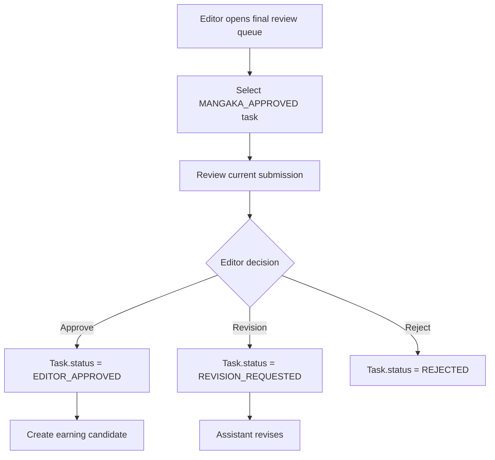

## 1. Tổng quan

Flow 07 mô tả bước Tantou Editor final review sau khi Mangaka đã approve Assistant work. Đây là gate chất lượng cuối trước khi Task/Page được xem là hoàn thành hợp lệ.

## 2. Mục tiêu nghiệp vụ

- Editor kiểm tra final output sau Mangaka approval.
- Approve hoặc request revision ở cấp editorial.
- Xác định Task đủ điều kiện tính earning.
- Cập nhật Page/Chapter readiness nếu tất cả Task đạt.

## 3. Phạm vi

In scope: editor review queue, final approve, request revision, reject, update task/page status, earning trigger candidate, notification, audit log.

Out of scope: Mangaka task assignment, Assistant initial work, actual payment, publication scheduling.

## 4. Actor tham gia

| Actor | Vai trò |
| --- | --- |
| Tantou Editor | Final review và quyết định |
| Mangaka | Nhận notification nếu Editor yêu cầu sửa |
| Assistant | Sửa task nếu bị revision |
| System | Update status, notify, audit, trigger earning candidate |

## 5. Điều kiện bắt đầu / kết thúc

Bắt đầu khi:

```
Task.status = MANGAKA_APPROVED
Submission.status = MANGAKA_APPROVED
Editor has access to Series/Chapter
```

Kết thúc thành công khi:

```
Task.status = EDITOR_APPROVED
Submission.status = EDITOR_APPROVED
```

Kết thúc khác: `REVISION_REQUESTED` hoặc `REJECTED`.

## 6. Entity liên quan

```
Task
Submission
Page
Chapter
Comment
Annotation
AssistantEarningCandidate
Notification
AuditLog
```

## 7. Task Status

| Status | Ý nghĩa |
| --- | --- |
| MANGAKA_APPROVED | Chờ Editor final review |
| EDITOR_APPROVED | Final approved, eligible for earning |
| REVISION_REQUESTED | Editor yêu cầu sửa |
| REJECTED | Editor reject |

## 8. Page Approval Status

| Status | Ý nghĩa |
| --- | --- |
| IN_PROGRESS | Page vẫn còn task đang làm |
| UNDER_REVIEW | Có task/submission đang review |
| APPROVED | Tất cả required tasks đã Editor approved |

## 9. Step-by-step flow

```
Editor opens Final Review Queue
↓
System lists Tasks with MANGAKA_APPROVED
↓
Editor opens Task/Page review detail
↓
Editor checks current submission
↓
Editor chooses:
    Final Approve
    Request Revision
    Reject
```

If approve:

```
Task.status = EDITOR_APPROVED
Submission.status = EDITOR_APPROVED
System checks Page completion
System creates earning candidate
```

## 10. Revision loop

```
Editor request revision
↓
Task.status = REVISION_REQUESTED
Task.revisionRequestedByRole = EDITOR
Submission.status = REVISION_REQUESTED
Editor creates feedback
↓
Notify Mangaka + Assistant
↓
Assistant submits new version
↓
Mangaka reviews again
↓
If Mangaka approved, Task returns to Editor queue
```

## 11. Permission Matrix

| Action | Editor | Mangaka | Assistant | Board | Admin |
| --- | --- | --- | --- | --- | --- |
| --- | ---: | ---: | ---: | ---: | ---: |
| View final review queue | Có | Không | Không | Không | Optional |
| Final approve | Có | Không | Không | Không | Optional |
| Request revision | Có | Không | Không | Không | Optional |
| Reject | Có | Optional | Không | Không | Optional |
| View own task result | Có | Có | Có nếu assigned | Không | Có |

## 12. API đề xuất

```
GET  /api/editor/final-reviews
GET  /api/editor/tasks/:taskId/review
POST /api/editor/submissions/:submissionId/approve
POST /api/editor/submissions/:submissionId/request-revision
POST /api/editor/submissions/:submissionId/reject
GET  /api/editor/pages/:pageId/status
```

## 13. UI screens đề xuất

```
/app/editor/final-reviews
/app/editor/tasks/:taskId/review
/app/editor/pages/:pageId/review
/app/editor/chapters/:chapterId/progress
```

## 14. Notification events

```
TASK_READY_FOR_EDITOR_REVIEW
TASK_EDITOR_APPROVED
EDITOR_REQUESTED_REVISION
TASK_EDITOR_REJECTED
PAGE_APPROVED
```

## 15. Audit log events

```
EDITOR_REVIEW_OPENED
TASK_EDITOR_APPROVED
EDITOR_REVISION_REQUESTED
TASK_EDITOR_REJECTED
PAGE_APPROVED
EARNING_CANDIDATE_CREATED
```

## 16. Business rules

- Payroll chỉ eligible sau `EDITOR_APPROVED`.
- Mangaka approval không đủ để tính earning.
- Editor có thể request revision sau Mangaka approval.
- Revision dùng chung status `REVISION_REQUESTED`, nhưng phải lưu metadata để phân biệt nguồn: `revisionRequestedByRole = MANGAKA | EDITOR`, `revisionRequestedByUserId`, `revisionRequestedAt`.
- Page chỉ approved khi tất cả required tasks đã `EDITOR_APPROVED`.
- Editor feedback phải link với task/submission.

## 17. Edge cases

| Case | Expected behavior |
| --- | --- |
| Task chưa Mangaka approved | Không vào final queue |
| Editor approve duplicate | Block |
| Editor revision thiếu reason | Block |
| Page còn task chưa approved | Page chưa APPROVED |
| Task rejected | Không tạo earning |

## 18. Mermaid activity flow



## 19. Acceptance Criteria

- Editor thấy queue task `MANGAKA_APPROVED`.
- Editor approve chuyển Task sang `EDITOR_APPROVED`.
- Editor revision quay lại Assistant/Mangaka loop.
- Editor reject yêu cầu reason.
- Earning chỉ phát sinh sau Editor approval.
- Page approved khi tất cả required tasks approved.

## 20. MVP implementation priority

```
1. Editor final review queue
2. Final review detail
3. Editor approve action
4. Editor revision action
5. Editor reject action
6. Page approval check
7. Earning candidate trigger
8. Notification + AuditLog
```