# MangaFlow — Business Workflow Specification

## 1. Mục tiêu hệ thống

MangaFlow là hệ thống quản lý quy trình sáng tác, sản xuất và xuất bản manga, hỗ trợ phối hợp giữa Admin, Mangaka, Assistant, Tantou Editor và Editorial Board.

Luồng tổng quan:

```
Tạo series mới
→ Nộp bản thảo sơ bộ
→ Editor review
→ Board xét duyệt
→ Tạo chapter chính thức
→ Upload page
→ Tạo region
→ Giao task cho assistant
→ Assistant submit
→ Mangaka review
→ Editor final approval
→ Publication readiness
→ Ranking
→ At-risk decision
→ Payroll tracking
```

---

## 2. Auth & User Management

Hệ thống không dùng Clerk. MVP sử dụng custom auth.

```
Custom Auth
Email + Password
JWT Access Token
Refresh Token
Google OAuth optional
```

### Admin tạo user

Trong MVP, Admin là người tạo user và gán role.

```
Seed sẵn Admin
→ Admin login
→ Admin tạo user
→ Admin gán role
→ User login
→ Redirect theo role
```

Roles:

```
ADMIN
MANGAKA
ASSISTANT
EDITOR
BOARD
```

Role nhạy cảm như `ADMIN`, `EDITOR`, `BOARD`, `BOARD_CHAIR` không cho user tự chọn.

### Redirect theo role

| Role      | Redirect                   |
| --------- | -------------------------- |
| ADMIN     | `/app/admin/dashboard`     |
| MANGAKA   | `/app/mangaka/dashboard`   |
| ASSISTANT | `/app/assistant/dashboard` |
| EDITOR    | `/app/editor/dashboard`    |
| BOARD     | `/app/board/dashboard`     |

---

## 3. Actor Responsibilities

### Admin

Admin quản lý hệ thống:

- Tạo user
- Gán role
- Suspend / activate user
- Quản lý Board Member
- Set Board Chair
- Cấu hình Task Type / Task Rate
- Xem audit log
- Xem storage và system health

Admin không quyết định xuất bản hoặc hủy series. Quyết định đó thuộc Editorial Board.

### Mangaka

Mangaka có thể:

- Tạo Series Profile
- Upload bản thảo sơ bộ
- Submit bản thảo cho Tantou Editor
- Xem feedback/revision từ Editor
- Upload manuscript version mới
- Sau khi Series được Board approve thì tạo Chapter
- Upload Pages
- Mở Page Workspace
- Tạo Region
- Thêm Assistant vào Production Team của Series
- Giao Task cho Assistant
- Review Assistant Submission
- Approve / Request Revision / Reject Submission
- Theo dõi Ranking
- Xác nhận Payroll cho Assistant

### Assistant

Assistant có thể:

- Xem My Tasks
- Mở Task Workspace
- Xem page/region được giao
- Xem context pages nếu task được cấp quyền
- Upload kết quả
- Submit work
- Sửa lại khi bị request revision
- Theo dõi earnings

Assistant không được:

- Xem toàn bộ chapter mặc định
- Xem page không liên quan task
- Xem task của assistant khác
- Xem Board data
- Xác nhận payroll
- Tự tạo task

### Tantou Editor

Tantou Editor có thể:

- Review bản thảo sơ bộ
- Request Revision nếu bản thảo chưa ổn
- Reject nếu bản thảo không phù hợp
- Forward series lên Editorial Board nếu đạt yêu cầu
- Review page/chapter
- Tạo comment/annotation
- Request revision
- Final approve task/submission/page
- Resolve/reopen comment
- Check publication readiness
- Chuẩn bị ranking support data để bảo vệ series

### Editorial Board

Editorial Board xử lý quyết định cấp cao:

- Review Series Summary
- Vote approve/reject/needs revision cho series mới
- Quyết định publication type: Weekly / Monthly
- Nhập ranking data sau kỳ phát hành
- Xem ranking table
- Xử lý series at-risk
- Quyết định continue / warning / cancel series

Board không cần xem chi tiết toàn bộ page trong MVP.

---

## 4. Bản thảo sơ bộ

Bản thảo sơ bộ là bộ hồ sơ đề xuất series do Mangaka nộp trước khi series được duyệt chính thức.

```
Bản thảo sơ bộ = Series Proposal + Sample Manuscript
```

Bản thảo sơ bộ dùng để Editor và Board đánh giá:

- Ý tưởng truyện
- Cốt truyện
- Nhân vật
- Bố cục
- Nhịp kể chuyện
- Khả năng phát triển thành series
- Tính phù hợp với lịch xuất bản

### Khi upload bản thảo sơ bộ cần gì?

Thông tin Series:

| Trường                 | Bắt buộc |
| ---------------------- | -------- |
| ---                    | ---:     |
| Series Title           | Có       |
| Description / Synopsis | Có       |
| Genre                  | Có       |
| Target Audience        | Có       |
| Publication Type       | Có       |
| Tags                   | Optional |
| Cover Draft            | Optional |

File bản thảo sơ bộ:

| File               | Bắt buộc        | Ghi chú                  |
| ------------------ | --------------- | ------------------------ |
| ---                | ---:            | ---                      |
| PDF bản thảo sơ bộ | Nên có          | Dễ review tổng thể       |
| Ảnh page mẫu       | Có thể thay PDF | Nếu upload từng trang    |
| Character concept  | Optional        | Giúp Board hiểu nhân vật |
| Cover draft        | Optional        | Ảnh bìa nháp             |
| Reference image    | Optional        | Bối cảnh/thế giới        |

Supported formats:

```
PDF
PNG
JPG
JPEG
WEBP
PSD optional
```

### Bản thảo sơ bộ không phải Chapter

Trước khi Board duyệt, Mangaka chỉ có:

```
Series Profile
Manuscript sơ bộ
Manuscript versions
Editor comments
Board review info
```

Chưa được có:

```
Chapter chính thức
Page production chính thức
Task giao Assistant
Assistant submission
Payroll
Publication
```

Chỉ khi Board approve:

```
Series status = APPROVED
→ Mangaka mới được tạo Chapter chính thức
```

---

## 5. Rule tạo Chapter

Editorial Board phải approve Series trước thì Mangaka mới được tạo Chapter chính thức.

| Series Status      | Có được tạo Chapter không? |
| ------------------ | -------------------------- |
| ---                | ---:                       |
| DRAFT              | Không                      |
| EDITOR_REVIEW      | Không                      |
| REVISION_REQUESTED | Không                      |
| BOARD_REVIEW       | Không                      |
| APPROVED           | Có                         |
| ONGOING            | Có                         |
| AT_RISK            | Có, nhưng có cảnh báo      |
| CANCELLED          | Không                      |
| COMPLETED          | Không                      |

Board không vote từng Chapter. Board chỉ quyết định các điểm lớn:

- Approve series mới
- Quyết định weekly/monthly
- Theo dõi ranking
- Quyết định continue / warning / cancel khi at-risk

---

## 6. Luồng tạo và xét duyệt Series mới

```
Mangaka tạo Series Profile
→ Mangaka upload Manuscript sơ bộ
→ Mangaka submit cho Tantou Editor
→ Series status = EDITOR_REVIEW
→ Tantou Editor review
```

### Nếu bản thảo đạt yêu cầu

```
Editor chọn Forward to Board
→ Series status = BOARD_REVIEW
→ Editorial Board review Series Summary
→ Board vote
```

### Nếu bản thảo chưa đạt nhưng sửa được

```
Editor chọn Request Revision
→ Editor ghi feedback/comment/annotation
→ Series status = REVISION_REQUESTED
→ Manuscript status = REVISION_REQUESTED
→ Mangaka nhận notification
→ Mangaka sửa bản thảo
→ Mangaka upload Manuscript version mới
→ Mangaka submit lại cho Editor
→ Series status = EDITOR_REVIEW
```

Manuscript không bị ghi đè. Mỗi lần sửa là một major version mới.

### Nếu bản thảo không phù hợp

```
Editor chọn Reject
→ Editor nhập lý do
→ Series status = REJECTED
→ Mangaka nhận notification
→ Flow dừng
```

---

## 7. Editorial Board Vote

Board chỉ xử lý series đã qua Tantou Editor.

```
Series status = BOARD_REVIEW
→ Board mở Series Summary
→ Board xem thông tin series, manuscript summary, genre, target audience, editor recommendation, feasibility
→ Board Member vote
```

Vote options:

```
APPROVE
REJECT
NEEDS_REVISION
```

Voting rule:

```
Voting result is determined by the option with the highest vote count after quorum is met.
If two or more options tie for highest vote count, Board Chair must make the tie-break decision.
```

Kết quả:

| Result         | System Action                        |
| -------------- | ------------------------------------ |
| APPROVED       | `Series status = APPROVED`           |
| REJECTED       | `Series status = REJECTED`           |
| NEEDS_REVISION | `Series status = REVISION_REQUESTED` |

---

## 8. Luồng tạo Chapter và Upload Page

```
Mangaka mở Series đã được approved
→ Mangaka tạo Chapter
→ Chapter status = DRAFT
→ Mangaka upload Pages
→ System validate file
→ System lưu original file vào Cloudflare R2
→ System tạo AI copy, preview, thumbnail
→ Page status = UPLOADED
```

Upload constraints:

```
Max 50 pages/upload
Max 50MB/image
Supported: PNG, JPG, JPEG, WEBP
Original: lưu nguyên bản
AI copy: max 2048px width
Preview: max 1600px width
Thumbnail: 300px width
```

---

## 9. Workspace Logic

Workspace trong MVP không cần model riêng.

```
Workspace = UI screen / aggregate view
Không bắt buộc = database model
```

Workspace được dựng từ:

```
Page
Region
Task
Submission
Comment
AIResult
FileAsset
BubbleTranslation
```

### Mangaka / Editor vào Workspace bằng Page

Routes:

```
/app/mangaka/pages/:pageId/workspace
/app/editor/pages/:pageId/review
```

API:

```
GET /api/pages/:pageId/workspace
```

Backend trả:

- page info
- signed preview URL
- regions
- tasks
- comments
- submissions
- AI results

### Assistant vào Workspace bằng Task

Assistant không vào bằng `pageId`, mà vào bằng `taskId`.

Route:

```
/app/assistant/tasks/:taskId/workspace
```

API:

```
GET /api/tasks/:taskId/workspace
```

Backend check:

```
task.assignedTo === currentUser._id
```

Nếu đúng thì trả:

- task detail
- page preview liên quan task
- assigned region
- reference files
- comments liên quan task
- submission history
- context pages nếu có

Assistant không thấy toàn bộ chapter mặc định.

---

## 10. Production Team và Assistant Access

Không assign task cho bất kỳ Assistant nào trong toàn hệ thống.

Chốt rule:

```
Assistant phải được thêm vào Production Team của Series trước
rồi mới được assign Task trong Series đó.
```

Sử dụng bảng quan hệ:

```
SeriesMember
- seriesId
- userId
- role = ASSISTANT
- status = ACTIVE
- accessScope = TASK_ONLY
```

Sau đó Task lưu:

```
Task.assignedTo = assistantUserId
Task.assignedBy = mangakaOrEditorUserId
```

SeriesMember không tự động cấp quyền xem toàn bộ chapter/page.

### Assistant có nên xem trang khác không?

Có thể, nhưng chỉ khi task được cấp context pages.

```
Assistant được giao Task
→ được xem page/region chính
→ có thể xem context pages được chọn, read-only
```

Ví dụ:

```
Task: Dịch bubble ở Page 5
Assigned Page: Page 5
Context Pages: Page 4, Page 6
```

Assistant được xem:

- Page 5 để làm việc
- Page 4 và Page 6 read-only để hiểu ngữ cảnh

Không được xem:

- Toàn bộ chapter mặc định
- Page không nằm trong task/context
- Task của assistant khác

Task nên có:

```
contextPageIds: ObjectId[]
```

---

## 11. Luồng thêm Assistant vào Production Team

```
Mangaka mở Series Members / Production Team
→ Add Assistant
→ System tạo SeriesMember role ASSISTANT, status ACTIVE
→ Assistant xuất hiện trong dropdown assign task
→ Bây giờ mới assign task được
```

Dropdown khi tạo task chỉ hiển thị Assistant thuộc Series hiện tại:

```
role = ASSISTANT
status = ACTIVE
```

---

## 12. Luồng Assign Task

Task có thể được giao theo 2 scope:

```
1. Region-level Task
2. Page-level Task
```

### Region-level Task

Dùng khi task gắn với một vùng cụ thể trên page.

Ví dụ:

- Dịch bubble này
- Xóa chữ bubble này
- Vẽ nền ở vùng này
- Sửa hiệu ứng vùng này

Flow:

```
Mangaka / Editor mở Page Workspace
→ Vẽ Rectangle Region
→ Save Region
→ Select Region
→ Create Task
→ Assign Assistant
```

### Page-level Task

Dùng khi task áp dụng cho toàn page.

Ví dụ:

- Clean toàn bộ page
- Lettering toàn page
- Translate toàn page
- Tô screentone toàn page

Flow:

```
Mangaka / Editor mở Page Workspace
→ Create Page-level Task
→ Assign Assistant
```

### Ai được tạo task?

| Actor           | Có được tạo task không?       |
| --------------- | ----------------------------- |
| ---             | ---:                          |
| Owner Mangaka   | Có                            |
| Co-Mangaka      | Có, nếu có quyền trong series |
| Tantou Editor   | Có                            |
| Admin           | Optional                      |
| Assistant       | Không                         |
| Editorial Board | Không                         |

### Điều kiện trước khi assign task

Backend phải check:

```
1. Series status = APPROVED / ONGOING / AT_RISK
2. Người assign là OWNER_MANGAKA / CO_MANGAKA / EDITOR của series
3. Assistant ACTIVE
4. Assistant có systemRole = ASSISTANT
5. Assistant là SeriesMember của series
6. SeriesMember.role = ASSISTANT
7. SeriesMember.status = ACTIVE
8. Page thuộc đúng chapter/series
9. Region nếu có thuộc đúng page
10. Due date không nằm trong quá khứ
11. Base rate >= 0
```

### Form tạo task

| Field              | Required | Ghi chú                                           |
| ------------------ | -------- | ------------------------------------------------- |
| ---                | ---:     | ---                                               |
| Task Title         | Có       | Tên task                                          |
| Description        | Có       | Mô tả công việc                                   |
| Task Type          | Có       | Lấy từ Task Type active                           |
| Assigned Assistant | Có       | Chỉ assistant trong series                        |
| Priority           | Có       | LOW / NORMAL / HIGH / URGENT                      |
| Due Date           | Có       | Deadline                                          |
| Base Rate          | Có       | Auto-fill từ Task Type, có thể chỉnh nếu có quyền |
| Region             | Optional | Có nếu task gắn vùng                              |
| Context Pages      | Optional | Previous/next/custom pages read-only              |
| Reference Files    | Optional | File hỗ trợ                                       |
| Note               | Optional | Ghi chú thêm                                      |

---

## 13. Admin cấu hình Task Type

Admin quản lý các loại task để Mangaka/Editor chọn khi giao việc.

Mục đích:

- Không hardcode loại task trong code
- Dễ thêm loại công việc mới
- Quản lý rate theo từng loại task
- Bật/tắt loại task
- Tính payroll chính xác

Default task types:

```
BACKGROUND
INKING
SCREENTONE
CLEANUP
EFFECT
TRANSLATION
LETTERING
BUBBLE_PROCESSING
OTHER
```

TaskType fields:

| Field                  | Bắt buộc | Ghi chú                        |
| ---------------------- | -------- | ------------------------------ |
| ---                    | ---:     | ---                            |
| name                   | Có       | Tên hiển thị                   |
| code                   | Có       | Mã định danh                   |
| description            | Optional | Mô tả                          |
| defaultRate            | Có       | Giá mặc định                   |
| currency               | Có       | POINT hoặc VND                 |
| isActive               | Có       | Có cho chọn khi tạo task không |
| allowRegionTask        | Có       | Có được gắn region không       |
| allowPageTask          | Có       | Có được gắn toàn page không    |
| requiresFileSubmission | Có       | Có cần upload file không       |
| requiresTextSubmission | Có       | Có cần nhập text không         |
| sortOrder              | Optional | Thứ tự hiển thị                |

Rule:

```
Mangaka/Editor chỉ chọn Task Type active.
Task đã tạo lưu baseRate riêng.
Nếu Admin đổi defaultRate, task cũ không bị đổi payment.
Task Type đã từng dùng thì không hard delete, chỉ disable.
```

API đề xuất:

```
GET    /api/task-types
GET    /api/task-types/active
POST   /api/task-types
GET    /api/task-types/:taskTypeId
PATCH  /api/task-types/:taskTypeId
DELETE /api/task-types/:taskTypeId
PATCH  /api/task-types/:taskTypeId/activate
PATCH  /api/task-types/:taskTypeId/deactivate
```

---

## 14. Task Status Flow

Main flow:

```
TODO
→ IN_PROGRESS
→ SUBMITTED
→ MANGAKA_APPROVED
→ EDITOR_APPROVED
```

Revision flow:

```
SUBMITTED
→ REVISION_REQUESTED
→ IN_PROGRESS
→ SUBMITTED
```

Reject flow:

```
SUBMITTED
→ REJECTED
→ Payment = 0
```

---

## 15. Assistant xử lý Task

```
Assistant login
→ Assistant mở My Tasks
→ System chỉ trả task có assignedTo = currentUser._id
→ Assistant chọn task
→ Mở Task Workspace
→ Assistant xem task description, assigned region/page, context pages, reference files, due date
→ Assistant Start Task
→ Task status = IN_PROGRESS
→ Assistant xử lý công việc
→ Assistant upload result file hoặc nhập text tùy Task Type
→ Assistant submit
→ Submission được tạo
→ Submission status = SUBMITTED
→ Task status = SUBMITTED
→ Meaning: pending Mangaka review
→ Mangaka nhận notification
```

UI label:

```
SUBMITTED => Pending Mangaka Review
```

---

## 16. Bubble Translation / Lettering

Nếu task là dịch bubble hoặc lettering:

```
Page đã được upload
→ AI detect bubble
→ System tạo Bubble Region
→ AI whiten bubble, tạo ảnh nền đã xóa chữ
→ Assistant mở Translation Workspace qua Task
→ Assistant click từng bubble
→ Assistant nhập translated text
→ Frontend preview text bằng overlay
→ Assistant save draft hoặc submit
```

Khi Assistant đang nhập text:

```
Whitened image + Text overlay trên frontend
```

Khi Assistant submit:

```
Backend lấy whitened image, bubble regions, translated text, font config
→ Backend render ra ảnh PNG mới
→ Upload rendered image lên R2
→ Tạo Submission version mới
```

Không render ảnh mới mỗi lần Assistant gõ.

---

## 17. Mangaka Review Submission

```
Mangaka nhận notification
→ Mangaka mở Submission Review
→ Mangaka xem task context, page/region, submitted file, assistant note, comment history
→ Mangaka chọn Approve / Request Revision / Reject
```

Nếu approve:

```
Submission status = MANGAKA_APPROVED
Task status = MANGAKA_APPROVED
Notify Tantou Editor
```

Nếu request revision:

```
Submission status = REVISION_REQUESTED
Task status = REVISION_REQUESTED
revisionRound += 1
Notify Assistant
```

Nếu reject:

```
Submission status = REJECTED
Task status = REJECTED
Payment = 0
Notify Assistant
```

---

## 18. Tantou Editor Final Approval

Sau khi Mangaka approve, Editor kiểm tra cuối.

```
Editor mở Page Review Workspace
→ Editor xem page, task, submission, comments
→ Editor chọn Final Approve / Request Revision / Add Comment
```

Nếu final approve:

```
Task status = EDITOR_APPROVED
Submission status = EDITOR_APPROVED
Page progress được cập nhật
Payroll calculation được trigger
```

Nếu request revision:

```
Task status = REVISION_REQUESTED
Submission status = REVISION_REQUESTED
Notify Assistant / Mangaka
```

---

## 19. Publication Readiness

Không phải 1 task được approve là được publish. Cần toàn bộ Chapter đạt readiness.

Checklist:

```
All pages uploaded
All tasks approved
All submissions approved
All comments resolved
Editor final approval exists
Publication date exists
```

Flow:

```
Tất cả task/page trong chapter đã EDITOR_APPROVED
→ System check Publication Readiness
→ Nếu đạt
→ Editor tạo/xác nhận publication schedule
→ Editor publish publication
→ Chapter status chuyển READY_FOR_PUBLICATION rồi PUBLISHED
```

Board approve Series + publication type. Editor quản lý lịch chapter cụ thể theo lịch đó.

MVP:

- Editor tạo hoặc cập nhật publication date.
- System check readiness trước khi publish.
- Khi publish thành công, Chapter chuyển `READY_FOR_PUBLICATION` rồi `PUBLISHED`.

Future:

- Publication scheduler tự publish theo lịch.
- Chapter có thể giữ trạng thái `READY_FOR_PUBLICATION` trong lúc chờ lịch chạy.

---

## 20. Comment Resolve Flow

```
Editor tạo comment
→ Comment status = OPEN
→ Assistant xử lý issue
→ Assistant mark fixed
→ Comment status = FIXED_BY_ASSISTANT
→ Mangaka kiểm tra nội bộ
→ Mangaka verify fixed
→ Comment status = VERIFIED_BY_MANGAKA
→ Editor kiểm tra lại
→ Editor resolve officially
→ Comment status = RESOLVED_BY_EDITOR
```

Nếu Editor thấy chưa đạt:

```
Editor reopen comment
→ Comment status = OPEN
→ Assistant / Mangaka tiếp tục xử lý
```

Rule:

```
Không được publish nếu còn comment chưa RESOLVED_BY_EDITOR
```

---

## 21. Ranking và At-Risk

Sau mỗi kỳ phát hành, Board nhập dữ liệu:

```
period
series
voteCount
readerScore 1–10
```

Formula:

```
normalizedReaderScore = readerScore * 10
finalScore = voteCount * 0.7 + normalizedReaderScore * 0.3
```

MVP:

```
Board imports/finalizes ranking data
System stores period, series, voteCount, readerScore, finalScore
Board manually reviews weak series
Board manually creates decision: CONTINUE / WARNING / REQUEST_IMPROVEMENT_PLAN / CANCEL
```

Future:

```
System calculates rank + previousRank automatically
System marks ranking WARNING / AT_RISK
System may mark Series AT_RISK
System notifies Mangaka + Editor
```

Board có thể quyết định:

```
CONTINUE
WARNING
REQUEST_IMPROVEMENT_PLAN
CANCEL
```

Series không bị hủy tự động. Hủy series là quyết định thủ công của Board.

---

## 22. Payroll

Payroll trong MVP chỉ là tracking, không thanh toán thật.

```
Task được Editor approve
→ System calculate earning
→ Create AssistantEarning
→ Mangaka xem payroll
→ Mangaka confirm payout
→ Earning status = CONFIRMED / PAID
```

Deadline rule:

```
Early ≤ 24h      → +10%
On time          → 0%
Late ≤ 24h       → -5%
Late > 24h       → mark LATE, no bonus
```

Formula:

```
finalPayment = basePayment * deadlineMultiplier
```

Future:

```
finalPayment = basePayment * (1 + bonusRate) + revisionFee
```

Nếu task bị reject:

```
finalPayment = 0
```

---

## 23. Notification

Notification được tạo khi:

```
Task assigned
Task submitted
Revision requested
Submission approved
Editor comment created
Comment resolved
Board decision finalized
Ranking warning
Payroll confirmed
Publication updated
```

Navbar Notification Bell:

```
Hiển thị 3–5 notification mới nhất
```

Sidebar Notifications:

```
Trang xem toàn bộ notification
Có filter, mark read, clear read
```

---

## 24. Entity chính

Core entities:

```
User
Series
SeriesMember
Manuscript
Chapter
Page
FileAsset
Region
Task
Submission
Comment
Annotation
```

Board entities:

```
BoardMember
BoardVote
BoardDecision
Publication
Ranking
```

Supporting entities:

```
Notification
AuditLog
TaskType
TaskRate
AssistantEarning
AIResult
BubbleTranslation
```

---

## 25. Mermaid Flow Tổng Quát

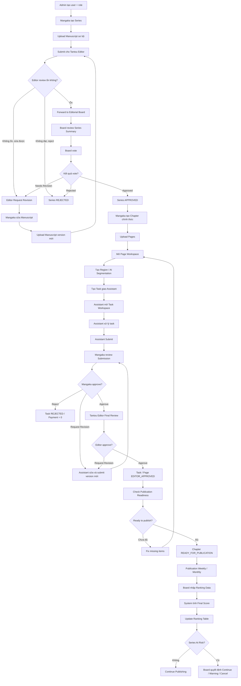

---

## 26. MVP Coding Priority

```
1. Custom Auth + Admin create user
2. User role guard
3. Series CRUD
4. Manuscript upload
5. Editor review manuscript
6. Board vote series
7. Series approval gate before chapter creation
8. Chapter + Page upload
9. Page Workspace
10. Region creation
11. Production Team / SeriesMember assistant management
12. Admin Task Type configuration
13. Assign Task to Assistant in Series
14. Context Pages for Task Workspace
15. Assistant Task Workspace
16. Submission
17. Mangaka review
18. Editor final approval
19. Comment resolve flow
20. Publication readiness
21. Ranking import
22. Payroll tracking
```

---

## Mermaid Activity Flows theo từng luồng

> Phần này bổ sung activity flow dạng Mermaid cho từng nghiệp vụ chính của MangaFlow. Có thể dùng để review logic trước khi triển khai API, schema và frontend route.

### 1. Auth & Admin Create User Flow

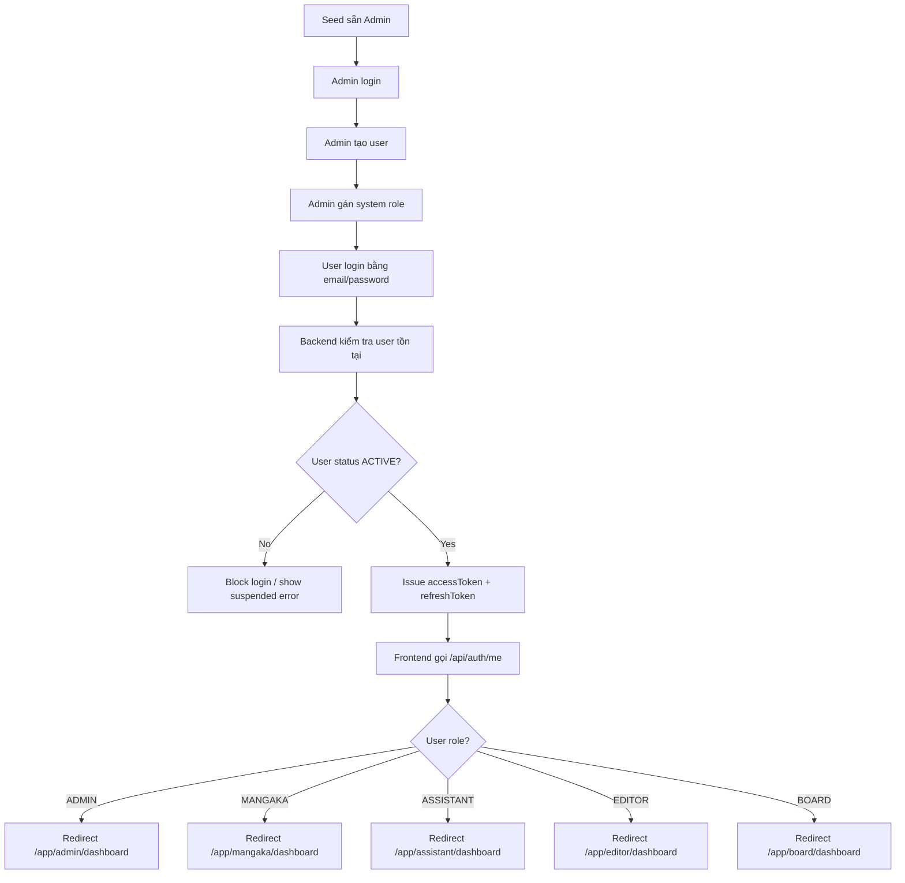

---

### 2. Series Proposal & Manuscript Review Flow

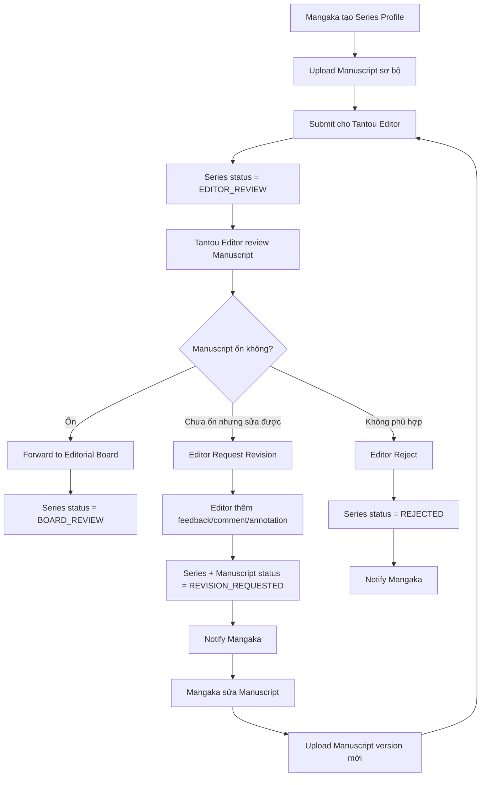

---

### 3. Editorial Board Vote Flow

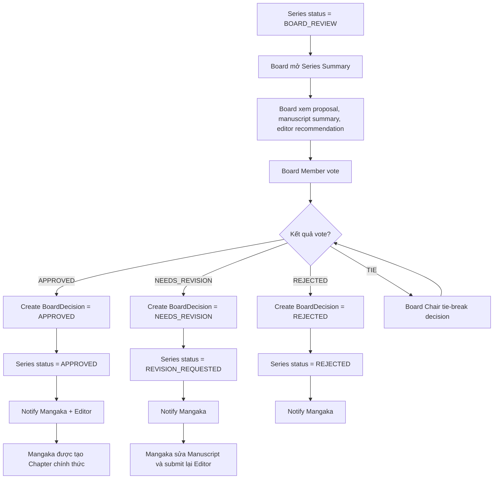

---

### 4. Chapter Creation Gate Flow

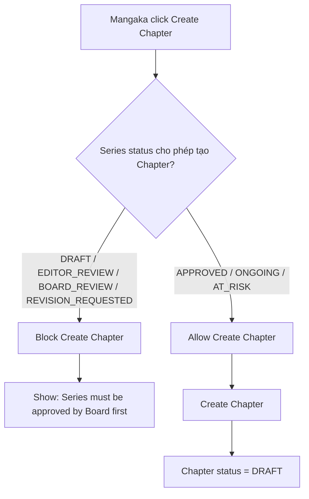

---

### 5. Page Upload Flow

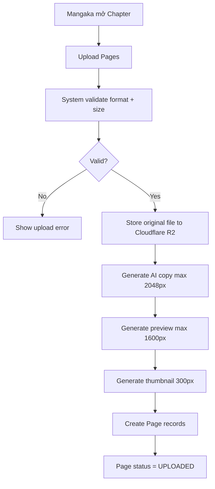

---

### 6. Production Team / Assistant Eligibility Flow

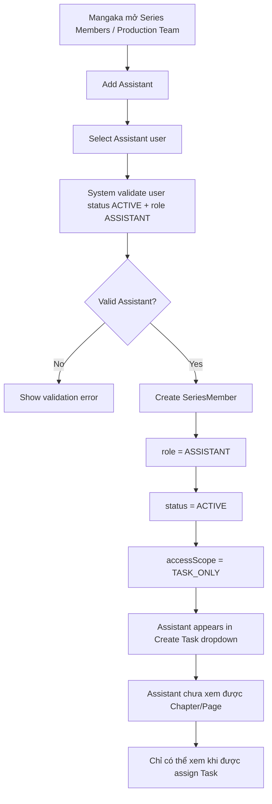

---

### 7. Create Region Flow

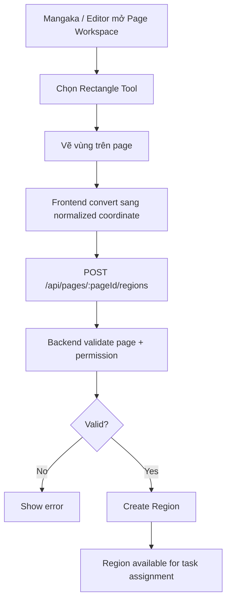

---

### 8. Assign Task Flow

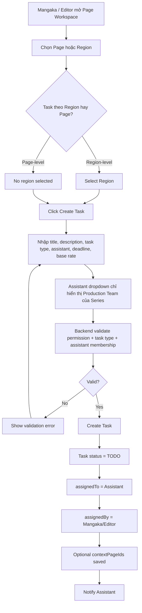

---

### 9. Assistant Task Workspace Access Flow

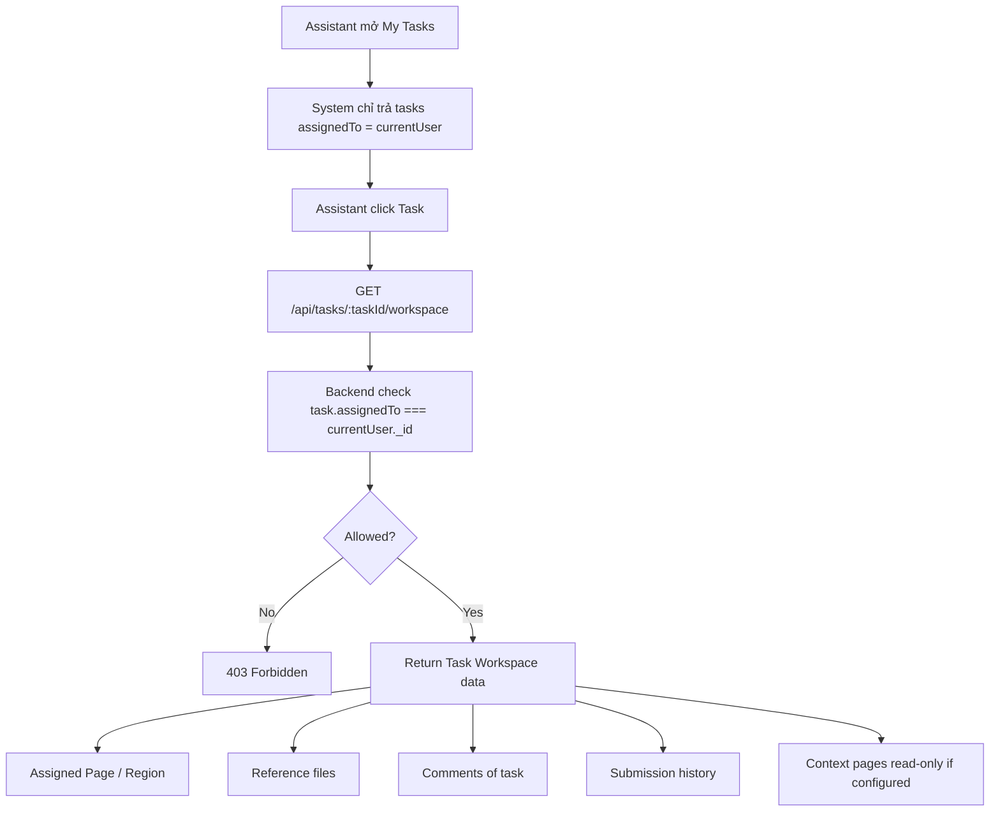

---

### 10. Assistant Work & Submit Flow

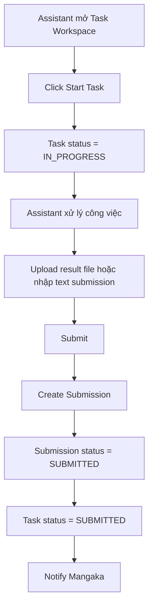

---

### 11. Mangaka Review Submission Flow

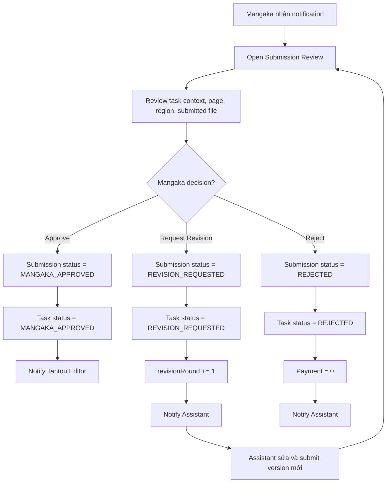

---

### 12. Tantou Editor Final Approval Flow

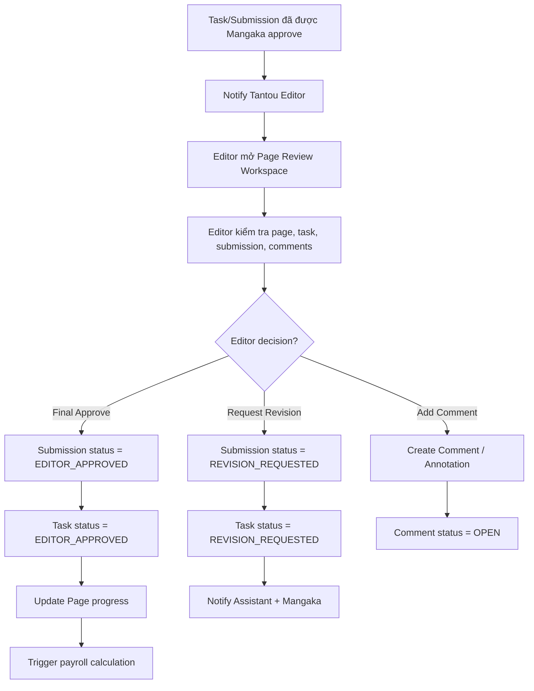

---

### 13. Comment Resolve Flow

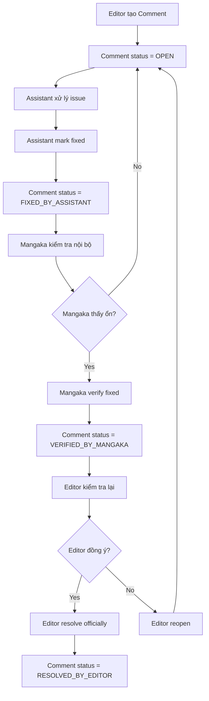

---

### 14. Publication Readiness Flow

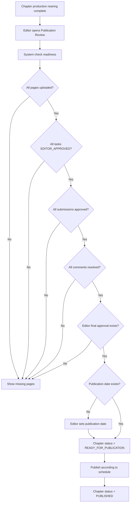

---

### 15. Ranking & At-Risk Flow

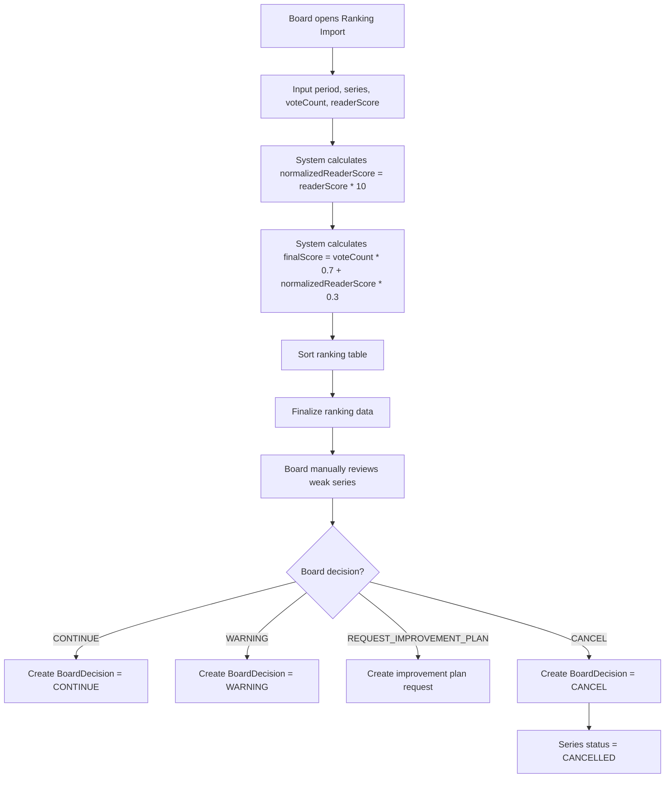

---

### 16. Payroll Flow

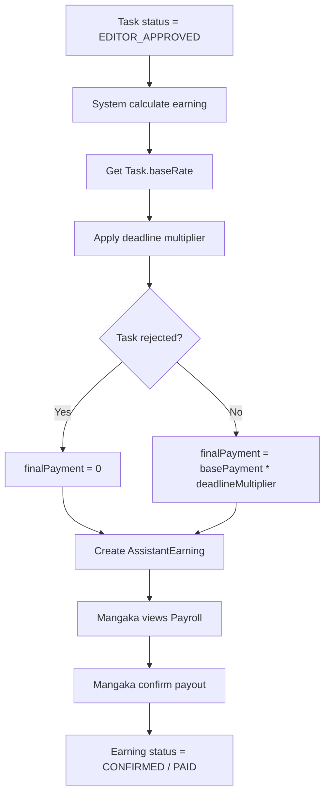

---

### 17. Admin Task Type Configuration Flow

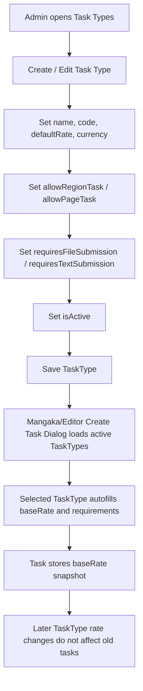

---

### 18. Bubble Translation / Lettering Flow

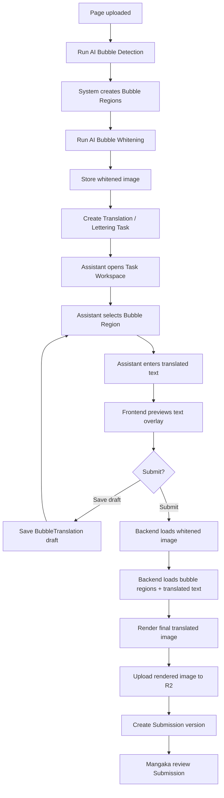

[MangaFlow — UI Development Management & Component System](https://app.notion.com/p/MangaFlow-UI-Development-Management-Component-System-378799c086e58144ae94ed428da3e183?pvs=21)
