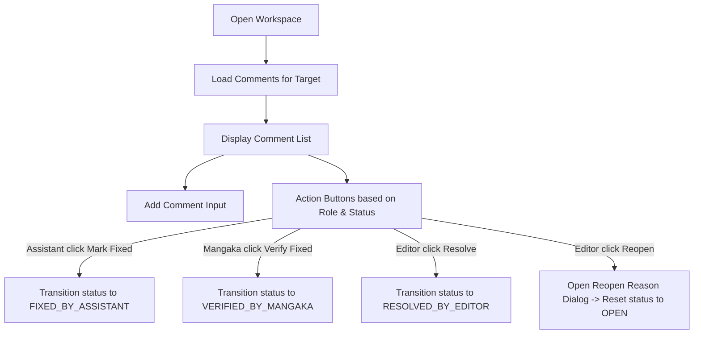

# Design

## UI Components

We will introduce several UI elements in the frontend client:

1. **`CommentPanel`**:
   - Placed in the right sidebar of the Page Workspace.
   - Accepts a `targetType` ("PAGE" | "TASK" | "SUBMISSION" | etc.) and `targetId`.
   - Shows the comments list and the add comment input.
2. **`CommentList` / `CommentItem`**:
   - Renders a list of comments sorted by date.
   - Shows author names, timestamps, comment content, and status badges.
   - Renders action logs (e.g. "Marked fixed by Assistant X", "Resolved by Editor Y").
3. **`AddCommentForm`**:
   - Simple textarea with a send button to submit a new comment.
4. **`CommentActionButtons`**:
   - Conditional rendering of buttons based on the user's system role and series-level role:
     - `Mark Fixed` button: Visible if user is an Assistant, comment status is `OPEN`.
     - `Verify Fixed` button: Visible if user is a Mangaka, comment status is `FIXED_BY_ASSISTANT`.
     - `Resolve` button: Visible if user is an Editor or Admin, comment status is not `RESOLVED_BY_EDITOR`.
     - `Reopen` button: Visible if user is an Editor or Admin, comment status is `RESOLVED_BY_EDITOR` or `VERIFIED_BY_MANGAKA` (requires reason dialog).

## Frontend Client API

Add endpoints helpers in `client/src/features/comment/api/comment.ts`:
- `getCommentsForTarget(targetType, targetId)`
- `createComment(targetType, targetId, content, optionalPageId, optionalAnnotationId)`
- `markFixed(commentId)`
- `verifyFixed(commentId)`
- `resolveComment(commentId)`
- `reopenComment(commentId, reason)`

## Interaction Flows

