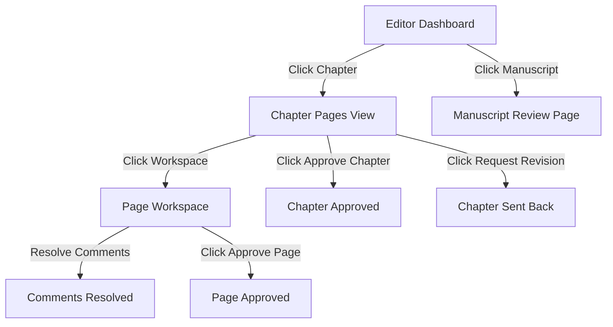

# Design - MF-020 Editor Approval Workflow UI

## UI Structure & Layout

### 1. Editor Dashboard (`/app/editor/dashboard`)
We will create a dashboard route matching the premium aesthetics of MangaFlow:
- **Navy & Purple High-Tech Design**: A beautiful, harmonized dark-toned container utilizing curated CSS gradients, custom micro-animations (e.g. scale on hover, glowing badge rings), and Geist variable typography.
- **Section 1: Assigned Series**: Grid of series cards matching current Mangaka views but read-only, linking to manuscripts or chapter lists.
- **Section 2: Pending Manuscripts**: Table/grid of manuscripts needing review (status `SUBMITTED`, `EDITOR_REVIEW`) with buttons linking to `/app/editor/series/:seriesId/manuscripts/:manuscriptId/review`.
- **Section 3: Pending Chapters**: List of chapters needing review (status `READY_FOR_EDITOR`, `EDITOR_REVIEW`) showing deadlines and page/unresolved-comment summary counts, with buttons linking to `/app/editor/chapters/:chapterId/pages`.

### 2. Chapter Pages View (`/app/editor/chapters/:chapterId/pages`)
- Dynamically hides "Add Pages", page "Delete" overlay icon buttons.
- Appends approval controls at the header:
  - **Approve Chapter** and **Request Revision** buttons.
  - Displays a summary warning if any pages have unresolved comments, warning the Editor that approval will be rejected.

### 3. Page Review Workspace (`/app/editor/pages/:pageId/workspace`)
- Reuses `PageWorkspacePage` component.
- Extends the workspace header with:
  - **Approve Page** button: transitions page to `EDITOR_APPROVED`.
  - **Request Revision** button: transitions page to `NEEDS_REVISION`.
- Hides region drawing and task assignment tools from Editors (since they only resolve comments and annotations).

## API & Client Hooks

We will introduce endpoint client functions:
- `client/src/features/page/api/page.ts`:
  - `editorApprovePage(token, pageId)` -> `POST /api/pages/:pageId/editor-approve`
  - `requestPageRevision(token, pageId)` -> `POST /api/pages/:pageId/request-revision`
- `client/src/features/chapter/api/chapter.ts`:
  - `approveChapter(token, chapterId)` -> `POST /api/chapters/:chapterId/approve`
  - `requestChapterRevision(token, chapterId)` -> `POST /api/chapters/:chapterId/request-revision`

## Flow Diagram

