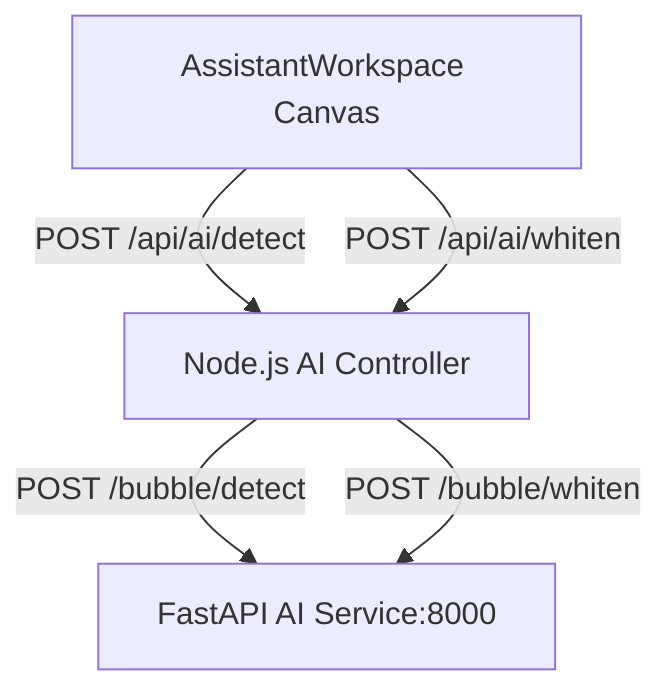

# MF-027 AI Bubble Integration Design

## Architecture

## Details
- Backend mounts `aiRoutes` under `/api/ai`.
- Axios / fetch calls are forwarded to port 8000 using standard FormData structure.
- YOLO11 is used to detect bounding boxes of speech bubbles on manga pages.
