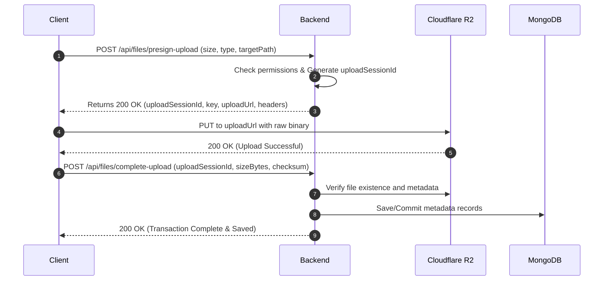

# Cloudflare R2 Storage Architecture & Integration Standard

This document details the finalized R2/S3-compatible bucket configurations, path hierarchy standards, retention lifecycles, and transaction protocols for the MangaFlow manga production platform.

---

## 1. Bucket Topologies & Environment Namespacing

To support multiple deployment stages cleanly without proliferating buckets, we utilize two main buckets with top-level environment namespacing (`dev/`, `staging/`, `prod/`).

```
Bucket 1: mangaflow-public (Public Read access, direct CDN delivery)
Bucket 2: mangaflow-private (Private access, read via Presigned URLs only)
```

---

## 2. Path Layout Schemas

### A. Bucket: `mangaflow-public`
*No authentication required. Served via Cloudflare CDN for immediate reader/UI rendering.*

```yaml
{env}/
  ├── users/
  │   └── {userId}/
  │       └── avatar/
  │           └── current.webp                 # User profile avatar
  └── series/
      └── {seriesId}/
          ├── cover/
          │   ├── large.webp                   # Detailed cover page (e.g. 1200px)
          │   ├── medium.webp                  # Card cover page (e.g. 600px)
          │   └── thumbnail.webp               # Search lists/icons (e.g. 150px)
          └── published/
              └── chapters/
                  └── {chapterId}/
                      └── pages/
                          └── {pageId}/
                              └── final.webp   # Published production pages
```

### B. Bucket: `mangaflow-private`
*Secure storage. Accessed exclusively via signed URLs with strict time limits (e.g. 15-30 minutes).*

```yaml
{env}/
  ├── proposals/
  │   └── {proposalId}/
  │       ├── cover-temp/
  │       │   └── v1.webp                      # Temporary proposal cover
  │       ├── manuscripts/
  │       │   └── v1.pdf                       # Manga proposal pitch PDF
  │       └── ref-materials/
  │           └── {assetId}/
  │               └── original.{ext}           # Reference documents/sketches
  │
  ├── series/
  │   └── {seriesId}/
  │       ├── design-sheets/
  │       │   └── {assetId}/
  │       │       └── original.{ext}           # Character/setting design reference sheets
  │       └── chapters/
  │           └── {chapterId}/
  │               ├── references/
  │               │   └── {referenceId}/
  │               │       └── original.{ext}   # Chapter script / guidelines
  │               ├── storyboards/
  │               │   └── {pageId}/
  │               │       └── v1.png           # Raw storyboards (Name / Phác thảo)
  │               ├── pages/
  │               │   └── {pageId}/
  │               │       ├── original/v1.png  # Raw canvas uploads (để phân vùng)
  │               │       ├── working/v1.psd   # Source project files (PSD/CLIP)
  │               │       ├── preview/
  │               │       │   ├── small.webp   # Thumbnails for studio timeline
  │               │       │   ├── medium.webp
  │               │       │   └── large.webp   # Full display page inside Studio Canvas
  │               │       ├── ai/
  │               │       │   ├── inspect.json # Bubble detection coordinates/metadata
  │               │       │   └── regions.json # Saved layout region presets
  │               │       └── published/
  │               │           └── final.webp   # Pre-rendered final distribution page
  │               ├── tasks/
  │               │   └── {taskId}/
  │               │       ├── region-slice/
  │               │       │   └── v1.webp      # Cropped region slice for assistants
  │               │       ├── submissions/
  │               │       │   └── {submissionId}/
  │               │       │       ├── original/v1.{ext} # Submission source file (PSD/CLIP)
  │               │       │       ├── preview/v1.webp   # Rasterized check preview
  │               │       │       ├── diff/v1.webp      # Layout comparison preview
  │               │       │       └── feedback/
  │               │       │           └── {commentId}/
  │               │       │               └── annotation.webp # Draw-over annotations
  │               │       └── temp/
  │               └── final-delivery/
  │                   ├── clean-pages/
  │                   │   └── {pageId}/
  │                   │       └── final.webp   # Fully approved clean pages
  │                   └── delivery-{chapterId}.zip # Final compiled delivery package
  │
  ├── imports/
  │   └── rankings/
  │       └── {importJobId}/
  │           └── raw.csv                      # Raw uploaded performance data
  └── temp/
      └── uploads/
          └── {uploadSessionId}/
              └── upload.tmp                   # In-flight temporary parts
```

---

## 3. Double-Handshake Upload Protocol

To ensure no orphan files accumulate in R2 and that MongoDB metadata matches the storage layer perfectly, all uploads follow a **Double-Handshake** transaction:



### Protocol Payloads

#### 1. Initiate Upload Request
*Route:* `POST /api/files/presign-upload`
```json
{
  "fileName": "lineart.psd",
  "contentType": "image/vnd.adobe.photoshop",
  "scope": "submission",
  "entityId": "tsk-001"
}
```

#### 2. Initiate Upload Response
```json
{
  "success": true,
  "data": {
    "uploadSessionId": "upl_9f7d2a58b093",
    "bucket": "mangaflow-private",
    "key": "prod/series/s_001/chapters/ch_002/tasks/tsk_001/submissions/sub_999/original/v1.psd",
    "uploadUrl": "https://mangaflow-private.r2.cloudflarestorage.com/prod/series/s_001/chapters/ch_002/tasks/tsk_001/submissions/sub_999/original/v1.psd?X-Amz-Algorithm=AWS4-HMAC-SHA256&...",
    "expiresIn": 900
  }
}
```

#### 3. Complete Upload Commit
*Route:* `POST /api/files/complete-upload`
```json
{
  "uploadSessionId": "upl_9f7d2a58b093",
  "sizeBytes": 18241923,
  "checksum": "sha256:7f83b162d3a95f928e12b7f3a9e1"
}
```

---

## 4. Lifecycle & Retention Policies

Using Cloudflare R2's Lifecycle rules, we define granular retention schedules to balance workspace history with storage cost management:

| Path Prefix | Rule Action | Days | Rationale |
| :--- | :--- | :--- | :--- |
| `private/{env}/temp/` | **Delete Object** | 7 Days | Temporary scratch uploads and failed chunks. |
| `private/{env}/series/*/chapters/*/tasks/*/temp/` | **Delete Object** | 30 Days | Transient crop slices or processing leftovers. |
| `private/{env}/series/*/chapters/*/tasks/*/submissions/*/preview/` | **Delete Object** | 90 Days | Old previews are redundant after chapter publication. |
| `private/{env}/series/*/chapters/*/tasks/*/submissions/*/diff/` | **Delete Object** | 90 Days | Version comparison files. |
| `private/{env}/series/*/chapters/*/tasks/*/submissions/*/original/` | **Transition to Infrequent Access** | 180 Days | Source CLIP/PSD project files from assistant submissions. |
| `private/{env}/series/*/chapters/*/tasks/*/submissions/*/original/` | **Delete Object** | 365 Days | Retain for tax/audit/payroll dispute cycles, then wipe. |
| `private/{env}/series/*/chapters/*/tasks/*/submissions/*/accepted/` | **Keep Indefinitely** | — | Retained as operational audit trail and payout proof. |
| `private/{env}/series/*/chapters/*/pages/*/preview/` | **Transition to Infrequent Access** | 30 Days | Move old drafts to IA storage classes. |
| `private/{env}/series/*/chapters/*/final-delivery/` | **Keep Indefinitely** | — | Master packaging copies must remain online. |
